# C++中的数值方法

> 原文：<https://medium.com/geekculture/numerical-methods-in-c-1c8ef1160c2b?source=collection_archive---------18----------------------->

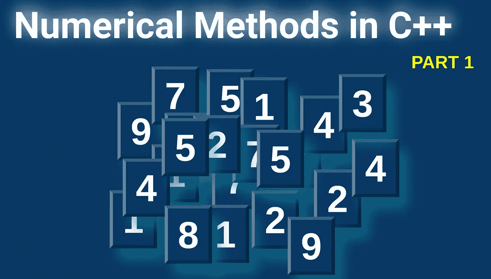

数值方法通常用于求解自然和物理现象的数学模型。每个问题都能精确解决。在这种情况下，我们可以说我们解析地解决了问题，或者我们的解决方案是近似的。以前，数值方法用于求解非常简单的数学模型，然而，计算能力(如 FPGA、CPU、GPU 或 TPU)的增加影响了数值计算的利用的增加，以求解复杂的模型，有时由高维非线性方程描述。当计算机被用来为一个特定的数学模型(可以用数学方程建模的问题)寻找解决方案时，我们可以说使用了数值方法。C++中的数值方法将在两篇独立的文章中讨论。接下来的部分将涵盖基础知识。另一部分将涵盖数值计算领域更高级的方面。

在下面的文章中，我使用了 c++ (克隆报告)的 [matplotlib 库。这是一个非常简单的库，允许你绘制数据。该库是非常著名的](https://github.com/lava/matplotlib-cpp) [Python 库](https://matplotlib.org/stable/index.html)的 API。不需要安装，只需要一个头文件。为了使用这个库，你需要首先检查你的 Python 版本和路径。您还需要为您拥有的 Python 版本安装 matplotlib(例如使用 pip)。

```
#on terminal type:~$ whereis python   //you receive version of Python and paths:~$ pip3 install matplotlib //Python 3:~$ pip install matplotlib //Python 2
```

你很容易编译每个程序，但是记住(在这里)头文件必须和你的 cpp 在同一个文件夹中。您也可以修改标题路径。

```
//compile
g++ my_prog.cpp -o my_prog -I/usr/include/python3.8 -lpython3.8// run
./my_prog//folder tree.
├── my_prog
├── my_prog.cpp
├── matplotlibcpp.h
```

**迭代**

数值计算中最常用的运算之一是迭代。你确切知道的迭代，可以表示为一组重复的相同操作，直到满足终止条件。通常我们设定的条件是通过定义期望解的精度(误差)来给出的。

迭代法是求方程根的常用方法。这里我将介绍常用的[牛顿法](https://en.wikipedia.org/wiki/Newton%27s_method#Square_root)。所提出的方法的基本版本可以定义如下(在下一篇文章中提出的所有方程的乳胶版本，你将在[我的要点](https://gist.github.com/markusbuchholz/b72af57f726a569a4c98675fe1d9a204)中找到)。

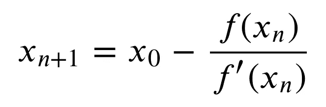

eq1 by author

如你所见，我们找到了函数的导数*f′*的下一个值，以及 *f* 的前一个根。当终止条件(精度)满足时，我们运行迭代过程。

下面的例子让您有机会熟悉讨论方法。这个例子解了一元二次方程。

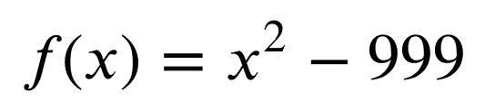

eq2 by author

请参考示例并适应您的条件。

我们也可以画出程序如何接近解决方案。

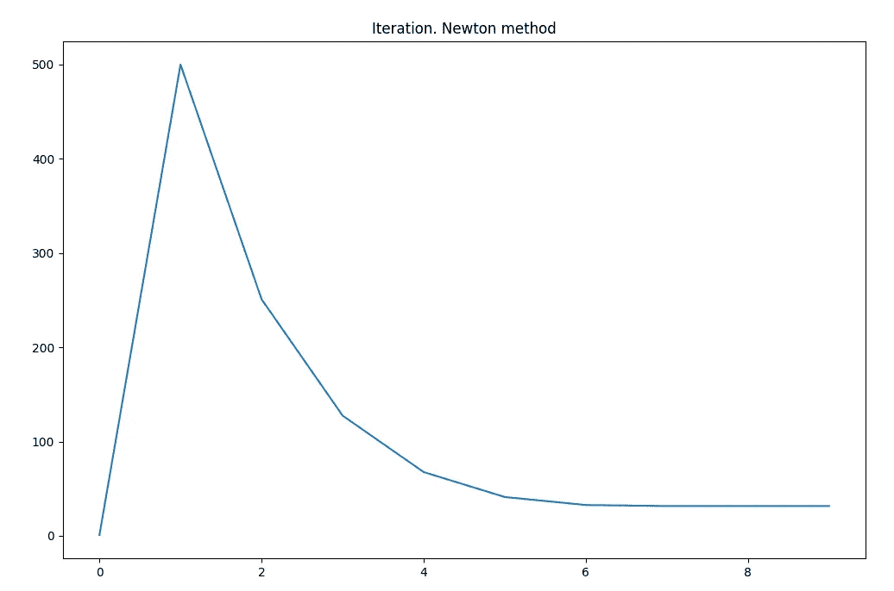

by author

我们还可以应用于更复杂方程，如高阶多项式(这里是三阶):

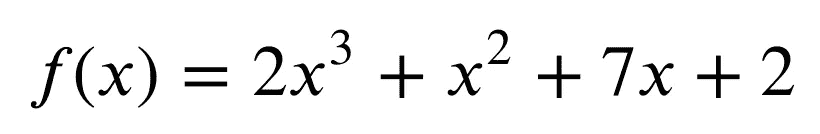

eq3 by author

我们也可以画出程序如何接近解决方案。

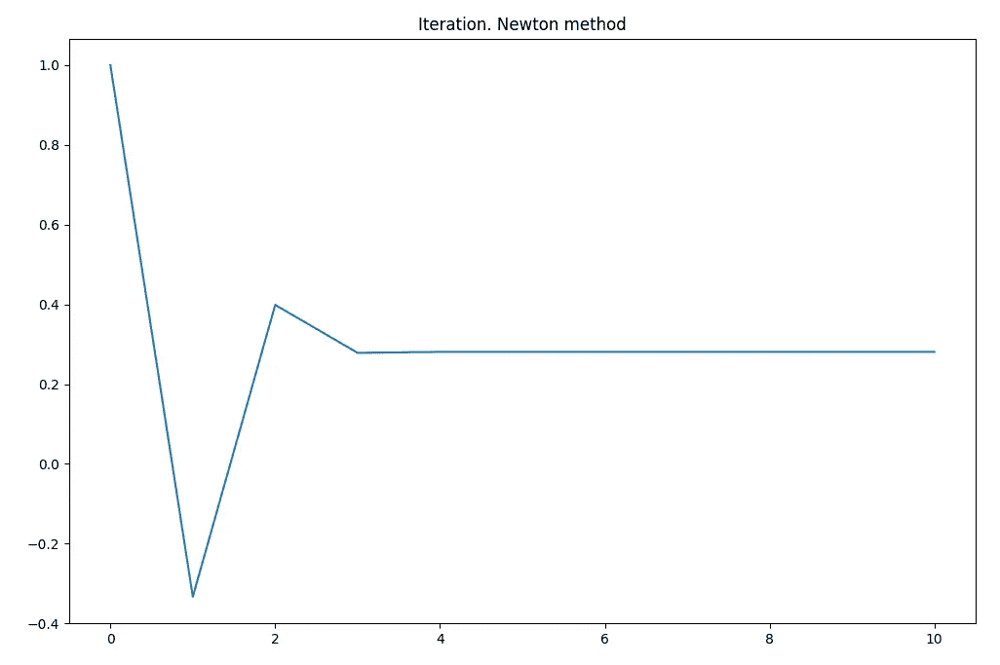

by author

**插值**

大多数以数字形式存储的函数(例如存储在你的个人电脑上的计算结果)对于相关函数的特定域具有离散值。这意味着我们只在特定的 x(n)和 x(n+1)点上有函数值，而在这两点之间没有值(例如 x(0.5n))。
计算这个数值的数学方法叫做[**插值**](https://en.wikipedia.org/wiki/Interpolation) 。还有 [**外推**](https://en.wikipedia.org/wiki/Extrapolation) ，可以解释为一种估计——在已有值的基础上寻找新值。

在下图中，你可以看到离散正弦(x)函数。函数只在某一点上确定(有值)。我们将对另一个函数进行插值，并找出其间的值。

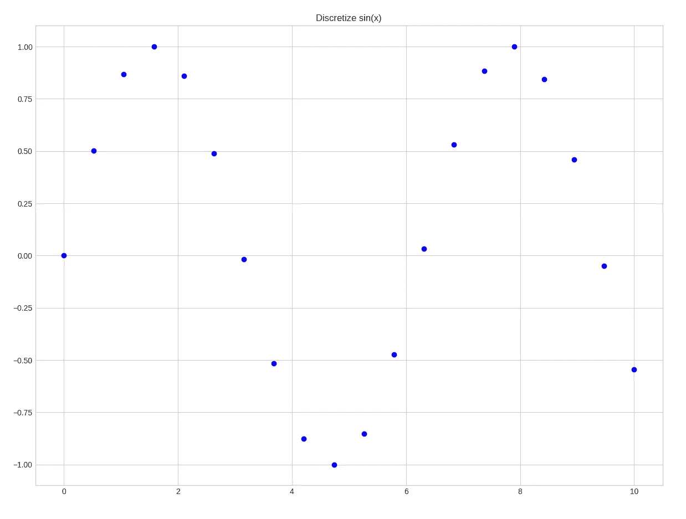

by author

**对于插值我们主要可以采用四种不同的方法:** [**牛顿**](https://en.wikipedia.org/wiki/Newton_polynomial)**[**拉格朗日**](https://en.wikipedia.org/wiki/Polynomial_interpolation)**[**切比雪夫**](https://en.wikipedia.org/wiki/Chebyshev_nodes) **和** [**样条插值**](https://en.wikipedia.org/wiki/Interpolation#Spline_interpolation) 。下面的例子描述了拉格朗日方法。****

****根据维基百科，我们可以找到基于已知节点值的多项式。我们使用下面的公式计算 n 阶多项式。****

****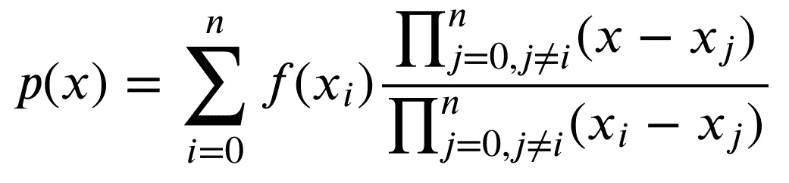****

****eq4 by author****

```
**|i | x_i |f(x_i)|
|---------------|
|0 |  1  |  1   |
|1 |  2  |  3   |
|2 |  4  |  7   |
|3 |  8  |  11  |**
```

****对于这些特定的(已知的)节点值 *f(x_i)* 我们可以计算(使用上述拉格朗日方法)插值。让我们假设，我们想知道 x = 6 的值。我们使用如下算法:****

```
**f(6) = f(1)*[(6-2)(6-4)(6-8)]/[(1-2)(1-4)(1-8)]+
       f(2)*[(6-1)(6-4)(6-8)]/[(2-1)(2-4)(2-8)]+
       f(4)*[(6-1)(6-2)(6-8)]/[(4-1)(4-2)(4-8)]+
       f(8)*[(6-1)(6-2)(6-4)]/[(6-1)(6-2)(6-4)] = 10.0476// you can check computed value by running below code (values for different node will be computed and displayed)**
```

****讨论方法的源代码如下所示。请对特定函数的部分进行注释和取消注释(上述示例中的一个函数，正弦函数和二次函数)。****

****下面的曲线是通过运行最后一个源 cpp 代码创建的。请注意，蓝色曲线代表已知节点，但是红色曲线是使用拉格朗日插值方法计算的。某些曲线的结果不能令人满意，特别是在插值结束时。该问题与应用插值多项式的高阶插值有关。关于这种现象的更多讨论在这里[龙格现象](https://en.wikipedia.org/wiki/Runge%27s_phenomenon#:~:text=In%20the%20mathematical%20field%20of,set%20of%20equispaced%20interpolation%20points.)中进行。****

****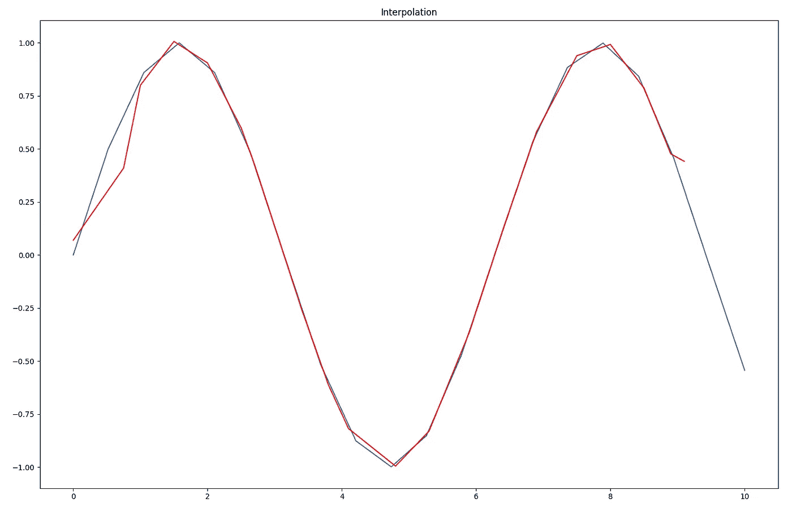****

****by author****

****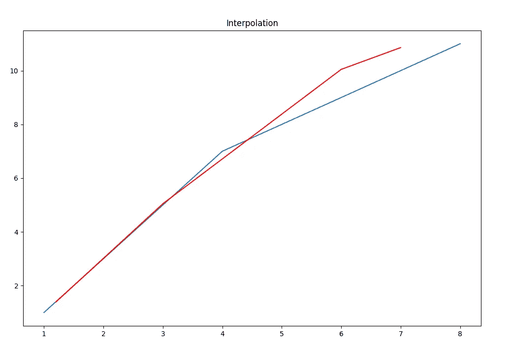****

****by author****

****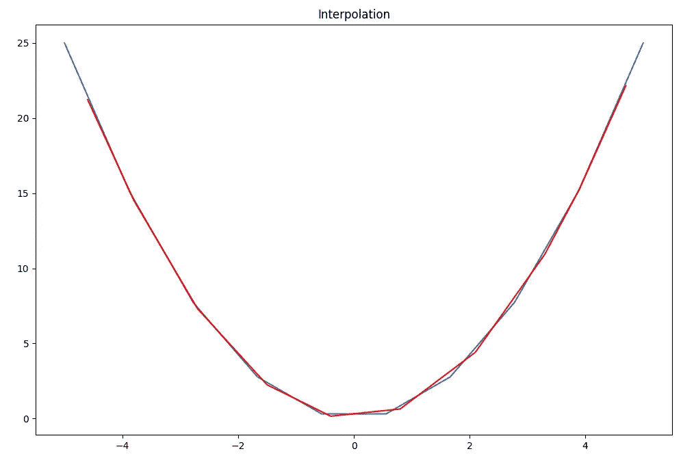****

****by author****

******数值积分******

****[数值积分](https://en.wikipedia.org/wiki/Numerical_integration)是一套计算定积分数值的方法。有了一个函数 *f(x)* 我们就能够估计这个函数在给定区间内的值。
用于数值计算积分值的大多数算法使用函数的加法特性，可写成如下:****

****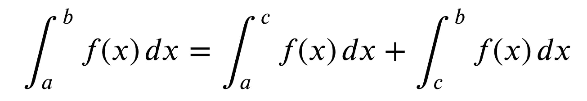****

****eq5 by author****

****如你所见，我们可以将定义的函数区间分割成小的区间，计算积分(较短的区间)，最后求和。
如果下面的文章我们将使用到不同的算法:**矩形法**和**梯形法。******

****在矩形法中，函数的区间由小矩形划分。我们的工作是计算矩形的面积，最后对所有计算出的矩形面积求和。所讨论的方法使用下面的公式来计算特定函数和区间的积分。****

****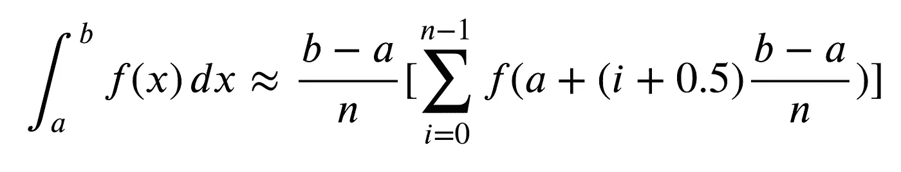****

****eq6 by author****

****更精确的方法不是应用矩形而是梯形。在该罐中，必须应用以下数值公式。****

****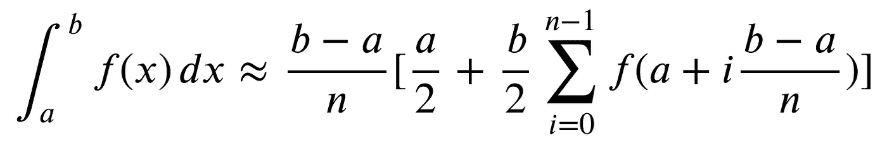****

****eq7 by author****

****上述等式已应用于以下代码中。该程序使用半径等于 1 的圆的面积公式来计算圆周率的值。我描述了两种讨论过的方法，可以一个接一个地绘制出来。如果是这样，请在下面的文件中注释和取消注释代码的某些部分。****

****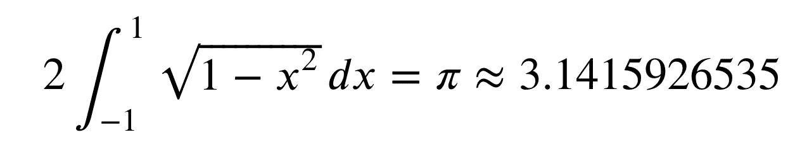****

****eq8 by author****

****下图描述了算法如何以逗号后 9 个数字的精度逼近解。****

****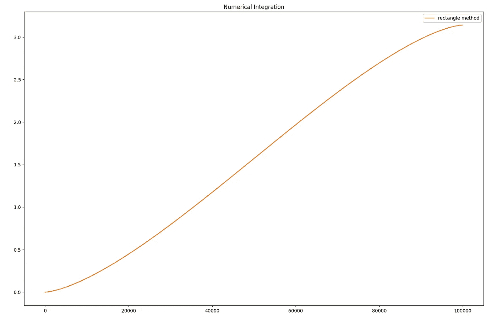****

****by author****

****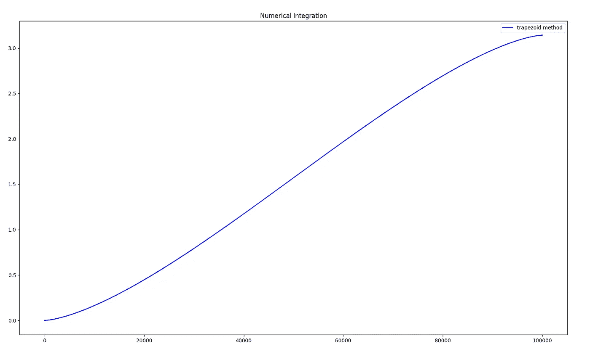****

****by author****

******数值微分******

****[数值微分](https://en.wikipedia.org/wiki/Numerical_differentiation)是一套计算定义点的导数数值的方法。在这种情况下，数值计算是愿意使用的，因为计算某些函数的导数存在一定的困难。我们也使用数值方法，其中我们只知道函数值域的离散值。
计算导数的最简单方法是牛顿法，可表示如下(在我们的例子中，我们可以通过计算中心差商来近似计算导数，h 是一个小的差商):****

****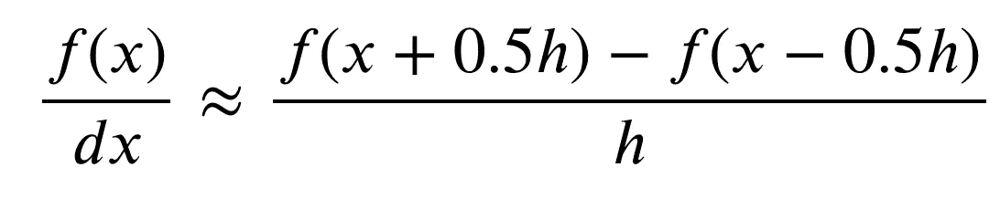****

****eq9 by author****

****下面的代码实现了讨论的牛顿法，并计算多项式三阶导数。请随意修改您选择的功能。****

****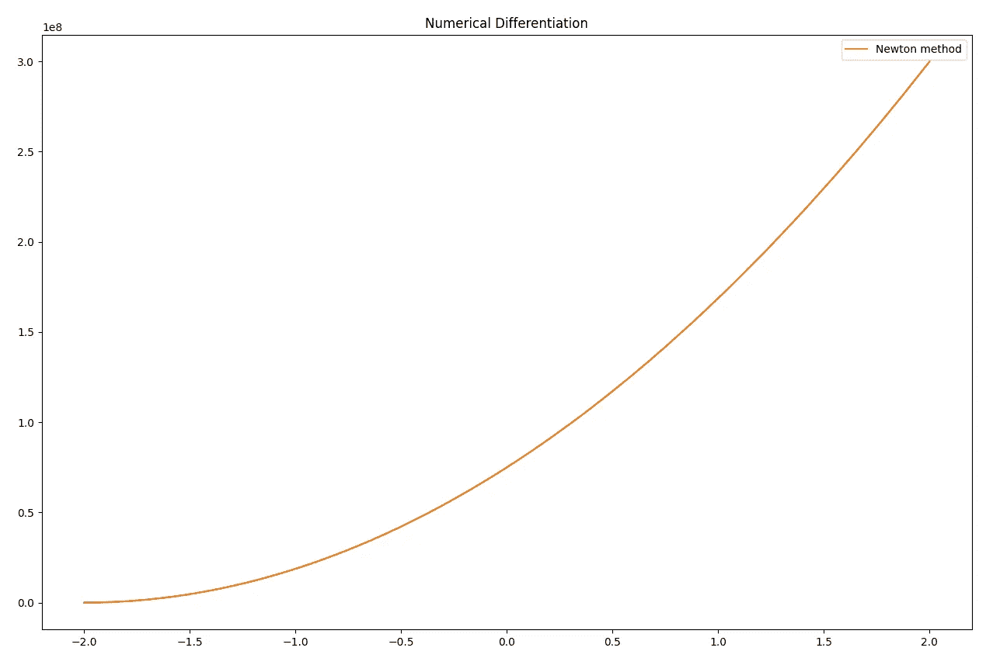****

****by author****

****感谢您的阅读。****