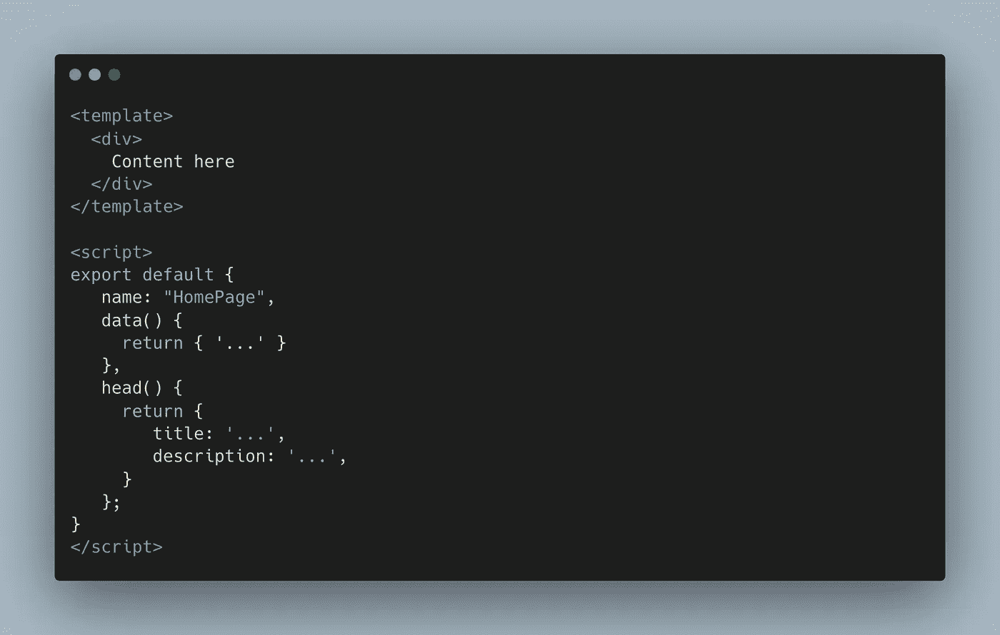
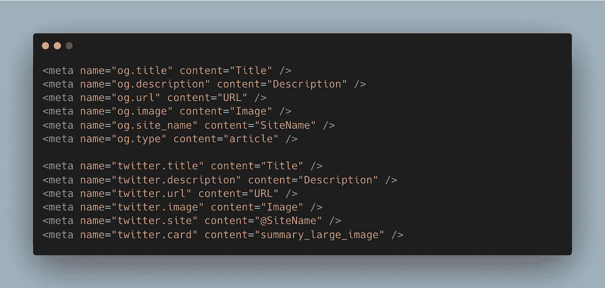
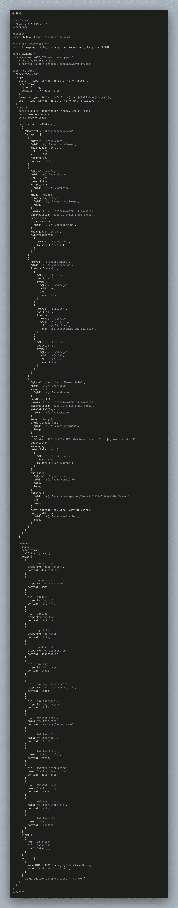
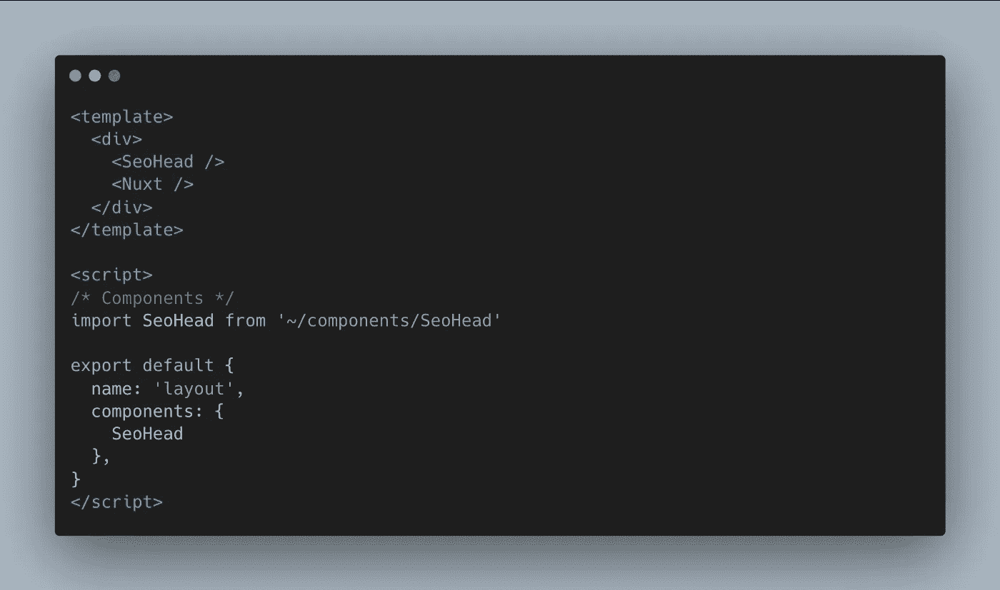
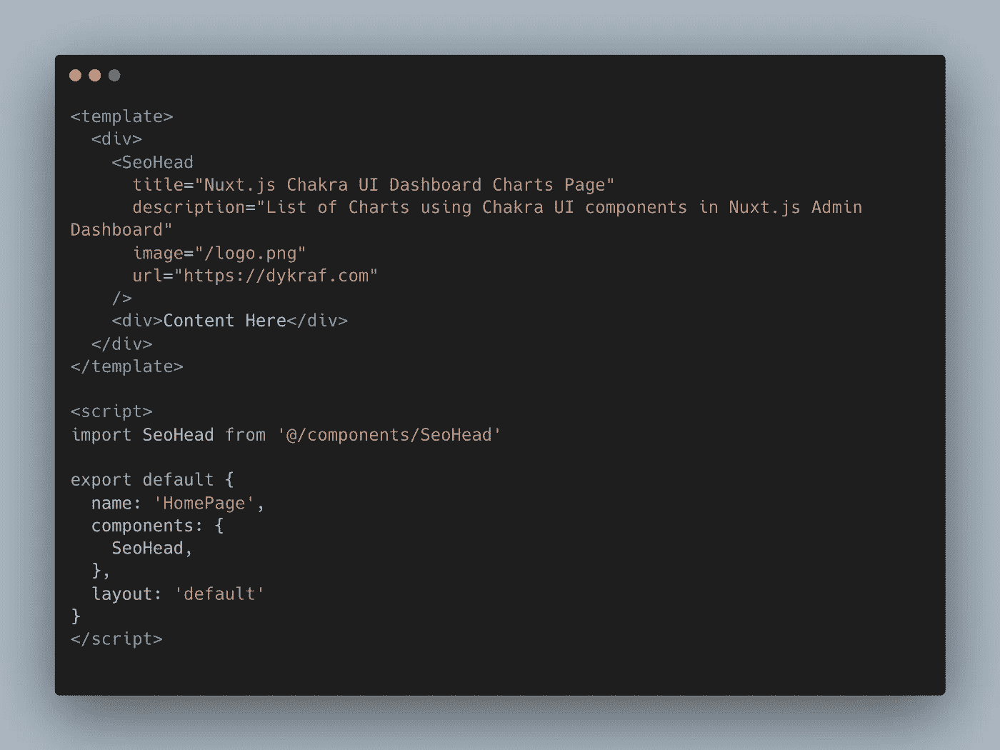

# Nuxt.js SEO Head 组件:如何实现

> 原文：<https://medium.com/geekculture/nuxt-js-seo-head-component-953859c6e2a6?source=collection_archive---------9----------------------->

## 在 Nuxt.js 网站中构建 SEO Head 标签组件，以支持 HTML 元标签和 JSON 模式

Photo by [Merakist](https://unsplash.com/@merakist?utm_source=medium&utm_medium=referral) on [Unsplash](https://unsplash.com?utm_source=medium&utm_medium=referral)

Nuxt.js 有一个特性支持可定制的 HTML Head 标签，这些标签包括 ***标题*** ， ***描述*** ， ***图片*** ， ***链接，规范，*** 等元 Head 标签。

为了支持 SEO 友好的 Head 标签，我们可以将所有必要的项目放入一个组件中，并将其作为默认的 SEO Head 组件导入，以便在任何 Nuxt.js 页面中使用。`head()`将返回任何在返回对象中定义的 HTML Head 标签。

[The head() feature from Nuxt.js](https://carbon.now.sh/?bg=rgba%28171%2C+184%2C+195%2C+1%29&t=vscode&wt=none&l=vue&width=1024&ds=true&dsyoff=20px&dsblur=68px&wc=true&wa=false&pv=56px&ph=56px&ln=false&fl=1&fm=Hack&fs=17.5px&lh=133%25&si=false&es=2x&wm=false&code=%253Ctemplate%253E%250A%2520%2520%253Cdiv%253E%250A%2520%2520%2520%2520Content%2520here%250A%2520%2520%253C%252Fdiv%253E%250A%253C%252Ftemplate%253E%250A%250A%253Cscript%253E%250Aexport%2520default%2520%257B%2520%250A%2520%2520%2520name%253A%2520%2522HomePage%2522%252C%250A%2520%2520%2520data%28%29%2520%257B%2520%250A%2520%2520%2520%2520%2520return%2520%257B%2520%27...%27%2520%257D%250A%2520%2520%2520%257D%252C%2520%250A%2520%2520%2520head%28%29%2520%257B%2520%250A%2520%2520%2520%2520%2520return%2520%257B%2520%250A%2520%2520%2520%2520%2520%2520%2520%2520title%253A%2520%27...%27%252C%250A%2520%2520%2520%2520%2520%2520%2520%2520description%253A%2520%27...%27%252C%2520%250A%2520%2520%2520%2520%2520%257D%250A%2520%2520%2520%257D%253B%250A%257D%250A%253C%252Fscript%253E) to support HTML meta tags for SEO

由于需要其他一些 HTML Head 标签来支持 SEO，并且它们中的大多数与 Open Graph 或 Twitter 标签等内容有相似之处，因此我们可以将其放入一个支持所有这些标签的组件中。

[HTML Meta tags](https://carbon.now.sh/?bg=rgba%28171%2C+184%2C+195%2C+1%29&t=vscode&wt=none&l=htmlmixed&width=1024&ds=true&dsyoff=20px&dsblur=68px&wc=true&wa=false&pv=56px&ph=56px&ln=false&fl=1&fm=Hack&fs=17.5px&lh=133%25&si=false&es=2x&wm=false&code=%253Cmeta%2520name%253D%2522og.title%2522%2520content%253D%2522Title%2522%2520%252F%253E%250A%253Cmeta%2520name%253D%2522og.description%2522%2520content%253D%2522Description%2522%2520%252F%253E%250A%253Cmeta%2520name%253D%2522og.url%2522%2520content%253D%2522URL%2522%2520%252F%253E%250A%253Cmeta%2520name%253D%2522og.image%2522%2520content%253D%2522Image%2522%2520%252F%253E%250A%253Cmeta%2520name%253D%2522og.site_name%2522%2520content%253D%2522SiteName%2522%2520%252F%253E%250A%253Cmeta%2520name%253D%2522og.type%2522%2520content%253D%2522article%2522%2520%252F%253E%250A%250A%253Cmeta%2520name%253D%2522twitter.title%2522%2520content%253D%2522Title%2522%2520%252F%253E%250A%253Cmeta%2520name%253D%2522twitter.description%2522%2520content%253D%2522Description%2522%2520%252F%253E%250A%253Cmeta%2520name%253D%2522twitter.url%2522%2520content%253D%2522URL%2522%2520%252F%253E%250A%253Cmeta%2520name%253D%2522twitter.image%2522%2520content%253D%2522Image%2522%2520%252F%253E%250A%253Cmeta%2520name%253D%2522twitter.site%2522%2520content%253D%2522%2540SiteName%2522%2520%252F%253E%250A%253Cmeta%2520name%253D%2522twitter.card%2522%2520content%253D%2522summary_large_image%2522%2520%252F%253E) for SEO

现在我们可以看到 Meta 标签中的相似性，我们可以将它放在 Nuxt.js 中的一个专用组件上，并将其命名为`./components/SeoHead.vue`

之后，我们可以放置所有必要的 SEO 元标记和 JSON 模式来支持 SEO 需求。

当然，这些 HTML Head 标记可以基于您的 Nuxt.js 进行定制，无论项目需求需要每个还是一个 JSON 模式。

[SeoHead.vue](https://carbon.now.sh/?bg=rgba%28171%2C+184%2C+195%2C+1%29&t=vscode&wt=none&l=vue&width=1024&ds=true&dsyoff=20px&dsblur=68px&wc=true&wa=true&pv=56px&ph=56px&ln=false&fl=1&fm=Hack&fs=17.5px&lh=133%25&si=false&es=2x&wm=false&code=%253Ctemplate%253E%250A%2520%2520%253Cspan%2520v-if%253D%2522false%2522%2520%252F%253E%250A%253C%252Ftemplate%253E%250A%250A%253Cscript%253E%250Aimport%2520GLOBAL%2520from%2520%27%7E%252Fconstants%252Fglobal%27%250A%250A%252F**%2520global%2520constants%2520**%252F%250Aconst%2520%257B%2520company%252C%2520title%252C%2520description%252C%2520image%252C%2520url%252C%2520lang%2520%257D%2520%253D%2520GLOBAL%250A%250Aconst%2520BASEURL%2520%253D%250A%2520%2520process.env.NODE_ENV%2520%253D%253D%253D%2520%27development%27%250A%2520%2520%2520%2520%253F%2520%27http%253A%252F%252Flocalhost%253A3000%27%250A%2520%2520%2520%2520%253A%2520%27https%253A%252F%252Fnuxtjs-chakraui-template.netlify.app%27%250A%250Aexport%2520default%2520%257B%250A%2520%2520name%253A%2520%27SeoHead%27%252C%250A%2520%2520props%253A%2520%257B%250A%2520%2520%2520%2520title%253A%2520%257B%2520type%253A%2520String%252C%2520default%253A%2520%28%29%2520%253D%253E%2520title%2520%257D%252C%250A%2520%2520%2520%2520description%253A%2520%257B%250A%2520%2520%2520%2520%2520%2520type%253A%2520String%252C%250A%2520%2520%2520%2520%2520%2520default%253A%2520%28%29%2520%253D%253E%2520description%252C%250A%2520%2520%2520%2520%257D%252C%250A%2520%2520%2520%2520image%253A%2520%257B%2520type%253A%2520String%252C%2520default%253A%2520%28%29%2520%253D%253E%2520%2560%2524%257BBASEURL%257D%2524%257Bimage%257D%2560%2520%257D%252C%250A%2520%2520%2520%2520url%253A%2520%257B%2520type%253A%2520String%252C%2520default%253A%2520%28%29%2520%253D%253E%2520url%2520%257C%257C%2520BASEURL%2520%257D%252C%250A%2520%2520%257D%252C%250A%2520%2520head%28%29%2520%257B%250A%2520%2520%2520%2520const%2520%257B%2520title%252C%2520description%252C%2520image%252C%2520url%2520%257D%2520%253D%2520this%250A%2520%2520%2520%2520const%2520name%2520%253D%2520company%250A%2520%2520%2520%2520const%2520logo%2520%253D%2520image%250A%250A%2520%2520%2520%2520const%2520structuredData%2520%253D%2520%255B%250A%2520%2520%2520%2520%2520%2520%257B%250A%2520%2520%2520%2520%2520%2520%2520%2520%27%2540context%27%253A%2520%27https%253A%252F%252Fschema.org%27%252C%250A%2520%2520%2520%2520%2520%2520%2520%2520%27%2540graph%27%253A%2520%255B%250A%2520%2520%2520%2520%2520%2520%2520%2520%2520%2520%257B%250A%2520%2520%2520%2520%2520%2520%2520%2520%2520%2520%2520%2520%27%2540type%27%253A%2520%27ImageObject%27%252C%250A%2520%2520%2520%2520%2520%2520%2520%2520%2520%2520%2520%2520%27%2540id%27%253A%2520%2560%2524%257Burl%257D%252F%2523primaryimage%2560%252C%250A%2520%2520%2520%2520%2520%2520%2520%2520%2520%2520%2520%2520inLanguage%253A%2520%27en-US%27%252C%250A%2520%2520%2520%2520%2520%2520%2520%2520%2520%2520%2520%2520url%253A%2520%2560%2524%257Burl%257D%2560%252C%250A%2520%2520%2520%2520%2520%2520%2520%2520%2520%2520%2520%2520width%253A%25201200%252C%250A%2520%2520%2520%2520%2520%2520%2520%2520%2520%2520%2520%2520height%253A%2520628%252C%250A%2520%2520%2520%2520%2520%2520%2520%2520%2520%2520%2520%2520caption%253A%2520title%252C%250A%2520%2520%2520%2520%2520%2520%2520%2520%2520%2520%257D%252C%250A%2520%2520%2520%2520%2520%2520%2520%2520%2520%2520%257B%250A%2520%2520%2520%2520%2520%2520%2520%2520%2520%2520%2520%2520%27%2540type%27%253A%2520%27WebPage%27%252C%250A%2520%2520%2520%2520%2520%2520%2520%2520%2520%2520%2520%2520%27%2540id%27%253A%2520%2560%2524%257Burl%257D%252F%2523webpage%2560%252C%250A%2520%2520%2520%2520%2520%2520%2520%2520%2520%2520%2520%2520url%253A%2520%2560%2524%257Burl%257D%2560%252C%250A%2520%2520%2520%2520%2520%2520%2520%2520%2520%2520%2520%2520name%253A%2520title%252C%250A%2520%2520%2520%2520%2520%2520%2520%2520%2520%2520%2520%2520isPartOf%253A%2520%257B%250A%2520%2520%2520%2520%2520%2520%2520%2520%2520%2520%2520%2520%2520%2520%27%2540id%27%253A%2520%2560%2524%257Burl%257D%252F%2523website%2560%252C%250A%2520%2520%2520%2520%2520%2520%2520%2520%2520%2520%2520%2520%257D%252C%250A%2520%2520%2520%2520%2520%2520%2520%2520%2520%2520%2520%2520image%253A%2520%255Bimage%255D%252C%250A%2520%2520%2520%2520%2520%2520%2520%2520%2520%2520%2520%2520primaryImageOfPage%253A%2520%257B%250A%2520%2520%2520%2520%2520%2520%2520%2520%2520%2520%2520%2520%2520%2520%27%2540id%27%253A%2520%2560%2524%257Burl%257D%252F%2523primaryimage%2560%252C%250A%2520%2520%2520%2520%2520%2520%2520%2520%2520%2520%2520%2520%2520%2520image%252C%250A%2520%2520%2520%2520%2520%2520%2520%2520%2520%2520%2520%2520%257D%252C%250A%2520%2520%2520%2520%2520%2520%2520%2520%2520%2520%2520%2520datePublished%253A%2520%272020-10-08T12%253A10%253A19%252B00%253A00%27%252C%250A%2520%2520%2520%2520%2520%2520%2520%2520%2520%2520%2520%2520dateModified%253A%2520%272020-12-04T10%253A17%253A53%252B00%253A00%27%252C%250A%2520%2520%2520%2520%2520%2520%2520%2520%2520%2520%2520%2520description%252C%250A%2520%2520%2520%2520%2520%2520%2520%2520%2520%2520%2520%2520breadcrumb%253A%2520%257B%250A%2520%2520%2520%2520%2520%2520%2520%2520%2520%2520%2520%2520%2520%2520%27%2540id%27%253A%2520%2560%2524%257Burl%257D%252F%2523breadcrumb%2560%252C%250A%2520%2520%2520%2520%2520%2520%2520%2520%2520%2520%2520%2520%257D%252C%250A%2520%2520%2520%2520%2520%2520%2520%2520%2520%2520%2520%2520inLanguage%253A%2520%27en-US%27%252C%250A%2520%2520%2520%2520%2520%2520%2520%2520%2520%2520%2520%2520potentialAction%253A%2520%255B%250A%2520%2520%2520%2520%2520%2520%2520%2520%2520%2520%2520%2520%2520%2520%257B%250A%2520%2520%2520%2520%2520%2520%2520%2520%2520%2520%2520%2520%2520%2520%2520%2520%27%2540type%27%253A%2520%27ReadAction%27%252C%250A%2520%2520%2520%2520%2520%2520%2520%2520%2520%2520%2520%2520%2520%2520%2520%2520target%253A%2520%255B%2560%2524%257Burl%257D%2560%255D%252C%250A%2520%2520%2520%2520%2520%2520%2520%2520%2520%2520%2520%2520%2520%2520%257D%252C%250A%2520%2520%2520%2520%2520%2520%2520%2520%2520%2520%2520%2520%255D%252C%250A%2520%2520%2520%2520%2520%2520%2520%2520%2520%2520%257D%252C%250A%2520%2520%2520%2520%2520%2520%2520%2520%2520%2520%257B%250A%2520%2520%2520%2520%2520%2520%2520%2520%2520%2520%2520%2520%27%2540type%27%253A%2520%27BreadcrumbList%27%252C%250A%2520%2520%2520%2520%2520%2520%2520%2520%2520%2520%2520%2520%27%2540id%27%253A%2520%2560%2524%257Burl%257D%252F%2523breadcrumb%2560%252C%250A%2520%2520%2520%2520%2520%2520%2520%2520%2520%2520%2520%2520itemListElement%253A%2520%255B%250A%2520%2520%2520%2520%2520%2520%2520%2520%2520%2520%2520) component in Nuxt.js

之后，现在我们可以将`SeoHead.vue`组件导入到我们的布局和页面中。

[SeoHead.vue](https://carbon.now.sh/?bg=rgba%28171%2C+184%2C+195%2C+1%29&t=vscode&wt=none&l=vue&width=1024&ds=true&dsyoff=20px&dsblur=68px&wc=true&wa=false&pv=56px&ph=56px&ln=false&fl=1&fm=Hack&fs=17.5px&lh=133%25&si=false&es=2x&wm=false&code=%253Ctemplate%253E%250A%2520%2520%253Cdiv%253E%250A%2520%2520%2520%2520%253CSeoHead%2520%252F%253E%250A%2520%2520%2520%2520%253CNuxt%2520%252F%253E%250A%2520%2520%253C%252Fdiv%253E%250A%253C%252Ftemplate%253E%250A%250A%253Cscript%253E%250A%252F*%2520Components%2520*%252F%250Aimport%2520SeoHead%2520from%2520%27%7E%252Fcomponents%252FSeoHead%27%250A%250Aexport%2520default%2520%257B%250A%2520%2520name%253A%2520%27layout%27%252C%250A%2520%2520components%253A%2520%257B%250A%2520%2520%2520%2520SeoHead%250A%2520%2520%257D%252C%250A%257D%250A%253C%252Fscript%253E) component in Nuxt.js layout

下面是一个如何将`SeoHead.vue`放到 ***Nuxt.js*** 页面上的例子:

[SeoHead.vue](https://carbon.now.sh/?bg=rgba%28171%2C+184%2C+195%2C+1%29&t=vscode&wt=none&l=vue&width=1024&ds=true&dsyoff=20px&dsblur=68px&wc=true&wa=false&pv=56px&ph=56px&ln=false&fl=1&fm=Hack&fs=17.5px&lh=133%25&si=false&es=2x&wm=false&code=%253Ctemplate%253E%250A%2520%2520%253Cdiv%253E%250A%2520%2520%2520%2520%253CSeoHead%250A%2520%2520%2520%2520%2520%2520title%253D%2522Nuxt.js%2520Chakra%2520UI%2520Dashboard%2520Charts%2520Page%2522%250A%2520%2520%2520%2520%2520%2520description%253D%2522List%2520of%2520Charts%2520using%2520Chakra%2520UI%2520components%2520in%2520Nuxt.js%2520Admin%2520Dashboard%2522%250A%2520%2520%2520%2520%2520%2520image%253D%2522%252Flogo.png%2522%250A%2520%2520%2520%2520%2520%2520url%253D%2522https%253A%252F%252Fdykraf.com%2522%250A%2520%2520%2520%2520%252F%253E%250A%2520%2520%2520%2520%253Cdiv%253EContent%2520Here%253C%252Fdiv%253E%250A%2520%2520%253C%252Fdiv%253E%250A%253C%252Ftemplate%253E%250A%250A%253Cscript%253E%250Aimport%2520SeoHead%2520from%2520%27%2540%252Fcomponents%252FSeoHead%27%250A%250Aexport%2520default%2520%257B%250A%2520%2520name%253A%2520%27HomePage%27%252C%250A%2520%2520components%253A%2520%257B%250A%2520%2520%2520%2520SeoHead%252C%250A%2520%2520%257D%252C%250A%2520%2520layout%253A%2520%27default%27%2520%2520%250A%257D%250A%253C%252Fscript%253E%250A) on Nuxt.js pages

这是一个示例，展示了我们如何使用一个组件来处理 Nuxt.js 项目库页面上的所有 SEO Head 标签，并为您提供了如何在 Nuxt.js 项目中实现这些标签的思路。

如果 ***Nuxt.js*** 页面中没有`SeoHead.vue`组件，那么`./layout/default.vue`上的`SeoHead.vue`组件将是默认的 SEO 标签。

这里是上面例子中的 [***源代码***](https://github.com/devcoderoad/nuxtjs-vuetify-dashboard) ，这里是 SEO 标签上的 [***demo***](https://nuxtjs-vuetify-dashboard.netlify.app/) 和 ***Nuxt.js*** 网站上的 JSON schemas。而你可以在这里阅读关于 [***的流程***](/geekculture/chart-js-in-nuxt-js-how-to-implement-c255a2657b02?source=user_profile---------1----------------------------) 在我另外写的关于[***chart . js in nuxt . js:如何实现***](/geekculture/chart-js-in-nuxt-js-how-to-implement-c255a2657b02?source=user_profile---------1----------------------------) ***。***

## 演示:

 [## Nuxtify 管理仪表板模板

### Lorem ipsum dolor，这是肥胖精英的共识。排斥，nisi inventore，aperiam 的智慧 quod dolores…

nux tjs-vue tify-dashboard . net lify . app](https://nuxtjs-vuetify-dashboard.netlify.app/) 

## 也阅读

 [## 如何构建 VueJS 地理位置天气应用程序

### OpenWeatherMap API、Google Maps Embed API、Random Quotes API、Hacker News API 等开放公共 API 非常…

javascript.plainenglish.io](https://javascript.plainenglish.io/how-to-build-vuejs-geo-location-weather-application-f65f5cc2fa4f)  [## 如何使用 NVM 在项目之间更改 Node.js 版本

### 在您的机器上管理具有不同版本的节点的多个项目

better 编程. pub](https://betterprogramming.pub/how-to-change-node-js-version-between-projects-using-nvm-3ad2416bda7e)  [## Next.js 和 Reactstrap 管理仪表板项目

### React、SSR(服务器端渲染)和静态导出是 Next 的众多优势之一。JS 框架特性…

code-road.medium.com](https://code-road.medium.com/next-js-and-reactstrap-admin-dashboard-project-e32ff3205eb2)  [## Nuxt.js 中的 Chart.js:如何实现

### Chart.js 是一个方便的图表库，包含使用

<canvas>标签的简单 HTML5 图表。在 Nuxt.js 中实现这个或者…</canvas>

code-road.medium.com](https://code-road.medium.com/chart-js-in-nuxt-js-how-to-implement-c255a2657b02) 

# 关闭

所有来自 ***Nuxt.js*** 的特性对于你的网站 SEO 列表来说都是非常方便和有用的，所以你不需要编写你自己的函数来实现你想要的功能。只需要阅读和理解这些模块是如何工作的，并在你的项目中适应性地实现它们。

> 请[关注我](https://code-road.medium.com/membership)以获得更多的 web 开发技巧和窍门，谢谢！

 [## 用我的推荐链接加入媒体—代码之路

### 阅读 Code Road 的每一个故事(以及 Medium 上成千上万的其他作者)。你的会员费直接支持代码…

code-road.medium.com](https://code-road.medium.com/membership)