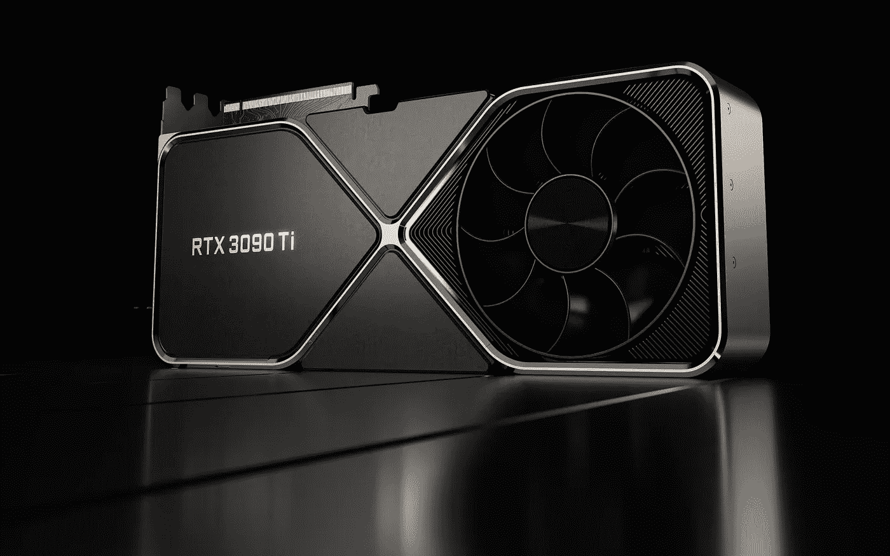

# 英伟达正以 RTX 3090 Ti 直接吸引消费者

> 原文：<https://medium.com/geekculture/nvidia-is-straight-up-trolling-consumers-with-the-rtx-3090-ti-bc235b7d1785?source=collection_archive---------3----------------------->

## 额外的性能，功耗，成本和时间都是如此糟糕，他们只是在问“为什么？”

The latest and greatest nVidia graphics card, the RTX 3090 Ti is not that great. Not really. So why did the company launch it so close to the unveiling of the RTX 4000 series? (Image: nVidia)

**总会有人**声称“在有需求的自由市场中，应该有产品或服务来满足需求”,但是……在现实世界中真的是这样吗……