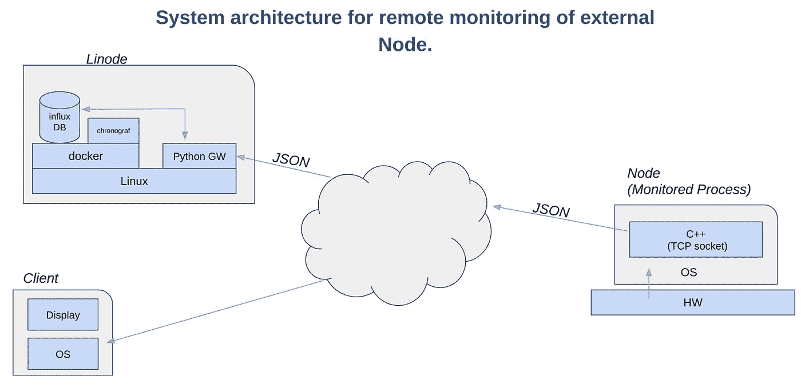
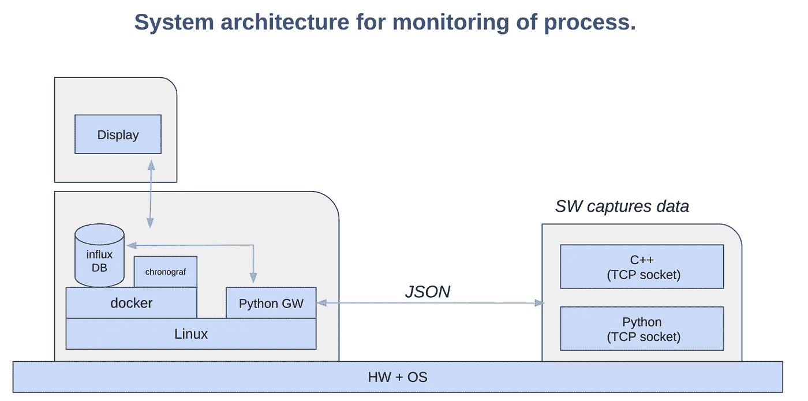
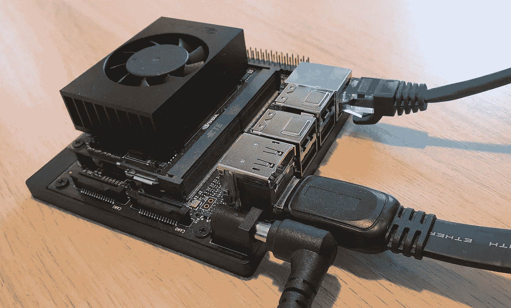
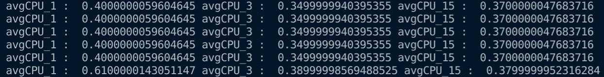
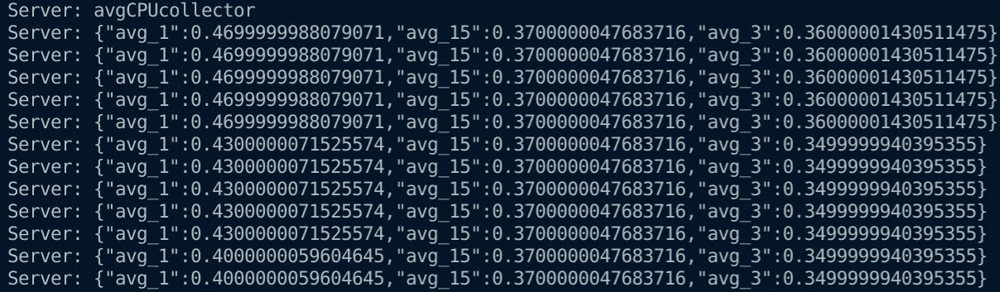
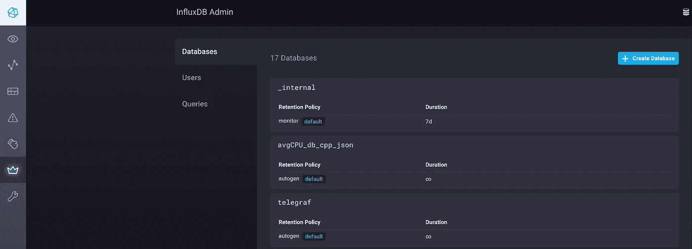
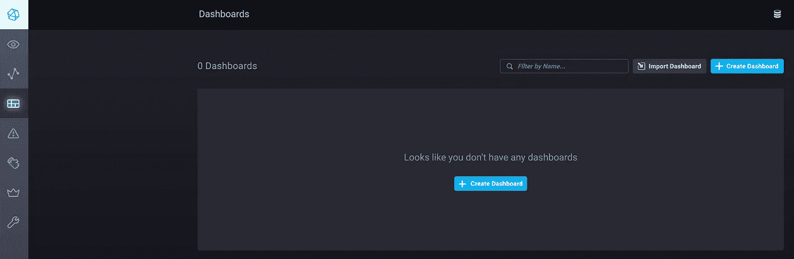
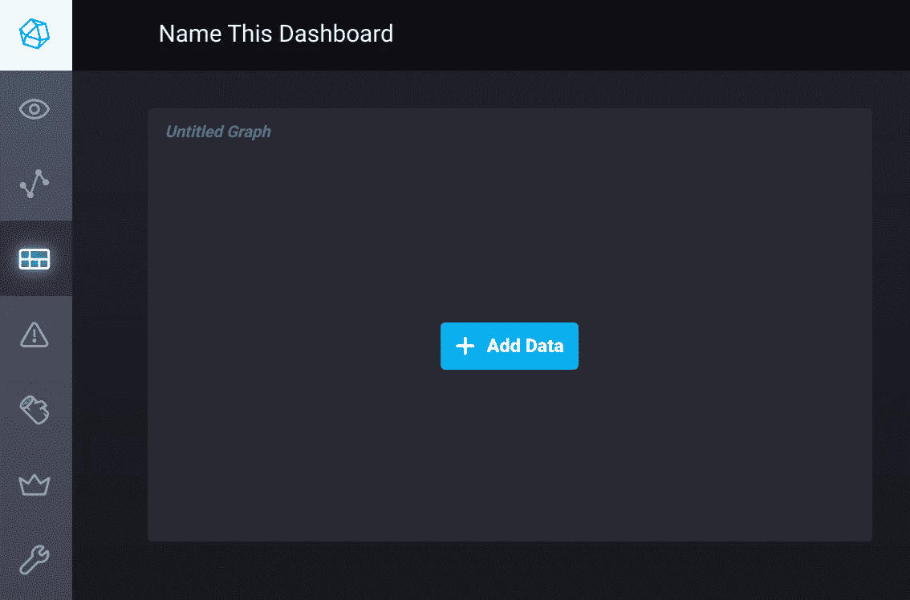
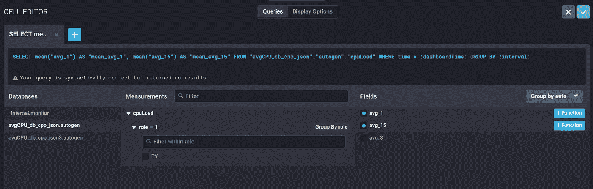
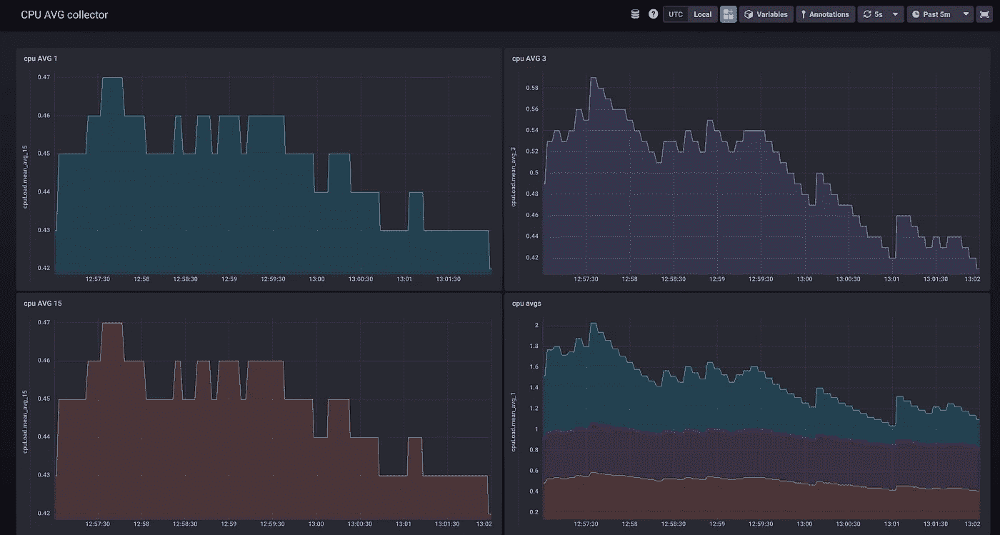

# Nvidia Jetson NX。过程云数据存储和可视化。

> 原文：<https://medium.com/geekculture/nvidia-jetson-nx-process-cloud-data-storage-and-visualisation-a3a87230a9eb?source=collection_archive---------35----------------------->


by author

在接下来的文章中，我将让你熟悉捕获系统数据的可能性(这里是运行 Linux Ubuntu 的 Jetson Nvidia NX)。数据将被发送到部署在 Linode 上的主机服务器。在这种特殊情况下，服务器的目的是收集输入数据，并运行 [Chronograpf](https://www.influxdata.com/time-series-platform/chronograf/) 服务。

注意。根据您的需要，在此项目中收集的过程数据(窗口 1[分钟]、5[分钟]和 15[分钟]的 CPU 滚动平均值)可能会有所不同。数据的收集可以在其他硬件上执行，然后呈现。你不需要运行 Linode 或其他云服务，因为以下项目中描述的所有服务都可以在一台机器上运行。
该项目的先决条件主要是[坞站](https://docs.docker.com/engine/install/)和[坞站组合](https://docs.docker.com/compose/install/)的安装。你需要有 [C++ boost 库](https://www.boost.org/users/download/)(也可以[安装](https://stackoverflow.com/questions/12578499/how-to-install-boost-on-ubuntu))、 [JSON C++](https://github.com/nlohmann/json) (一个文件库)和 [InfluxDB](https://docs.influxdata.com/influxdb/cloud/tools/client-libraries/python/) 客户端。

出于安全考虑，我将显示与主机版本相关的 IP 地址。请为您的特殊情况申请合适的地址。

系统结构

本项目的系统架构已在图纸上描述。第一个版本展示了存储(influxDB)和可视化服务计时码表在 Linode 上的部署。另一张图显示了在本地运行这个项目的可能性(在您的机器上，例如装有 Linux、Nvidia Jetson 或其他的 PC)。



by author

您可以在计算机上配置系统体系结构如下所示:



by author

对于这个项目，数据处理收集器可以部署在 Nvidia Jetson NX 上，并利用 Linode 云(就像作者做的那样)。



by author

InfluxDb 和计时表在 Docker 中运行。你唯一需要做的就是下载 blow docker-compose.yml 文件并运行 command(你的 yml 文件位置)。

```
//run commandsudo docker-compose up -d        //-d = detach flag//stop
sudo docker-compose down
```

确认你可以进入超时空传送系统。

```
// Depending where you run the service//locally
[http://localhost:8888](http://localhost:8888/)//Linode
[http://YOUR_LINODE_IP:8888](http://localhost:8888/)
```

在 Linode 或 locally 上，您通过套接字(这里是端口 9999)从机器(进程)收集数据。在这种情况下，Python 脚本扮演了重要的角色(作为网关)。它收集 JSON 格式的数据，并将这些数据发送到 InfluxDB 数据库进行存储。

确认 Chronograpf 正常工作后，运行 Python 脚本。

```
python3 influx_json_server_python.py
```

收集器进程(这里是 C++)可以在您自己的机器上运行，例如 Nvidia Jetson NX(或其他)。正如我在本文介绍中提到的，您必须执行一些安装或克隆操作。下面我展示了一个程序，它从/proc/loadavg 文件中收集数据并将数据(通过 JSON)发送到你的服务器——你运行 python 的地方。请相应地调整 IP 地址。
[Linux folder/proc](https://tldp.org/LDP/Linux-Filesystem-Hierarchy/html/proc.html)([参见此处](https://man7.org/linux/man-pages/man5/proc.5.html))包含系统中运行的所有进程的信息以及系统状态的信息。

在这个项目中，我从/proc/loadavg 收集了三个参数([CPU 负载的滚动平均值](https://en.wikipedia.org/wiki/Moving_average#:~:text=In%20statistics%2C%20a%20moving%20average,of%20finite%20impulse%20response%20filter.))，这些参数是我在系统运行的每一秒收集的。

编译程序，运行命令(在确认运行 Docker 中的图像和服务器(Python 中的网关也运行)后，运行以下 C++程序):

```
//compile
g++ json_client_cpp.cpp -o json_client_cpp -lboost_system//run
./json_client_cpp
```

启动服务器(网关)后，它与 InfluxDB 通信并从数据收集器(C++)获取数据，您应该会收到以下终端输出。

Gayway 上的输出(运行 Python 脚本)



by author

数据收集器的输出，它从 proc/loadavg 获取数据。



by author

如果一切正常，连接以便您可以开始在 Chronograf 中配置您的仪表板，它显示来自 InfluxDB 的数据，该数据库存储来自/proc/loadavg 文件的数据。

按照以下步骤配置简单仪表板。

打开您最喜欢的浏览器，键入 Chronograf 的链接(在本文中找到正确的地址)。
您可以看到，您正在运行的 Python 脚本刚刚创建了数据库 avgCPU_db_cpp_json。



by author

接下来，单击仪表板上的。给出名称并将数据添加到您的仪表板。



by author



by author

按下“添加数据”后，您将有机会选择希望在仪表板上显示的数据库和数据类型。您可以调整您的可视化(曲线，酒吧，gausgges 等)和应用不同的功能到您的数据。受到启发。



by author

最终仪表板可以按如下方式创建。



by author

感谢阅读。