# 纽约最危险的街区是哪里？用 R 快速分析 NYPD 射击数据集

> 原文：<https://medium.com/geekculture/nypd-shooting-database-analysis-with-r-what-is-the-most-dangerous-neighborhood-in-nyc-e69278190902?source=collection_archive---------11----------------------->

你可能已经听说了这个令人悲伤的消息:2020 年，纽约市的枪击案呈上升趋势，并将继续飙升。在这种背景下，我试图用基本的 R 语言和数据可视化来确定纽约市最危险的街区。

我使用了 [NYPD 枪击事件数据集](https://data.cityofnewyork.us/Public-Safety/NYPD-Shooting-Incident-Data-Historic-/833y-fsy8)，分析的时间段为 2006 年 1 月 1 日至 2019 年 12 月 31 日。

我用以下内容丰富了数据集:

*   **邮政编码**基于事件的经度和纬度(感谢谷歌地图 api 每月 200 美元的免费使用)
*   **2020 年人口**来自 [Beta NYC](https://data.beta.nyc/) 的邮政编码(对于非美国读者，这里是一个[邮政编码](https://en.m.wikipedia.org/wiki/ZIP_Code)的定义)。

对于任何对与分析相关的编码部分感兴趣的人来说，这里是。

对于那些想要快速回答的人，你可以直接跳到结论(#4)。

1/自治区级

让我们先来看看区一级的数字。

下面是按日期排列的枪击事件的密度图(一段时间内直方图的简单变化，这里是关于它的[帖子](/@analyttica/density-plots-8b2600b87db1#:~:text=Density%20plots%20are%20used%20to%20observe%20the%20distribution%20of%20a,are%20a%20variation%20of%20Histograms.)):

*dens _ plot<-shootings %>% gg plot(AES(x = occure _ DATE，y =..数数..，col=BORO)) +geom_density()*

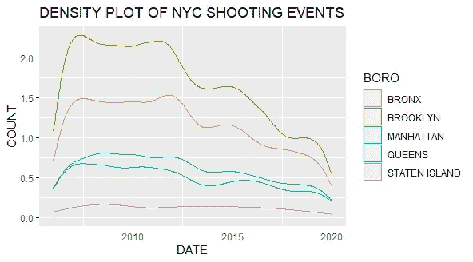

我们很容易注意到，布鲁克林是这一时期枪击案数量最多的区。

无需关注时间变量，为了获得更多可见性，我们可以简单地制作所有事件的直方图，然后得到确认:

*total _ histo<shoots %>% gg plot(AES(x = forcats::FCT _ infreq(BORO))+geom _ bar()*

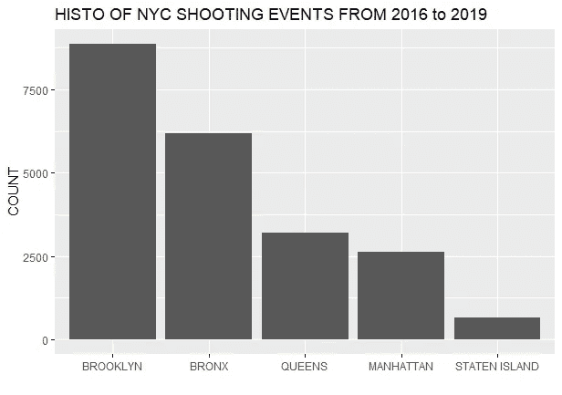

数据集包含每个事件的纬度和经度。根据这些信息做一个散点图，我们就有了这一时期枪击事件的地图:

*地图<-shootings %>% gg plot(AES(x =经度，y =纬度，col=BORO))+geom_point()*

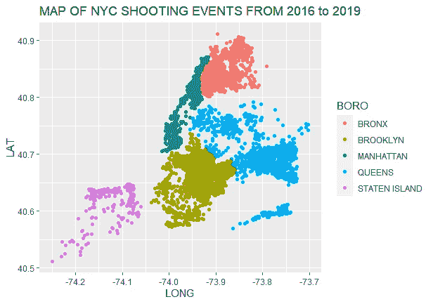

2 邻居级别

我们已经确定布鲁克林是 2006 年至 2019 年间枪击案数量最多的区。现在让我们放大到这个区，看看附近的情况。

根据下面的地图，我们观察到西边的密度更高，使得这个区域更加“拍摄敏感”:

*布鲁克林 _ 地图<拍摄%>%滤镜(BORO== "布鲁克林")%>% gg plot(AES(x =经度，y =纬度))+geom_point()*

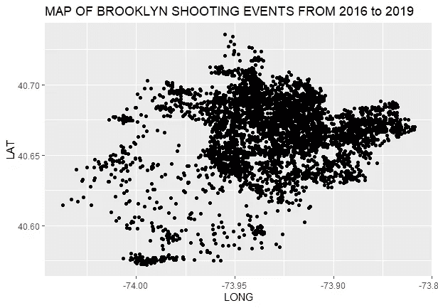

这些点给了我们一个提示，但为了更准确，让我们使用邮政编码信息，并确定在此期间出现次数最多的 5 个邮政编码。

*#看排名前 5 的 ZIP
group _ ZIP<-shootings %>% group _ by(ZIP)%>% tally()
top _ 5 _ ZIP<-group _ ZIP %>% arrange(desc(n))%>% head(n = 5)
# plot this top 5
top _ 5 _ histo<-shootings %>% filter(ZIP % in % top _ 5 _ ZIP $中*

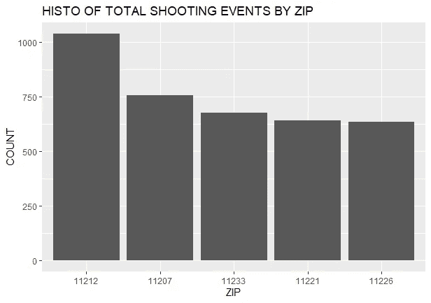

这 5 个拉链是布鲁克林区的一部分。我们现在可以用高亮显示的区域绘制一张地图。

*BROOKLYN _ map _ top _ 3<-shootings %>% filter(BORO = = " BROOKLYN ")%>%
gg plot(AES(x =经度，y =纬度，col = if else(ZIP % in % top_3_zip$ZIP，top _ 3 _ ZIP $ ZIP，"其他"))+
geom_point()*

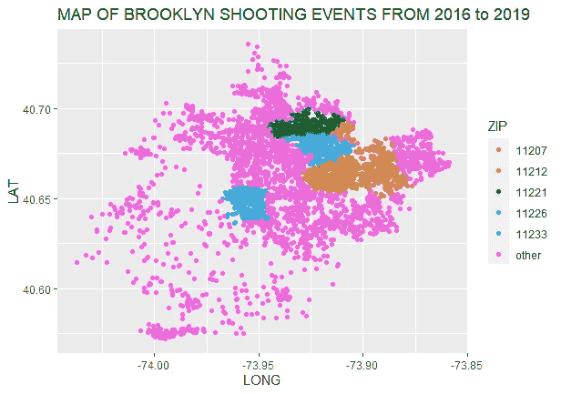

*   11212 =布鲁克林布朗斯维尔
*   11207 =布鲁克林，东布鲁克林
*   11233 =布鲁克林海洋山
*   11221=布鲁克林布什维克
*   11226=布鲁克林弗拉特布什

3 考虑到人口

上述分析仅考虑了每个 ZIP 的出现次数。从这些数字的角度来看待人口更有意义。

为了澄清，我们在下面看到，枪击事件的总发生率和邮政编码的人口之间没有很强的相关性。

*group _ zip _ pop _ plot<-group _ zip _ pop %>%
gg plot(AES(POPULATION，n，col=BORO))+geom_point()*

(我使用对数标度来响应向极端值的偏斜)

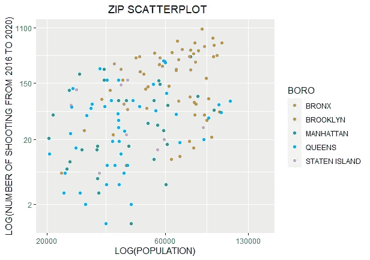

事实上，我们在散点图 ZIP 中观察到很大的分散。然而，布朗克斯区和布鲁克林区的枪击案数量都很高，人口也很多(我们在地块的右上方看到一片 yucki/green cloud)。

然而，即使相关性不显著，我们显然也需要考虑人群来确定该区域的危险。

为此，让我们引入一个 ZIP 射速(每 10，0 00 名居民的年射速):

*#将比率添加到 df
group _ zip _ shooting _ rate<-group _ zip _ pop %>% mutate(shooting _ rate = as . numeric(n)/as . numeric(POPULATION)/14 * 10000)*

*# plot top 5
top _ 5 _ histo _ shooting _ rate _ plot<group _ ZIP _ shooting _ rate %>% arrange(desc(shooting _ rate))%>% head(5)%>% gg plot(AES(x = reorder(ZIP，-shooting_rate)，y = shooting_rate，fill = BORO))+geom _ bar(stat = " identity ")*

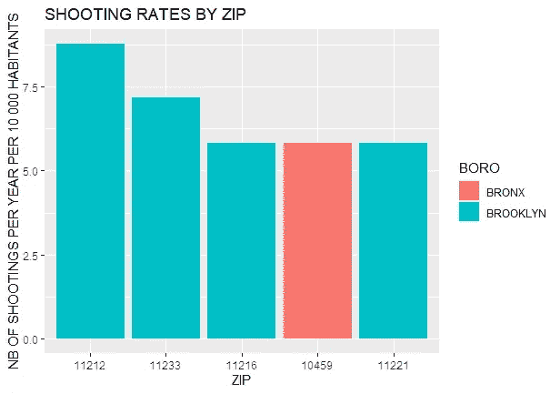

这五大“危险拉链”的构成已经发生了变化。你可以注意到布朗克斯的拉链现在是它的一部分。

我们可以通过凶杀案信息来看看枪击案的总数，从而了解凶杀案的比例:

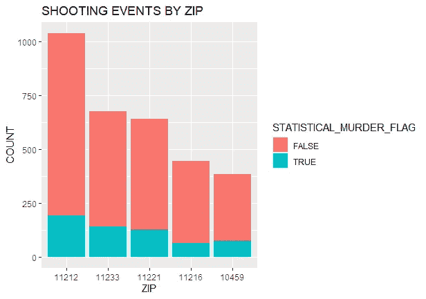

你注意到布朗克斯区 10459(图中的 5 号)比 11216(4 号)包含更多的谋杀案。

4 结论

以下是根据 NYPD 数据库，2006-2019 年期间发生最高*枪击事件/ 2020 年人口*比率*的 5 个“最危险”拉链 *(* ):*

*   *布鲁克林布朗斯维尔 1 号(11212)*
*   *布鲁克林区海洋山 2 号(11233)*
*   *布鲁克林东布鲁克林区 3 号(11207)*
*   *布鲁克林皇冠高地 4 号(11216)*
*   *布朗克斯区朗伍德 5 号(10459)*

*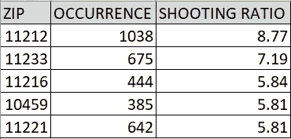**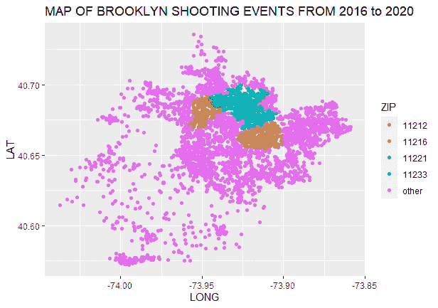**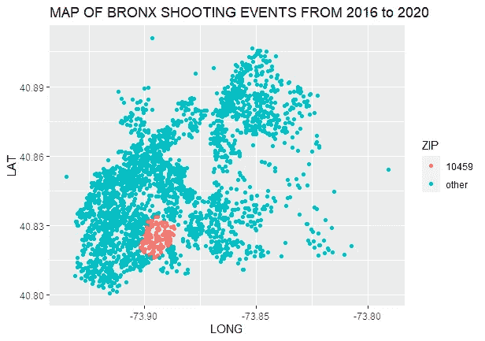*