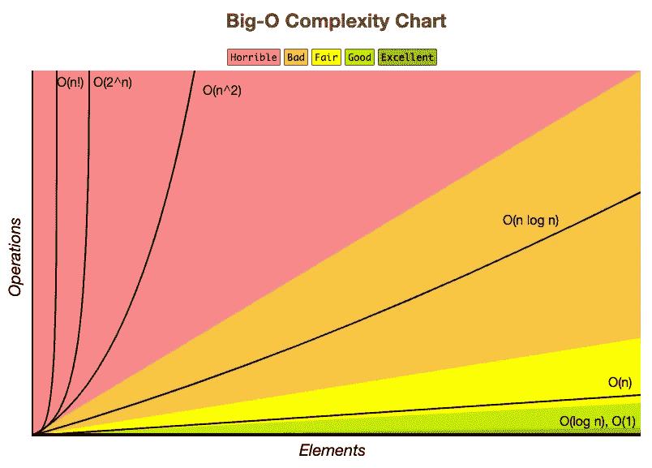
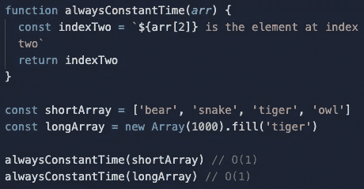
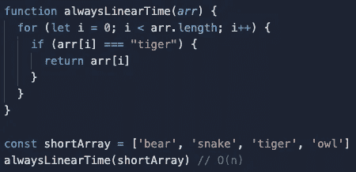
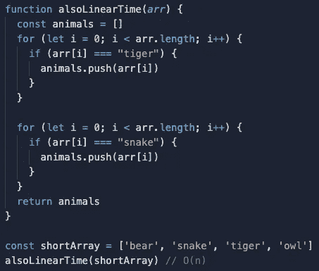
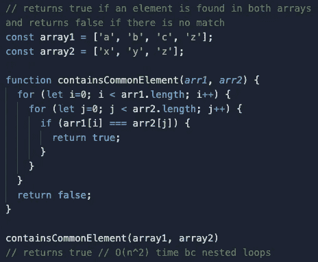
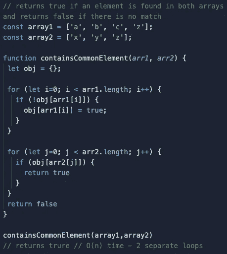

# 对于初级面试来说足够大了

> 原文：<https://medium.com/geekculture/o-no-not-another-blog-about-big-o-338457f9247a?source=collection_archive---------17----------------------->

我发现有这么多关于大 O 符号的博客的原因之一是因为没有主流训练营(包括我参加的那个)教授它。因此，这是写博客的完美话题，因为写作有助于巩固你自己的知识。我相信这一点被忽视了，因为人们认为它在小公司没有用，在初级开发人员的面试中不会被问到，或者可能(最有可能)没有足够的时间把它塞进 15 周的训练营计划。但是，正如你将看到的，即使只是知道基本知识(这个*是*基本知识)也会帮助你在竞争中脱颖而出，并从根本上改变你看待算法的方式。

首先，看一下这张图表(你可能已经看过无数次了):

[bigocheatsheet.com](http://bigocheatsheet.com)

这张图表基本上向我们展示了我们的算法在放大时的效率。例如，如果您要搜索 20 个元素，一个基本的 For 循环就可以了，但是 10，000，000 个元素呢？我们需要一种方法来讨论我们代码的时间和空间。由于每个人的电脑、网速等都不一样。，测量一个算法的*实际*时间或空间(即 40ms，3kb)对我们几乎没有好处。大 O 符号给了我们一个统一的方法来度量代码的时间和空间复杂度。

我们只讨论恒定时间 O(1)，线性时间 O(n)，二次时间 only 我相信这些会对初级软件开发人员面试最有帮助(如果你申请的是苹果、亚马逊等。你的知识需要更加深入)。

## **常数时间 O(1)**

时间为 O(1)的算法将在固定的时间内返回，而不管输入的大小。例如:

这个函数返回一个字符串，该字符串包含在输入数组的索引 2 处访问的元素。如你所见，数组是 4 个元素还是 1000 个元素并不重要；返回时间总是相同的——恒定的。这是最快的大 O 时代。

## **线性时间 O(n)**

时间为 O(n)的算法的速度由输入(n)的大小决定。在大 O 中测量的一个非常重要的规则是，我们总是将*最坏情况*作为我们的大 O 符号。例如:

这个函数找到“tiger”相当快，但是如果我们的数组有 1000 个元素，而“tiger”在最后呢？这就是我们所说的最坏情况。所以每增加一个元素(n)，我们的时间就线性增加 O(n)。可以把它想象成数组中的每一步都会导致时间随之增加。这个例子怎么样:

每个 for 循环的时间都是 O(n)，所以这个函数的时间是 O(2n)。然而，在大 O 符号中，我们去掉了常数，仍然称之为 O(n)。

## 关于数组和时间的说明:

访问数组(arr[2])中的元素将总是常数时间 O(1)。追加和取消应用(push，pop)元素也是如此。然而，插入、删除、移位、取消移位、拼接都需要 O(n)时间。这是因为在执行这些操作时，必须移动数组的所有索引，这意味着完成这些操作的时间随着数组中每个元素(n)的增加而增加。即使您执行切片来制作阵列的副本，执行该副本也需要 O(n)时间，因为必须映射整个阵列才能制作副本。数组方法如。forEach，。地图，。查找，。过滤器，。减少都是 O(n)线性时间。

## 二次时间 O(n)

随着我们的前进，随着投入的增加，我们的时间变得越来越糟糕。二次时间变得不可接受，你应该对给出一个时间复杂度如此之高的面试问题的解决方案感到厌倦。然而，当你想出第一个强力解决问题的方法时，这是一个很好的起点；这表明你至少可以*解决问题，并给你一个机会谈论大 O 以及为什么二次时间(通常)是不可接受的。最常见的例子是嵌套循环:*

如果你的答案涉及到嵌套循环，总是有一个更快的时间可以解决它，它最有可能涉及到一个对象或“哈希表”。让我们来看看更好的解决方案:

使用对象允许我们用两个没有嵌套的 for 循环来解决问题。看上面线性时间，多重 for 循环仍然给我们 O(n)时间，所以这是一个更好的答案。

## 空间复杂性

上述解决方案引入了空间复杂性，因为有一个变量会占用内存(空间)。空间复杂性和时间复杂性在逻辑上是一样的。随着输入(n)的增加，变量的大小(空间、内存)会增加，这是真的吗？是的，所以我们的空间复杂度是 O(n)。

## 面试

很有可能没有人会在你的面试中问你关于 Big O 的问题——这是因为他们在等着看*你*是否会在你讲述你的编码过程时提到它。这是你从新兵训练营的毕业生中脱颖而出的时候了，他们都制作了相同的小狗般的应用程序，却从来没有自己学习过任何新东西！大 O-耶！lol。