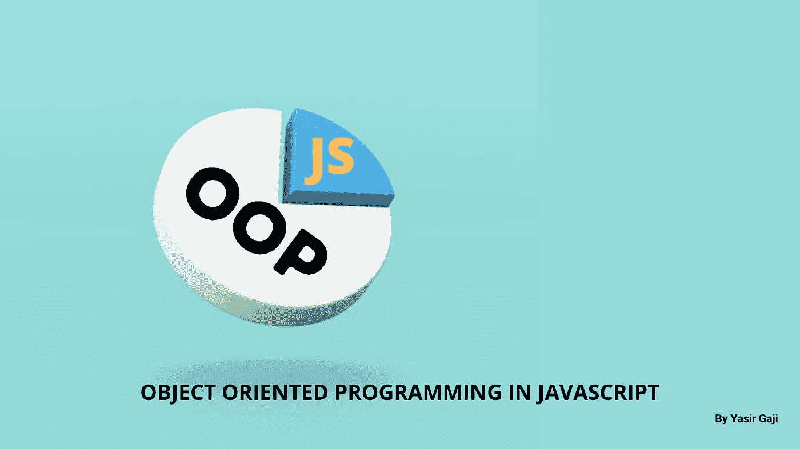
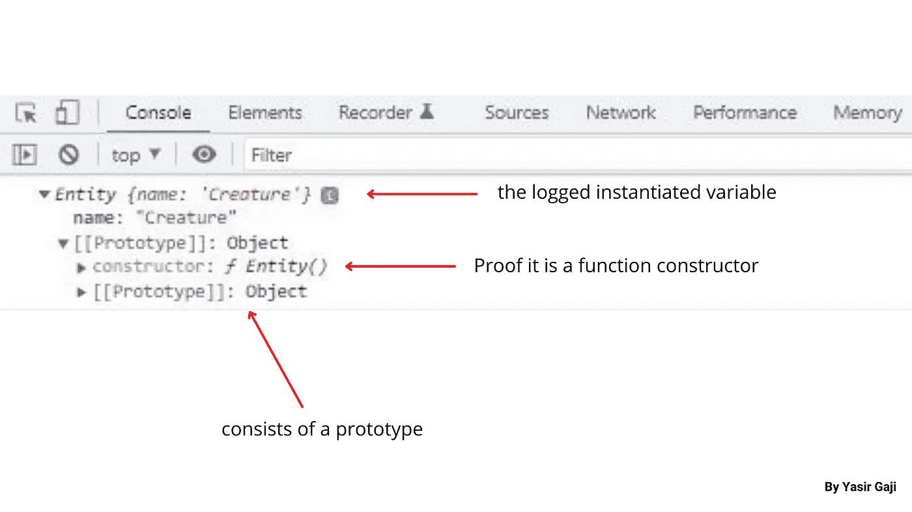
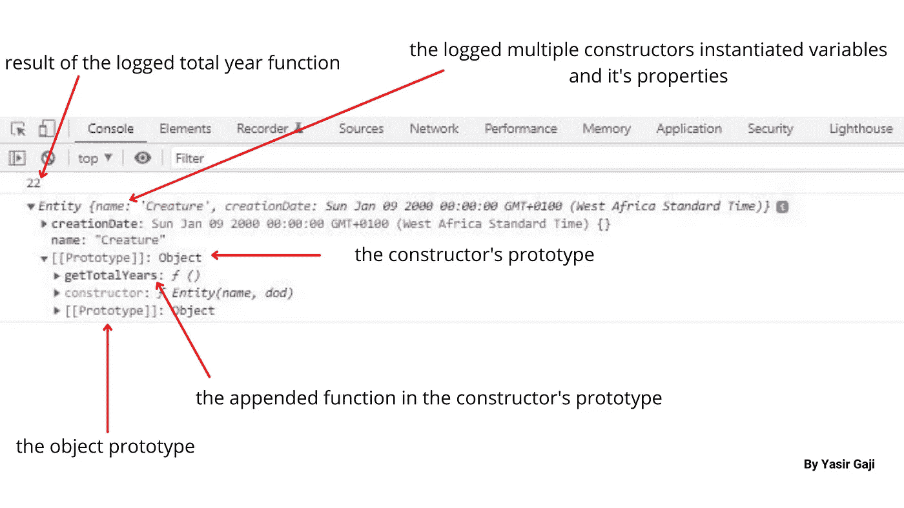
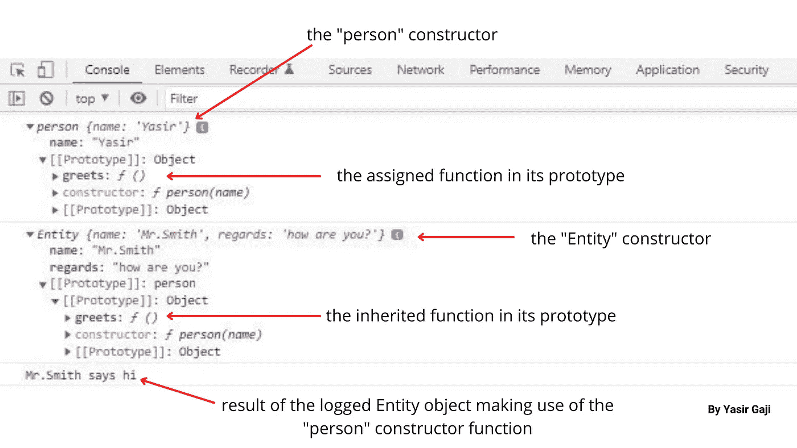

# O.Javascript 中的 O.P

> 原文：<https://medium.com/geekculture/o-o-p-in-javascript-369434afcf1d?source=collection_archive---------3----------------------->

Object-Oriented Programming Image By [**Yasir Gaji**](https://yasirgaji.com)

[***面向对象编程***](https://en.wikipedia.org/wiki/Object-oriented_programming#:~:text=Object%2Doriented%20programming%20(OOP),(often%20known%20as%20methods).) 简单来说就是一种基于不同类型对象及其属性概念的编程模式。现在，几乎所有的编程语言都支持 **OOP** ，但是在本文中，我们将研究 javascript 中 **OOP 的关键特征，并且我将确保使用简单的例子来举例说明。**

我们将看看两个关键的 ***OOP 原则*** : [**继承**](https://developer.mozilla.org/en-US/docs/Learn/JavaScript/Objects/Inheritance) **和** [**多态性**](https://www.javatpoint.com/javascript-oops-polymorphism#:~:text=JavaScript%20Polymorphism,method%20on%20different%20JavaScript%20objects.) 在基本层面上，它实际上如何与 javascript 代码相关，使用 javascript 中 **OOP 的核心特征来举例说明这些原则，我们有:**

# 构造函数和“this”关键字。

javascript 和几乎任何其他编程语言中的 [***面向对象编程***](https://en.wikipedia.org/wiki/Object-oriented_programming#:~:text=Object%2Doriented%20programming%20(OOP),(often%20known%20as%20methods).) 中最重要的两件事是`this`关键字和`constructors`。

虽然 **Es6+** 被认为是一种语法糖，并提供了一种更方便的编写构造函数或声明类的方式，但我将在本文中使用 **Es5** ，这样我们可以更深入地了解构造函数是如何工作的。

就像键值对对象被赋给变量的对象文字一样，构造函数也是如此，但是对于多个实例，与对象文字不同，构造函数由**原型**和**继承组成。**

首先，有一个单一或多个属性的构造函数，我们可以使用`new`关键字实例化一个对象。请参见下面的代码演示和控制台结果:

Code representation of a single property constructor By[**Yasir Gaji**](https://yasirgaji.com)

Console Image of the instantiated constructor By [**Yasir Gaji**](https://yasirgaji.com)

`this`关键字是一个非常重要的关键字，它的值由代码运行的当前上下文决定。在我们的例子中，它的值的范围是`Entity`函数上下文。而如果在函数作用域之外或全局作用域中使用，您将获得窗口对象，因为它现在存在于全局上下文中。您可以在这里 了解更多`this`关键词 [***。***](https://developer.mozilla.org/en-US/docs/Web/JavaScript/Reference/Operators/this)

您也可以将多个属性添加到构造函数中，并以不同的方式实例化它们。

# 原型和原型继承

javascript 中的每个对象都有一个原型。原型本身就是一个对象，所有对象都可以从它们的原型继承属性和方法。这意味着我们也可以将我们选择的函数分配或附加到构造函数原型链中。

请参见下面的代码表示:

Code representation of how to append functions into the constructor’s prototype By [**Yasir Gaji**](https://yasirgaji.com)

The results of the logged code in the console By [**Yasir Gaji**](https://yasirgaji.com)

**原型继承**是指一个对象从同一个代码上下文中的另一个对象继承其属性，这可以借助`object.create()`方法来实现。

请参见下面的代码表示:

Code representation of Prototypal inheritance example By [**Yasir Gaji**](https://yasirgaji.com)

The console Image of the above code results By [**Yasir Gaji**](https://yasirgaji.com)

# 结论

有些核心对象使用构造函数，但是不建议使用，例如，`Date()`对象。
当使用对象文字时，原型从`object.prototype`获得，但是当使用构造函数对象时，原型从`(the constructor name).prototype` 获得，不能被 for-in 循环访问。

将函数附加/分配到构造函数的原型中的艺术被认为是有效的，并且在良好的实践中，这是值得推荐的。
`Call()`方法是一个函数，用于从同一上下文中的另一个代码块调用另一个函数。

你可以在这里 找到本文 [***中所有代码的 **Es6+** 语法***](https://gist.github.com/YasirGaji/2cced55f954bc31fa5f108d9a84c7f3c)

一定要问问题来澄清，并提出纠正和建议，我希望他们这样做。