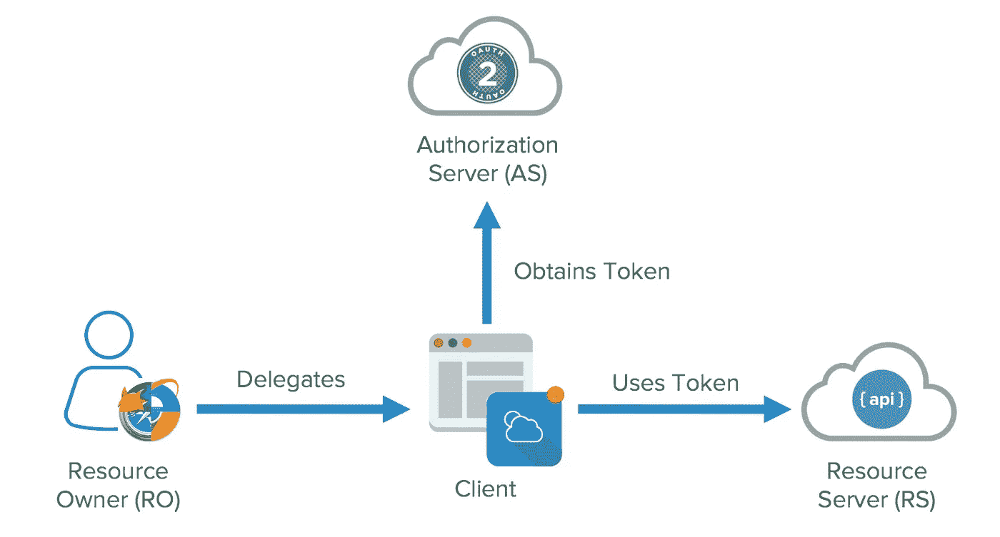
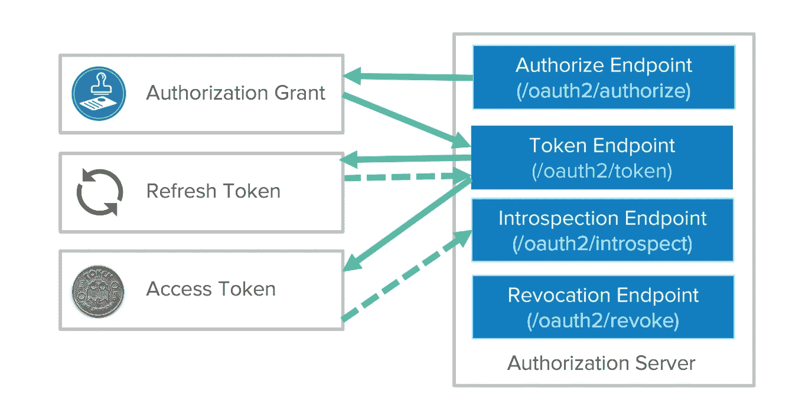

# OAuth 2.0 认证协议

> 原文：<https://medium.com/geekculture/oauth-2-0-authentication-protocol-3768a6535c40?source=collection_archive---------6----------------------->

# OAuth 2.0

OAuth 2.0 是授权的行业标准协议。OAuth 2.0 关注客户端开发人员的简单性，同时为 web 应用程序、桌面应用程序、移动电话和客厅设备提供特定的授权流。该规范及其扩展正在 IETF OAuth 工作组内开发。

# 身份验证与授权

简而言之，身份验证是验证用户身份的过程，而授权是验证用户有权访问哪些内容的过程。

**认证**:

*   用于识别用户身份的有效性
*   要求用户使用有效凭据来识别其身份
*   通常在认证之前完成
*   通常通过 ID 标记进行验证

**授权:**

*   用于标识用户可以或不可以访问的内容。
*   验证是否通过策略和规则允许访问
*   通常在用户通过身份验证后出现。
*   使用接入令牌传输信息。

OAuth 用于授权一个服务的特定功能，而不是认证用户。

# 用例

*   照片打印应用程序可以通过 Google 认证来使用 Google 相册上的图片。
*   面向游戏玩家的社交网站可以显示用户在不同游戏平台上的分数。
*   在线健身房平台可以访问用户的总结健康数据，以便为用户策划特定的挑战。

# 真实演员

OAuth 流中的参与者如下:

*   **资源所有者**:拥有资源服务器中的数据。例如，我是我的脸书个人资料的资源所有者。
*   **资源服务器**:存储应用程序想要访问的数据的 API
*   **客户端**:想要访问你的数据的应用
*   **授权服务器**:OAuth 的主引擎

OAuth 2.0 Actors

资源所有者是一个可以随不同凭据而变化的角色。可以是最终用户，也可以是公司。

客户可以是公开的也可以是保密的。在 OAuth 命名法中，两者有显著的区别。可以信任机密客户端来存储秘密。它们不在桌面上运行，也不通过应用商店发布。人们无法对它们进行逆向工程并获得密钥。它们运行在终端用户无法访问的受保护区域。

公共客户端是浏览器、移动应用和物联网设备。

# OAuth 令牌

**访问令牌**是客户端用来访问资源服务器(API)的令牌。它们是短暂的，TTL 是以小时和分钟为单位，而不是以天和月为单位。您可以从公共客户端获得访问令牌。它们旨在针对互联网规模问题进行优化。因为这些令牌可以是短期的和横向扩展的，它们不能被撤销，您只需等待它们超时。

**刷新令牌**是客户端用来获取新访问令牌的令牌。它们的寿命比访问令牌长得多，即几天、几个月和几年。

刷新令牌可以被撤销。这为服务器提供了强制客户端轮换密码的能力。客户端可以使用刷新令牌来获取新的访问令牌，这些访问令牌会访问所有 API 资源。每次刷新访问令牌时，客户端都会获得一个新的加密签名令牌。系统内置了密钥轮换。

Lifecycle of OAuth 2.0

# OAuth 流

*   **授权码流程:**授权码流程用授权码换代币。这个流程的先决条件是客户端已经拥有应用程序的密钥。应用程序接收用户的授权码，并将其与客户端 ID 和客户端机密一起转发给 OAuth 授权服务器。授权服务器生成 ID 令牌、访问令牌和可选的刷新令牌，然后将它们提供给应用程序。然后，web 应用程序可以使用访问令牌，通过用户凭证获得对目标 API 的访问。
*   **客户端凭证流**:客户端凭证流允许应用程序将它们的客户端秘密和客户端 ID 传递给授权服务器，授权服务器对用户进行身份验证，并返回一个令牌。这不需要任何用户干预，因为“用户”通常是机器或服务角色。
*   **资源所有者密码流**:资源所有者密码流要求用户通过表单提交他们的凭证。在授予访问令牌之前，凭证被传送到后端，并且可以被保留以供将来使用。该应用程序必须完全可信。所以一般不推荐这种流量。
*   **表单 Post 的隐式流:**web 应用程序通过前端通道请求和接收令牌，不需要额外的后端调用或秘密。通过这一过程，您不必使用、维护、获取或保护应用程序中的机密。
*   **混合流程**:多种方法的混合
*   **设备授权流程:**授权设备而非用户
*   **PKCE 授权码流程**

# 结论

OAuth 2.0 是授权访问 API 的授权框架。它涉及请求资源所有者授权/同意的范围的客户端。授权许可被交换为访问令牌和刷新令牌(取决于流)。有多个流程来处理不同的客户端和授权场景。jwt 可以用于授权服务器和资源服务器之间的结构化令牌。

祝贺你坚持到了最后！在[*Twitter*](https://twitter.com/bot_pragmatic)*[*GitHub*](https://github.com/abinator-1308/abinator-1308)*[*Medium*](/@abhinav.as1308)*[*LinkedIn*](https://www.linkedin.com/in/abinator-1308/)*，或者*[*insta gram*](https://www.instagram.com/abinator_1308/)*上随意谈论科技或者任何很酷的项目。****

**感谢阅读！**

# **参考**

*   **[https://oauth.net/2/](https://oauth.net/2/)**
*   **[https://github.com/golang-jwt/jwt](https://github.com/golang-jwt/jwt)**
*   **[https://github.com/dgrijalva/jwt-go](https://github.com/dgrijalva/jwt-go)**
*   **[https://www.youtube.com/watch?v=-Scg9INymBs](https://www.youtube.com/watch?v=-Scg9INymBs)**
*   **[https://auth 0 . com/docs/get-started/identity-fundamentals/认证和授权](https://auth0.com/docs/get-started/identity-fundamentals/authentication-and-authorization)**
*   **[https://tools . IETF . org/id/draft-IETF-oauth-use-cases-03 . html](https://tools.ietf.org/id/draft-ietf-oauth-use-cases-03.html)**
*   **[https://developer . okta . com/blog/2017/06/21/what-the-heck-is-oauth](https://developer.okta.com/blog/2017/06/21/what-the-heck-is-oauth)**
*   **[https://frontegg.com/blog/oauth-flows](https://frontegg.com/blog/oauth-flows)**