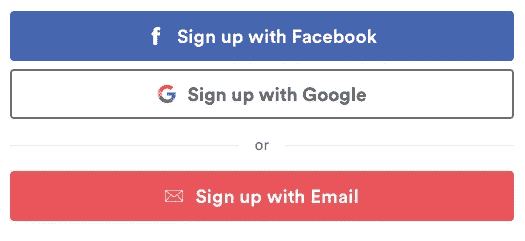
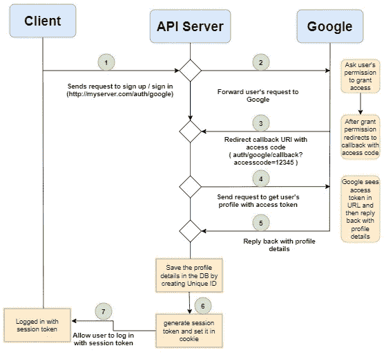
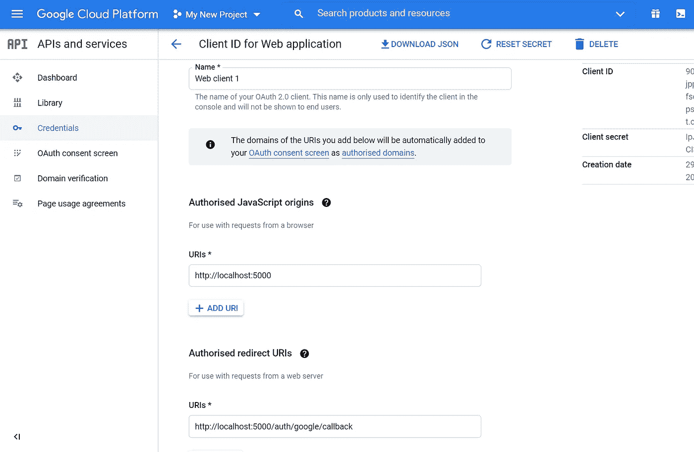
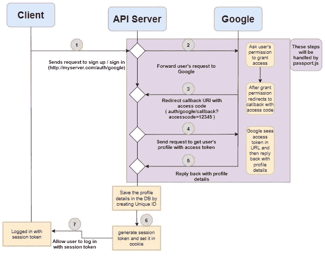
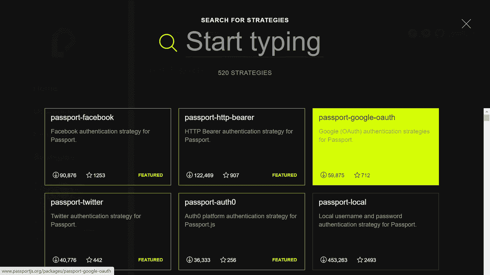
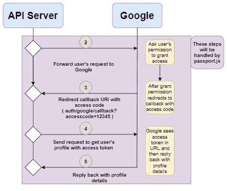
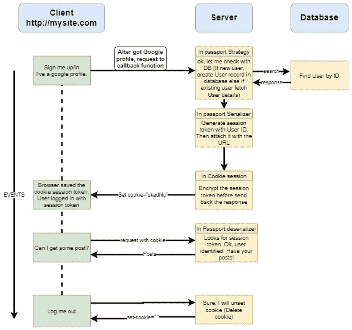
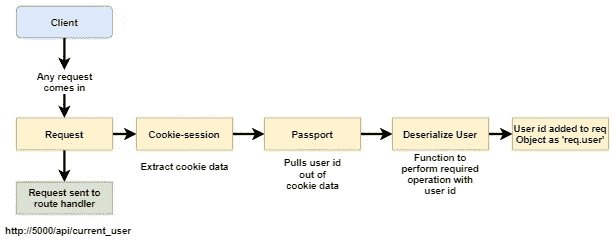

# OAuth 认证系统-幕后

> 原文：<https://medium.com/geekculture/oauth-authentication-system-behind-the-scenes-e0720a3c31ab?source=collection_archive---------28----------------------->

## 关于 OAuth 身份验证，您需要知道的就是。通过在 Node.js 应用程序中实现 OAuth 来理解它的操作流程。


Photo by [Franck](https://unsplash.com/@franckinjapan?utm_source=medium&utm_medium=referral) on [Unsplash](https://unsplash.com?utm_source=medium&utm_medium=referral)

在我们的应用程序中实现 OAuth 身份验证系统并理解 OAuth 方法的技术工作流程是相当具有挑战性的。



在本文中，让我们用简单的英语来说明 OAuth 的工作流程，以及它在 Express.js 框架中的实现。这里我们将使用 **Google OAuth** 进行演示。



当用户(从客户端)向 API 服务器发送使用 Google 登录的请求时，它会将该请求转发给 Google。google 在一个单独的窗口中提示用户的许可。一旦用户授予许可，Google 就用访问令牌响应服务器。
当服务器获得访问令牌时，它通常不会让用户立即登录应用程序。它再次向 Google 发送一个请求，通过访问代码获取用户的详细信息。通过查看访问代码，Google 向服务器提供所请求的用户配置文件。现在，服务器将用户的详细信息存储在数据库中，然后允许用户使用会话令牌登录应用程序。这些是 OAuth 的基本高层流程。现在让我们借助 Express.js 框架，在 Node.js 应用程序中开始实现它。

> 本文假设您对 Node.js 和 Express 有基本的了解。
> 
> 整个源代码可以在 [***这里找到***](https://github.com/vijay7755/google-oauth) 。

通过在终端窗口中执行 *npm init* 来创建 node.js 应用程序，并在根目录中的 ***index.js*** 文件中添加以下代码。

```
/* index.js */const express = require('express');const app = express();const PORT = process.env.PORT || 5000
app.listen(PORT);
```

在我们继续之前，让我们首先在[***console . Google***](https://console.cloud.google.com)中设置我们的项目，以便访问 Google OAuth API。我们在应用程序中需要 ***客户端 ID*** 和 ***客户端秘密*** 。



> 请按照 [***这里***](https://drive.google.com/file/d/1dH6nCmNm8Vqqc_VUdhvWofHqdJxDCxPk/view?usp=sharing) 的指示，在 google 控制台中设置项目。

在 google 控制台中完成项目设置后，创建一个 keys.js 文件来存储我们的 google 客户端 ID 和客户端密码。

```
/* ./config/keys.js */module.exports = {
    googleClientID: 'your-client-id1234.apps.googleusercontent.com',
    googleClientSecret: 'your-secret-key'
}
```

现在我们将使用一个名为 ***Passport.js*** 的助手库来帮助我们创建这个认证流。Passport.js 将在这里处理几个不同的步骤，这将使我们的生活更加轻松。



在我们的应用程序中安装 Passport.js。欲了解更多信息，请访问 [***文档***。](http://www.passportjs.org/docs/downloads/html/)

```
$ npm install passport
```

当我们使用 Passport.js 时，我们至少安装了两个独立的库。第一个是 Passport.js 本身，它是核心的 Passport 模块，包含一般的函数、对象和助手，使得认证在 Express 中很好地工作。其他被称为 Passport Strategy 的库用于实现与特定提供者的授权流。这里的提供商有谷歌、脸书、Github 等。

这里我们要使用***passport-Google-oauth***策略。在我们的应用程序中安装*passport-Google-oauth 20**。*

```
*$ npm install passport-google-oauth20*
```

**

*要了解更多护照策略，请访问 [**这里**](http://www.passportjs.org/packages/) 。*

> *在这个时候，你可能会觉得我为什么要办护照之类的事情。但是相信我，这对减少我们的努力会非常有帮助。*

*由于护照功能是一种服务，在 ***下创建一个 ***passport.js*** 文件。/services*** 目录并添加以下代码。*

```
*/* ./services/passport.js */const passport = require('passport');
const GoogleStrategy = require('passport-google-oauth20').Strategy;
const keys = require('./../config/keys');passport.use(
    new GoogleStrategy({
        clientID: keys.googleClientID,
        clientSecret: keys.googleClientSecret,
        callbackURL: '/auth/google/callback'
    },
        (accessToken, refreshToken, profile, done) => {
            console.log(profile.id);
        })
);*
```

*这里，我们正在导入 Passport 库和 passport-google-oauth 库，这被称为策略。如果我们在应用程序中使用其他 OAuth 服务，比如脸书、GitHub，我们必须安装并导入相应的策略。
然后我们要给 GoogleStrategy 提供 ***clientID*** ， ***clientSecret*** 和 ***callbackURL*** 三个强制属性。记住，回调 URL 是 google OAuth API 用访问代码重定向的地方。*

*现在在***中创建***auth routes . js***文件。/routes* 和**目录中添加以下内容。*

```
*/* ./routes/authRoutes.js */const passport = require('passport');module.exports = (app) => {
    app.get('/auth/google',
        passport.authenticate('google', { scope: ['profile', 'email'] })); app.get(
        '/auth/google/callback',
        passport.authenticate('google'),
        (req, res) => {
            res.redirect('/')
        }
    );}*
```

*这里我们设置了一个用于认证的路由处理器。一旦 URL 命中“/auth/google”，我们就使用 Passport 库，它会自动访问 Google OAuth API，从而执行身份验证。用户授予权限后，Google API 会用访问代码重定向到“/auth/google/callback”。现在“/auth/google/callback”路由处理器将参与进来。我们在那里指定了 passport.authenticate('google ')。因此，如果 Passport 看到带有访问代码的 URL，它会再次将其发送给 google API，并要求提供用户的个人资料。现在，通过查看访问令牌，Google API 将把用户的配置文件详细信息返回给 Passport(accessToken、refreshToken、profile)。参考下图。*

**

*现在更新 ***index.js*** 文件如下，在 app 启动时执行 ***passport.js*** 文件和 ***authRoutes.js*** 文件。*

```
*/* index.js */const express = require('express');
const passport  = require('passport');
const keys = require('./config/keys');
require('./services/passport');
const authRoutes = require('./routes/authRoutes');const app = express();authRoutes(app);const PORT = process.env.PORT || 5000
app.listen(PORT);*
```

*是的，我们已经成功地在应用程序中设置了 google OAuth。现在，如果您访问“[http://localhost:5000/auth/Google](http://localhost:5000/auth/google)”，您应该会看到 google OAuth 窗口询问用户的许可。授予权限后，您应该会在控制台窗口(终端)中看到配置文件 id。记住，我们已经在 googleStrategy 的回调函数中打印了 passport.js 文件中的 *profile.id* 。*

## *会话令牌*

*我们已经完成了一半。现在让我们进入会话令牌部分。认证的另一个重要方面。*

**

*一旦 Passport GoogleStrategy 从 google OAuth API 得到响应，我们就可以实现将用户配置文件存储到数据库中的过程(逻辑),并开始处理会话令牌。*

*如下所示更新 passport.js 文件以使用数据库(检查用户的配置文件)。*

```
*/* ./services/passport.js */const passport = require('passport');
const GoogleStrategy = require('passport-google-oauth20').Strategy;
const keys = require('./../config/keys');passport.use(
    new GoogleStrategy({
        clientID: keys.googleClientID,
        clientSecret: keys.googleClientSecret,
        callbackURL: '/auth/google/callback'
    },
        (accessToken, refreshToken, profile, done) => {
            console.log(profile.id);
            **// Write logic here to find the user profile with id in    //the database
           // Once done, the DB will return the response

   let existingUser = "some_id_123" // Assume this variable value //was return by database by finding existing record** **if(existingUser) {
                done(null, existingUser)
            }
            else {
   // Write logic here to create the record for the user with the ID
   // Once done, the DB will return the response

   let newUser = "new_id_456" // Assume this variable value was     //return by database after creating new record** **done(null, newUser)
            }**
        })
);*
```

*然后，我们将转到序列化和反序列化部分，我们将分别为响应生成会话令牌和从请求中检索会话令牌。*

*现在添加 serializeUser 和 deserializeUser 方法，如下所示。*

```
*/* ./services/passport.js */const passport = require('passport');
const GoogleStrategy = require('passport-google-oauth20').Strategy;
const keys = require('./../config/keys');**passport.serializeUser((userID, done) => {
    done(null, userID)
});****passport.deserializeUser((userID, done) => {
    // perform logic here to verify the userID with the database
// Once verifyed call done(),so that the request pass to route  //handler** **done(null, userID)
});**passport.use(
    new GoogleStrategy({
        clientID: keys.googleClientID,
        clientSecret: keys.googleClientSecret,
        callbackURL: '/auth/google/callback'
    },
        (accessToken, refreshToken, profile, done) => {
            console.log(profile.id);
            // Write logic here to find the user profile with id in //the database
   // Once done, the DB will return the response

   let existingUser = "some_id_123" // Assume this variable value //was return by database by finding existing record
            if(existingUser) {
                **done(null, existingUser)**
            }
            else {
   // Write logic here to create the record for the user with the ID
   // Once done, the DB will return the response

   let newUser = "new_id_456" // Assume this variable value was //return by database after creating new record
            **done(null, newUser)**
            }
        })
);*
```

****Google strategy()******内的 **done(null，user)** 方法回调*** 方法将调用**passport . serialize user(userID)**方法，将用户作为参数传递。serializeUser 方法将负责生成带有 userID 的会话令牌，并将其与响应一起发送。*

*不，让我们再安装一个模块[***cookie-session***](https://www.npmjs.com/package/cookie-session)*来创建一个 cookie 来使用会话令牌。**

```
**$ npm install cookie-session**
```

> **注意:也有其他方法可用，如 **JWT。**这里我们使用 cookie 作为会话令牌。**

**现在更新 index.js 文件如下，添加***cookie-会话中间件*** 和 ***passport 中间件*** 来处理会话。**

```
**/* index.js */const express = require('express');
const cookieSession = require('cookie-session');
const passport  = require('passport');
const keys = require('./config/keys');
require('./services/passport');
const authRoutes = require('./routes/authRoutes');const app = express();**app.use(
    cookieSession({
        maxAge: 30 * 24 * 60 * 60 * 1000,
        keys: [keys.cookieKey]
    })
);
app.use(passport.initialize());
app.use(passport.session());**authRoutes(app);const PORT = process.env.PORT || 5000
app.listen(PORT);**
```

**现在更新。/config/keys.js 文件来设置 cookie id，如下所示。作为一种加密行为，该 id 将被标记在会话令牌上。**

```
**module.exports = {
    googleClientID: 'your-client-id123456789.apps.googleusercontent.com',
    googleClientSecret: 'your-secret-key',
    **cookieKey: 'mckdjcnhljinuyvrhbelbvcnaljskbvnskvnr'**
}**
```

****

**这些是中间产品。通过实现***cookieSession***，由***passport . serialize user***函数创建的会话令牌将在响应发送到客户端时被加密。此外，每当我们从客户端获得请求时，cookie 都会被解密。**

**当 cookieSession 中间件解密 cookie 令牌时，它将发送给 deserializeUser，在那里我们可以执行自己的逻辑来处理 userID，就像我们可以用数据库验证 userID 一样，然后将请求传递给 ***路由处理程序*** 。**

**为了验证这一点，在***auth routes . js***文件中添加以下路由。**

```
**/* ./routes/authRoutes.js */const passport = require('passport');module.exports = (app) => {
    app.get('/auth/google',
        passport.authenticate('google', { scope: ['profile', 'email'] }));app.get(
        '/auth/google/callback',
        passport.authenticate('google'),
        (req, res) => {
            res.redirect('/')
        }
    );

 **app.get('/api/logout', (req, res) => {
        req.logout();****res.send(req.user);
    });****app.get('/api/current_user', (req, res) => {
        if (req.user) {
            res.send({ here_is_user_profile: user })
        }
        else {
            res.send('Please login by this URL: 
                    http://localhost:5000/auth/google')
        }
    });**
}**
```

**登录后如果访问***http://5000/API/current _ user***，会得到用户 id。而如果你访问***http://5000/API/logout***，通过查看 **req.logout()，**passport 会负责从请求中删除 cookie，你会被自动注销。**

## **结论**

**OAuth 是一个现代的认证系统，它使得用户注册/登录很容易，因为他们不需要记住用户名和密码。我们上面讨论的工作原理和实现也适用于其他 OAuth APIs，如脸书、twitter、GitHub 等。试试看。祝 OAuth 系统好运。**