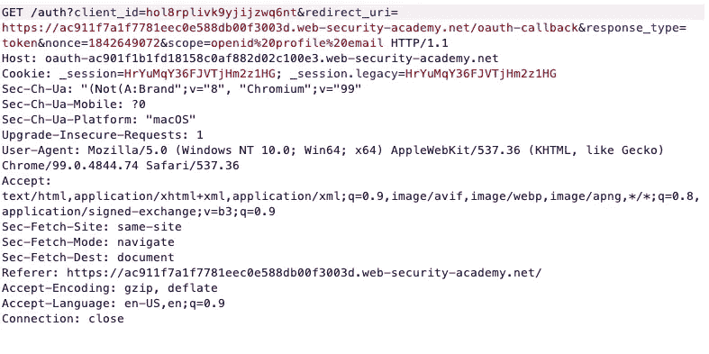

# OAuth 笔测试:第 1 部分

> 原文：<https://medium.com/geekculture/oauth-pen-testing-part-1-ae3f961a760a?source=collection_archive---------2----------------------->

## PortSwigger Web Security Academy OAuth 实验室演练

OAuth initial request

H ello，🌎！这个博客 ports 为 OAuth 实验室提供了一个名为“通过 OAuth 隐式流的认证旁路”的演练，可以在 [PortSwigger 的 Web 安全学院](https://portswigger.net/web-security)中找到。此外，我还将提供什么是 OAuth 以及通常实现的 OAuth 授权类型的基本解释。我们开始吧！