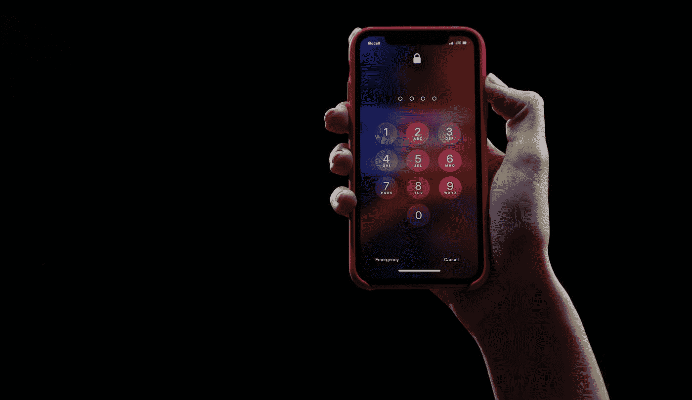
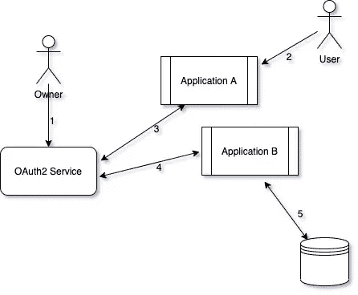
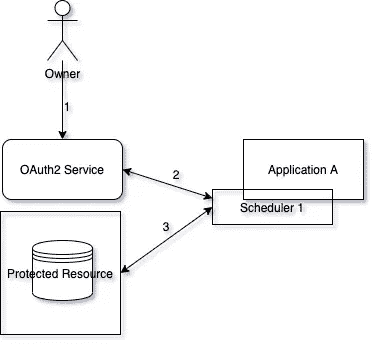
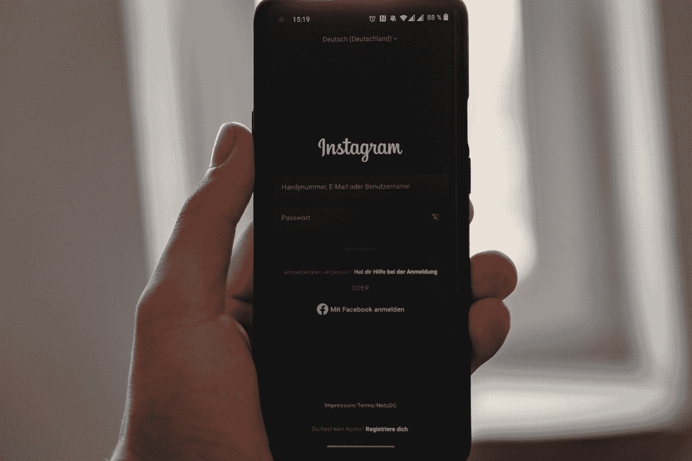
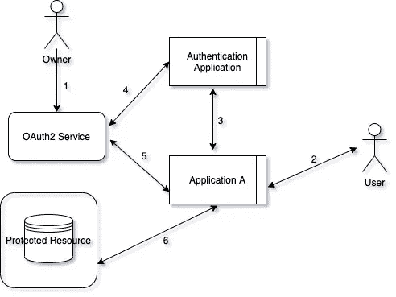
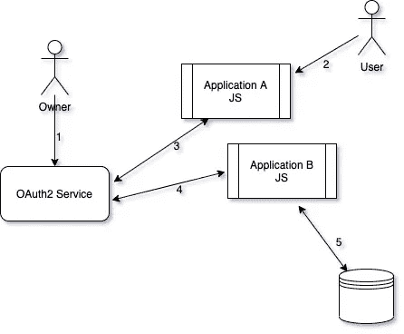

# 虚拟对象的 OAuth2 授权类型

> 原文：<https://medium.com/geekculture/oauth2-grant-types-for-dummies-bf911b2ff275?source=collection_archive---------23----------------------->

Photo by [Collin Armstrong](https://unsplash.com/@brazofuerte?utm_source=medium&utm_medium=referral) on [Unsplash](https://unsplash.com?utm_source=medium&utm_medium=referral)

我们都知道现实世界并不那么简单，我们在每个角落都不断面临新的挑战。

用户期待一个互联的世界，他们可以在多个应用程序之间安全地共享数据，例如，在他们刚刚安装的每个应用程序上，使用他们的脸书帐户作为首选身份验证方法。

从安全角度来看，这种期望带来了独特的挑战，比如不强迫用户共享凭据，以及让这种方法具有灵活性。

在今天的文章中，我们将看到你应该根据具体情况使用哪种授权类型。

## **索引**

*   密码
*   客户端凭据
*   授权代码
*   含蓄的

# #密码

Photo by [Yura Fresh](https://unsplash.com/@mr_fresh?utm_source=medium&utm_medium=referral) on [Unsplash](https://unsplash.com?utm_source=medium&utm_medium=referral)

***密码*** 格兰特式大概是最广为人知最直白的了。

当应用程序和服务在同一组织下管理并且共享相同的策略和过程时，使用他的授权类型。

Password Grant Type

1.  在用户可以访问应用程序和受保护的资源之前，他需要被 OAuth2 服务识别。

所有者需要用唯一的服务名注册环境中的所有应用程序。OAuth 随后将提供一个双方共享的密钥。

2.用户使用他们的登录凭证登录到应用程序 A。

3.这些凭证与所有者注册的应用程序名称和密钥一起提供。OAuth 服务对应用程序进行身份验证，然后提供一个令牌用于在环境中进行通信。

4.每次代表用户调用新服务时，都会通过 OAuth 服务验证给定的令牌。

5.如果令牌验证成功，服务将访问所有请求的资源。

# #客户端凭据

Photo by [Andrea De Santis](https://unsplash.com/@santesson89?utm_source=medium&utm_medium=referral) on [Unsplash](https://unsplash.com?utm_source=medium&utm_medium=referral)

***客户端凭证*** 授权通常在应用程序需要访问 OAuth 保护的资源时使用。

这种授权类型与前一种类似。主要的区别是没有人参与到流程中。

应用程序只能通过提供的唯一服务名和密钥进行身份验证。

当两个申请属于同一组织时，也使用此授权类型。

一个常见的用例可能是调度程序的使用。例如，每 30 分钟收集一次统计数据的过程。

Client Credentials Flow

1.  所有者注册应用程序，给它一个惟一的服务名。生成密钥并发送给所有者；
2.  每当调度程序运行时，它将把它的应用程序名作为所有者提供的密钥；
3.  OAuth 服务将对应用程序 A 进行身份验证，并返回一个访问令牌。每当调度程序需要再次调用资源时，服务只需要出示给定的令牌(一定期限内有效)；

# #授权

Photo by [Cedrik Wesche](https://unsplash.com/@cedrikwesche?utm_source=medium&utm_medium=referral) on [Unsplash](https://unsplash.com?utm_source=medium&utm_medium=referral)

***授权*** 授权类型被认为是四种授权类型中最复杂的。但是，它也是使用最多的，因为它允许来自不同供应商的不同应用程序共享数据，而无需在多个应用程序之间暴露用户的凭据。

与最后两种授权类型不同，这一次，OAuth 访问令牌不会立即被应用程序访问，而是被用作“预访问”授权代码。

Authorization grant type flow

1.  拥有者注册应用程序，给出一个唯一的服务名。检索密钥。通过注册“ ***认证应用*** ”，管理员将需要指定一个回调 URL，该 URL 将在用户通过认证后被调用；
2.  用户点击 ***应用内的登录页面***；
3.  每当用户试图通过 ***应用程序 A*** 进行身份验证时，他将被重定向到 ***身份验证应用程序*** ，然后他将根据正在使用的应用程序(脸书、Linkedin 等)插入其凭据。);
4.  如果提供的凭证有效，将生成一个授权码，并将用户重定向回 ***应用 A***；

> 注意:授权码不是授权令牌

5.一旦**应用程序 A** 保存了代码，并且同一用户发出了新的资源请求，**应用程序 A** 将使用生成的密钥和生成的代码检查 OAuth 服务。如果一切顺利，令牌将最终生成并被检索；

6.每当需要访问一个新的受保护资源时，将向 OAuth 服务发出一个新的请求，在请求的头上显示生成的令牌；

如果我们注意一下，没有用户数据被直接暴露给 ***应用 A*** 。

# #隐式

Photo by [Shane Aldendorff](https://unsplash.com/@pluyar?utm_source=medium&utm_medium=referral) on [Unsplash](https://unsplash.com?utm_source=medium&utm_medium=referral)

众所周知， ***隐式*** 授权类型允许不依赖于服务器端调用的基于 web 浏览器的应用程序调用第三方服务。

使用隐式授权，我们通常使用纯 JavaScript 应用程序。所有的服务交互都直接发生在用户的客户端。

Implicit Grant Type

1.  JavaScript 应用程序所有者在 OAuth 服务中注册应用程序。他必须给出一个唯一的服务名作为将要使用的回调 URL
2.  每当用户试图进行身份验证时，应用程序 A 将使用预先注册的应用程序名调用 OAuth 服务，在那里他将被强制进行身份验证；
3.  如果用户成功通过身份验证，将使用相应的令牌作为查询参数重定向用户；应用程序运行 JS 脚本，解析给定的访问令牌并存储它；
4.  每当一个受保护的资源被请求时，OAuth 访问令牌被提供给调用服务；它验证并检查用户是否被授权访问所请求的资源；

已知 ***隐式*** 授权类型是 OAuth 访问令牌直接暴露给公共客户端(web 浏览器)的唯一类型。

这种授权类型更容易受到攻击和滥用，这就是为什么我们主要建议令牌是短期的(1-2 小时)。

# #结论

如您所见，OAuth 授权类型并没有那么难，一旦知道了，您就不可能忘记它们。

请随意留下任何反馈，看看以前的一些文章。

敬请期待！

 [## 将改变你 2021 年的 4 本书

### “一个读者在死前经历了一千次生命,”Jojen 说。从不读书的人只能活一次。

rafael-as-martins.medium.com](https://rafael-as-martins.medium.com/4-books-that-will-change-your-2021-ae47bdc7d016)  [## 如何 Kafka 你的微服务

### 应用程序工作流最吸引人和最具挑战性的主题之一是消息/事件驱动的…

medium.com](/geekculture/how-to-kafka-your-microservices-9ef45a9e882a)  [## Webhooks:从零到英雄

### 你在一家餐馆里等着你的外卖，而点餐屏幕损坏了。你被要求采取…

medium.com](/geekculture/webhooks-from-zero-to-hero-7ab6d81babce)