# 基于机器学习的肥胖分类和数据分析

> 原文：<https://medium.com/geekculture/obesity-classification-and-data-analysis-via-machine-learning-6635682f0f87?source=collection_archive---------6----------------------->

# 介绍

我选择进一步分析我用于最终项目的 [**EDA**](https://stacyy.medium.com/itp-449-exploratory-data-analysis-project-obesity-levels-based-on-eating-habits-and-physical-82fa10775c2e) 的 [**数据集**](https://drive.google.com/file/d/1dqIVJkvy_8-DclFL_F4H8Izw9vGABlnV/view?usp=sharing) 。该数据集记录了墨西哥、秘鲁和哥伦比亚人的肥胖水平，以及他们的饮食习惯和身体状况。由于该项目要求我们建立一个机器学习模型，我有兴趣建立一个关于一个人是否肥胖的准确模型——这是一个两类问题——以及找到与训练该模型最相关的特征。

我使用的数据集有 2111 个年龄在 14 到 61 岁的个体的数据和 17 个属性。这些属性中有许多都有缩写，所以我在下面简要描述了它们:

*   **性别** : 1=女性，2 =男性
*   **年龄**:数字
*   **高度**:数字，单位为米
*   **重量**:数字，单位为千克
*   **家族史**(肥胖家族史):1 =是，2 =否
*   **FCHCF** (经常食用高热量食物):1=是，2=否
*   FCV (吃蔬菜的频率:1 =从不，2 =有时，3 =总是
*   **NMM** (主餐数量):每天 1、2、3、4 餐
*   **CFBM** (两餐之间的食物消耗量):1 =否，2 =有时，3 =经常，4 =总是
*   **烟雾** : 1=是，2=否
*   **CW** (耗水量):1 =小于 1 升，2 = 1–2 升，3 =大于 2 升
*   **CCM** (卡路里消耗监测):1=是，2 =否
*   **PAF** (每周身体活动频率):0 =无，1 = 1 至 2 天，2= 2 至 4 天，3 = 4 至 5 天
*   **啧啧**(一天使用科技设备的时间):0 = 0–2 小时，1 = 3–5 小时，2 = 5 小时以上
*   **CA** (饮酒量):1=从不，2 =有时，3 =经常，4 =总是
*   **交通** : 1 =汽车，2 =摩托车，3 =自行车，4 =公共交通，5=步行
*   **肥胖(目标变量)** : 2 =不肥胖，4 =肥胖

# 数据准备

1.  **导入库**

首先，我导入了理解和训练数据所需的库。之后，我使用 google.colab 导入 CSV 文件，然后使用 pandas 将数据加载到一个数据框中。前五个数据点通过。头部功能。

**2。检查形状和值**

的。形状函数准确返回(2111，17)，热图确认没有丢失值。

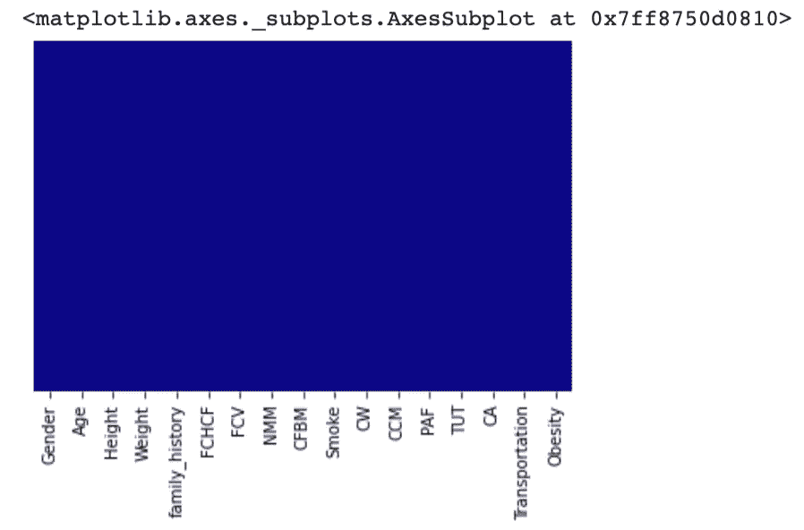

**3。相关性**

接下来，我打了电话。corr 得到一个相关矩阵，因为这将帮助我确定是否有任何变量我应该放弃，因为它们与目标变量，肥胖，太相关了。我将矩阵转化为热图，因为它使我能够有效地识别高度相关或不相关的变量。

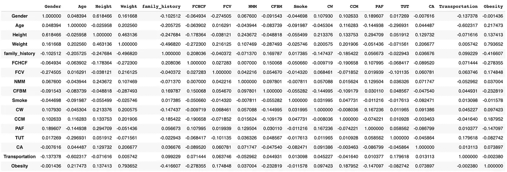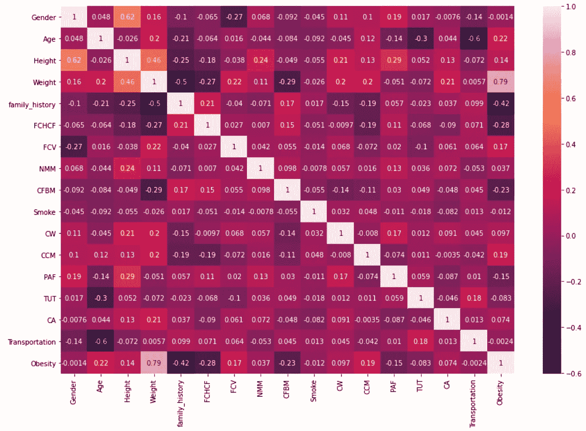

热图告诉我，一个变量，体重变量，与肥胖高度相关(0.79)。这是有道理的，因为体重是决定一个人的身体质量指数和一个人是否肥胖的一个不可或缺的因素。

**4。丢弃变量**

知道体重与肥胖高度相关，我需要去掉这个变量，以确保我的模型可以从其他变量中学习。当我用权重特征运行我的模型时，我的集合模型在没有任何调整的情况下都具有 98.74%至 99.16%的准确度，甚至我的逻辑回归模型也具有 97.68%的准确度。放下它会降低它们的精确度，让我可以分析更多的其他特征。

**5。数据集概述**

为了检查变量是否被删除，以及我的数据集的整体准确性和组成，我调用了下面的四个函数来给我一个快速概述。

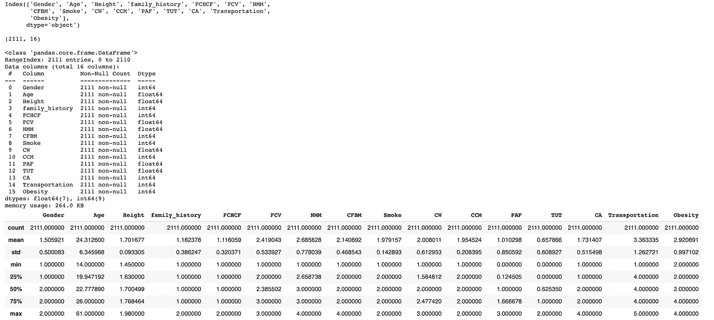

**6。目标变量分布**

最后，我创建了一个 countplot 来获取目标变量的分布，这样我就可以看到它是否平衡，以便通知训练集和测试集。

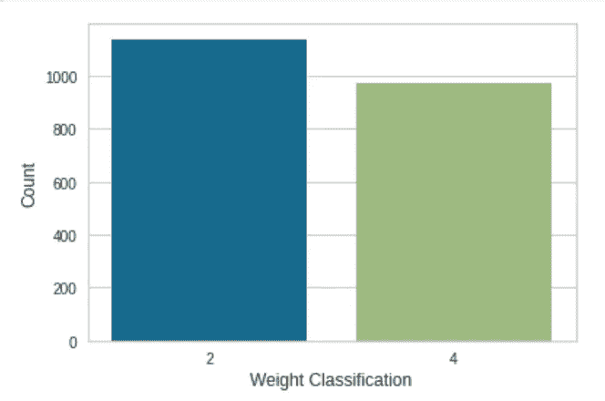

2 = not obese, 4= obese

这个数据集相当平衡，因为肥胖的例子和不肥胖的例子几乎一样多。这里的目标变量显然是二元分类的情况，这将通知我们未来的模型选择。

进一步的数据探索，请参考我的 [**EDA 文章。**](https://stacyy.medium.com/itp-449-exploratory-data-analysis-project-obesity-levels-based-on-eating-habits-and-physical-82fa10775c2e)

# 预建模

1.  **预处理**

在分割数据之前，应先对其进行规范化，因为数据集要素的范围并不相同。这可能会有问题，因为一个功能的微小变化可能不会影响到另一个功能，因此范围被规范化为 0–1 的统一范围。

**2。分割测试和训练数据**

数据集被划分为训练集(70%)和测试集(30%)，并打印出各自的形状，以确保在构建模型之前数据被正确分割。

这些数字表明训练集有 1477 个数据点，而测试集有 634 个数据点。

**3。基线分类精度**

计算基线分类精度很有帮助，因为这是最简单的预测。这给了我们一个很好的起点，当我们以获得更好的分数为目标创建更精确的模型时，要记住这一点。

我们得到了 54.57%的低基线精度，因此我们的后续模型应该具有比这更高的精度。

# 模型

我选择了以下六个模型，因为它们可以很好地处理二元分类问题，比如这篇文章所讨论的肥胖问题。

**模型#1:逻辑回归&超参数微调**

我将训练的第一个模型是逻辑回归模型，因为它是一种预测分类变量概率的分类算法。除了 random_state 之外，我还使用默认参数实例化了它，因为我希望每次分割都是相同的。然后用数据拟合模型，并进行预测和评估。之后，通过标准的 10 重交叉验证对模型进行交叉验证，其中数据被分成 10 个子集，每个子集依次作为验证数据集搁置，以确定拟合度。

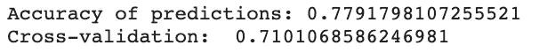

在这里，我们可以看到，逻辑回归模型在 77.91%的时间内是准确的，这远远低于当体重特征仍然存在时模型得到的 97.68%。71.01%的交叉验证分数明显低于模型的准确性。这表明我们的模型可能过度拟合，或者与当前数据和随机噪声过于接近，而不是变量之间的实际关系。由于差异几乎是 8%，我们应该微调模型的超参数，看看当我们使用 GridSearchCV 时会发生什么。GridSearchCV 被视为更准确的方法之一，因为它的迭代次数很多，因为它贯穿了超参数值的每个组合。

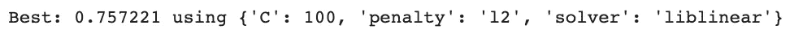

现在 GridSearchCV 已经给了我们最好的超参数用于 C，penalty 和 solver，我们应该使用它们并重新评估精度。

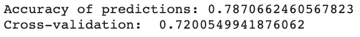

在使用建议的超参数后，我们的交叉验证分数 72%更接近 GridSearchCV 的 75.72%输出，这意味着我们的模型得到了改进，不像以前那样过度拟合。然而，我很好奇另一种流行的调整超参数的方法 RandomizedSearchCV 会怎么样，因为它采用了一种不同的方法，通过创建超参数值的网格并在训练时选择随机组合。

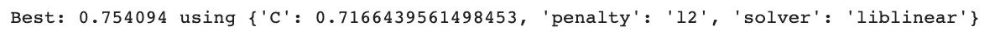

我将 RandomizedSearchCV 的关键超参数重新插入到逻辑回归中，以观察其性能。

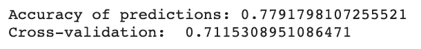

虽然与初始逻辑回归模型准确性及其交叉验证分数相比，RandomizedSearchCV 的超参数仍然改善了交叉验证和 RandomizedSearchCV 分数之间的差异，但它并没有像 GridSearchCV 那样将差异最小化。因此，我们将使用 GridSearchCV 的超参数来看看逻辑回归的主要特征。

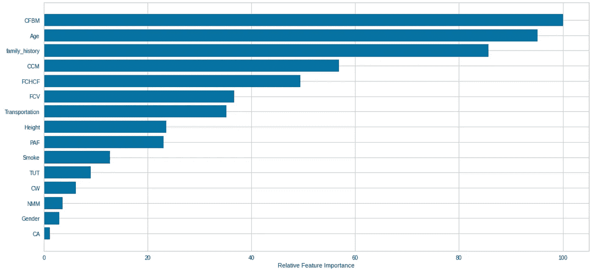

这张图表向我们展示了预测肥胖的不同特征的相对重要性。我们可以看到，这个模型的三个最重要的特征是 CFBM(两餐之间的食物消耗量)、年龄和家族史。从表面上看，这些变量似乎对肥胖有更大的影响，但我们将继续探索更多的模型，并获得更好的共识。

我们还可以在逻辑回归模型上快速创建分类报告。“精确度”类别指的是准确预测的百分比,“召回”类别详细说明了找到的肯定案例的百分比，F1 分数是正确的肯定预测的百分比。

接下来，我将使用各种集成方法，这些方法是将多个模型结合起来得到最终预测的预测模型。

**模型#2:装袋**

Bagging 也称为 bootstrap aggregation，是一种平均集成方法，用于决策树并聚合多个模型的预测。n_estimators 是 BaggingClassifier 和其他类似模型的参数，它会对模型的准确性产生很大影响，并且很难确定要使用的最佳 n _ estimators。因此，我们可以使用 n 估计量的增加值和它们的测试精度的图表来帮助我们选择具有最高可能精度的 n 估计量。

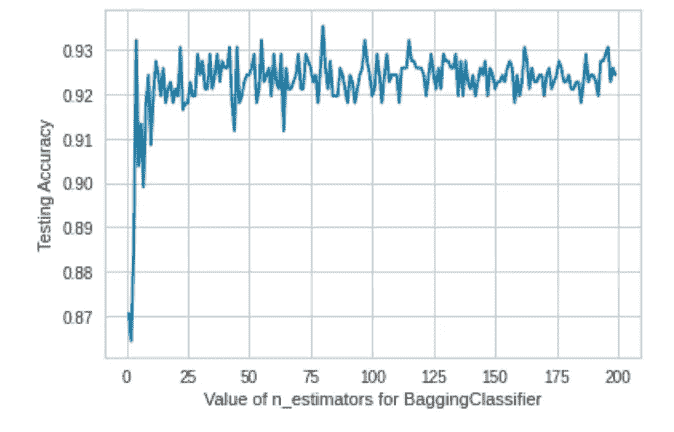

这张图告诉我们，当 n_estimator 约为 79 时，精确度最高，因此我们将使用它来构建 bagging 模型。

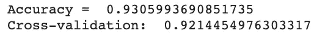

bagging 模型为我们提供了 93.06%的准确性和 92.14%的交叉验证分数，这是我们从逻辑回归模型中获得的巨大改进，可能是因为它是几个模型的产物，这些模型分别进行了训练和平均。这两个分数之间的差异也非常小，表明模型拟合得更好，不需要像我们在逻辑回归模型中那样微调超参数。*交叉验证和准确度分数之间有微小差异(< 1%)的所有后续模型将不会被微调*。

打印分类报告只是为了确认准确性:

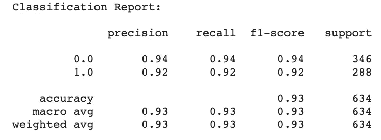

该报告告诉我们，与逻辑回归模型的分类报告相比，该模型对于类别 0 和类别 1 中的对象都具有更高的准确性。

**模式三:随机森林**

接下来，我将构建一个随机森林模型，这是另一种平均方法，并创建一个去相关决策树的集合。

我创建了另一个关于 n 估计量及其测试精度的图表，让我知道在我的随机森林模型中应该使用什么样的 n 估计量。

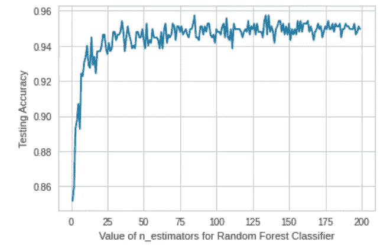

该图表明，大约为 132 的 n 估计值将有助于我们实现高精度。然而，准确性的大小仍然取决于我指定或不指定的其他参数。

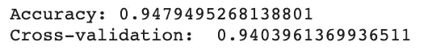

max_features 是分割结点时要考虑的随机要素子集的大小。虽然将其设置为“auto”使我获得了 94.95%的高准确度和 93.85%的交叉验证，但我选择将其设置为 6，以获得类似的 94.79%的准确度和更高的 94.04%的交叉验证分数。正如我们所看到的，随机森林模型是迄今为止性能最好的模型，具有很高的准确性和交叉验证分数，交叉验证分数非常接近准确性，表明过度拟合程度低得多。

我还对随机森林模型中最有影响力的特性感到好奇，所以我创建了一个简单的条形图来直观显示这一点。

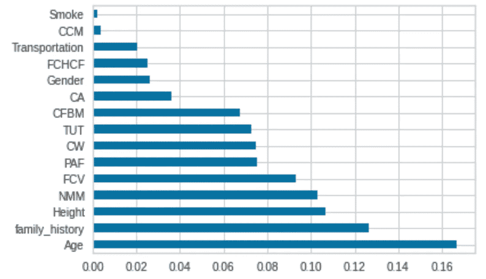

这向我表明，年龄、家族史和身高是通过随机森林模型预测肥胖最有用的特征，而吸烟和卡路里消耗监测等其他特征仅仅是噪声。我还可以通过下面的代码快速提取前三个特性及其特性重要性值:

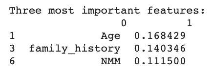

袋外(OOB)样本是被排除在引导样本之外的样本，可以用作测试样本，因为它们没有在培训中使用，因此可以防止泄漏。由于 oob_score 提供了一个更好的模型，具有更低的方差，并且没有过度拟合，因此它有助于验证该模型。在下面的代码中，我比较了 OOB 准确度分数和随机森林模型的准确度。

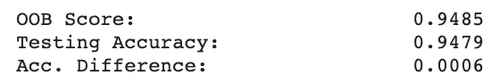

在这里，我们可以看到，OOB 分数非常接近我们以前计算的测试精度，证实了我们的模型是高性能的。

**型号#4: AdaBoost**

接下来，我们将看看另一种不同的系综方法，增强方法。这与 bagging 方法不同，因为这些方法可以减少总体方差，而 boosting 模型通过顺序训练弱学习者来降低总体偏差。

我选择建立一个 AdaBoost 模型，它将几个弱学习器组合成一个强学习器，并为每个错误分类的观察值改变权重。我从另一个 n_estimator 图开始:

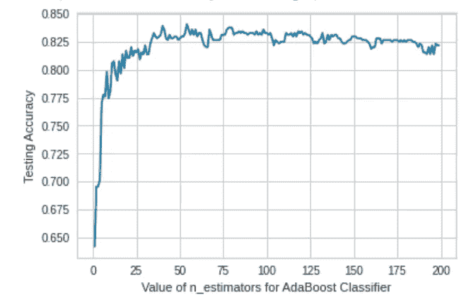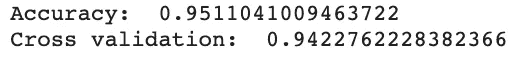

我用 AdaBoost 模型指定了更多的参数，比如 max_depth 为 7，learning_rate 为 0.5，以进一步提高准确性和交叉验证分数。我测试了这些参数的各种实例，并根据它们的精度输出来选择它们。该模型为我们提供了很高的准确性和交叉验证分数，两者之间的差异可以忽略不计。

我很想看看 AdaBoost 模型的特征变量与随机森林模型相比如何，所以我将它们绘制在下面。

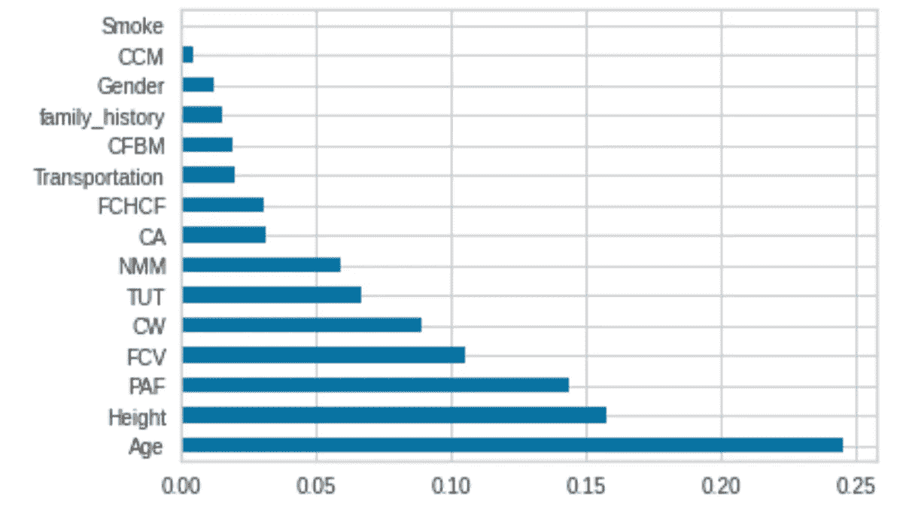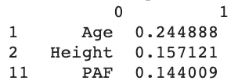

对于最重要和最不重要的变量，特征重要性输出是相似的，因为身高和年龄都出现在两个模型的前三个特征中，吸烟和卡路里消耗监测仍然是最不重要的。然而，在 AdaBoost 模型的前三个特征中，家族史被替换为身体活动频率。

**模型#5:梯度推进树**

梯度增强树是另一种增强模型。然而，当 AdaBoost 根据其预测精度对观测值进行重新加权时，梯度增强树试图将新的预测值拟合到来自先前预测值的残差中。

和以前一样，我首先可视化了 n _ 估计量的性能。

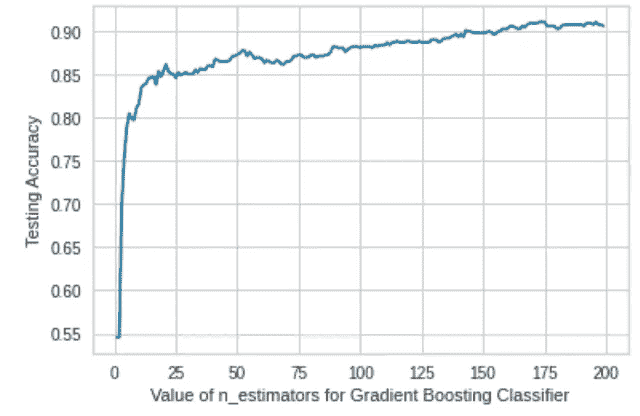

这里的峰值好像是 170 左右。

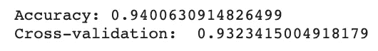

梯度提升在这里也表现得相当好，交叉验证和准确度得分之间的差异也很小。

我对梯度增强树模型的特征重要性分数与 AdaBoost 模型的特征重要性分数进行了比较，因此我绘制了特征重要性图和下面的前三个特征。

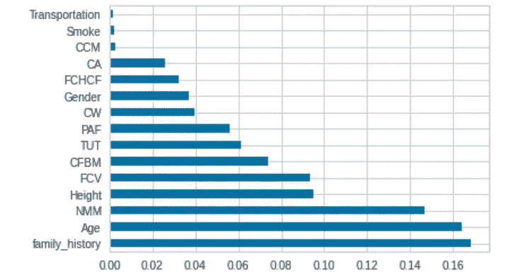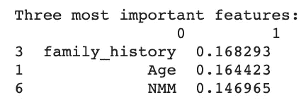

梯度增强树和 AdaBoost 模型共享年龄作为三大特征之一，但是梯度增强树模型也受到家族史和主餐数量的影响。吸烟和卡路里消耗监测再次排名靠后。

**模型#6:投票分类器**

最后，我们将使用投票分类器模型，该模型通过选定模型的集合进行训练，并平衡单个分类器的弱点。有两种投票方式:硬投票和软投票。我们将使用软投票，因为它提供了更多的概率信息，而不是类别标签。它包括平均每个类别的概率，并选择平均值最高的类别作为最终预测。我选择在集合中包含四个最高性能的模型:随机森林、Bagging、AdaBoost 和梯度增强。

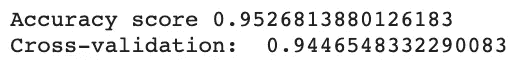

正如预期的那样，投票分类器模型在所有模型中返回了最高的准确性和交叉验证分数，尽管它并没有比 AdaBoost 模型好太多。这可能是因为软投票考虑了实际概率，考虑了每个分类器的不确定性，并给予高度自信的投票更多的权重。投票分类器模型是最有前途的一个，因为它的高准确性、交叉验证和准确性得分之间的小差异、它的较低方差以及它的最终预测来自贡献模型的多数投票的事实，这些贡献模型已经都是高性能的。

# 结论

通过聚合不同的模型和调整各种参数，如 n 估计量、最大深度和学习率，从 54.57%的基线准确度到 95.27%的投票集成准确度有了显著的提高。虽然精确度很高，但该模型基本上没有过度拟合，因为每种集成方法的交叉验证分数与模型精确度的差异都小于 1%。

特征重要性计算表明，年龄、家族史和身高对上述模型的影响最大。对上述模型中的一个有很大影响的其他因素是饭前食物的消耗、身体活动频率和主餐的数量。没有全面影响的因素是吸烟、卡路里消耗监测、性别和交通。鉴于该模型的高准确性，任何出于自身健康原因或其他用途而对影响肥胖的因素感兴趣的人都可以参考上述突出特征。