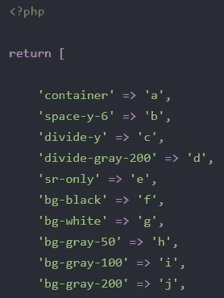

# 混淆 Laravel 项目中的顺风类

> 原文：<https://medium.com/geekculture/obfuscate-tailwind-classes-in-a-laravel-project-71694b9d8ac1?source=collection_archive---------17----------------------->

我们将看到如何在一个 Laravel 项目中*混淆* Tailwind 类，以及一般的 CSS 类，这样就没有人能够简单地复制粘贴你的类并窃取你的成果。目标是将`class="bg-indigo-500 flex flex-col h-full"`转换成类似于`class="h N T ja"`的东西。很美，不是吗？

让我们从跑`npm install postcss-rename --save-dev`开始。你可以在这里查看存储库[了解更多信息。这是负责重命名 CSS 类的插件。](https://github.com/google/postcss-rename)

在 Laravel 的 Mix 中配置插件很容易。这里的关键点是将类映射保存到一个 Laravel 配置文件中，我们稍后会用到它。基本上，这个配置文件将包含类似于`'bg-indigo-500' => 'h'`的键值对。

我这里用的是 Sass 和 Tailwind，但是一点关系都没有。根据我们的需求正确配置插件是最重要的部分。这是我的混合文件:

webpack.mix.js

当您执行`npm run prod`时，您现在应该拥有包含我之前描述的内容的`config\map.php`文件。请注意，为了简单起见，我使用了关键字`map`，但是您可以随意对其进行重命名。

config\map.php

下一步是利用这个生成的文件。你可以简单地通过调用`config('map.bg-indigo-500')`来映射你的类，你已经准备好了，但是嘿，如果你需要像那样包装你所有的类，这就有点问题了，它也没有考虑环境。

我们现在将创建一个助手函数及其相应的刀片指令。这是助手函数。如果你还没有一个帮助文件，你可以搜索如何创建一个。请注意，我们正在检查我们是否在生产中。

app\helper.php

这是刀锋指令。

app\Providers\AppServiceProvider.php

现在，您需要更新您的刀片视图。用新指令包装类属性的内容就足够了。

举个例子，

应该成为，

如果你认为我使用的配置产生了太短的类名(这可能*潜在地*导致冲突)，你总是可以随意使用它。例如，您可以生成随机的类名:

webpack.mix.js

使用随机生成的 5 个字符长度的类名的输出示例:

Obfuscating Tailwind classes

config\map.php

我希望你觉得这篇文章有用。请随意分享你的做事方式。:)

不要犹豫[在 Twitter 上关注我](https://twitter.com/torshidy)获取更多信息。如果你用 Laravel 构建 SaaSes，你可能也会发现[这篇关于共享会话的文章](https://larawind.com/shared-laravel-sessions-across-domains)很有趣。