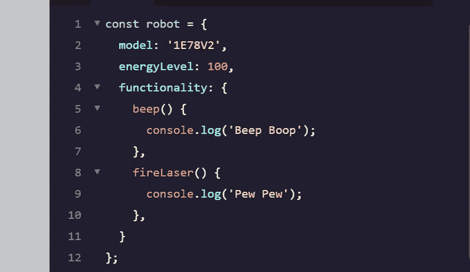
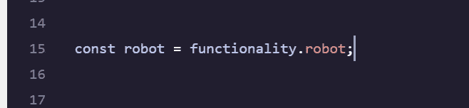
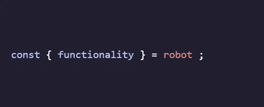
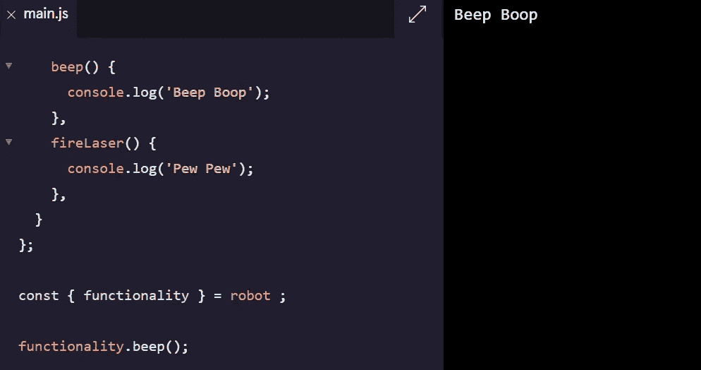

# JavaScript 中的对象析构

> 原文：<https://medium.com/geekculture/object-destructuring-in-javascript-d7aa07e82a8f?source=collection_archive---------20----------------------->

想要从对象中提取键值对并将它们保存为变量，这在 JavaScript 编程中显得效率低下。以下面的对象为例:

Object named ‘robot’.

如果我们想提取`functionality`属性作为一个变量，我们可以使用下面的代码:

然而，我们也可以利用一种叫做*析构赋值*的析构技术来节省一些击键次数(读作重音)，当然还有时间！在析构赋值中，我们用花括号`{ }`中的对象键的名称创建一个变量，并将对象赋给它。看看下面的例子:

由于`functionality`引用了`robot.functionality`，我们可以简单地通过`functionality`调用`robot.functionality`可用的方法。

我们可以利用这个快捷方式，在`functionality`上调用`.beep()`方法(请看第一段代码)

这将在控制台上打印出‘哔哔’声。

要点:使用对象析构有不同的方法；一种方法是属性值速记，另一种是析构赋值。与任何概念一样，学习如何将 MDN 文档用于对象是一项很好的技能！保持冷静，伙计们。