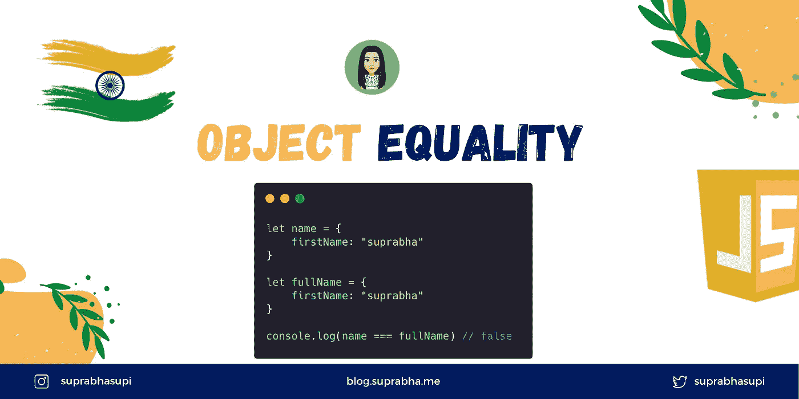

# JavaScript 中的对象相等性

> 原文：<https://medium.com/geekculture/object-equality-in-javascript-2571f609386e?source=collection_archive---------1----------------------->



Object Equality in JavaScript

比较数字或字符串确实很容易，但是你有没有尝试过比较两个对象🤔

**即使两个对象具有相同的键和值对，它也将返回 false。**

**示例:**

```
let name = {
    firstName: "suprabha",
    lastName: "supi"
}let fullName = {
    firstName: "suprabha",
    lastName: "supi"
}console.log(name === name) // true
console.log(name === fullName) // false
console.log(name == fullName) // falseconsole.log(Object.is(name, fullName)) // false
console.log(Object.is(name, name)) // true
```

从上面的例子可以看出，`name`和`fullName`是相同的。然而，这个物体既不等同于`==`也不等同于`===`。

## 在进行对象相等时，您可以检查两件事情:

1️⃣对象有相同的实例

2️⃣对象具有相同的值

# 1️.对象具有相同的实例

JavaScript 有两种方法来匹配这些值。

*   对于原始类型(字符串、数字)，它通过它们值进行比较。
*   对于非原始类型(对象、数组、日期)，它通过引用进行比较。

# 通过引用进行比较是什么意思？

**引用比较**表示对象引用内存中的同一个位置。

**例如:**

```
let name = {
    firstName: "suprabha",
    lastName: "supi"
}let fullName = {
    firstName: "suprabha",
    lastName: "supi"
}let copyName = fullNameconsole.log(name === fullName) // false
console.log(copyName == fullName) // true
```

这里，`copyName`和`fullName`指的是同一个内存实例，因此返回 true。

# 2️.对象具有相同的值

要检查实例你可以使用`===` equality，但是要匹配这个值你需要做更多的工作😂

```
let name = {
    firstName: "suprabha",
    lastName: "supi"
}let fullName = {
    firstName: "suprabha",
    lastName: "supi"
}function isEqual(obj1, obj2) {
    var props1 = Object.getOwnPropertyNames(obj1);
    var props2 = Object.getOwnPropertyNames(obj2); if (props1.length != props2.length) {
        return false;
    } for (var i = 0; i < props1.length; i++) {
        let val1 = obj1[props1[i]];
        let val2 = obj2[props1[i]];
        let isObjects = isObject(val1) && isObject(val2); if (isObjects && !isEqual(val1, val2) || !isObjects && val1 !== val2) {
            return false;
        }
    }
    return true;
}function isObject(object) {
  return object != null && typeof object === 'object';
}console.log(isEqual(name, fullName)); // true
```

有几个插件可以帮助你满足上述条件，你可以简单地使用`_.isEqual`来检查对象值:

1.  [下划线](http://underscorejs.org/#isEqual)
2.  [洛达什](https://lodash.com/docs#isEqual)
3.  [isDeepStrictEqual(object1，object2)](https://nodejs.org/api/util.html#util_util_isdeepstrictequal_val1_val2) 节点

```
let name = {
    firstName: "suprabha",
    lastName: "supi"
}let fullName = {
    firstName: "suprabha",
    lastName: "supi"
}console.log(_.isEqual(name, fullName)); // true
```

# 总结⅀

在 object 中，如果您对两个对象进行实例检查，那么您可以使用`==`、`===`和`Object.is()`。

然而，如果您想检查两个对象值，那么您必须编写自己的逻辑来完成。

感谢您阅读❤️这篇文章

🌟[推特](https://twitter.com/suprabhasupi)📚电子书🌟 [Instagram](https://www.instagram.com/suprabhasupi/)