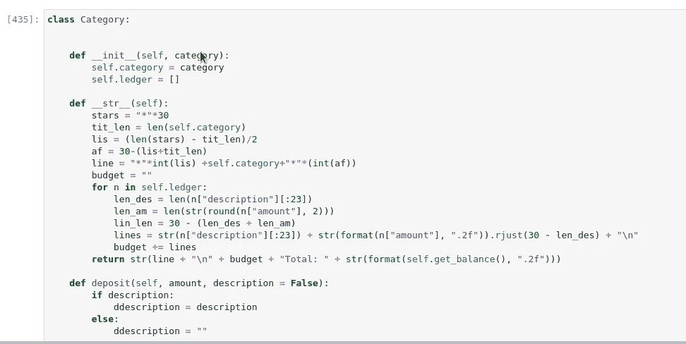

# OOP:为我们的程序创造一个全球灵魂

> 原文：<https://medium.com/geekculture/object-orientation-oop-creating-a-global-soul-53a5f591ea8a?source=collection_archive---------36----------------------->

object oriented approach in programming

任何进入编程领域的人都会接触到 OOP，即面向对象编程。所以，在这里我不打算解释。相反，这是关于我对 OOP 的体验。

没错，OOP 这个概念确实是程序员的福气。一开始，我也喜欢一遍又一遍地写整个脚本，或者至少为了某个目的复制整个代码。但是，在学习了对象创建和类/方法利用之后，整个事情变得不可思议地简单。

那么，OOP 中到底做了什么？

首先，我们找出我们的脚本要解决的问题。

然后，我们将问题分成小的部分，这样每个部分都可以单独操作和处理。

然后，我们加入小垃圾关闭代码。好啊，它让我们解决问题的想法有了生命力。

加分的是这个剧本的灵魂可以坚持下来，可以成为一个全球的灵魂，可能会把我们很多想法从想象带到生活中。