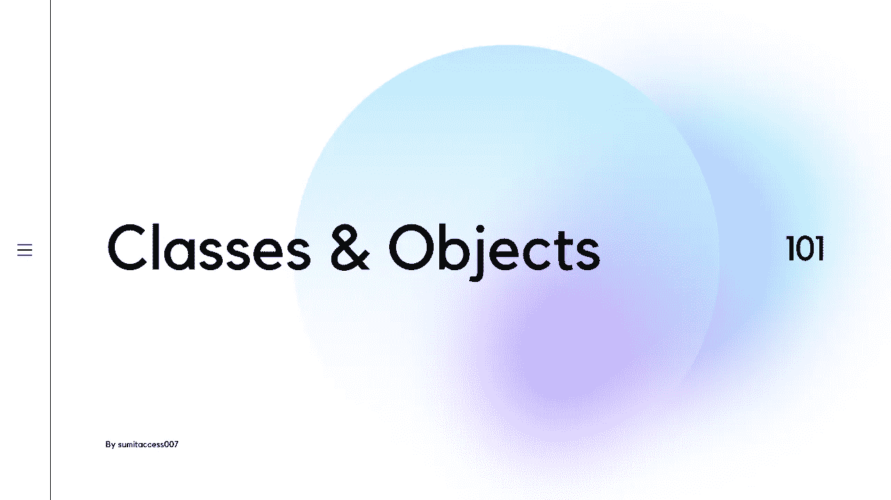
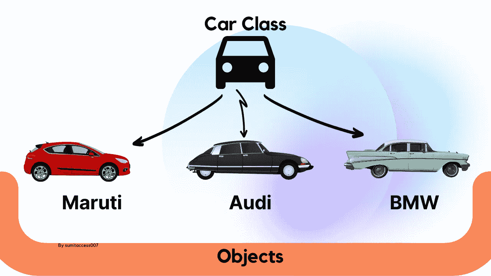
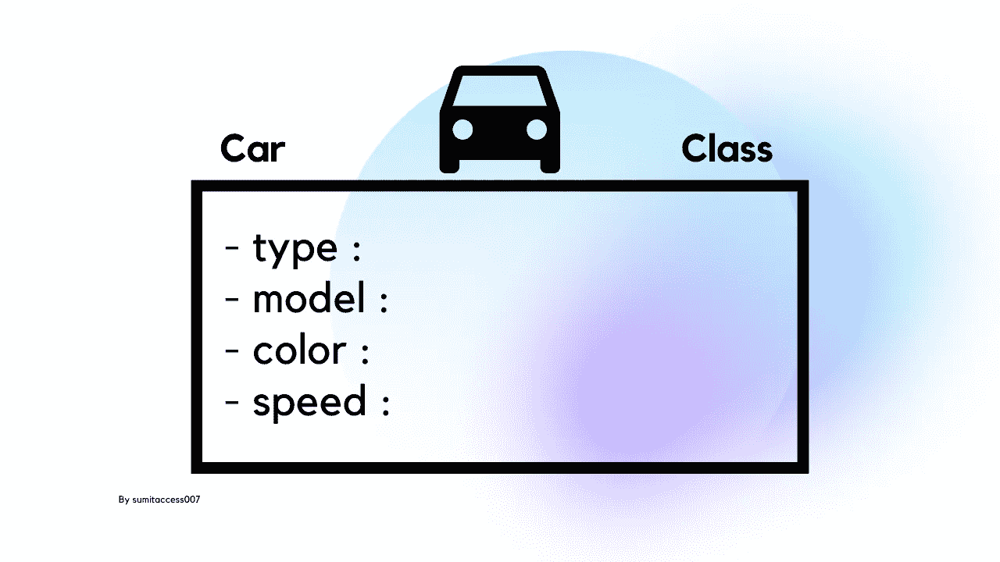
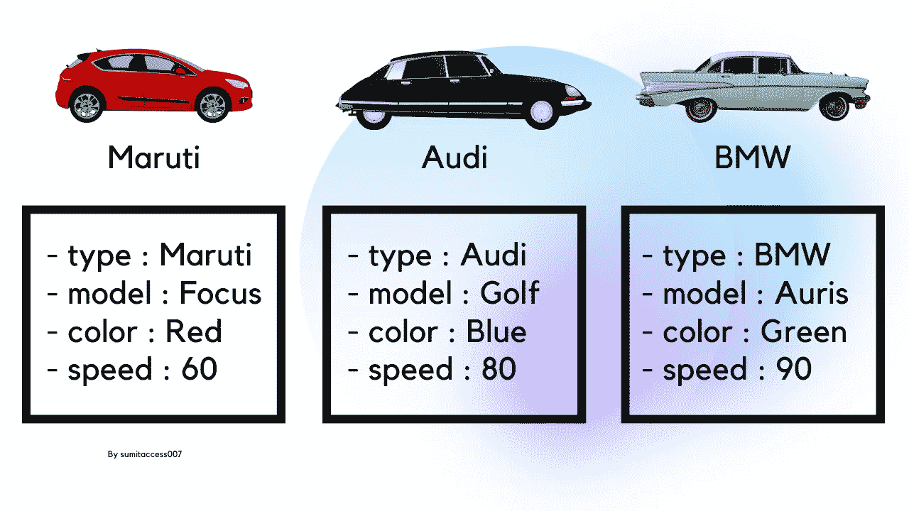
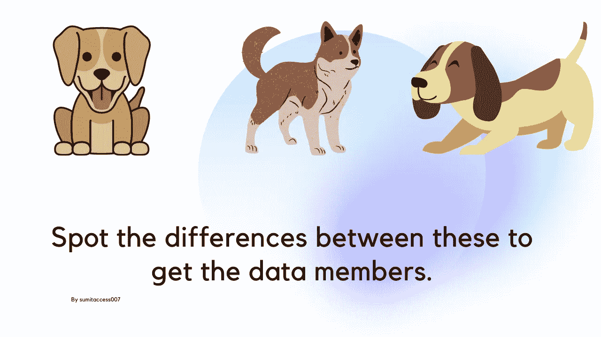
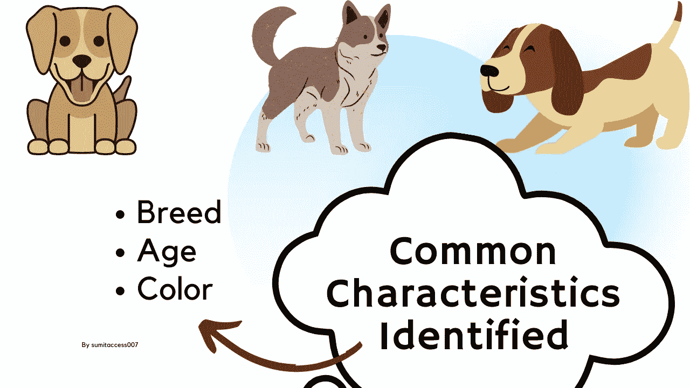
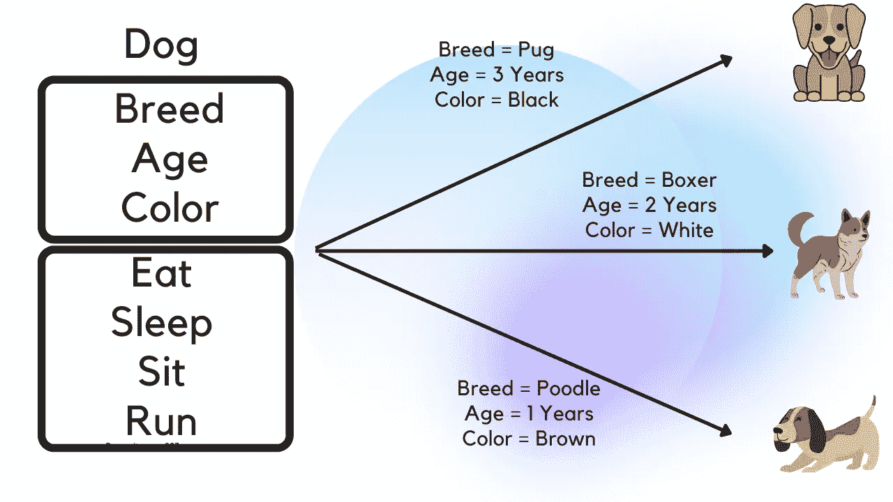

# 面向对象编程 101 —类和对象

> 原文：<https://medium.com/geekculture/object-oriented-programming-101-classes-and-objects-447cd3f2d165?source=collection_archive---------6----------------------->

## 类和对象是 Java 的精髓

## Java——类和对象



***Object Oriented Programming Concepts — Classes and Objects***

面向对象编程已经获得了广泛的成功。作为一种面向对象的编程语言，类和对象是 Java 的精髓。在本文中，我们将理解和学习两个重要的面向对象概念 Java 中的类和对象。这些实际上是面向对象编程的最基本的概念，我们用它们来模拟现实生活中的实体。许多年轻的程序员无法解释/回答，这就是我写这篇文章的原因。本文只针对理论上了解 OOP，但无法将其与现实世界和编程世界联系起来的受众。

我认为理解类和对象概念的最好方法是看一个例子——一个简单的 Java 类代表一辆汽车。



**Car as a Class and Its Objects**

为了理解更多，让我们考虑我们的汽车类有一些属性，如类型、型号、颜色和速度。如引言部分所述，这些概念用于对现实生活中的实体进行建模。这里 Car 是一个逻辑概念，现在我们可以使用这个 Car 类来构建一些在现实世界中有物理存在的特定类型的对象。下面的 Java 类代表了 Car 类的蓝图，它是一种模板，我们可以用它来创建真实的对象。

**Java 中类的语法-**

```
class <Class Name> {
     field;
     method;
}class **Car** {
     // fields or properties
     **String** type;
     **String** model;
     **String** color;
     **int** speed;

     // methods // Constructors
     **Car**(**String** type, **String** model, **String** color) {
          this.type = type;
          this.model = model;
          this.color = color;
     }
}
```

在这里，基于上面的讨论，我写了一些关于阶级的诗句—

*   类是一个**蓝图**或**模板**或**原型**或**逻辑构造**或**指令集**来构建特定类型的对象。
*   类没有物理存在(在现实世界中并不真正存在&在编程世界中不占用内存空间)，它只是一组规则或定义。
*   类是现实生活中实体的一般定义。
*   类实际上决定了一个对象的行为方式和对象包含的内容(类描述了对象的状态和行为)。
*   在类文件中，我们用方法将状态或属性表示为字段和行为。
*   我们可以使用类来创建用户定义的数据类型。
*   类在编译时被翻译。



**Car Class — Looks Like a Template or Blueprint**

现在，通过使用上面的汽车类模板或蓝图，我们可以在现实中创建任何类型的汽车。就像在现实世界中，许多公司使用这个模板或蓝图创造了他们自己的汽车——马鲁蒂、奥迪、宝马等。这些公司制造的汽车具有所有这些属性(类型、型号、颜色、速度)，但价值可能不同。



**Object — Implementation of its Class**

下面是从 car 类创建不同的 Car 对象的代码。现在我们有三个 car 对象，它们都是从单个类创建的。

**Java 中的对象语法—**

```
ClassName ReferenceVariable = new ClassName();**Car** focus = new **Car**("Maruti", "Focus", "red");
**Car** golf = new **Car**("Audi", "Golf", "blue");
**Car** auris= new **Car**("BMW", "Auris", "green");
```

在这里，基于上面的讨论，我写了一些关于物体的文字—

*   对象是类的实例或实现。
*   对象是具有状态和行为的实时实体(或运行时实体)。
*   对象是在运行时从类中创建的。
*   对象有三个重要属性——
    ——**状态**——代表对象的数据(值)。【变量】
    - **身份**-JVM 内部维护的对象身份，用于唯一标识每个对象。
    - **行为**-表示对象的行为(功能性)(它是数据类型操作的一种效果)[方法]

# 真实世界的例子—

例-1
假设我们想要建造一所房子，那么在实际开始建造房子之前，我们会创建一些蓝图或建筑计划。但是最后我们创造了房子，它是根据蓝图创造的实际物体。

**例-2** 让我们把现实生活中的实体狗转换成软件对象。下面我们有三种不同品种的狗。

为了识别对象的数据成员，我们将寻找它们之间的差异。



**Dog Objects**

我们可能观察到的一些差异是——品种、年龄、肤色。如果我们想一想，这些差异也是这些狗共有的共同特征。



**Common Characteristics**

现在我们要列出一些常见的行为，比如睡觉、坐着、吃饭、跑步。这些将成为我们的软件对象的动作。


**Common Behaviors**

于是我们确定了下面的事情——
**类**——狗
**数据成员**——品种、年龄、
肤色**方法**——吃、睡、坐、跑

现在对于 Java 类中这些数据成员(品种、年龄、颜色)不同的不同值，我们会得到不同的狗对象。



**Different Dog Objects**

# 结论—

按照上面的文章，很容易理解 OOPs 中的对象和类。我们可以使用这种方法从它的类中创建任何对象，并将现实世界的实体与编程世界联系起来。