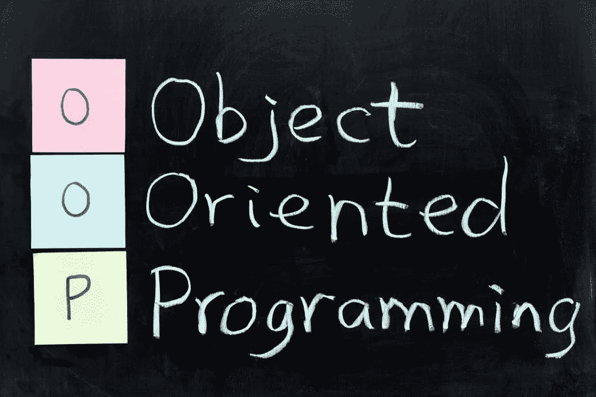
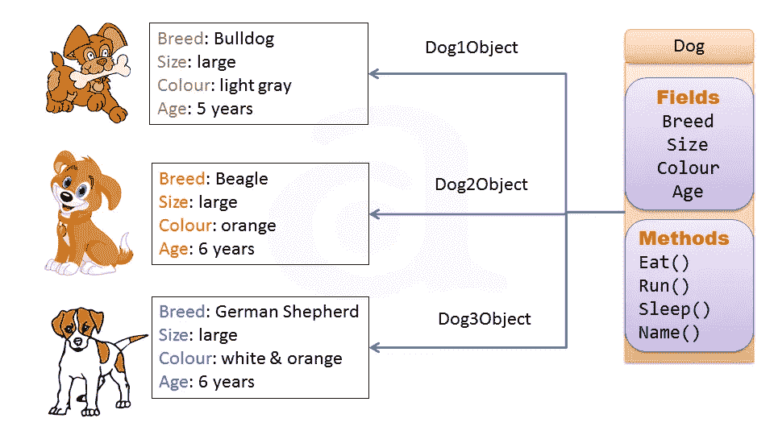
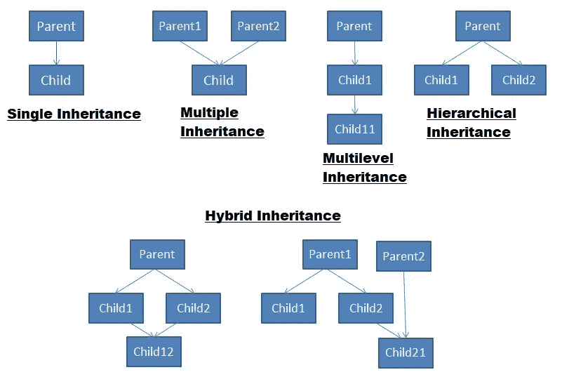
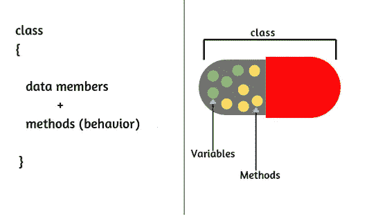

# Java 中的面向对象编程

> 原文：<https://medium.com/geekculture/object-oriented-programming-in-java-5cffc5d6efae?source=collection_archive---------17----------------------->



解决问题或完成任务的方法被称为**范式。**借助编程语言以特定的方式完成某项任务被称为**编程范式。**有许多编程范例，例如过程编程范例、逻辑编程范例等等。

**面向对象编程**是一种借助类和对象解决问题的范式。

这些是理解面向对象编程概念的关键。我们的生活被诸如牛、笔、桌子、汽车等物品所包围。

一个对象在现实世界中有两个特征:**状态**(他们拥有的东西)**行为**(他们执行的动作)**。例如:在现实生活中，狗是一个物体。狗的状态有年龄、颜色和品种，行为有吃、睡和叫。**

**类:**它是创建单个对象的蓝图。在现实世界中，我们看到许多属于同一类别的物体。

例如，世界上可能有成千上万只狗，它们中的每一只都有相同的状态和行为。



## ***有四个基本的积木哎呀:***

1.  遗产
2.  抽象
3.  包装
4.  多态性

**继承:**当一个对象获得父对象的所有属性和行为时，称为继承。继承的类称为子类(派生类)，继承的类称为超类(基类)。这是在关键字**扩展**的帮助下完成的。例如，父母的所有财产都由他们的孩子继承。

```
class Baseclass{                
      ...
}
class Derivedclass **extends** Baseclass{   
      ...
}
```

Java 支持五种类型的继承，其中**单级、多级和分层**可以通过类实现，而**混合**和**多级**通过一个接口实现。



**抽象:**对用户隐藏实现细节，只向用户显示功能的过程。换句话说，用户只知道外部工作，而不知道内部是如何工作的。

例如，在 WhatsApp 中，我们只知道如何给某人发消息、上传状态和打电话，但不知道这些功能在内部是如何工作的。这只不过是抽象。我们可以通过使用**抽象类**和**接口来实现抽象。**

封装:将所有的变量和方法组合成一个单元被称为封装。封装的主要目的是实现安全性。

它是**数据隐藏**和**抽象**的结合。数据隐藏只不过是将类中的所有变量都变成私有变量，这样外部就没有人能访问它们，它们的值可以在 getters 和 setters 的帮助下被访问。



```
 public class Students{
       private String name;               // private data members
       private int age;

       public void setName(String name){  // setter
             this.name = name;
        }    
       public String getName(){           // getter
             return name;
        }
       public void setAge(int age){
             this.age = age;
        }
       public int getAge(){
             return age;
        }
}
```

**多态性:**多态性这个词由两个词组成,‘poly’表示**许多**而‘morphs’表示**形式。**就是用不同的方式呈现一个事物。例如，如果你在教室里的时候表现得像个学生，当你在市场里的时候表现得像个顾客，当你在家的时候表现得像个儿子或女儿。这样，一个人就表现出了多种形态。

多态性有两种类型 **:**

1.  **编译时多态**:也叫**方法重载**。在方法重载中，我们用相同的名字创建多个方法，所有的方法都以不同的方式工作。要重载一个方法，我们应该有不同类型的参数，参数的顺序和相同方法名的参数数量。

```
 public class Calc{

        public int sum(int a, int b){
              return a + b;
        } public double sum(int a, double b){     //overloading method
              return a + b;
        }
        public double sum(double a, int b){     //overloading metod
              return a + b; public double sum(double a, double b){ //overloading method
              return a + b;
        }
}
```

2.**运行时多态性:**也叫**方法覆盖**。在继承中，如果一个子类有和超类中声明的相同的方法，那么它被称为方法重载。当子类想要给出自己的具体实现时，就完成了。

```
class Bank{ public double interestRate(){
          return 2.0;
       }
}
class SBIBank extends Bank{ public double interestRate(){      // overriding method
          return 3.0;
       }
}
class HDFCbank extends Bank{ public double interestRate(){     // overriding method 
          return 5.5;
       }
}class Account{
   public static void main(String args[]){ Bank bank = new SBIbank();
   Bank bank1 = new HDFCbank(); System.out.println("SBI interest rate:" + bank.interestRate()); 
   System.out.println("HDFC interest rate:" + bank1.interestrate()); 
  }
}Output: SBI interest rate: 3.0
        HDFC interest rate: 5.5 
```

在上述法规中，政府决定所有银行必须向其客户提供最低 2.0 的利率。HDFC 和 SBI 向客户提供 5.0 和 3.0 的利率，如果他们愿意在银行开户的话。因此，HDFC 和 SBI 超越了类**银行**的 **interestRate()** 方法，给出了他们自己的利率。