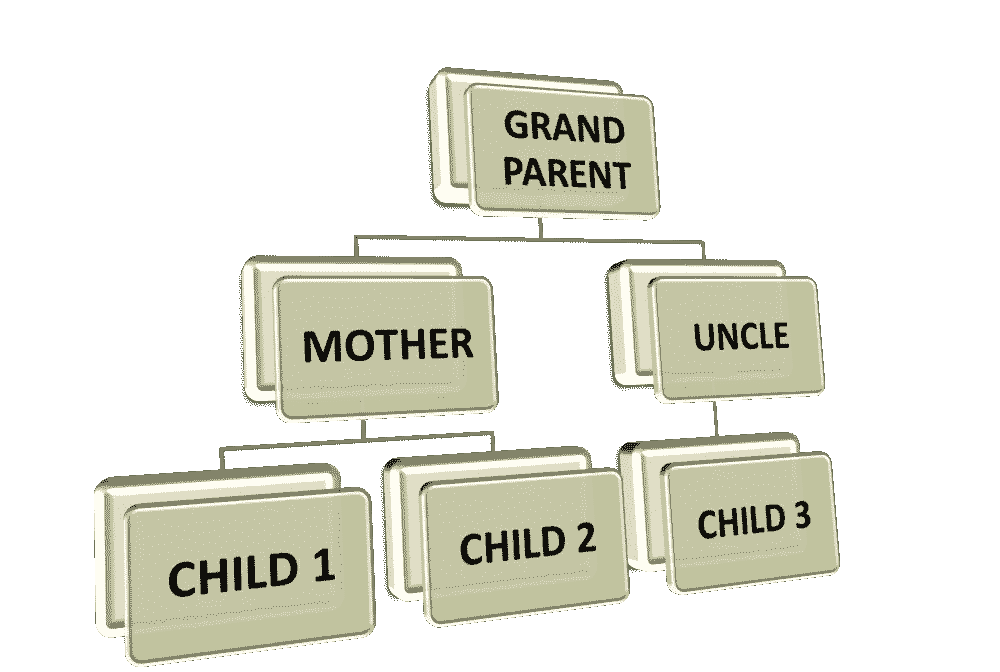
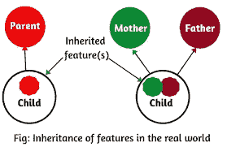
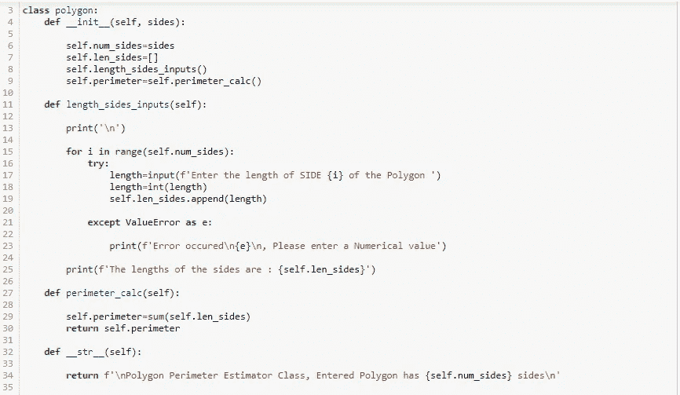
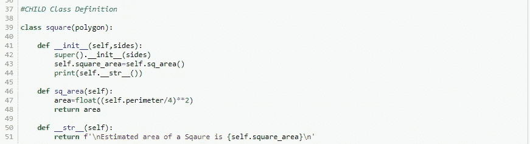
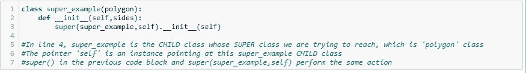
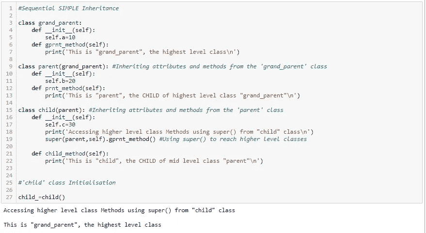
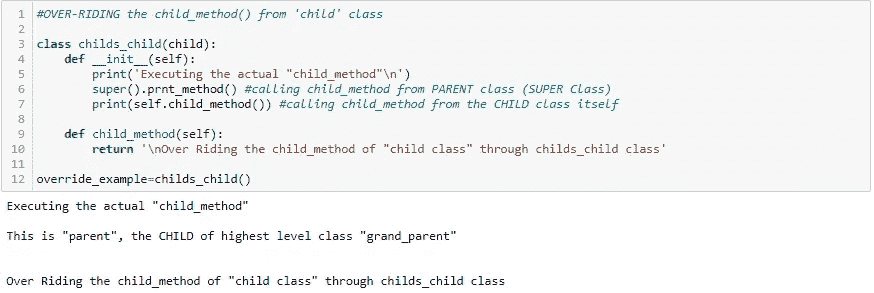
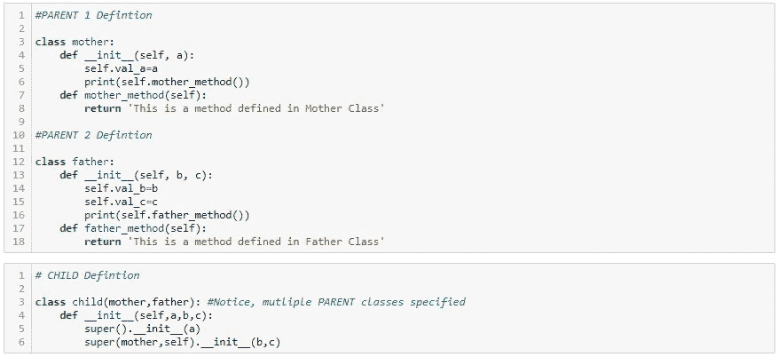
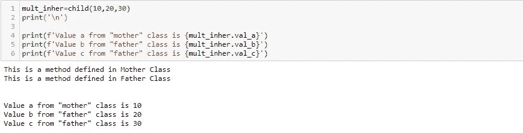
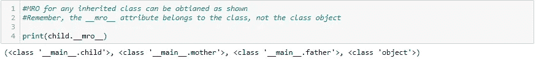

# 面向对象的思维:多重继承

> 原文：<https://medium.com/geekculture/object-oriented-thinking-multiple-inheritance-c782c1d64b8?source=collection_archive---------56----------------------->

棘手但易于理解，尽管用例过多

Real World INHERITANCE

在之前的[文章](https://arvindhhp.medium.com/object-oriented-thinking-inheritance-ae912642de37)中，我已经提到了 Python 中继承的 OOPs 概念的基本实现。文章还提到了 super()函数的概念。

在这本笔记本中，我已经深入研究了 super()，多重继承和函数重载。

深呼吸，振作精神，准备好投入到遗产中去。快乐传承(:

realpython.com[，再次感谢一些深思熟虑的见解。](http://realpython.com)

# 多重继承思想

在简单继承中，我们有一个子类从一个父类继承信息。这是一对一的关系。但是在继承的情况下，一个子类从两个或多个父类继承信息。

从图片上看，这就是它们的样子。左边的链接表示简单继承，而右边的链接合并表示多重继承。

Multiple Inheritance (Image source: scientecheasy.com)

# 什么是超级()

现在，有了对什么是继承、如何在 Python 中实现继承(至少是简单继承)以及简单继承和多重继承之间的区别的基本理解，我强烈地感觉到，你很好地理解了 super()实际上是什么？

从更广的角度来看，在更高的层次上，super()允许您从继承它的子类访问超类中的方法。

没有任何附加功能的 super()返回超类(也称为父类)的临时对象。这个临时对象可以用来调用超类的方法。

这类似于使用访问属于类外部的类的方法的过程。；这里改为<super>。用于从子类中调用子类的相应超类。</super>

# 简单继承中的 super()

# 父类和子类定义

为了理解这一点，让我们考虑一堆类，其中“square”类继承了“polygon”类。这里，“polygon”类是超类，而“square”类是子类。下面的代码块包含了父类和子类的定义。

SUPER (PARENT) Class Definition

Child Class Definition

# 超级()在做什么？

在第 41 行，上面的“square”类定义有一个包含两个参数的 **init** ()。第一个“self”是一个指向类本身的指针。下一个是另一个参数“sides”。没什么新的，就像其他的 **init** ()。

在第 42 行表达式中，提到了另一个 **init** ()但是这一次，这是一个通过点符号以 super()为前缀的函数调用。

我们知道，super()从调用它的地方返回子类的超类的临时对象。在这种情况下，从从“polygon”类继承的“square”类调用 super()。第 42 行的表达式调用了‘polygon’类的 **init** ()。相应地，我们还需要确保按照超类的 **init** ()参数定义提供正确的参数。

super()并不仅限于 **init** ()，它可以用来从子类中调用超类的任何方法

简单吧？？现在让我们初始化“square”类，看看发生了什么。

super() and Simple Inheritance Execution

# 更多关于 super()

直到现在，我们一直使用 super()无参数。

它可以带两个可选参数，一个是我们要访问的超类的子类，另一个是指向子类本身的指针。

super() call with Arguments

super()也可以用于通过跳过级别到达更高的父类。

为了更好地理解这一点，让我依次定义 3 个类的简单继承。这也称为多级继承

super() in Multi Level Inheritance

上面定义的“子”类是从“父”继承的，而“父”是从“grand_parent”继承的。

super()也可以用来从 grand_parent 类调用 gprnt_method()。这可以通过在 super()中传递“parent”作为类名来实现

当一个更高级别的类的方法之一在它的任何子类中被覆盖时，这是很方便的，但是我们想要访问这个方法的覆盖前的版本。在我们继续理解多重继承之前，让我们讨论最后一个“方法优先”的概念

# 方法覆盖

顾名思义，这个概念是关于通过子类覆盖父类中定义的方法。

Method Over-Riding

# 这里刚刚发生了什么？？？

“child”类已经有一个 child_method()。在用 same 定义一个新方法时，超类的方法被覆盖。这里，在 childs_child 类中定义的 child_method 覆盖了在“child”类中定义的原始方法。注意，这样做时，对父类方法的任何更新都不会反映到这个覆盖的子类及其下游子类中。

底线是，如果使用了 super(，)，它将继续调用对应于这个子节点的父节点的方法。

# 多重遗传

最后，我们到了，最后一个话题，祝贺你走到这一步；-)

正如我们已经讨论过的，在多重继承中，多个父母共享他们所有的信息给一个孩子。

让我们使用一组虚拟的类来理解这一点。

MULTIPLE INHERITANCE, PARENT(s) & CHILD definition

好，好，好，我刚才在上面的代码块里做了什么。不幸的是，多重继承有点棘手。与只有一个父代的简单继承不同，使用 super()非常简单。但是在多重遗传的情况下，我们有多个父母。super()将遵循方法解析顺序(MRO)的指示。MRO 只是 Python 在遇到两个同名方法时会引用的类的列表。我们都知道，为了初始化一个类，我们都使用一个同名的类 **init** ()

默认情况下，Python 解释器在继承语句中按照父类定义的顺序给出优先级。请参见上面代码块的第 3 行。“子”类将“母亲”作为第一个父类，将“父亲”作为第二个父类。因此，无参数的 super()将最终初始化“母亲”类的 **init** ()。

好的，但是这里有多个双亲，我该怎么初始化其他双亲。带有参数的 super()在这里提供了帮助。只需定义 super()，将父类及其指针本身作为已经初始化的参数。

当定义任何新类时，所有这些都是主超类的默认对象。几乎所有的类都有默认的父类。一旦完成，解释器将在主超类中寻找下一个可用的 **init** ()，这个主超类只不过是第二个父类的 **init** ()。让我们暂时不要过多地考虑这个问题。类似地，如果 CHLD 类有许多父类，通过在顺序表达式中不断更新参数类名来编写 super()语句。

小心，所有方法都会出现相同的问题。一个好的代码应该确保，对于以某种方式相互关联的类的特性，不应该使用多余的名字。在这种情况下，MRO 不会影响我们，只有一个具有指定标识符的方法会存在于代码中。

# 多重继承的执行

MULTPLE INHERITANCE execution

# 方法解析顺序(MRO)

Method Resolution Order

# 为好奇者提供一些关于多重继承的额外阅读材料

一如既往，stackoverflow 前来救援。

# **快乐编码，快乐传承:)**

代码可以在我的 Github [库](https://github.com/arvindhhp/PyPro_ahhp/blob/main/Part_015b_OOP_Multiple_Inheritance.ipynb)中找到。