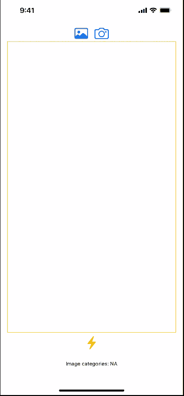

# 在 iOS 上使用 CoreML、Vision 和 SwiftUI 进行物体识别

> 原文：<https://medium.com/geekculture/object-recognition-with-coreml-vision-and-swiftui-on-ios-2fc24610f040?source=collection_archive---------44----------------------->

​

WWDC 2021 距离今天(2021 年 5 月 31 日)只有一周了。

SwiftUI 框架已经发布了大约 2 年，并在 iOS 开发人员社区中获得了巨大的发展势头。

然而，它仍处于相对早期的阶段。对于人工智能和机器学习从业者来说，最重要的问题之一是…