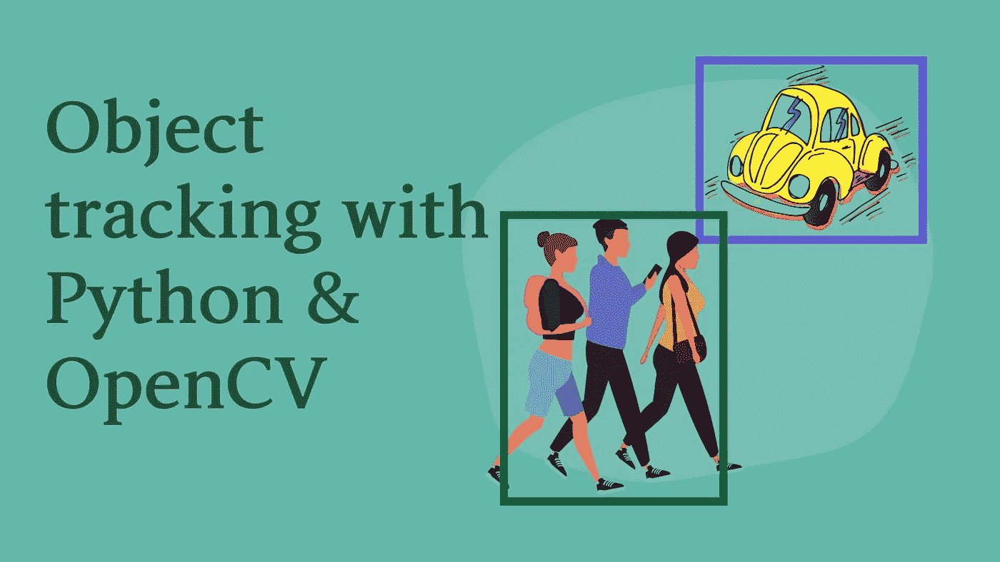

# 用 OpenCV 进行目标跟踪

> 原文：<https://medium.com/geekculture/object-tracking-with-opencv-4927a275bcb2?source=collection_archive---------7----------------------->

## 计算机视觉

## Python 和 OpenCV 简化了高级跟踪技术

工程师和计算机科学家长期以来一直试图让计算机看到和解释视觉数据，并根据收集的数据执行某些功能。这就是计算机视觉的想法产生的地方。计算机视觉旨在自动处理…