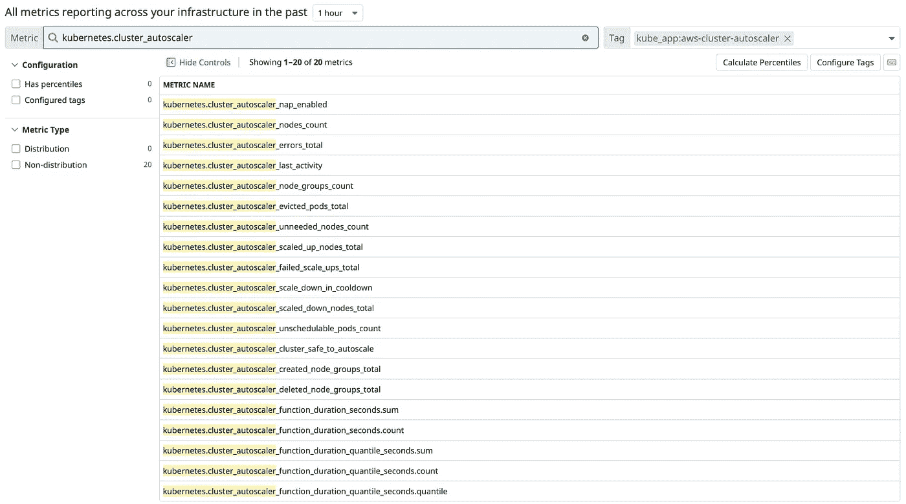
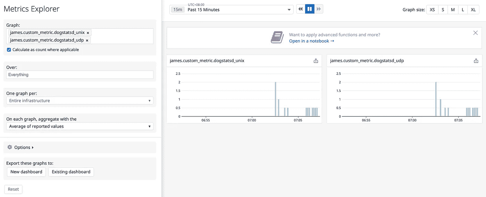

# K8s 上的可观察性—数据狗自动发现和数据狗统计

> 原文：<https://medium.com/geekculture/observability-on-k8s-datadog-autodiscovery-and-dogstatsd-3404c605fcb7?source=collection_archive---------3----------------------->

在[上一篇文章](/@tunguyen9889/observability-on-k8s-monitor-kubernetes-clusters-with-datadog-14c597def537)中，我介绍了 DataDog 以及如何将它部署到 Kubernetes 集群。今天，我将分享 DataDog 中的自动发现功能，以及我们如何将自定义指标发送到 DogStastD 套接字。

# 要求

*   K8s，Docker，DataDog 的基础知识。
*   正在运行的 AWS EKS 集群的管理员权限。你可以去 https://eksworkshop.com 的[参观](https://eksworkshop.com)，学习如何设置。
*   管理 K8s 集群的*kube CTL*([https://kubernetes.io/docs/tasks/tools/install-kubectl/](https://kubernetes.io/docs/tasks/tools/install-kubectl/))。
*   DataDog 代理被部署到 K8s 集群(查看本指南)。

# DataDog 自动发现？

根据 DataDog [官方文件](https://docs.datadoghq.com/getting_started/agent/autodiscovery/?tab=kubernetes#overview):

> 当您监控集装箱化的基础设施时，出现的一个挑战是集装箱可以从一个主机转移到另一个主机。集装箱化系统的动态特性使其难以人工监控。
> 
> 要解决这个问题，您可以使用 Datadog 的自动发现功能来自动识别特定容器上运行的服务，并从这些服务中收集数据。每当一个容器启动时，Datadog 代理就会识别这个新容器上正在运行哪些服务，查找相应的监控配置，并开始收集指标。

DataDog 的自动发现有助于:

*   自动识别在特定容器上运行的服务，并从这些服务中收集详细的指标—无论它们可能在哪里运行。
*   持续监控您的所有服务，无论底层基础设施多么动态或短暂。
*   允许您为代理检查定义配置模板，并指定每个检查应应用于哪些容器。
*   持续监视 Docker 事件，如容器创建/销毁/启动/停止，然后针对此类事件启用/禁用/重新生成静态检查配置，并报告收集的指标。

# 设置自动发现

在 Kubernetes 中，DataDog Agent pods (daemonSet)默认启用自动发现，我们只需验证是否设置了以下环境变量:

```
➜  ~ kubectl --namespace monitoring exec -it datadog-ja4fx -- env | grep KUBERNETES
...
KUBERNETES=yes
...
```

启用该功能后，DataDog 代理将根据默认自动发现配置文件，自动尝试自动发现多个服务[。](https://docs.datadoghq.com/agent/faq/auto_conf/)

集成模板可以以多种形式定义:Kubernetes pod 注释、Docker 标签、安装在代理中的配置文件、ConfigMap 和键值存储。示例:

```
apiVersion: v1
kind: Pod
# (...)
metadata:
  name: '<POD_NAME>'
  annotations:
    ad.datadoghq.com/<CONTAINER_IDENTIFIER>.check_names: '[<INTEGRATION_NAME>]'
    ad.datadoghq.com/<CONTAINER_IDENTIFIER>.init_configs: '[<INIT_CONFIG>]'
    ad.datadoghq.com/<CONTAINER_IDENTIFIER>.instances: '[<INSTANCE_CONFIG>]'
    # (...)
spec:
  containers:
    - name: '<CONTAINER_IDENTIFIER>'
# (...)
```

正如所解释:

*   `<CONTAINER_IDENTIFIER>`是指标公开的容器的名称。
*   `<INTEGRATION_NAME>`是 DataDog 集成的名称，例如:apache、redis 或 openmetrics 等。
*   `<INIT_CONFIG>`是在您的`conf.yaml`中的`init_config:`下列出的配置参数，并且是您正在启用的任何集成所必需的。
*   `<INSTANCE_CONFIG>`是`<INIT_CONFIG>`的一部分，这些是在`conf.yaml`中的`instances:`下列出的配置参数，是您正在启用的任何集成所必需的。

对于其他集成模板类型，可参考 [Kubernetes 集成自动发现](https://docs.datadoghq.com/agent/kubernetes/integrations/?tab=kubernetes#configuration)。

要查看 DataDog 集成的样子，请参考其[集成-核心 GitHub](https://github.com/DataDog/integrations-core) 。

# 使用 DataDog 的自动发现功能发送指标

在本例中，我将展示如何配置 [cluster-autoscaler](https://github.com/kubernetes/autoscaler/tree/master/cluster-autoscaler) (CA)使用自动发现功能向 DataDog 发送指标:

集群自动缩放器(CA)通过度量端点以 OpenMetrics 格式公开[其度量。我们将使用](https://github.com/kubernetes/autoscaler/blob/master/cluster-autoscaler/proposals/metrics.md)[DataDog open metrics integration](https://docs.datadoghq.com/integrations/openmetrics/)让代理从该端点收集指标，并转发给 data dog。

按照本说明为 CA 准备必要的配置。

然后将这些配置块添加到部署的`values.yaml`中:

```
...
podAnnotations:
  ad.datadoghq.com/aws-cluster-autoscaler.check_names: '["openmetrics"]'
  ad.datadoghq.com/aws-cluster-autoscaler.init_configs: '[{}]'
  ad.datadoghq.com/aws-cluster-autoscaler.instances: |
    [
      {
        "prometheus_url": "http://%%host%%:8085/metrics",
        "namespace": "kubernetes",
        "metrics": ["*"],
        "ignore_metrics":
          [
            "go_*"
          ]
      }
    ]
...
serviceMonitor:
  enabled: true
...
```

在解释上述配置时， *podAnnotations* 将被渲染到`conf.yaml` ( [样本文件](https://github.com/DataDog/integrations-core/blob/master/openmetrics/datadog_checks/openmetrics/data/conf.yaml.example)):

1.  `<CONTAINER_IDENTIFIER>`是 *aws-cluster-autoscaler* 。
2.  `<INTEGRATION_NAME>`是 *openmetrics* 。
3.  `<INIT_CONFIG>`是`[{}]`，意思是*空*。
4.  `<INSTANCE_CONFIG>`具有以下配置:

*   `"prometheus_url": "http://%%host%%:8085/metrics"`:这是 CA 的度量端点，使用`%%host%%`模板变量将帮助自动检测网络并返回 CA pod 的 IP 地址。请查看[自动发现模板变量](https://docs.datadoghq.com/agent/faq/template_variables/)了解支持变量的完整列表。
*   `"namespace": "kubernetes"`将为所有指标添加前缀`kubernetes.*`。
*   `"metrics": ["*"]`和`"ignore_metrics": ["go_*"]`表示收集 CA 支持的所有指标，除了`go_*`。

5.`serviceMonitor.enabled: true`:创建 Prometheus Operator service monitor，并为 CA 公开`/metrics`端点。

运行`helm install`将图表部署到集群中:

```
➜  ~ helm repo add autoscaler https://kubernetes.github.io/autoscaler
➜  ~ helm install autoscaler --namespace monitoring -f autoscaler-values.yaml autoscaler/cluster-autoscaler
```

验证部署:

```
➜  ~ kubectl --namespace monitoring get pods -l app.kubernetes.io/instance=autoscaler -o wide --no-headers
autoscaler-aws-cluster-autoscaler-7bre6732d6-czpkf   1/1   Running   1     30s   10.123.45.67   ip-10-123-45-144.ap-southeast-1.compute.internal   <none>   <none>
```

我们可以看到 CA 已部署，pod 正在节点`ip-10-123-45-144.ap-southeast-1.compute.internal`中运行。

我将在这个例子中解释 Kubernetes 集成自动发现是如何工作的:

*   由于 OpenMetrics 检查已与 DataDog 代理 6.6.0 版一起打包，代理 pod 将自动搜索该集成模板的所有 pod 注释。
*   在上面的 CA Helm 的`values.yaml`中，我们已经用*open metrics*integration 的配置定义了它的 *podAnnotations* ，所以代理现在可以开始检查和收集来自 CA 的指标。
*   首先，我们需要找到与 CA pod 在同一个节点上运行的 DataDog 代理 pod:

```
➜  ~ kubectl get pods --all-namespaces -o wide --field-selector spec.nodeName=ip-10-123-45-144.ap-southeast-1.compute.internal | grep -E "autoscaler|datadog"
monitoring     autoscaler-aws-cluster-autoscaler-7bre6732d6-czpkf   1/1     Running     1     120s     10.123.45.67   ip-10-123-45-144.ap-southeast-1.compute.internal   <none>     <none>
monitoring     datadog-ja4fx                                        1/1     Running     0     1d       10.123.45.78   ip-10-123-45-144.ap-southeast-1.compute.internal   <none>     <none>
```

*   验证代理 pod 中的集成，在本例中为`datadog-ja4fx`。

```
➜  ~ kubectl --namespace monitoring exec -it datadog-ja4fx -- agent check openmetrics
...
=== Series ===
{
  "series": [
    {
      "metric": "kubernetes.cluster_autoscaler_function_duration_seconds.count",
      "points": [
        [
          1620938471,
          6001
        ]
      ],
      "tags": [
        "docker_image:k8s.gcr.io/autoscaling/cluster-autoscaler:v1.17.4",
        "function:main",
        "image_name:k8s.gcr.io/autoscaling/cluster-autoscaler",
        "image_tag:v1.17.4",
        "kube_app:aws-cluster-autoscaler",
        "kube_app_instance:autoscaler",
        "kube_app_name:aws-cluster-autoscaler",
        "kube_container_name:aws-cluster-autoscaler",
        "kube_deployment:autoscaler-aws-cluster-autoscaler",
        "kube_namespace:monitorin",
        "kube_replica_set:autoscaler-aws-cluster-autoscaler-7bre6732d6",
        "kube_service:autoscaler-aws-cluster-autoscaler",
        "pod_name:autoscaler-aws-cluster-autoscaler-7bre6732d6-czpkf",
        "pod_phase:running",
        "short_image:cluster-autoscaler",
        "upper_bound:15.0"
      ],
      "host": "i-01234abcdxyz",
      "type": "gauge",
      "interval": 0,
      "source_type_name": "System"
    },
...
=== Service Checks ===
[
  {
    "check": "kubernetes.prometheus.health",
    "host_name": "i-01234abcdxyz",
    "timestamp": 1620938470,
    "status": 0,
    "message": "",
    "tags": [
      "docker_image:k8s.gcr.io/autoscaling/cluster-autoscaler:v1.17.4",
      "endpoint:[http://10.123.45.67:8085/metrics](http://10.123.45.67:8085/metrics)",
      "image_name:k8s.gcr.io/autoscaling/cluster-autoscaler",
      "image_tag:v1.17.4",
      "kube_app:aws-cluster-autoscaler",
      "kube_app_instance:autoscaler",
      "kube_app_name:aws-cluster-autoscaler",
      "kube_container_name:aws-cluster-autoscaler",
      "kube_deployment:autoscaler-aws-cluster-autoscaler",
      "kube_namespace:addons",
      "kube_replica_set:autoscaler-aws-cluster-autoscaler-7bre6732d6",
      "kube_service:autoscaler-aws-cluster-autoscaler",
      "pod_name:autoscaler-aws-cluster-autoscaler-7bre6732d6-czpkf",
      "pod_phase:running",
      "short_image:cluster-autoscaler"
    ]
  }
]
...
=========
Collector
=========
  Running Checks
  ==============
    openmetrics (1.10.0)
    --------------------
      Instance ID: openmetrics:kubernetes:9c6a<>cac [OK]
      Configuration Source: kubelet:docker://9782a<>20dc088
      Total Runs: 1
      Metric Samples: Last Run: 641, Total: 641
      Events: Last Run: 0, Total: 0
      Service Checks: Last Run: 1, Total: 1
      Average Execution Time : 305ms
      Last Execution Date : 2021-05-13 20:41:11.000000 UTC
      Last Successful Execution Date : 2021-05-13 20:41:11.000000 UTC
```

很好，我们可以看到 DataDog 代理可以检测和收集指标。让我们通过检查 Metrics => Summary 来看看指标是否发送到了 DataDog:



Metrics Summary — Cluster Autoscaler

# DogStatsD

什么是自定义指标？

*   如果指标不是从 [450+数据狗集成](https://docs.datadoghq.com/integrations/)之一提交的，则被视为自定义指标。
*   自定义指标可帮助您跟踪应用程序 KPI:访问者数量、平均客户购物篮大小、请求延迟或自定义算法的性能分布。
*   自定义指标由指标名称和标记值(包括主机标记)的唯一组合来标识。

一般来说，您使用 *DogStatsD* 或通过自定义代理检查发送的任何指标都是自定义指标。

DogStatsD 是一个与 Datadog 代理捆绑在一起的指标聚合服务。它实现了 [StatsD](https://github.com/etsy/statsd) 协议，并添加了一些特定于数据狗的扩展:

*   直方图度量类型
*   服务检查
*   事件
*   磨尖

DogStatsD 如何工作？

*   DogStatsD 通过 UDP 接受[自定义指标](https://docs.datadoghq.com/developers/metrics/custom_metrics/)、[事件](https://docs.datadoghq.com/developers/events/dogstatsd/)和[服务检查](https://docs.datadoghq.com/developers/service_checks/dogstatsd_service_checks_submission/)，并定期汇总和转发给 Datadog。
*   因为它使用 UDP，所以您的应用程序可以向 DogStatsD 发送指标，并继续其工作，而无需等待响应。如果 DogStatsD 变得不可用，您的应用程序将不会遇到中断。
*   默认情况下，DogStatsD 监听 UDP 端口 8125，但是您也可以配置 DogStatsD 使用一个 [Unix 域套接字](https://docs.datadoghq.com/developers/dogstatsd/unix_socket/)。

# **设置 DogStatsD**

在[我之前的博客](/@tunguyen9889/observability-on-k8s-monitor-kubernetes-clusters-with-datadog-14c597def537)中，[data dog-k8s-values . YAML](https://gist.github.com/tunguyen9889/e16db637de93c8b0c2026f800c3bc8de#file-datadog-k8s-values-yaml)已经包含了 DogStatsD 配置。我使用的是图表版本 **1.39.9** ，所以配置看起来像:

```
...
daemonset:
  useHostPort: true
...
datadog:
...
  useDogStatsDSocketVolume: True
  dogStatsDSocketPath: "/var/run/datadog/dsd.socket"
# This to expose UDP socket for some application not support UNIX socket
  nonLocalTraffic: True
...
```

如果您使用的是图表版本 **2.x.x** ，可以参考[本指南](https://docs.datadoghq.com/developers/dogstatsd/?tab=helm#agent)来启用 DogStatsD。

# 使用 DogStatsD 套接字发送指标

应用程序或服务可以使用 UDP 或 UNIX 套接字将其指标发送到 DogStatsD:

*   UDP 套接字:将此变量添加到您的应用程序 Kubernetes 部署中:

```
env:
- name: DD_AGENT_HOST
  valueFrom:
    fieldRef:
      fieldPath: status.hostIP
```

*   UNIX socket:将 DogStatsD socket 挂载到您的应用程序 Kubernetes 部署中:

```
volumeMounts:
  - name: dsdsocket
    mountPath: /var/run/datadog
    readOnly: true
...
volumes:
- hostPath:
    path: /var/run/datadog/
  name: dsdsocket
```

*   使用端口`8125`将应用程序的 StatD 配置指向`/var/run/datadog/dsd.socket`或`$DD_AGENT_HOST`。

我编写了一个小部署来测试使用`netcat`向 DogStatsD 发送定制指标:

将部署应用到集群中:

```
➜  ~ kubectl apply -f dogstatsd-demo.yaml
configmap/custom-metrics-script created
deployment.apps/dogstatsd-demo created
```

等待 pod 运行，并在 DataDog Metrics Explorer 中验证:



Metrics Explorer — DogStatsD

删除部署以避免意外的[自定义指标计费](https://docs.datadoghq.com/account_management/billing/custom_metrics/?tab=countrategauge):

```
➜  ~ kubectl delete -f dogstatsd-demo.yaml
configmap/custom-metrics-script deleted
deployment.apps/dogstatsd-demo deleted
```

# 下一步是什么

这篇博客是基于我自己在现有的 EKS 系统上使用 DataDog 的经验。它可能在您现有的环境中工作，也可能不工作。可以访问 [DataDog 官方文档](https://docs.datadoghq.com/agent/kubernetes/?tab=helm)了解更多信息。请随意留下评论或问题。

希望你喜欢阅读我的博客。在下一篇文章中，我将分享如何使用自动发现将 Spark on K8s 指标发送到 DataDog:

[](https://tunguyen9889.medium.com/spark-on-k8s-send-spark-jobs-metrics-to-datadog-using-autodiscovery-fc10488ecdc9) [## K8s 上的 Spark—使用自动发现将 Spark 作业的指标发送到 DataDog

tunguyen9889.medium.com](https://tunguyen9889.medium.com/spark-on-k8s-send-spark-jobs-metrics-to-datadog-using-autodiscovery-fc10488ecdc9) [](https://about.me/tunguyen9889) [## 詹姆斯·nguyễn 关于我

### 我是新加坡的云基础设施工程师。看我的博客。

关于我](https://about.me/tunguyen9889)