# K8s 上的可观测性——用 DataDog 监控 Kubernetes 星团

> 原文：<https://medium.com/geekculture/observability-on-k8s-monitor-kubernetes-clusters-with-datadog-14c597def537?source=collection_archive---------0----------------------->

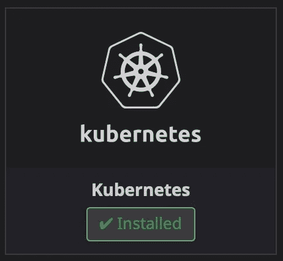

The screenshot has taken in the DataDog integrations console

当您为您的团队管理超过 10 个 Kubernetes (EKS)集群，并且在这些集群上运行一些关键应用程序时，您将需要建立一个具有监控、日志记录和跟踪功能的可观察性堆栈。

在这篇博客中，我将分享我们如何建立一个监控系统，设置一个仪表板，并使用 DataDog 监控我们的 K8s 基础设施。

# 为什么是 DataDog？

有许多可观察性工具或平台，既有开源的也有订阅的，但我为我的博客选择了 DataDog，因为我发现它广泛支持多种平台(AWS、Azure、GCP、on-premise 等)。)和应用程序，以及它与 Kubernetes 或 Prometheus metrics 的兼容性。还有，主要是我是(数据)狗的粉丝。

您可以查看 [DataDog 内置集成](https://docs.datadoghq.com/integrations/)的列表，或者参考他们的[集成-核心](https://github.com/DataDog/integrations-core)并编写自己的脚本。

# 要求

*   K8s，Docker，DataDog 的基础知识。
*   正在运行的 AWS EKS 集群的管理员权限。你可以去 https://eksworkshop.com 学习如何设置。
*   *kubectl* 管理 K8s 集群([https://kubernetes.io/docs/tasks/tools/install-kubectl/](https://kubernetes.io/docs/tasks/tools/install-kubectl/))。
*   *掌舵 v2* 安装图表中的数据狗。

出于某种原因，在这篇博客中，我将使用来自稳定库和版本 **1.39.9** 的[数据狗头盔图。从版本 **2.x.x** 开始，DataDog Helm Chart 已经重构并移动到](https://github.com/helm/charts/tree/master/stable/datadog)[其官方回购](https://github.com/DataDog/helm-charts)，但概念是相同的。

# 部署

我已经为 DataDog 部署生成了如下示例 values.yaml:

我在本教程中使用了 EKS 集群，因此您可以看到定义为`cloud:aws`和`distribution:eks`的标签，并按照以下约定将我的集群命名为`<env>-<platform>-<category>-xxx`，即`dev-eks-datadog-001`。

当您为核心基础架构设计和设置监控系统时，标签或标记非常重要，它将帮助您轻松地组织、分组、过滤或集中您的数据，以排除故障并了解您的环境。稍后，我将在仪表板和监视器部分分享更多示例。

使用*舵*部署数据狗:

```
➜  ~ helm install --name datadog --namespace monitoring -f datadog-k8s-values.yaml --set datadog.apiKey=<API_KEY> --set datadog.appKey=<APPLICATION_KEY> --version=1.39.9 stable/datadog
```

当*掌舵*命令完成后，你会看到一些类似如下的东西:

```
➜  ~ kubectl get pods -n monitoring --no-headers | grep datadog
datadog-2tspw                                   1/1   Running   0     2m
datadog-6bd328d579-tj8lp                        1/1   Running   0     2m33s
datadog-cluster-agent-54hv37f8fb-cgp2f          1/1   Running   0     2m23s
datadog-kube-state-metrics-56gre5ft89-lx8e9     1/1   Running   0     1m56s
datadog-pvltl                                   1/1   Running   0     2m55s
datadog-qtlh9                                   1/1   Running   0     3m12s
➜  ~ kubectl get svc --no-headers | grep datadog
datadog                             ClusterIP      172.20.6.24    <none>   8125/UDP     2m
datadog-cluster-agent               ClusterIP      172.20.10.15   <none>   5005/TCP     2m
datadog-cluster-agent-metrics-api   ClusterIP      172.20.12.27   <none>   443/TCP      2m
datadog-kube-state-metrics          ClusterIP      172.20.24.17   <none>   8080/TCP     2m
➜  ~ kubectl get deployments --no-headers | grep datadog
datadog                             1/1   1     1     3m
datadog-cluster-agent               1/1   1     1     3m
datadog-kube-state-metrics          1/1   1     1     3m
➜  ~ kubectl get daemonsets --no-headers | grep datadog
datadog    3     3     3     3     3     <none>   3m
```

您可以看到 DataDog 部署了 3 个主要组件:

*   数据狗特工达蒙塞特。
*   数据狗集群代理。
*   DataDog Kube-state-metrics (KSM):这是一个简单的服务，它侦听 Kubernetes API 服务器并生成关于对象状态的度量:节点状态、节点容量(CPU 和内存)、每个部署所需/可用/不可用/更新的副本数量、pod 状态(例如，等待、运行、就绪)等等。

为了理解数据狗代理和集群代理，让我解释一下旧的和当前的数据狗设计，这可以在[他们的官方文件](https://www.datadoghq.com/blog/datadog-cluster-agent/)中找到。

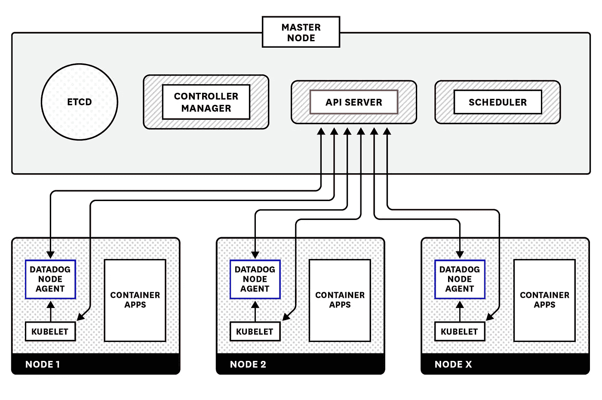

Without Cluster Agent diagram on [DataDog](https://www.datadoghq.com/blog/datadog-cluster-agent/)

您可以从上图中看到，在没有集群代理的情况下，集群中的每个工作节点都运行一个代理 pod，它从两个主要来源收集数据:

*   库伯莱:

> 通过监视每个 worker 节点上的 kubelet，Datadog 代理可以让您深入了解容器的行为，并帮助您跟踪与调度相关的问题。代理还检索系统级数据，并且[自动发现和监控节点上运行的应用](https://www.datadoghq.com/blog/autodiscovery-docker-monitoring/)。

*   *集群的控制平面*，由 API 服务器、调度器、控制器管理器等组成。

> 除了收集这些节点级别的指标之外，每个 Datadog 代理还单独查询主节点上的 API 服务器，以收集关于特定 Kubernetes 组件的行为的数据，以及收集关于整个集群的关键元数据。
> 
> 每个代理还检索以该特定节点上调度的 pod 为目标的服务列表，使用该数据将相关的应用度量映射到服务，然后用适当的 pod 名称和服务标记每个度量。代理还可以被配置为选举一个领导者，该领导者定期查询 API 服务器以收集 Kubernetes 事件。

由于旧方法让您可以看到集群的所有层，当集群规模增加时，它会增加 *API 服务器*和 *etcd* 的负载。

这就是 DataDog 开发和推出集群代理的原因，如下图所示:

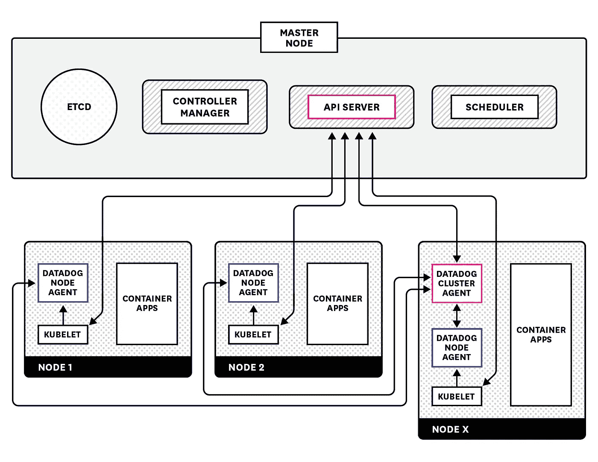

With Cluster Agent diagram on [DataDog](https://www.datadoghq.com/blog/datadog-cluster-agent/)

DataDog 集群代理的主要功能:

*   提供一种简化的集中式方法来收集集群级监控数据。
*   通过充当 API 服务器和基于节点的代理之间的代理，集群代理有助于减轻服务器负载。
*   将集群级元数据中继到基于节点的代理，允许它们丰富本地收集的指标的元数据。

使用 Datadog 集群代理，您可以:

*   减轻代理对基础设施的影响。
*   将基于节点的代理隔离到它们各自的节点，减少 RBAC 规则，只从 kubelet 读取度量和元数据。
*   向节点代理提供只能在 API 服务器中找到的集群级元数据，以便它们丰富本地收集的度量的元数据。
*   启用集群级数据的收集，例如服务或 SPOF 和事件的监控。
*   利用定制 Kubernetes 指标的水平 pod 自动扩展。

通过这种设置，DataDog 代理不需要选举 leader pod，集群代理将进行 K8s 事件收集。

DataDog cluster-agent 还提供了[外部指标提供者](https://www.datadoghq.com/blog/autoscale-kubernetes-datadog/)来根据 DataDog 指标定义 HPA(不仅限于 CPU/内存利用率)。

# 数据狗事件

在这个设置中，我通过将*data dog-K8s-values . YAML*文件中的`datadog.leaderElection`、`datadog.collectEvents`和`agents.rbac.create`选项设置为`true`，启用了 [K8s 事件集合](https://docs.datadoghq.com/agent/kubernetes/?tab=helm#event-collection)。

该功能告诉 DataDog 集群代理从控制平面收集 K8s 事件，并将它们转发给 DataDog。您可以轻松地检查您的集群发生了什么，为什么 pod 不能被调度，或者排除**回退**容器的故障，而不需要`kubectl get events`或`kubectl describe nodes|pods`。

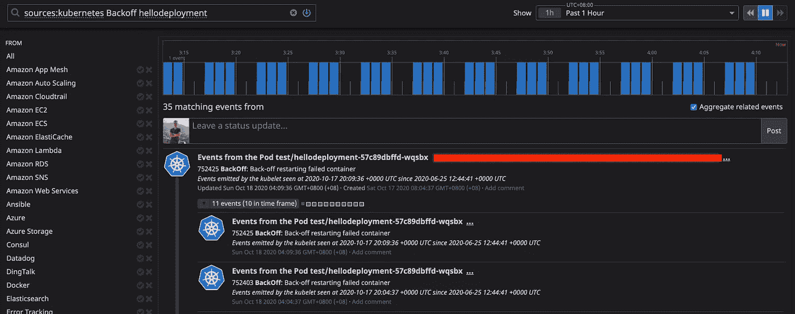

K8s events — Backoff

我们可以轻松创建仪表板或监视器，以近乎实时的方式观察和通知任何 K8s 事件。

# 仪表板

在这一节中，我将分享我自己为所有正在运行的 Kubernetes 集群(EKS)构建一个公共仪表板的经验。

我曾经将指标分解为不同的层，并按如下方式分组:

*   云/集群基础设施指标:EC2、RDS、ElastiCache 等。
*   系统指标:操作系统、CPU、内存、磁盘 IOps、网络带宽等。
*   编排(K8s)指标:节点状态、部署/副本集/状态集、pod(CPU/Mem)、PVC 大小等。
*   应用程序指标:HTTP 响应时间、Kafka 消费延迟、JVM 堆、Logstash 事件、Spark 作业指标等。

我创建的一个示例仪表板提供了我团队中所有正在运行的 EKS 集群的概览:

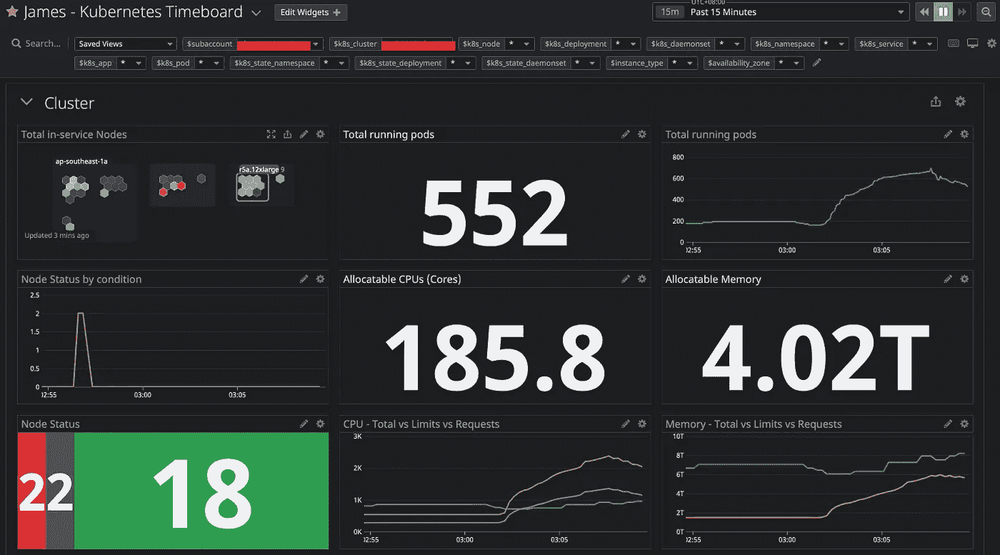

Cluster-metrics graphs — 1

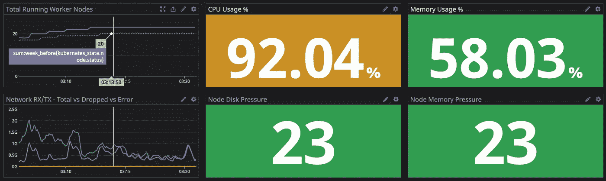

Cluster-metrics graphs — 2

DataDog 支持配置*模板变量*来快速过滤或查询特定标签或属性的指标，例如`subaccount` (AWS 账户)`k8s_cluster` (K8s 集群名称)`k8s_node` (EC2 工作节点)`k8s_namespace``k8s_deployment``k8s_daemonset`等。

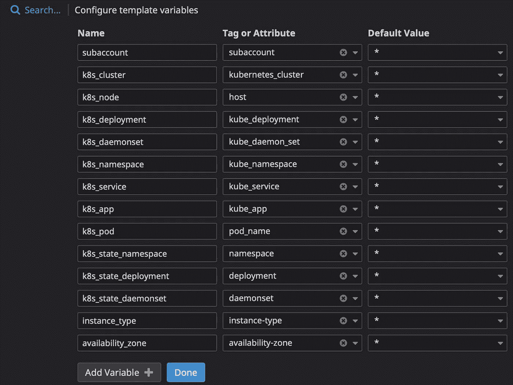

DataDog template variables

你会注意到为什么我用两个不同的标签来过滤同一个东西，比如`k8s_namespace`和`k8s_state_namespace`。这是因为 DataDog 收集了 [2 组指标](https://docs.datadoghq.com/agent/kubernetes/data_collected/),并且标记不同:

*   `kubernetes.*`数据狗代理/集群代理收集指标。
*   `kubernetes_state.*`指标从[*Kube-state-metrics*](https://github.com/kubernetes/kube-state-metrics)(KSM)API 中收集。

除了集群图，我还将系统指标和 K8s 指标添加到仪表板中，如下所示:

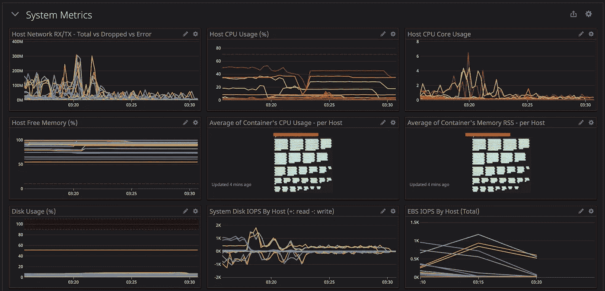

System-metrics graphs — 1


K8s-metrics graphs — 1

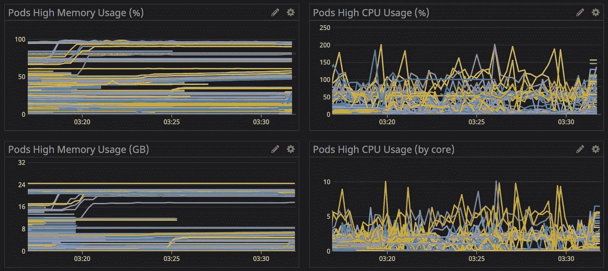

K8s-metrics graphs — 2

您可以向您的控制面板添加更多指标，以便对您的基础架构进行更多观察，但是我建议我们划分不同的层(集群/协调器/系统/应用程序/等等)。)到不同的仪表板中。这是因为当您查询巨大的指标子集或巨大的时间范围(1 周或 1 个月)时，您的仪表板 UI 会变得滞后。

# 监视器

在创建显示器之前，我通常会考虑一些基本信息:

*   当你挑选度量标准时，需要注意什么？(高 CPU/Mem、事件丢失、错误率、HTTP 响应缓慢、p95/p99 等。)
*   计算指标并设置阈值(最小值/最大值、平均值/总和、前一周/前一天等。).
*   度量标记/标签。
*   故障排除步骤操作手册和日志链接。
*   警报通知(松弛时间、寻呼负荷)。

正如我上面提到的，标签或标记很重要，尤其是当我们为核心基础架构设计和设置常见警报时。让我分享一个例子:创建关于名称空间上失败的 pod 的警报:

*   要检查的指标:`kubernetes_state.pod.status`和`phase:failed`

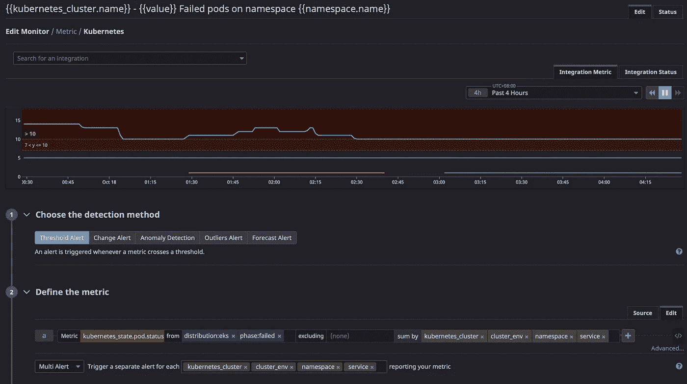

Failed pods alert — 1

*   `sum by` : `kubernetes_cluster`、`cluster_env`和`namespace` —这是因为当集群中的一个名称空间有如此多的故障单元时，随叫随到的工程师需要快速调查根本原因。
*   为监视器设置警报和警告阈值:

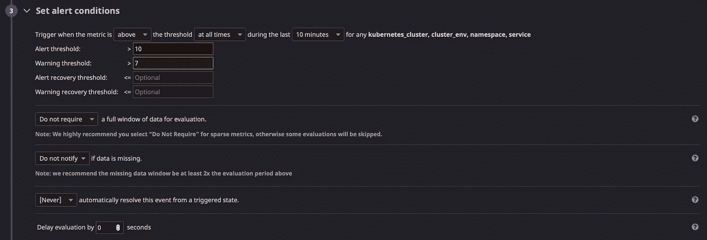

Failed pods alert — 2

*   度量标记/标签:如上所述，我已经在`sum by`中定义了一个标记列表，DataDog 允许我们使用这些变量定义警报消息:

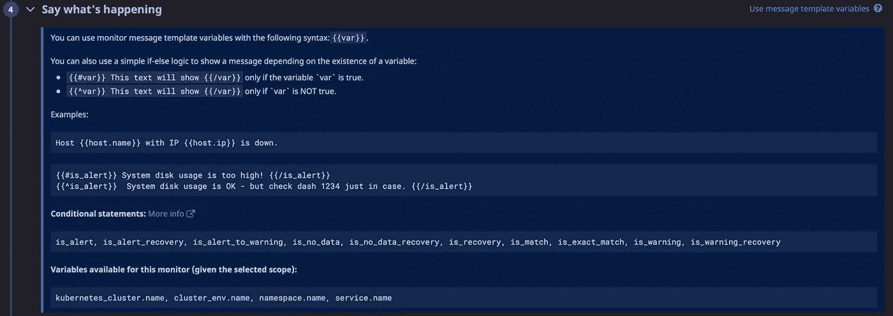

Failed pods alert — 3

*   然后，您可以看到如下警告消息:

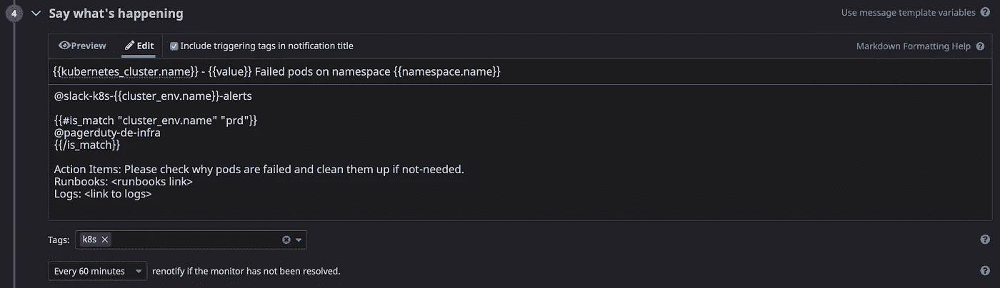

Failed pods alert — 4

`@slack-k8s-{{cluster_env.name}}-alerts`:我们可以简单地将来自不同环境(dev、stage 或 prd)的警报分散到不同的 Slack 通道(`k8s-dev-alerts`或`k8s-stg-alerts`或`k8s-prd-alerts`)，并且仅在生产环境中发生故障时才触发针对 oncall 的 page duty(`@pagerduty-de-infra`)。

对时差的警告示例如下所示:

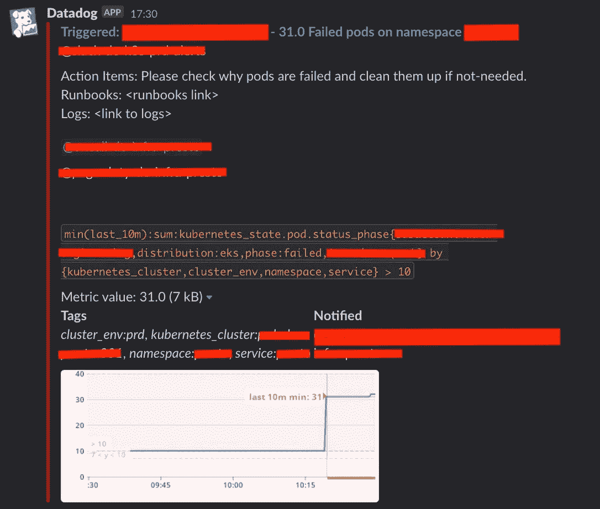

Failed pods alert — 5

# 下一步是什么

这篇博客是基于我自己在现有的 EKS 系统上使用 DataDog 的经验。它在您现有的环境中可能有效，也可能无效。可以访问 [DataDog 的官方文档](https://docs.datadoghq.com/agent/kubernetes/?tab=helm)了解更多信息。请随意留下评论或问题。

希望你喜欢阅读我的博客。下一篇，我会分享一下 [DataDog 自动发现和 DogStatsD](https://tunguyen9889.medium.com/observability-on-k8s-datadog-autodiscovery-and-dogstatsd-3404c605fcb7) 。

[](https://about.me/tunguyen9889) [## 詹姆斯·nguyễn 关于我

### 我是新加坡的一名站点可靠性工程师和全职爸爸。看我的博客。

关于我](https://about.me/tunguyen9889)