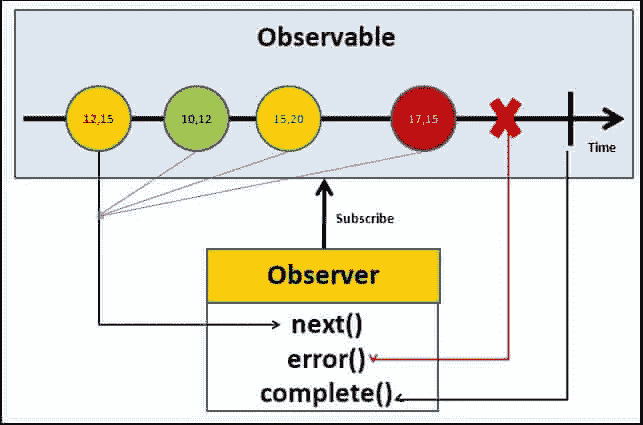

# 可观测量:高层次的解释

> 原文：<https://medium.com/geekculture/observables-a-high-level-explanation-69bf826f9aad?source=collection_archive---------18----------------------->

*从鸟瞰图中了解可观测的事物*


Photo by [AltumCode](https://unsplash.com/@altumcode?utm_source=unsplash&utm_medium=referral&utm_content=creditCopyText) on [Unsplash](https://unsplash.com/s/photos/code?utm_source=unsplash&utm_medium=referral&utm_content=creditCopyText)

T 他们说最好的学习方式是教学，我不是观察方面的专家，但我做了大量的研究，想尽我所能帮助你理解这个我一直难以理解的概念。

# **基本概况**

我的目标是尽可能简单地回顾这样一个健壮的概念。有人向我描述了一个随时间变化的数组，可以把它想象成一个稳定的数据流，通过决策对其进行监控。Tektutorialshub 非常直观地展示了可观测物体在时间上的样子。



Credit tektutorialshub

请注意数据流是如何变化的，数据流被观察者订阅，并根据发生的情况决定可观察对象可以采取的各种步骤。

# 当可观察到的呼叫:

**1。。next()** : Next 做了很多你期望它做的事情，它传递数据流中的下一个值。在执行开始后，这可以被调用零次或多次。
**2。。error():** 出错时，流将停止并执行错误回调，此时可观察到的下一个调用将是…这是一个可选的处理程序，用于停止可观察实例的执行。
**3。。complete()** :一旦进行了 complete 调用，observables 就停止发送数据，即使流中稍后有更多的值，complete 仍然会执行，后续代码不会运行。请参见下面的示例。

```
*setTimeout(() => { observer.****next****(“hello”) }, 1000);**setTimeout(() => { observer.****next****(“my”) }, 2000);**setTimeout(() => { observer.****next****(“name is”) }, 3000);**setTimeout(() => { observer.****complete****() }, 3500); //sending complete event. observable stops here**setTimeout(() => { observer.next(“you’ll never”) }, 4000); //this code is never called**setTimeout(() => { observer.next(“know”) }, 5000);*
```

**可观察到的碎片
1。subscriber:** subscribe 扩展了 subscription 类，订阅一个可观察对象，你会调用新可观察对象的 subscribe 方法吗:

```
 *someData.subscribe({
//next
})*
```

**2。** 观察器本质上是监听被观察对象发出的特定数据值的调用。观察者通常是可观察对象的第一个自变量，如下所示。

```
 const someData$ = new Observable(**observer**){
}
```

**创造一个可观察的**

1.  创建可观察变量，因为这是一个变量，这可以是你指定的任何名称。
2.  将变量赋给新的 Observable.create 函数
3.  写下你的可观察数据，开始时并不复杂，记住你所做的只是随着时间的推移发出数据。确保你下次打电话。
4.  关闭您的观察窗口，完成通话

```
const observable = new Observable.create(function(observer ){observer.next('some data');observer.next('some more data');observer.complete()})
```

**使用可观测的**

要使用 observable，只需将它与 subscribe 方法结合使用，如下所示。

```
observable$.subscribe(observable$)//emits some data//emits some more data
```

# 最后

可观测量是一个深刻复杂的概念，可以进一步探索，这只是一个概述，给你一些基本的理解。当你理解可观测量的价值以及如何有效地实现它们时，它们会成为一个非常强大的工具。