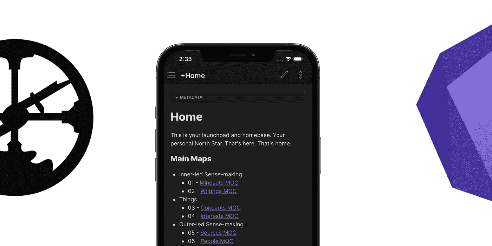

# Obsidian 和 Roam 是业余爱好者的应用

> 原文：<https://medium.com/geekculture/obsidian-roam-are-hobbyist-apps-83b679243fef?source=collection_archive---------2----------------------->

## 这两款生产力应用可能都不会家喻户晓

[漫游研究](https://roamresearch.com/)和[黑曜石](https://obsidian.md/index.html)在 2020 年和 2021 年已经成为真正流行的工具，成为记笔记的新方式。

我相信，尽管这两个工具都非常适合做笔记，但它们不会成为家喻户晓的名字。