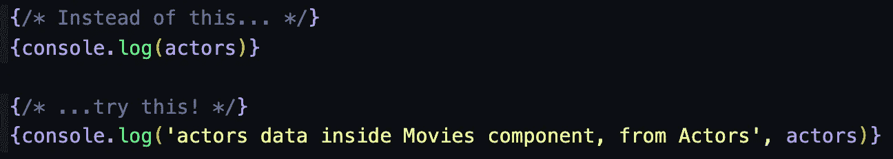
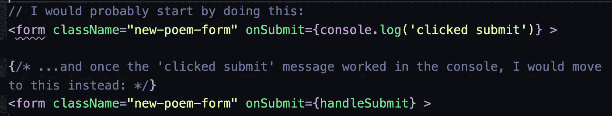
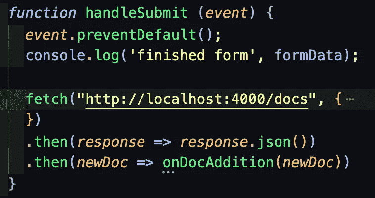
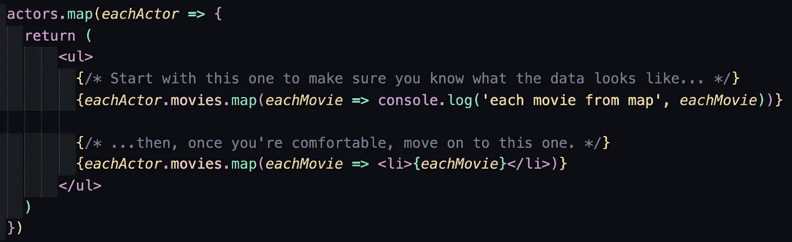

# Console.log 的代码()

> 原文：<https://medium.com/geekculture/ode-to-console-log-c5a91fe01f45?source=collection_archive---------11----------------------->

作为一名初学编程的人非常有趣。整个知识世界就在你的指尖，等待着你去发现。学习的过程令人陶醉——如果你和我一样，你知道从你第一次编写单词并显示在页面上的那一刻起，你就迷上了编码。快速建立学习动力是很容易的，尤其是如果你(和我一样)正在以编程训练营的极快速度学习编码。但不幸的是，对于我们初学者来说，当我们在代码中遇到错误，并且不知道如何前进时，所有的编码过程都很容易陷入停顿。

假以时日，我们肯定会建立肌肉记忆和直觉，这将帮助我们几乎自动地排除故障和调试代码。但在那之前，初学编码的人必须刻意找出当我们的代码停止运行时如何摆脱困境，而且，我相信每个人都知道，找出*如何*摆脱困境有时可能是最难思考的部分。

作为一名编码学习者，我发现 console.log()是在遇到错误后让自己重新运行代码的最有用的工具之一。这些经验和个人技巧来自我学习 vanilla JavaScript 和 React.js 的经历，但我相信这种自我思考的方式适用于许多不同的语言。我希望这些提示和技巧可以帮助其他初学者——如果这些对你有帮助，如果你已经在代码中实现了这些或其他调试方法，或者如果你有任何建议，请随时给我留言。感谢阅读！

当我第一次构建一个项目时，我基本上记录了所有的东西。它有助于我准确地了解代码中发生的事情，这也是我给初学程序员在调试时应用的第一条建议。我发现我定期在控制台记录一些不同的东西——我自己的上下文信息、变量和其他数据，以及类型。

## Console.log(“针对您自己的上下文消息”)

这里有一个通用的有用提示，即不仅记录来自程序的数据片段，还记录给自己的消息。我发现控制台为自己记录一些上下文信息确实有助于我准确理解我的代码是如何流动的。例如，如果您正在构建一个流过一堆不同函数和点击事件的程序，当您的代码中断时，可能很难找出问题来自哪里。如果你给自己上下文信息，它会帮助你知道什么*没有*坏，这样你就可以缩小嫌疑范围。这里有一个例子:

虽然上面的第一个控制台日志工作正常，并将从 actors 变量中获取数据，但是第二个示例在文本的海洋中会更有帮助，因为您已经为自己留下了注释，以提供一些上下文和位置感。这是我自己留下的笔记类型的一个很好的例子——它让您知道您实际上在控制台日志中看到了什么数据，并且它还告诉您它是从哪里传来的。而且，因为你会在进行过程中删除这些笔记，所以在这里非正式是完全可以的。

## Console.log(“传递数据时”)

这个技巧和上一个真的很像，只是更上一层楼。当集成许多不同的代码块时——比如函数、事件处理程序，甚至 if/else 语句——我通常从控制台记录每个代码块内部的内容开始。这样，我可以四处点击，直观地确认每个块都在做自己的工作。在你觉得有必要实际构建每个块的功能之前，这是一个很好的第一步，因为它帮助我们准确地理解我们将如何在代码中一步一步地前进。

例如，如果我正在创建一个表单，并添加一些当用户单击提交按钮时应该发生的提交操作，我可能首先只是在提交时控制台记录某种字符串。然后，一旦工作正常，我就知道事件侦听器实际上被添加到了正确的元素中(这对于初学者来说很容易出错)。在这一点上，我准备重构我的代码，以便事件实际上触发预期的功能。对于第一遍，我可能会让函数再次控制台记录一个字符串，以确保一切按预期工作。然后，一旦确认，我将实际执行预期的行动。

下面是另一个代码示例:

如您所见，首先，当单击 submit 按钮时，我选择简单地记录一条消息。一旦这很好，就很容易重构代码，以便调用 handleSubmit 函数。

在这种情况下，我的示例表单的输入字段一直在向 formData 状态添加信息，所以在我的 handleSubmit 函数实际上对该数据执行*操作之前，我想确保我的状态看起来和行为都符合我的计划。因此，正如您可能已经猜到的，我的第一步是控制台记录 formData 状态，一旦看起来不错，我就可以转到我的 fetch POST 来持久保存我从表单中获得的内容。*

## Console.log(“使用迭代器”)

当使用迭代器时。map()和。forEach()，控制台记录您在迭代中获得的每一项总是开始工作的安全地方。我总是从那里开始我的生活！这是一个很好的第一步，因为它确保了我确实到达了我想要的数据。下面是另一个代码示例:

正如你可以从我在代码中添加的注释中看到的，我首先只是控制台记录每个电影项目，以确保我知道我在那里得到了什么。然后，一旦我确信那确实是我想要的，我就可以舒服地继续做每一件事。

虽然这对于超级简单的迭代来说并不总是必要的，但是对于初学者来说，这是一个很好的学习工具，并且当我们进入一些更复杂的嵌套时，它对于高级初学者来说是很有帮助的。在这里，我们可以看到我们实际上是在另一个 map()中进行 map()迭代。地图()。还有一些额外的点符号，让我们进入正确的数据层次来执行我们的内部。map()操作。对于嵌套的数据和迭代，很难确切地看到我们正在处理的数据，这就是为什么控制台日志记录在这里仍然是一个很好的首选。

## Console.log('运算符的类型')

如果您不熟悉运算符的类型，[这里有一个到 MDN 文档的链接——来看看吧！](https://developer.mozilla.org/en-US/docs/Web/JavaScript/Reference/Operators/typeof)

当我熟悉了普通的 JavaScript 和 React.js 时，我发现 typeof 操作符非常有用。让我们思考编码和处理数据可能很困难，因为它不是有形的，也不容易描述，所以我发现自己一直在控制台记录不同数据的类型。

当我访问嵌套数据的内部级别时，当在 React.js 组件之间传递属性时，甚至作为提取的结果，我经常选择控制台记录数据类型。控制台记录项目和项目类型对我想象数据在任何给定时间的去向和样子非常有帮助。例如，当传递给子组件时，很容易忘记数组属性是包装在对象中的，但是控制台记录属性和属性类型可以帮助您了解真相。

此外，我发现当我的代码没有按照我预期的方式运行时，这种类型的操作符特别有用。通常，如果我控制台记录该项和该项的类型，我会意识到我以为它是一个数组，但它实际上被包装在一个对象中，这意味着数组方法不会立即工作——或者我会发现我的。map()不起作用，因为在执行 array 方法时我的变量没有定义。

虽然控制台日志不能解决所有初学编码者的问题，但我相信它对我们所有学习者来说都是一个非常有用的工具，因为它有助于减轻编码的抽象本质所导致的一些问题。也就是说，它可以帮助我们看到代码运行时我们在哪里，哪里可能会出问题，它可以帮助我们更清楚地看到所有的数据。