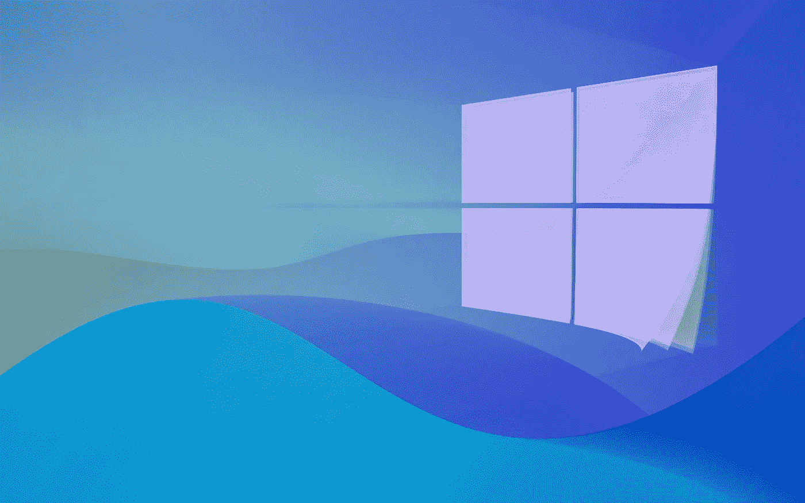

# 在我的三台“合格电脑”中，我没有一台升级到 Windows 11

> 原文：<https://medium.com/geekculture/of-my-three-eligible-pcs-i-am-upgrading-none-to-windows-11-fe3a959e315e?source=collection_archive---------2----------------------->

## 这可能很诱人，但是有理由让你仔细考虑一下

Windows 11 is now available as an upgrade to millions of consumers using Windows 10-based “eligible PCs” — so the obvious question now is: should they make the leap? Not so fast. (Image: Microsoft/Fakurian Design, Unsplash)

所以！在经历了所有的[忙乱](/geekculture/windows-11-wont-be-an-option-for-many-windows-10-users-d8462e894eb3)、[期望](/geekculture/windows-11-heres-how-the-new-os-can-be-a-great-success-f9b2e4096654)、[争议](/geekculture/hey-microsoft-enough-with-the-shady-tactics-enough-26e78596b429)、挫折和痛苦失望[之后，微软的](/geekculture/the-windows-11-saga-continues-now-it-will-be-your-fault-832061fed449) [**Windows 11**](https://farkonas.medium.com/list/windows-11-19f799b1bd89) 刚刚发布:数百万人现在可以去 Windows 10 设置中的 Windows 更新区…