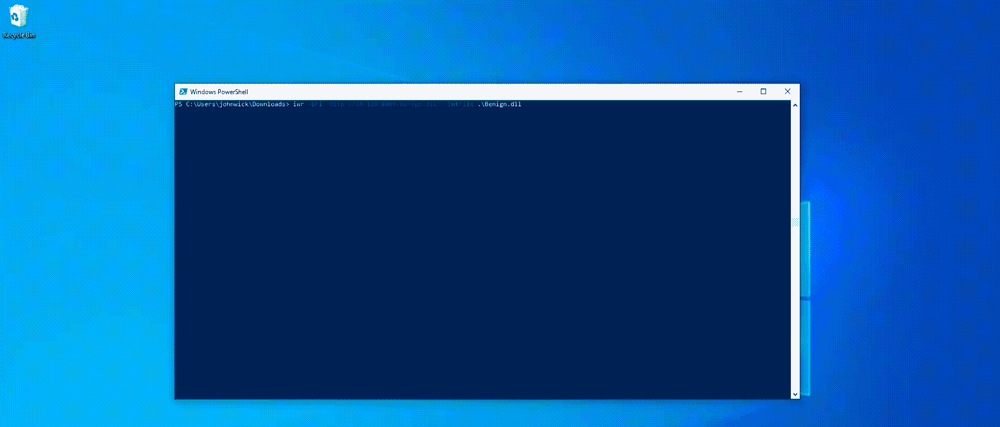

# 攻击性 Go:创建恶意 dll

> 原文：<https://medium.com/geekculture/offensive-go-creating-malicious-dlls-8c797bcdd290?source=collection_archive---------3----------------------->

## 并用 RunDLL32 执行它们

H ello，🌎！在这篇简短的博客中，我将展示使用 Go 创建一个恶意 DLL 是多么容易，然后展示如何使用 rundll32 在目标 Windows 机器上执行它。我们开始吧！

__________________________________________________________________

# 用 Go 创建 dll