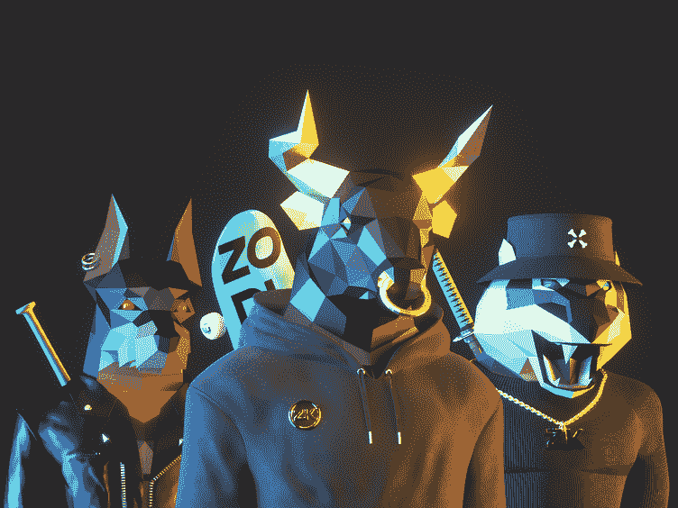

# 送 NFT 圣诞礼物可能是今年最不应该做的事情了！

> 原文：<https://medium.com/geekculture/offering-an-nft-christmas-present-might-be-the-least-2022-thing-to-do-this-year-8ca5cf6d4507?source=collection_archive---------9----------------------->

## 这个博客是针对一个对 NFTs 感兴趣的平民，他想给他们所爱的人提供一份 NFT 圣诞礼物。

最近的技术革命围绕着许多新兴技术，区块链比以往任何时候都更受关注。虽然到目前为止，21 世纪 20 年代已经经历了大流行和战争，但密码和不可替代代币(NFT)的平行崛起已经发出了积极的光芒

特别是谈到 NFT，它们的感知价值使它们成为 NFT 圣诞礼物的绝佳选择，因为许多千禧一代已经开始深入虚拟世界。这个博客是针对一个对 NFTs 感兴趣的平民，他想给他们所爱的人提供一份 NFT 圣诞礼物。

# 首先，什么是 NFT？

虽然我们认为 NFT 圣诞礼物是一个可行的选择，但我们应该知道 NFT 到底是什么。不可替代令牌是一种虚拟实体，可作为在分布式数字分类账(称为区块链)上注册的所有权证明。这些令牌有区块链记录作为支持，可以帮助验证数字或物理资产的所有权和真实性。虽然它们的功能类似于加密货币，但它们不能相互交换，因为它们的价值是基于个人的感知，因此被称为不可替代的令牌。这就像一个人不能互相交换艺术品，但美元纸币可以交换。

 [## 五大 NFT 商业模式将于 2023 年启动！

### 不可替代代币的出现向世界展示了一种自我转变的方式，以更好地适应消费者，同时…

bit.ly](https://bit.ly/3gr2yZu) 

# 2022 年 NFT 圣诞礼物的流行类型

*   **作品:**

艺术品可能是今年最受欢迎的 NFT 类型，是 2021 年 NFT 繁荣背后的主要推动力。数字艺术的兴起，以及艺术家和收藏家对以有意义的方式联系和赚钱的需求，使得他们对 NFT 圣诞礼物有了需求。

*   **PFP NFTs:**

对于那些不知道 PFPs 的人来说，这些是 NFT 的圣诞礼物，基于基于数字主题的个人资料图片，给予独家权利。无聊猿游艇俱乐部，密码朋克，OkayBears，突变猿游艇俱乐部，和月鸟是一些著名的亲民党 NFT 集合。

*   **游戏资产:**

如果接收者是一个狂热的 NFT 游戏玩家，这是一个值得作为 NFT 圣诞礼物的项目。头像、皮肤、武器、交通工具、装备、药剂和交易卡可以根据游戏类型来提供。Axie Infinity，Splinterlands，Gods Unchained，Sorare 和 Alien Worlds 是受欢迎的 [**NFT 游戏平台**](https://bit.ly/3tYu6bu) 的资产需求。

 [## NFT 游戏:可能改变 Web3 未来的点数！

### 几十年来，随着技术的快速进步，视频游戏已经成为一个产生利润的行业…

bit.ly](https://bit.ly/3gvjMEP) 

*   **收藏品:**

如果收礼物的人是某个名人的狂热爱好者，这些可以是理想的 NFT 圣诞礼物。大多数名人、运动队和运动联盟已经以数字交易卡、视频和照片的形式发布了 NFT，它们可以作为纪念品进行交易或珍藏。NBA 顶级射手，FanCraze，和 Rario，都是很受欢迎的例子。

# 规划 NFT 圣诞礼物前需要考虑的几个因素

虽然送某人一份 NFT 圣诞礼物听起来有点超前和私人化，但在送之前还是要记住一些要点。

*   选择 NFT 圣诞礼物需要大量的研究，因为重要的是提供一份令人印象深刻的礼物，让收件人了解背后的价值。这就像在现实世界中购买礼物的基本思想一样。
*   您还应该考虑将 NFT 圣诞礼物转给收件人时产生的交易(汽油)费用。它随区块链、一周的时间和拥挤程度而变化。
*   对于双方来说，拥有一个可以存放 NFTs 和加密货币的加密钱包也是必不可少的。有各种形式:冷(线下)热(线上)，每种形式都有不同的利弊。
*   如果您不确定收件人的 NFT 偏好，建议向他们的钱包转移一些加密货币。请注意，并非所有平台都接受所有密码。因此，确保您共享一个流行的密码，即使很少。

# 提供 NFT 圣诞礼物的过程

> 赠送 NFT 圣诞礼物的过程从赠送者从 NFT 市场购买 NFT 物品开始。人们被众多的选择宠坏了。
> 
> 在购买了 NFT 商品之后，赠送者必须通过钱包-钱包交易将其发送给接收者。赠送者和接收者知道彼此的钱包地址是必要的。在赠送者的情况下，知道正确的钱包地址是必要的，以便 NFT 圣诞礼物正确到达。然而，对于收件人来说，知道提交人的地址有助于他们不被诈骗或黑客攻击。
> 
> 现在，在接受者收到 NFT 的礼物后，他们可以选择将它作为一个可收藏的记忆或在 NFT 二手市场交易。

# NFT 圣诞礼物有商业角度吗？

事实上，赠送 NFT 圣诞礼物有一个商业角度，因为卖家将从飙升的销售中获得巨大利益，他们的价值将会上升。此外，他们还可以通过发布可以保留特殊记忆的独家节日 NFT 来吸引大众。随着越来越多的人访问 NFTs，它对整个生态系统总是有益的。

## 总结想法

从今以后，我们可以说，NFT 圣诞礼物可以是伟大的选择，提供和打动你的近和亲爱的人。随着 NFTs 的受欢迎程度比以往任何时候都高，基于 NFT 的礼物对于任何精通或不精通技术的人来说都是理想的，只要他们对 NFTs 有所了解。不过，如果你想创建自己的 NFT，这是可能的，专业的 NFT 发展公司可以提供帮助。所以，给你心爱的人送上 NFT 圣诞礼物，用将在 2023 年统治的区块链科技来珍惜这个节日。