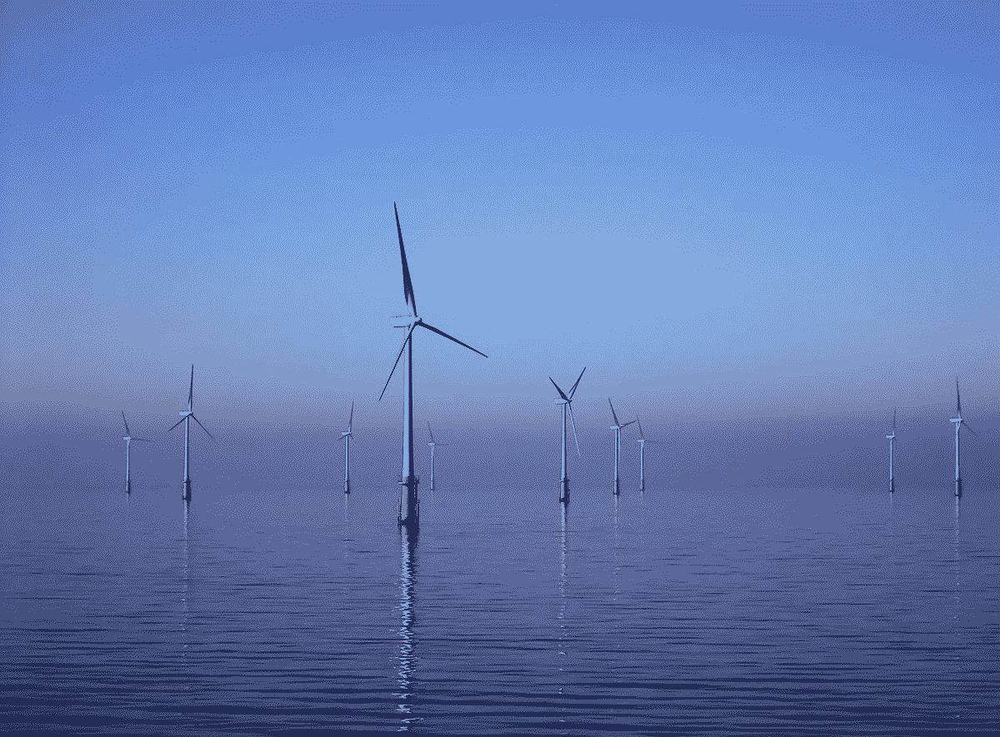

# 海上风力可以为世界提供动力

> 原文：<https://medium.com/geekculture/offshore-wind-could-power-the-world-595f460eed44?source=collection_archive---------2----------------------->

## 大型海上风力发电场正在世界各地涌现，但这仅仅是个开始

Image by [Andy Dingley](https://commons.wikimedia.org/wiki/User:Andy_Dingley) on [Wikimedia Commons](https://commons.wikimedia.org/wiki/File:Barrow_Offshore_wind_turbines_NR.jpg)

在能源领域，海上风能仍然相对年轻。1991 年，世界上第一个海上风力发电场在丹麦文德比海岸试运行。