# 发现易通行已被 pwn！

> 原文：<https://medium.com/geekculture/ollydbgfind-the-easy-pass-has-been-pwned-2288b25cfb93?source=collection_archive---------8----------------------->

今天，我们将继续[Hack Bo](https://hackthebox.eu)x 初学者赛道，进行倒车挑战，找到容易通过的地方。完全免责声明，我几乎没有逆向工程的经验。我以前看过这个挑战，并完成了它，但我不明白是怎么回事。我在大学时做过一些组装工作，但那是十多年前的事了，现在我已经全忘了。

因此，有了这种方式，让我们得到扭转。

首先你需要去黑盒子并下载这个挑战的文件。

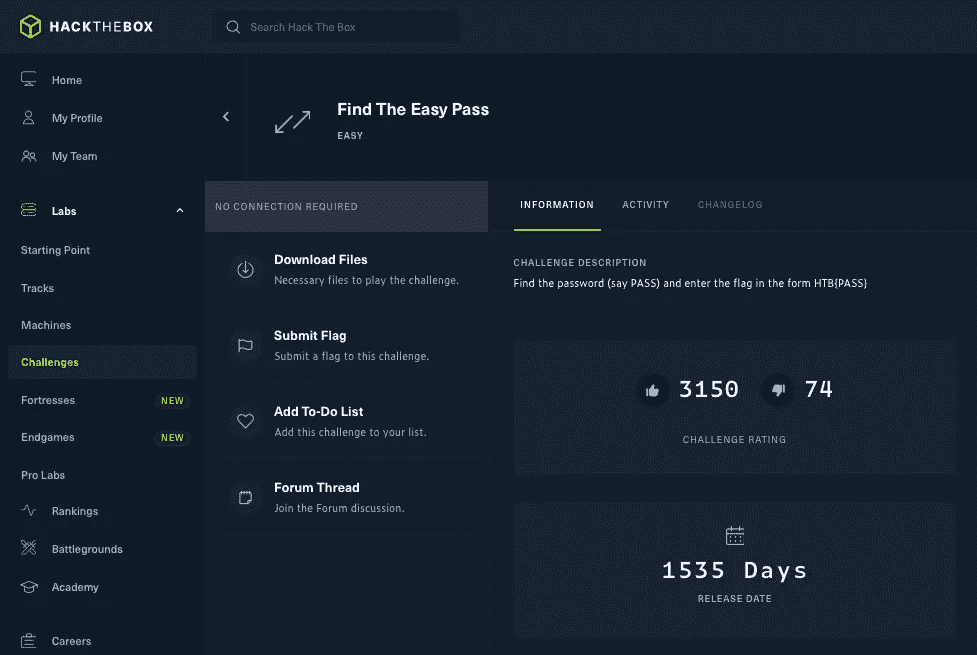

这会将文件下载到您的下载目录或您设置的任何地方。您需要提取 zip 存档的内容，但它是受密码保护的。密码列在挑战中，是“黑客盒子”。如果你在 Windows 上，你应该能够双击可执行文件并立即运行它。然而，如果你使用的是 Linux，那么你需要用 wine 这样的仿真软件来运行它。

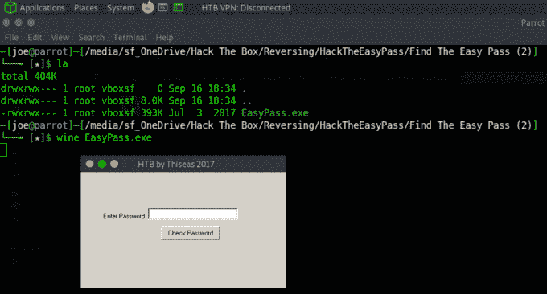

现在应用程序正在运行，最好记下应用程序中显示的字符串。当需要对程序进行反编译时，这有助于跟踪程序中的位置。接下来要检查的是当我们向应用程序提交数据时会发生什么。

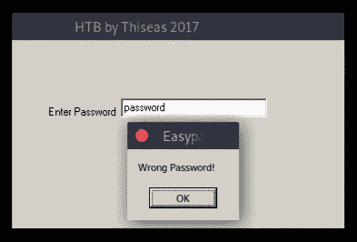

我们失败了，我们提交了错误的密码，应用程序在嘲笑我们。那么，我们该何去何从呢？我们需要一个程序把其他程序撕成碎片，这样我们就能看到它们的内部。如果您还没有设置和安装它，可以看看我在 Ghidra 上的文章。我们开始倒车吧。与。现在是时候搜索我们之前记下的那些字符串了。顶部菜单有一个搜索选项。点按它，然后点按“搜索字符串”。

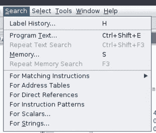

应该会弹出一个新窗口，提供一些选项来优化搜索。我保留了默认选项，并点击了搜索。

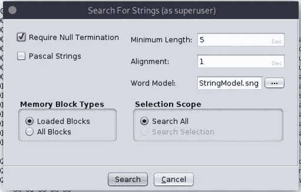

一旦完成，将弹出另一个窗口，显示 Ghidra 在代码中找到的所有字符串。底部有一个过滤器选项，您可以使用它来进一步细化搜索。从测试应用程序中我们知道，在应用程序上可以看到字符串“password”。我们找找吧。

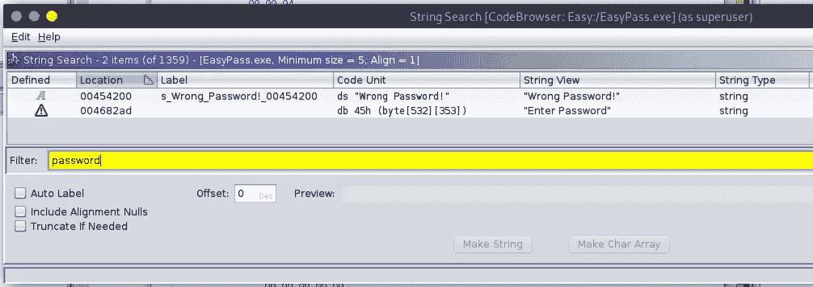

好的，我们正在缓慢但稳定地前进，这就是我们需要做的，为了打败兔子，或者是野兔？希望所有倒车不用这么久。接下来，我们需要双击包含“错误密码”的行，这将把我们带到应用程序中代码部分的位置。

代码部分以蓝色突出显示。您可以看到，当前正在查看内存引用 00545200。如果我们右键单击突出显示的部分，并单击引用，然后显示地址引用，将弹出一个新窗口，显示内存地址。

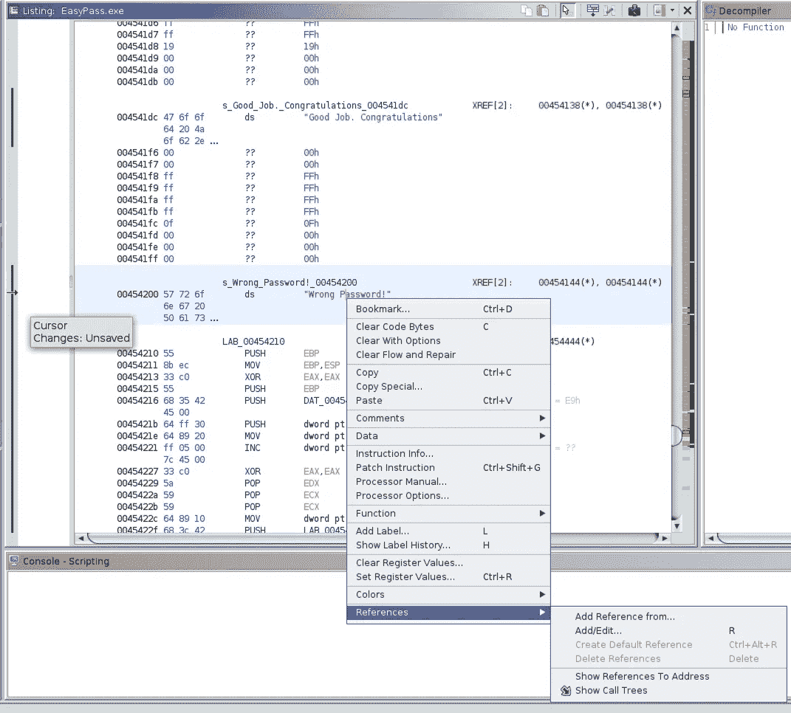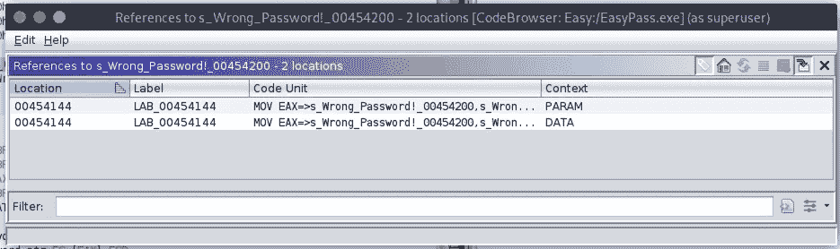

可以看到位置是 00454144。如果我们再次双击那个地址，那么它将把我们带回到主窗口和下一个内存引用的位置。

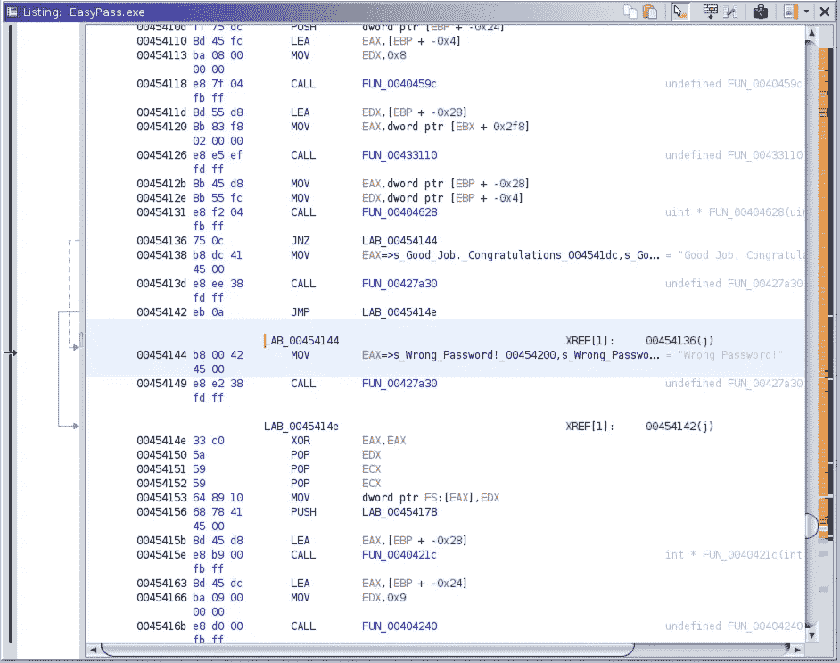

迷路了？是的，不要担心，我花了几次尝试才走到这一步，我并不羞于承认我已经阅读了一些演练。现在，如果你看一下顶栏，在绿色播放按钮旁边有一个“层次顺序”图标(我唯一能想到的称呼)。单击它以启动函数图窗口。你应该得到一个窗口，看起来像下面的东西。

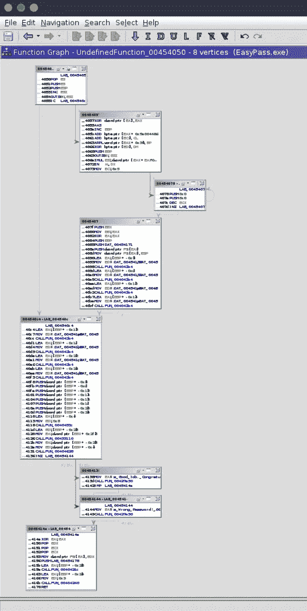

现在，如果你放大到最后 4 个方框，你可以看到有一点逻辑在起作用。根据结果，程序有两个不同的代码部分。本质上，这是一个 IF 语句。如果满足一个条件，则运行第一个框中的代码(00454138)，否则运行第二个框中的代码(00454144)。

如果我们看看这两个框正上方的框，您可以看到函数(FUN_00404628)决定了下一个要运行哪个框。如果我们点击函数号，它会把我们带到调用函数的地方。记下内存引用 00454131。

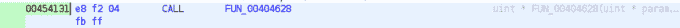

然后，如果你双击这个函数，它会把你带到主窗口中的 if 语句，在这里我们可以看到它在做什么。正如您在下面看到的，应用程序从 param_1 和 param_2 中获取值，并将它们存储在 EAX 和 EDX。接下来，您应该会看到使用 PUSH 将 param_1 和 param_2 的值写入堆栈，并使用 CMP 进行比较。我们可以假设，因为这是检查密码是否正确，所以这些参数之一包含正确的密码。

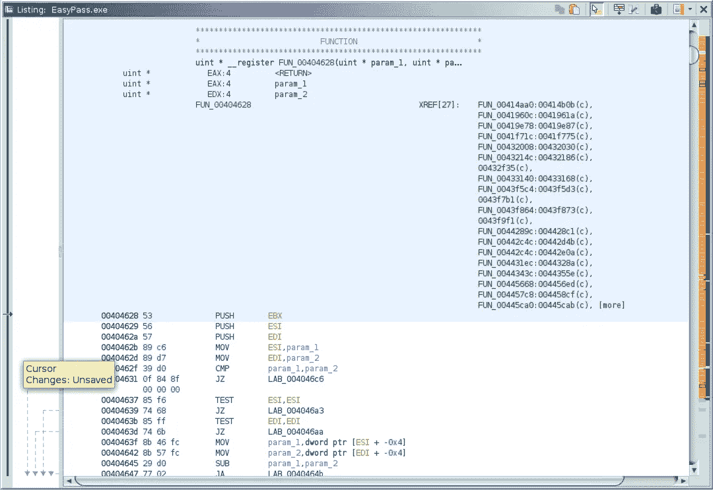

因此，接下来我们需要调试程序，并检查这些参数的内容。为此，我将使用 ollydbg。如果您需要安装 ollydbg，您可以从 CLI 使用“sudo apt-get install ollydbg”进行安装。程序安装后，您可以通过运行“ollydbg”来启动它。ollydbg 运行后，单击文件，打开并选择 EasyPass.exe。

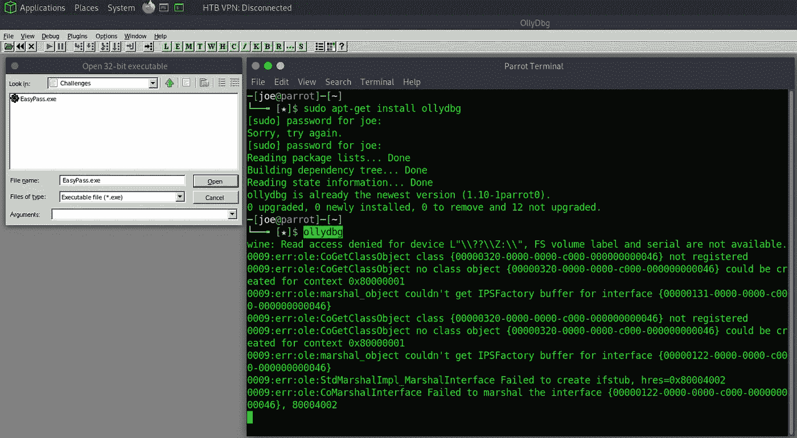

随着程序的加载，我们需要找到我们的内存引用。可能有搜索内存引用的方法，但我只是滚动直到找到它。右击引用，选择断点，然后单击切换。

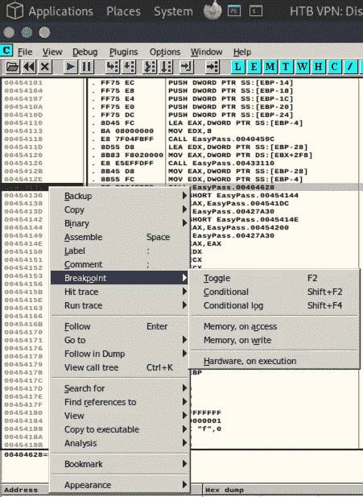

现在，如果你点击播放按钮运行程序，它将启动并要求你输入密码。但是，这一次不是检查密码是否正确，而是暂停，您将能够看到它与之比较的值。下图显示了我们输入的“test”和另一个值“fortran！”。

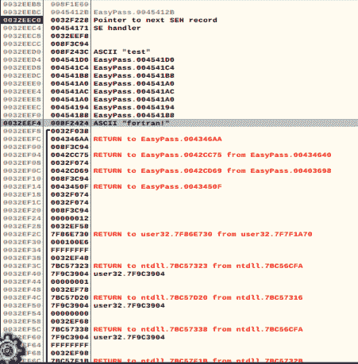

现在，如果我们使用 wine 再次运行该程序，我们可以输入密码来检查它是否正确，它是正确的。恭喜你完成了最简单的倒车挑战。不使用 Ghidra 可能有更简单的方法，但我想试试。

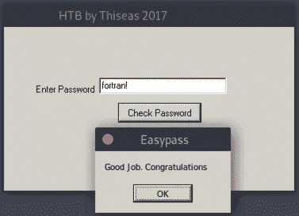

看看我的其他一些帖子，包括[原型](https://haxez.org/2021/09/hack-the-box-archetype-has-been-pwned/)、 [Oopsie](https://haxez.org/2021/09/hack-the-box-oopsie-has-been-pwned/) 、[疫苗](https://haxez.org/2021/09/hack-the-box-vaccine-has-been-pwned/)、[盾牌](https://haxez.org/2021/09/hack-the-box-shield-has-been-pwned/)、[探路者](https://haxez.org/2021/09/hack-the-box-pathfinder-has-been-pwned/)、[收录](https://haxez.org/2021/09/hack-the-box-included-has-been-pwned/)和[标记](https://haxez.org/2021/09/hack-the-box-markup-has-been-pwned/)。

*原载于 2021 年 9 月 16 日 https://haxez.org***。**