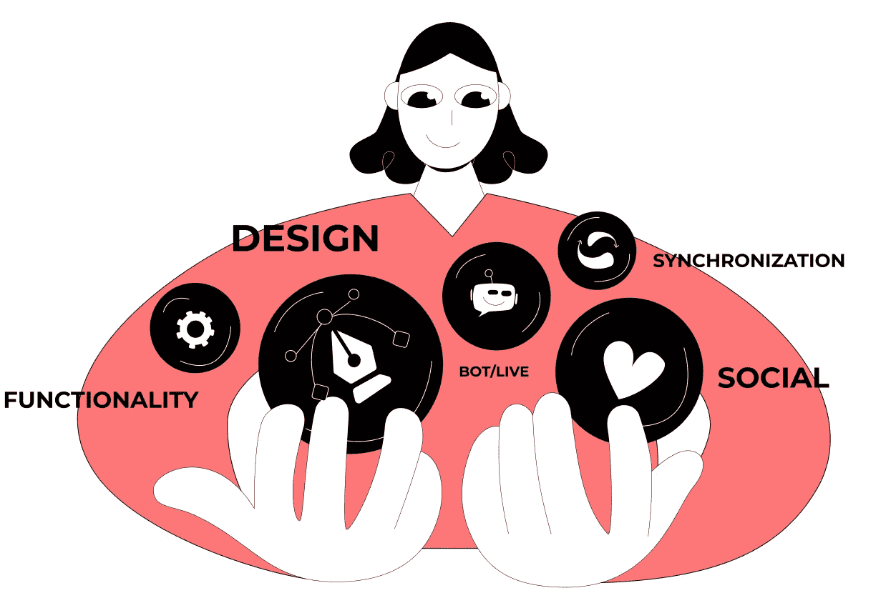
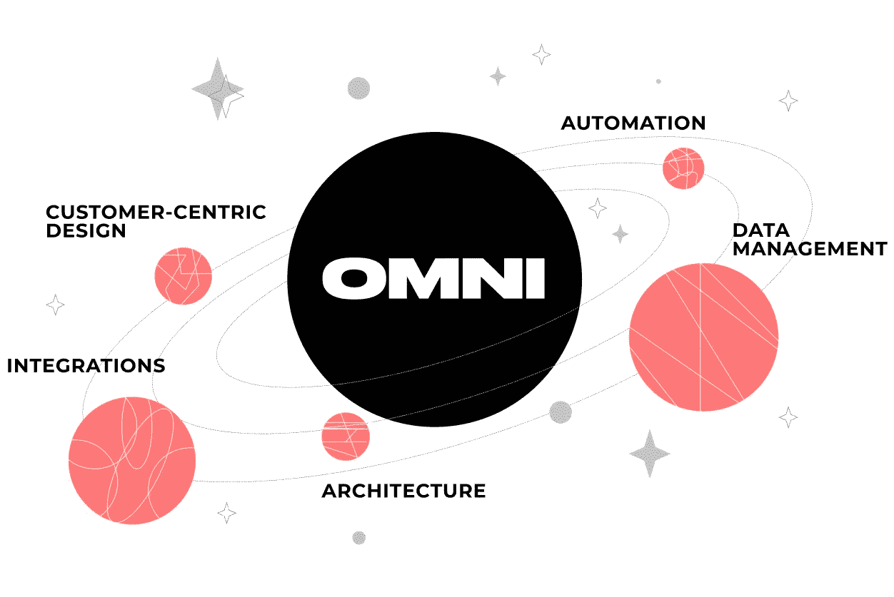

# 全渠道仍然是提升数字客户体验的一件大事

> 原文：<https://medium.com/geekculture/omnichannel-is-still-a-big-thing-in-elevating-digital-customer-experience-cfeca34dadb1?source=collection_archive---------10----------------------->

现代顾客的形象是什么？这是一个生活在高度互联世界的数字土著。他们没有耐心与数码产品进行复杂的互动。相反，他们期望通过最便捷的渠道快速获得他们想要的东西。如果你的品牌不能提供这一点，他们会退出并在其他地方获得想要的体验。一旦你失去了他们，很可能你就永远失去了他们。

如今，是顾客决定了他们喜欢在何时、何地以及如何消费商品，而不是品牌。另一方面，品牌的任务是跟上不断变化的需求，并确保每个接触点都有令人满意的数字客户体验。简而言之，该品牌必须提供 [CX 感知解决方案](https://cxdojo.com/about/approach)。

*做这件事的最好方法是什么？*

尽量模糊频道之间的界限。通过提供流畅愉快的互动，让顾客的旅程始终如一。无论他们选择什么平台购买，体验都应该是一样的——无论是移动应用程序还是以你的品牌经营的实体店。是时候将客户置于聚光灯下了！

# 什么是数字化客户体验？一个恰当的例子

以世界上最著名的娱乐公司迪斯尼为例。有谁不想走进魔法王国，重温无忧无虑的童年时光呢？

这正是迪斯尼想让你在进入他们的游乐园时感受到的。你不用担心纸质机票，现金，地图。迪士尼公园是一个线下和线上相遇的地方，他们是很棒的一对。

迪士尼允许游客使用他们的一体化移动应用程序。当我说“一体化”时，我是认真的。这个应用程序充当 1)公园景点的数字通行证；2)具有导航、等待时间和虚拟队列的个人指南；3)餐厅预订工具；甚至是你酒店房间的数字钥匙。基本上，一个单独的应用程序就是你从头到尾计划迪士尼乐园之旅所需要的。

*你应该向迪士尼学习什么？*

不要忽视你的[数字客户体验战略](https://cxdojo.com/the-power-of-customer-experience-design)。擦亮它。

只要设身处地为客户着想，试着走一走。这样你就会明白他们真正关心的是什么。一旦你发现顾客-品牌互动中的弱点，尽可能地优化它们。

# 多渠道与全渠道客户体验战略

顾名思义，多渠道战略规定使用多个平台向客户介绍您的产品。这里的关键是每个平台都作为一个独立的机制独立工作，以你的产品为核心。

这意味着每个渠道都是孤立的，依赖于一种独特的客户体验策略，这种策略对大多数访问者都很有效。通常，它会有自己的部门、库存、运输系统和支持团队。

那么什么是全渠道客户体验呢？另一方面，全渠道战略以跨多个平台的整体体验为中心。这意味着你的品牌连接了不同接触点的用户互动，维持了统一的客户旅程。

简单来说就是所有渠道互相融合。因此，客户可以开始在移动应用程序中选择产品，在网站上完成购买，并在附近的实体店领取订单，而不会在切换渠道时被丢弃。

让我们回到迪士尼的例子。

如果他们使用多渠道方法，客户体验组件(即实体公园、附属餐厅和酒店)将独立运行，彼此之间很少交互。他们的中心焦点将是在他们这边销售更多的商品和服务，而不是考虑如何改善客户体验并在所有这些渠道中加入它。

# 客户眼中的全渠道

今天， [67%的客户](https://www.financialexpress.com/brandwagon/why-omnichannel-presence-is-key-to-succeeding-in-todays-competitive-landscape/2301079/)使用多个渠道进行一笔交易。这转化为一个简单的事实:全渠道不再是一个可选的额外；这是数字客户体验的一个重要方面，作为一个额外的好处，它可以增加您的收入。加拿大自行车零售商 Primeau Velo 在实施全渠道战略击败竞争对手后获得了第一手信息。仅在一年内，Primeau Velo 就设法[将其销售额提高了 27%](https://business.adobe.com/blog/basics/omnichannel-marketing-guide) 。听起来很有希望，不是吗？

为了把一次性购买者变成品牌大使，你必须满足他们所有的期望，甚至超过他们。那么顾客对你的品牌有什么期待呢？

## 易接近

现代顾客很忙。这就是为什么他们从那些努力节省时间、更容易获得想要的价值的品牌那里购买。换句话说，顾客更喜欢能立即买到的产品。

他们希望一家公司出现在他们选择的所有平台上，即网站、移动应用程序、社交媒体，甚至是信使，他们可以在这些平台上无缝协作。

## 一致性

虽然客户一天多次在渠道之间跳转，但他们仍然希望一个品牌以同样的方式对待他们。这适用于品牌的信息、感觉和外观。这是全渠道客户体验的重要组成部分，不容错过。

每个品牌都有自己的身份——颜色、字体、图像、语调、声音等等。这些设计元素必须在展示品牌产品的所有平台上保持一致。更重要的是，客户还希望功能组件始终服务于相同的目的。

## 个性化

在全渠道世界中，客户是中心，因此交付的体验应该对他们有意义。顾客希望感受到品牌对他们的关心和关注。

通过同步客户数据，品牌可以建立真正统一的体验，因为它不会丢失所有接触点的客户交互上下文。支离破碎的沟通总是会带来令人沮丧的数字客户体验。

# 技术人员眼中的全渠道

数字化转型和客户体验相辅相成。因此，已经走上全渠道道路的企业应该意识到这一点。为了使所选择的策略按预期工作，您需要有合适的技术和流程。

一致体验的支柱是一个整体基础设施，它将所有渠道集成在一起，并将它们与支撑业务运营的系统同步。

## 体系结构

任何全渠道架构都有一个主要特征，那就是必须灵活。随着新的数字渠道的出现，你的公司应该有机会快速适应。为了保持数字客户体验的顺畅，架构组件必须易于扩展和集成所需的层，而不会破坏整体系统的性能。

传统的单片架构可以解决这个问题，但在一定程度上。当系统越来越慢的时候，就该转移重心了。通常，一个有效的选择是添加**微服务**。它们是无头的或者本质上是分离的。这允许将数据存储在一个中心位置，同时跨多个通道分发。

考虑在单个项目的环境中构建哪种架构是很重要的。没有适合所有全渠道项目的通用解决方案。一个提示是尽可能保持简单的架构。

## 综合

从根本上说，全渠道要求将业务关键层和面向客户的层合并到一个解决方案中。这两层通常由允许多个系统相互通信和共享数据的 API 联合起来。

这意味着 **API 层**将作为渠道之间的纽带，并确保互联的客户体验。此外，构建基于 API 的解决方案会更快，因为 API 可以直接访问集成系统的某些功能。所以，没有必要从头开始写每一段代码。

## 数据管理

数据是全渠道数字客户体验趋势的核心。作为一家数据驱动型企业，您必须将在不同系统内部和之间流动的信息汇集在一起，并以某种方式进行同步。

显而易见的解决办法是拥有一个单一的存储库，在那里存储关于客户、订单和库存的数据。你最好选择**云存储解决方案**，因为它易于扩展。

汇总的数据可以让您全方位了解客户的旅程，并在此基础上改进您的服务。然而，有一个重要的考虑。为了充分利用大数据并获得高质量的洞察，我建议您集成**数据分析工具**。

## 自动化

这与客户支持服务高度相关。提供全渠道客户体验，您的支持团队注定会看到来自各种来源的大量请求:web 表单、电子邮件、社交媒体、聊天消息、电话等。现场特工会应接不暇。虽然有些客户在等待回复时没有问题，但其他人可能会感到沮丧，因为他们希望立即得到服务。在这种情况下，自动化可以帮你一个忙。考虑引入机器人和**自助服务选项**。

此外，内部流程拖累您的业务绩效的情况并不少见。确保审核您的工作流程，找出薄弱环节，然后进行适当的优化。

## 以客户为中心的设计

你可以整合尽可能多的渠道，但是如果你的服务对客户不友好，你的全渠道战略就会失败。

您已经收集了大量关于客户行为的有意义的数据，是时候好好利用这些数据了。你的 CX 或 UX 设计师应该分析旅程地图的每个细节，并提供完美的用户体验，从头到尾解决你的客户面临的每个问题。不要忽视用户测试，因为它的结果会告诉你什么时候迭代，增加哪些功能。

# 从哪里开始？

首先从定义你的痛点开始，然后才考虑解决它们的方法。没有一个统一的解决方案适用于所有希望走全渠道道路的企业。这需要一种定制的方法。

尽管如此，我还是会试着给你一个提示，告诉你应该在哪些方面加强努力。这里有一份简短的问卷。

✔️:你的品牌可以通过各种渠道接触到吗？

✔️:你的品牌在这些渠道中有相同的外观和感觉吗？

✔️:当用户在频道间切换时，他们能从停止的地方继续他们的旅程吗？

✔️:你的团队能实时访问聚合的客户数据吗？

✔️:你的客户能得到快速的、适合他们特定需求的服务吗？

企业所有者通常与技术解决方案提供商合作，以实现更高的灵活性和服务性能。如果你觉得你也需要一个，我的公司 CXDojo 有很多专业知识可以分享。