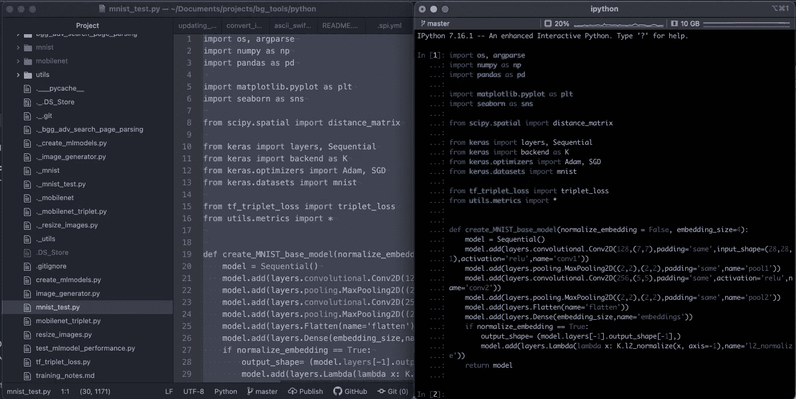
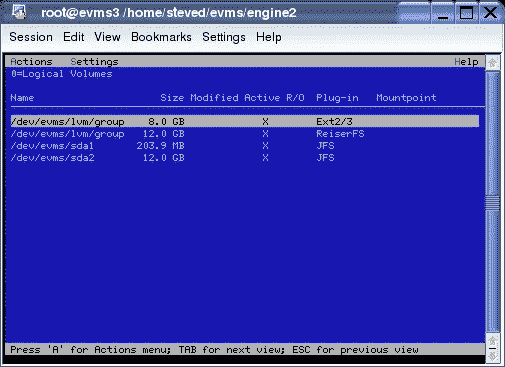
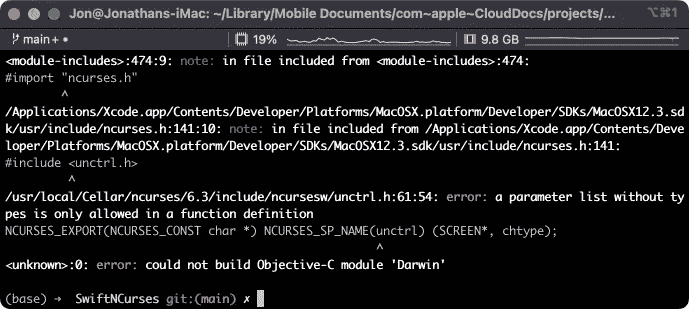
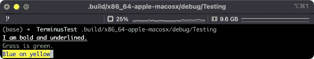
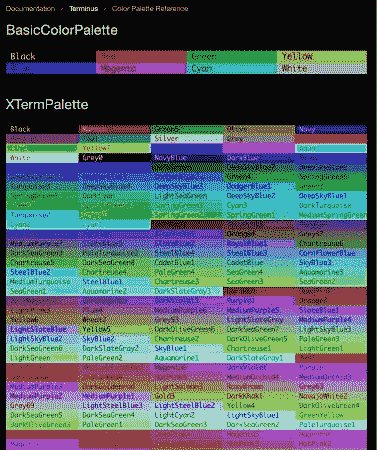
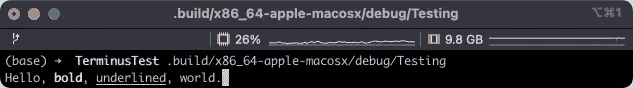
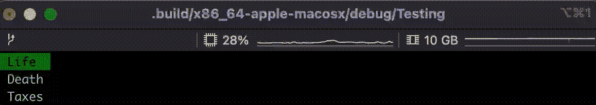
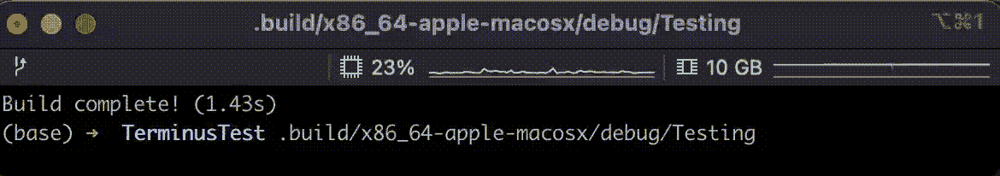

# Swift 中的命令行应用

> 原文：<https://medium.com/geekculture/on-command-line-applications-in-swift-41566574ab09?source=collection_archive---------12----------------------->

通向 Terminus 的蜿蜒小路，一个开源库。

在生物学中，像鳄鱼这样的动物有时被称为活化石，因为它们似乎与过去地质层中发现的标本没有什么变化。计算机技术有一些自己的活化石。终端，或者更可能是终端仿真器，就是这样一个例子。像 [VT100](https://en.wikipedia.org/wiki/VT100) 这样的 70 年代的终端是物理设备，有键盘、屏幕和有限的逻辑，可以使用共享计算机发送和接收命令。快进到 2022 年。终端仍然有大量的用途。基于云的服务、web 服务、远程工作和脚本是我想到的几个例子。今天，我想讲述一个开发者的故事，它涉及到在 Swift 中寻求命令行工具，与 ncurses 的史诗般的战斗，以及最终 Terminus 的开发，这是一个开源包，我希望你们中的一些读者会考虑尝试一下。

## Swift 命令行应用程序开发包

在完成生物医学信息学培训后，我大量使用了 shell 和 R、Python 等语言，通过学习 Swift，我又回到了苹果设备的编程上。我很快意识到 Swift 是一种令人惊叹的语言，我希望看到它成长为我可以在*所有*编程任务中使用的东西，而不仅仅是编写 iOS 和 Mac 应用程序。遗憾的是，在 Swift 中做其他事情的基础设施仍有许多需要完善的地方。我在我的上一篇文章中深入讨论了这一点，我在下面做了链接。

 [## 2022 年，Swift 将成为跨平台、通用编程语言

### Swift 会成为统治它们的语言吗？

medium.com](/geekculture/swift-as-a-cross-platform-general-purpose-programming-language-in-2022-d039f61b3a5c) 

我喜欢在数据科学领域做的许多事情(探索性数据分析、数据管理、机器学习等。)都发生在命令行上。当我的屏幕左边是一个脚本，右边是 iPython 时，我感觉就像在家里一样。

Example working environment

对于那些不熟悉的人来说，iPython 是一个交互式 Python shell，或运行在终端中的 REPL (read-evaluate-print-loop)。它提供了语法高亮、代码补全和一大堆其他漂亮的特性。我心想…你可以在 iPython 中用着色和编辑文本做这么多漂亮的事情，自动完成菜单系统真的很酷。我们在 Swift 中有什么可以让我们在终端中引人注目的东西？

在谷歌搜索了一下之后，我确实找到了一些有趣的命令行工具包。请随意阅读下面的列表:

*   [彩虹](https://github.com/onevcat/Rainbow)——一个漂亮的文本着色和样式包
*   [ANSITerminal](https://github.com/pakLebah/ANSITerminal) —提供文本颜色和样式、光标功能(移动、隐藏/显示、保存/恢复)、屏幕功能(清除屏幕、清除线条等)。)，以及键盘捕获(一次一个字符，没有内置行编辑器)。
*   [Swift 命令行工具](https://github.com/objecthub/swift-commandlinekit)——来自谷歌的马蒂亚斯·曾格。包括一个用于处理命令行参数、文本颜色和样式、单行和多行输入、文本完成和提示的系统。
*   [ConsolKit](https://github.com/vapor/console-kit) —来自 Vapor(Swift 中的后端 web 框架)的制造商。一个健壮的包，提供活动指示、参数处理(标志、选项等)。)、文本样式和颜色、日志等等。

所有这些包都提供了对文本颜色和样式的基本支持，而 ConsolKit 和 CommandLineKit 有很多高级特性。我遇到的问题是，我需要菜单、对在屏幕上移动光标的细粒度支持，以及对选择颜色的更好控制。这让我来到了著名的 ncurses C 图书馆。

## 我与 ncurses 的史诗般的战斗

对于那些不熟悉的人来说， [ncurses](http://ncurses library) 是一个 C 包，最初是在 80 年代早期编写的，用于在各种各样的终端上创建用户界面。成百上千的程序使用 ncurses 来创建文本用户界面(tui)。由于 Swift 与 C 配合得非常好，我认为围绕 ncurses 编写一个 Swift 包装器是一个好主意，它具有一些感兴趣的功能，如菜单。

Image from [https://linux.die.net/EVMSUG/ncurmigrate.html](https://linux.die.net/EVMSUG/ncurmigrate.html)

在大多数情况下，将 C 库并入 Swift 是一个相对容易的过程。您提供了一个模块映射，告诉编译器您的 C 库位于何处(在您的本地项目中还是在您的系统上),以及当您在包装文件中使用`import`时，您的模块的名称应该是什么。从那里开始，你可以用任何你喜欢的方式编写 C 库的包装器。我的计划是在我的包清单中使用 home brew(Linux 上的 apt ),并将我的包与系统安装的 ncurses 库链接起来，如下所示:

如果你在 Linux 系统上，一切都很好。事实上，我是从看这个项目开始的,[t 来自于那个做这个的皮肤学家。但这是我从 Mac 上的编译器那里收到的令人讨厌的消息:](https://github.com/TheCoderMerlin/Curses)

Build error compiling ncurses on MacOS

好吧 crud。原来 Darwin 模块引入了它自己的 ncurses 版本，该版本包含在 MacOS developer SDK 中！这意味着头文件已经被导入，我们正在尝试重新定义之前已经声明的内容。此外，MacOS SDK 中的 ncurses 版本在 5.8 版本中已经过时了，据我所知，这是 2011 年的版本。为什么？！我花了很多时间在 StackOverflow 上寻找解决方案，正当我准备在电脑上发飙时，我发现了一个[解决方案](https://stackoverflow.com/questions/56251835/swift-package-manager-unable-to-compile-ncurses-installed-through-homebrew)。简而言之，当运行 swift build 告诉编译器忽略所有 ncurses 头文件时，您可以通过`-Xcc -D__NCURSES_H`。这样的问题是，同样的问题也出现在 brew 安装的 ncurses 版本中…为了解决这个问题，您必须在本地复制所有的 ncurses 头，并用其他内容替换`__NCURSES_H`的实例。

长话短说，我终于得到了可以在 Mac 和 Linux 上编译和工作的东西，但是所有的头文件混乱会使维护变得非常痛苦，而且仍然有一个交易破坏者。任何对使用包装包感兴趣的用户都必须在他们自己的项目中包含那个`-Xcc -D__NCURSES_H` C 编译器标志。这会*不会*给开发者带来愉快的体验…所以我存档了这个项目，继续前进。安息吧。

## 终点

从那时起，我写了一个名为 Terminus 的纯粹基于 ANSI 的 Swift 包，现在我想与你们分享。

下面是演示如何用样式和颜色向终端写入的示例代码:

Text style and coloring output.

请注意，您可以在文本中添加任意数量的样式和/或颜色。可以使用 RGB 或使用内置调色板中的命名颜色来指定颜色，比如我在这里使用的 XTerm 调色板。该文档为每个调色板提供了一个可视化图表。

Color palette reference chart.

总站还支持`AttributedStrings.`

Using AttributedString

现在来看一些更有趣的东西。下面是一些制作菜单的代码。

Menu demo

最后但同样重要的是……使用一个采用文本突出显示的行编辑器。

Line editing demo

## **结论**

对于那些坚持到最后的人，谢谢你的阅读！Terminus 是一个新的包，但绝不是完整的。我正在积极寻找合作者来添加功能、修复 bug 等。如果你想试驾 Terminus，请查看 GitHub repo 。[文档](https://swiftpackageindex.com/jbadger3/Terminus/main/documentation/terminus)也可在 SwiftPackageIndex 上获得。最后，如果你喜欢这篇文章或者想提供一些支持，我们将不胜感激:)

*   跟我来。来吧…点击那个绿色的小按钮！
*   [订阅](https://jonathancbadger.medium.com/subscribe)当我写新东西时接收电子邮件。