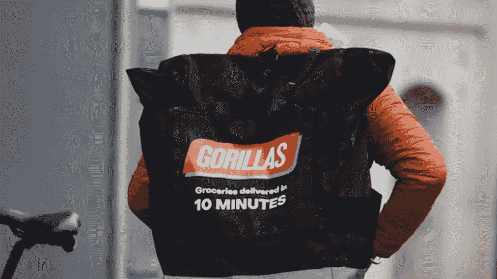

# 像大猩猩一样的按需杂货交付应用程序

> 原文：<https://medium.com/geekculture/on-demand-grocery-delivery-app-like-gorillas-ee12123bb7ab?source=collection_archive---------18----------------------->

每个人都渴望成为一名企业家，但创建一家符合你的激情并一次性解决消费者问题的企业，并不是每个人都能拥有的天赋。

你听说过**大猩猩**吗？(我知道名字很凶！).不，不是哺乳动物，而是领先的按需杂货交付市场。

如果你曾经梦想开始一项按需送货业务，这里是你的灵感来源——大猩猩的故事。

# 大猩猩是什么？

Gorillas 是一款按需杂货交付应用，承诺在 10 分钟内交付商品。⏲️

(那是一支胆大的舰队！)

杂货交付应用程序与暗店相连，以采购优质的杂货，并将其送到用户的家门口。

Gorillas Like App — WooberlyGrocery

# 大猩猩的利与弊——向它们学习什么？

了解创业的利弊总是有帮助的。让我们了解大猩猩，这样我们才能做出明智的决定。

# 赞成的意见

*   大猩猩对顾客的快速送货收取每次 2 美元的费用。
*   他们使用“黑暗杂货店”采购杂货，这意味着这些商店只接受提货和送货订单。
*   物流变得简单多了，因为送货伙伴只需从附近的黑暗商店提取杂货，然后送到顾客的卸货地点。

# 骗局

*   他们雇佣自己的送货伙伴。
*   一旦下了订单，就缺少客户支持。

# 按需杂货交付初创公司 Gorillas 是如何获得如此成功的？

大猩猩对送货的座右铭是“比你快”。他们的快速交付是他们疯狂快速成功的原因。

他们的送货伙伴会得到一辆自行车，而不是一辆汽车。大猩猩的创始人是一个狂热的自行车爱好者，据说他从土耳其骑到了中国。

他还认为自行车是最快、最有效的交通方式。说得对，它对大猩猩的成功贡献更大。

大猩猩在获得 3.354 亿美元的三轮融资后，已经拥有近 100 个仓库。他们称黑暗商店是一种储存 2000 多种杂货的微履行基础设施。

# 结论

大猩猩清楚地知道他们的客户需要什么——快速有效地送货上门。他们的成功和扩张速度是巨大的，因为疫情有助于他们的情况。

如果他们更多地关注员工和客户支持，他们的成功就不会只是短暂的增长，而是一个长期的旅程。

如果你想像大猩猩一样开始一项令人兴奋的商业冒险**——看看我们现成的按需杂货交付应用， [**WooberlyGrocery**](https://www.rentallscript.com/grocery-delivery-script/) 。**