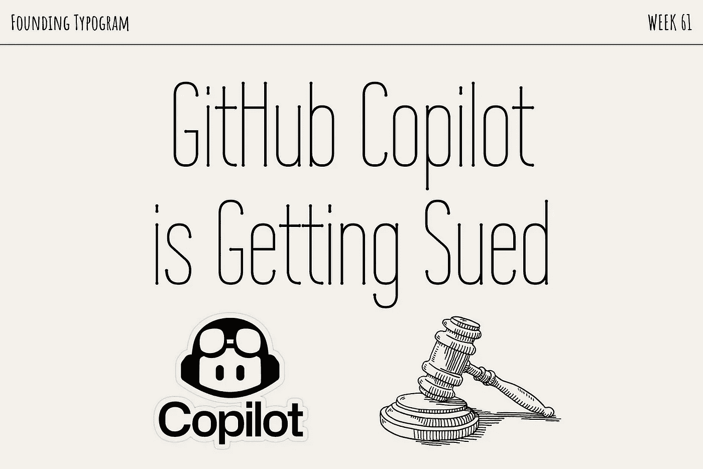
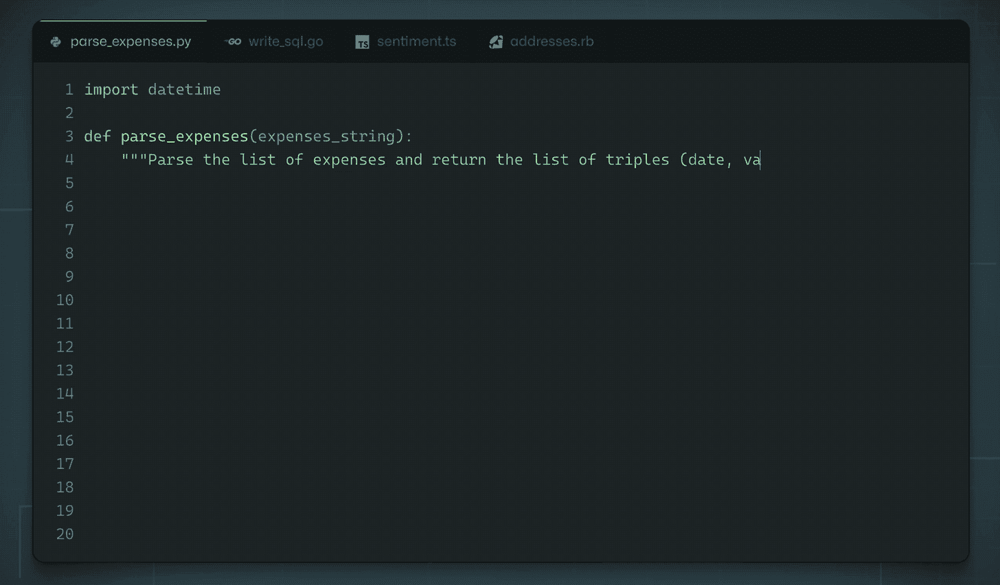
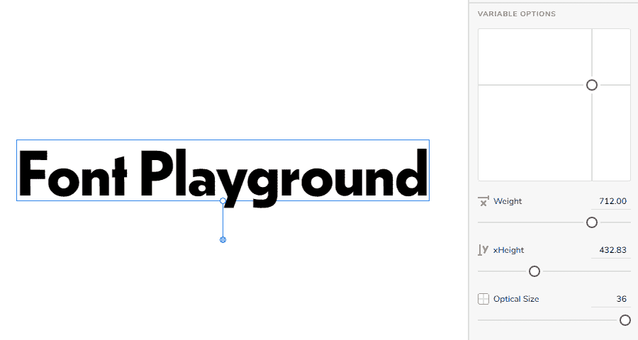

# 在 GitHub 上，Copilot 被起诉&开源软件

> 原文：<https://medium.com/geekculture/on-github-copilot-is-getting-sued-open-sourced-software-5e65aef379ca?source=collection_archive---------8----------------------->

我写过[类似 Tabnine 的](https://build.typogram.co/p/road-blocks-and-flowers) AI 编码助手。有趣的是，一个非常相似的竞争对手产品 GitHub Copilot 正在被起诉！这起诉讼的领头人不是别人，正是字体设计领域的一张熟悉的面孔[马修·巴特里克](https://matthewbutterick.com/)。

[GitHub Copilot litigation · Joseph Saveri Law Firm & Matthew Butterick](https://githubcopilotlitigation.com/)

退一步说，GitHub Copilot 是一个人工智能编码助手，它通过预测用户将要写的内容并提出建议来帮助用户编码。有时你只需要写下函数名，它会自动为你完成函数的其余部分！它运行得非常好，在 Twitter 上获得了很多称赞。

GitHub 声称 Copilot AI 是使用公共 GitHub repos i 到 ries 的代码训练的，但这些 GitHub 仓库的一些作者正在集体诉讼中起诉 GitHub，因为这种使用(使用他们的代码训练 AI)违反了他们项目的许可。这些公共资源库中的一些代码受许可证保护，需要注明作者的姓名。当 Copilot 向其用户提示代码建议时，不属于任何人，因此不符合使用许可的前提条件。

How GitHub Copilot works, image credit: [GitHub](https://github.com/features/copilot/)

这场诉讼让我想起了几年前发生在我身上的一个故事。事后看来，我当时的反应与我现在对这起诉讼的立场高度相关。

# 故事时间！

我做过一个名为[字体游乐场](https://play.typedetail.com/)的个人项目，围绕可变字体探索用户界面设计；我探索的 UI 创新之一是“2d 滑块”,它可以同时控制两个可变轴:

2d slider in [Font Playground](https://play.typedetail.com/)

我为了虚拟主机的目的在 GitHub 上发布了这个项目，但是没有添加任何许可信息。这个项目更像是一个设计项目，而不是一个编码项目，代码只是为网站运行而写的，不是为了重用，所以我没有添加任何典型的开源许可证。我对该项目的意图是传播和促进我的可变字体用户界面的设计思想。

一天，有人联系了我，他正在为谷歌字体做一个委托项目。他们正在开发一个字体工具，并想使用我在字体操场上的滑块模块。Google Fonts 希望我通过向我的项目添加一个开源许可证来授权使用。

我告诉他们，我欢迎他们在 Font Playground 中使用我的设计理念——我希望围绕可变字体的 UI 得到改善，该项目旨在促进更多人采纳我的设计理念。

我犹豫是否将开源许可添加到我的 GitHub repos i to ry 中，因为我并不打算重用我的代码——正确地维护一个开源项目需要时间和精力，并且我的代码不会被第三方审查；这只是为了保持网站字体操场运行，在前端呈现那些设计思想。

他们感兴趣的滑块代码与应用程序的其他部分交织在一起；它不像代码库那样可以很容易地剥离并移植到另一个项目中。我告诉他们可以随意钻研我的代码来研究它是如何实现的，并警告他们这不是一个简单的复制粘贴工作。他们将不得不使用从研究我的代码中获得的知识来从头开始编写代码组件。为了研究我的代码，我觉得没有必要通过添加开源许可证来授予许可——默认情况下他们是被允许这样做的。

我相信任何人都可以阅读任何代码，只要它是合法获得的，去研究如何完成一项工作，然后去做那项工作，而不需要请求允许去学习。许多人通过这种方式自学成为一名程序员，包括我自己。

和 GitHub Copilot 诉讼有什么关系？我在谷歌字体承包商和 GitHub Copilot 之间看到的唯一区别是，一个是人类，另一个是人工智能。其余的都是一样的:他们都研究公开共享的代码，获取知识，并使用这些知识来完成工作。如果一个人能做到，我认为人工智能也应该被允许。如果 GitHub 允许 Copilot 人工智能读取私有存储库，那将是错误的——那将是研究非法获得的代码。

与我目前的立场相反，我支持这场集体诉讼，不仅因为它是由一位印刷工同行(他也是一名律师，并撰写了《律师的印刷术》*)领导的，还因为我认为 AI 需要审查和监管。这场诉讼提供了一个讨论的机会，就像我刚刚在这篇文章中提到的那样。集体诉讼还有更多我在本文中没有讨论的论点。*

# *收到你的来信*

*许多灰色区域有待讨论，我的任何论点都不是断言。我把它写下来，作为组织我的想法和形成我的立场的一种方式。*

*我头脑中的一个灰色区域是重用代码的程度。研究某人的代码来学习如何编写 for 循环不同于复制粘贴整个代码组件和仅仅改变几个变量名。“学习代码并内化为知识来编写自己的代码”和“直接使用别人的代码”的界限在哪里？还有，如果有一天，有人在他们的代码编辑器中键入“2d-slider”，然后 GitHub Copilot 提示我的项目中完全相同的代码组件怎么办？我还会认为未经许可的合理使用吗？我欢迎更多的讨论。*

# *❧*

**张文婷致力于* [*Typogram*](https://typogram.co/) *，这是一款面向创始人和绝对设计初学者的下一代标志设计工具。如果你喜欢这篇文章，请订阅我们的***更新，分享我们的创业之旅！***