# 关于指针类型

> 原文：<https://medium.com/geekculture/on-pointer-types-f3fc92206b98?source=collection_archive---------44----------------------->

## 窥视引用语义

Photo by [Ron Lach](https://www.pexels.com/@ron-lach?utm_content=attributionCopyText&utm_medium=referral&utm_source=pexels) from [Pexels](https://www.pexels.com/photo/children-peeking-on-a-circular-window-8544496/?utm_content=attributionCopyText&utm_medium=referral&utm_source=pexels)

在本文中，我旨在介绍使用指针背后的概念和动机。有些 C++开发人员出于安全原因只使用智能指针，有些开发人员为了性能利益只使用原始指针，有些开发人员在提供最大利益时两者都使用。在本文中，我的目标是强调指针的用例，这样您就可以决定何时使用指针。

从概念上讲，指针是一种引用。也就是说，指针指的是作为入口点的某个内存块。为了访问内容或者修改指针的值，我们*去引用*它。许多语言都有类似指针的特性。我们关注的是 C 和 C++的上下文。请注意，所有的 C 函数在 C++中都是有效的，但反之则不然。因此，我们关于智能指针的部分只适用于 C++。

指针是实现引用语义的基本结构。指针对于命名另一个实体是很方便的，该实体由被引用实体的内容所属性化。一个指针可以访问和操作它被*指向*的实体的内容，考虑:

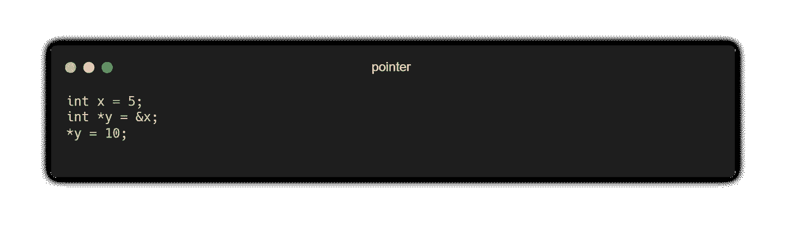

C 中引入指针的原因如下:

*   廉价的参数传递。
*   为堆上的新对象分配内存。
*   向函数传递函数引用。
*   迭代数据结构。

在 C++中也是如此。事实上，迭代器(用于 C++容器迭代的组件)类似于指针的接口。但是 C++提供了一组不同的模态来表达引用语义。我们将重点讨论称为智能指针的参考模态集。但在此之前，让我们通过列举原始指针的问题来提出使用智能指针的令人信服的理由。

# 原始指针

原始指针是属于某个内存块的低级类型。如前所述，指针是在内存的特定位置访问或修改值的入口点。

一些语言对指针类型有不同程度的限制。例如， [Ada](https://www.adacore.com/uploads_gems/03_safe_secure_ada_2005_safe_pointers.pdf) 将其指针类型的默认值初始化为 null，并对涉及指针的类型转换进行限制，主要是为了类型安全。而像 Java 这样的语言已经禁止使用低级指针类型来减少编程错误。

在指针的微妙阴影中蠕动。现在我们问 C 中指针类型是什么场景？

在像 C 和 C++这样的语言中，指针类型大量用于低级编程。指针类型的类型转换有不同程度的限制。在 C 语言中，`void *`类型被认为是原始指针类型，可以通过称为类型转换的操作将其变形为任何类型。

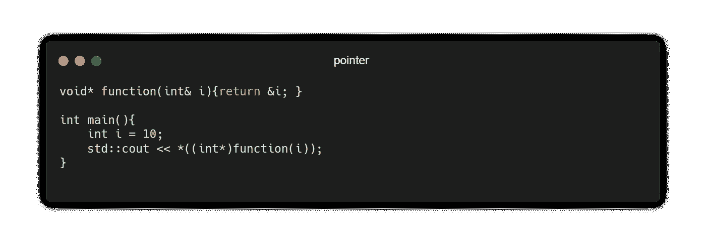

上面的代码片段演示了一个`void *`类型可以被转换成一个`int *`，或者*任何一个*类型。虽然在上面的例子中不明显，但是这对于抽象来说是有用的，这是我们在这里不讨论的问题。

原始指针是更抽象的引用概念的具体实现。与 Ada 不同，C/C++中的原始指针不在 null 值中初始化，尽管它们可以引用 null，这是使用原始指针的一种更安全的方式:如果没有用引用对象的地址初始化，就用`nullptr`(在 C++中)和`NULL`(在 C 中)初始化它。这背后的原因是为了实现定义良好的行为，并避免很难修复的错误，更不用说找到了。

原始指针不会强加任何东西，因此误用或滥用它是很容易犯的。

## 悬空问题:

让我们考虑一个可能会遇到悬空指针问题的例子。让我们看看在 C++中使用`new`和`delete`函数以及在 C 中使用`malloc` ( `calloc`)或`free`来分配和释放资源。

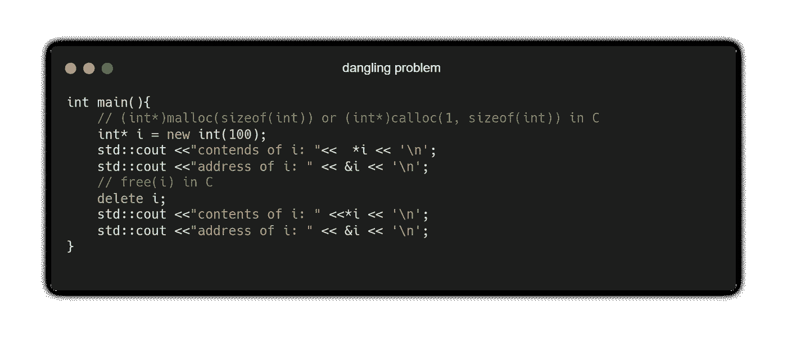

注意`delete`或`free`功能仅*移除*实体的内容，在本例中为`i`。也就是说，解引用`i`仍然返回`i`被删除前的内存位置。这是有问题的，因为它可能引入未定义的行为:取消对已经释放的内存的引用是危险的。为了解决这个问题，我们必须确保`i`引用内存中一个明确定义的位置，因此我们在删除`i`的内容后放置`i = nullptr`(在 C++中)和`i = NULL`(在 C 中)以避免严重错误。

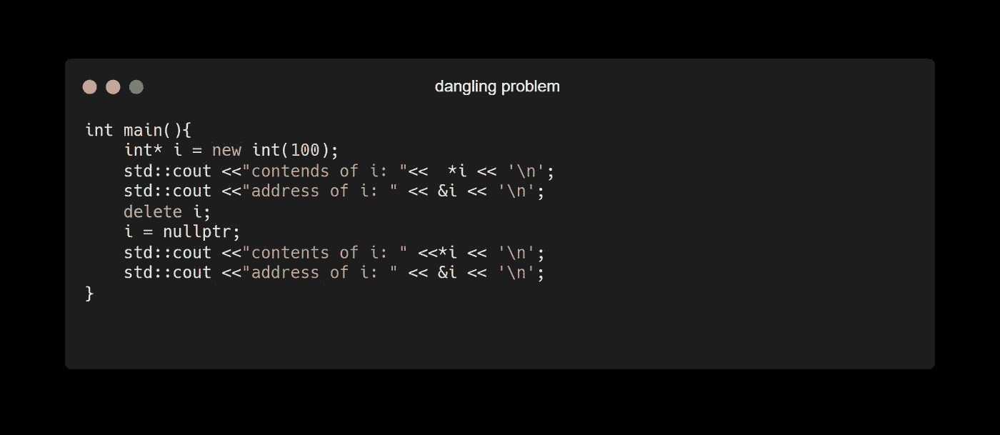

另一个问题是确定拥有指针，这会导致严重的问题，从资源泄漏、未定义的行为到安全漏洞。哪个指针负责哪个实体？很难跟踪多个引用并确保在作用域的末尾正确管理这些引用。必须有一个明确的表达式来确定所属指针。正因为如此，C++引入了一个围绕着 [RAII](https://docs.microsoft.com/en-us/cpp/cpp/object-lifetime-and-resource-management-modern-cpp?view=msvc-160) 思想的引用管理系统。

# 智能指针

来自 [C++标准](http://isocpp.github.io/CppCoreGuidelines/CppCoreGuidelines#???):

> 实施终生安全配置可消除泄漏。当与 RAII 提供的资源安全相结合时，它消除了对“垃圾收集”的需要(通过不生成垃圾)。将这一点与类型和边界配置文件的强制结合起来，就可以获得完全的类型和资源安全，由工具来保证。

C++引入了一组用于自动资源管理的类，性能损失极小甚至为零。使用这些指针集有以下好处:

*   表达所有权的清晰性
*   保证资源不会泄漏

在适当的时候，我们应该使用智能指针来清楚地表达我们的意图，我们希望在指针和它所引用的实体之间建立一种所有权。我们有三个智能指针:`std::unique_ptr<T>`、`std::shared_ptr<T>`和`std::weak_ptr<T>`。我们可以在`<memory>`头文件中访问这些设备。

让我们浏览一下，看看这些参考模式能提供什么。为了演示，让我们考虑一个名为`Entity`的类，定义为:

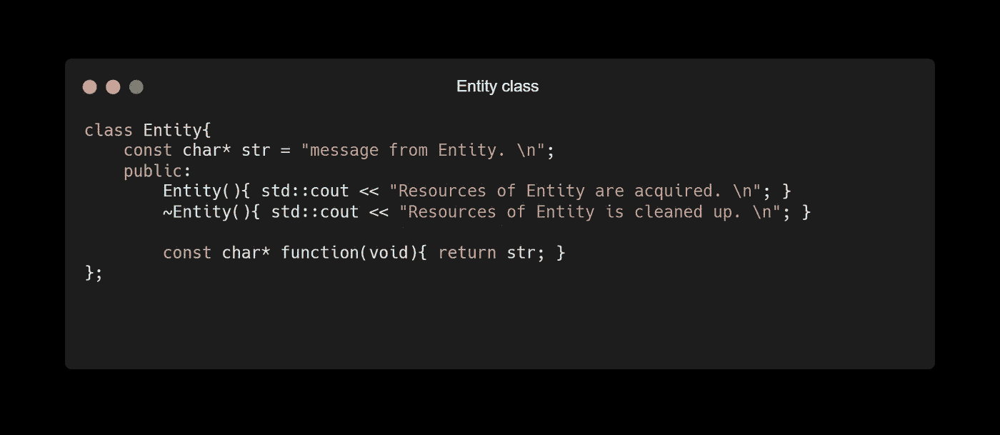

## 唯一指针

唯一指针保持只有一个指针负责内存中的给定资源。拥有指针负责清理和资源管理。

让我们定义一个`Entity`的实例。

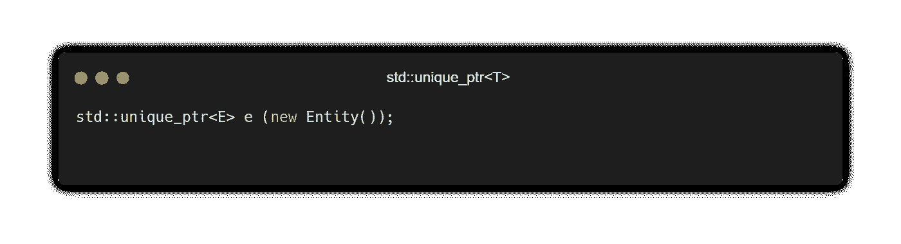

现在，让我们考虑通过引用和 move 构造函数来传递指针，看看它对销毁`Entity`的位置的影响。通过引用传递惟一指针意味着惟一指针被扩展到一个函数，因此在惟一指针超出声明它的主函数的作用域之后，就要进行清理。

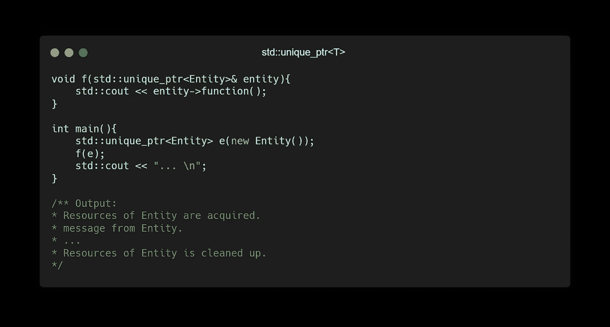

用 move 构造函数传递唯一指针就是将所有权转移给函数`f()`中定义的唯一指针。我们可以注意到运行以下代码片段后的行为:

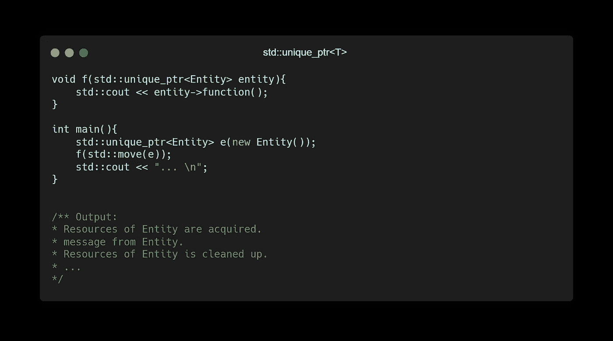

因为我们将`e`的所有权转移给了`entity`，所以实体一退出函数就进行了清理。

## 共享指针

共享指针有一个称为引用计数的附加机制，它跟踪请求共享资源的指针。每当另一个指针请求共享资源时，引用计数器就加 1，每当它超出范围时就减 1。当引用计数为 0 时，它要求清除。我们可以通过下面的代码片段来观察这种机制:

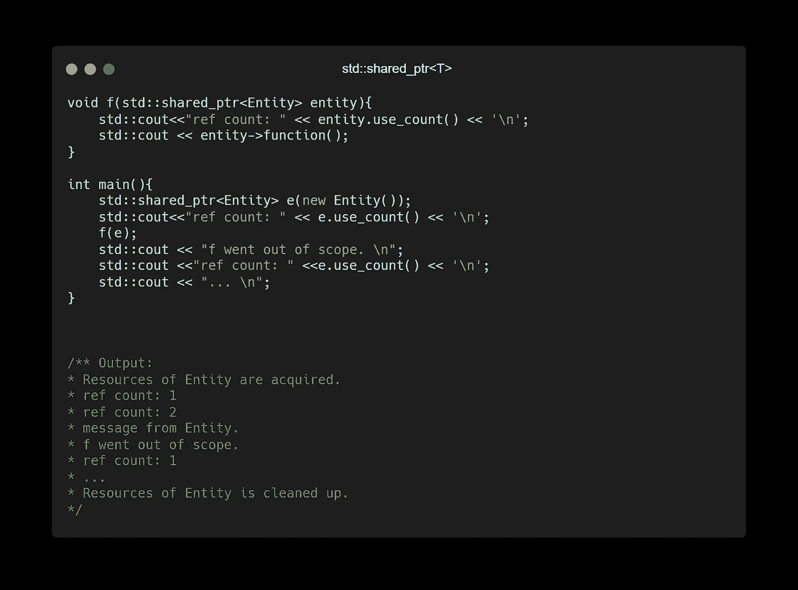

当我第一次遇到这种情况时，我认为这就是我所需要的，唯一指针和共享指针就是它的全部。直到我遇到了这个叫做循环引用的问题，共享引用带来了麻烦。通过形成导致资源泄漏的循环引用的循环，有可能破坏共享指针的保证。

Photo by [Jeremy Perkins](https://unsplash.com/@jeremyperkins?utm_source=medium&utm_medium=referral) on [Unsplash](https://unsplash.com?utm_source=medium&utm_medium=referral)

## 循环引用问题

循环引用的形式是 A→B，B→A。让我们把它写成代码。

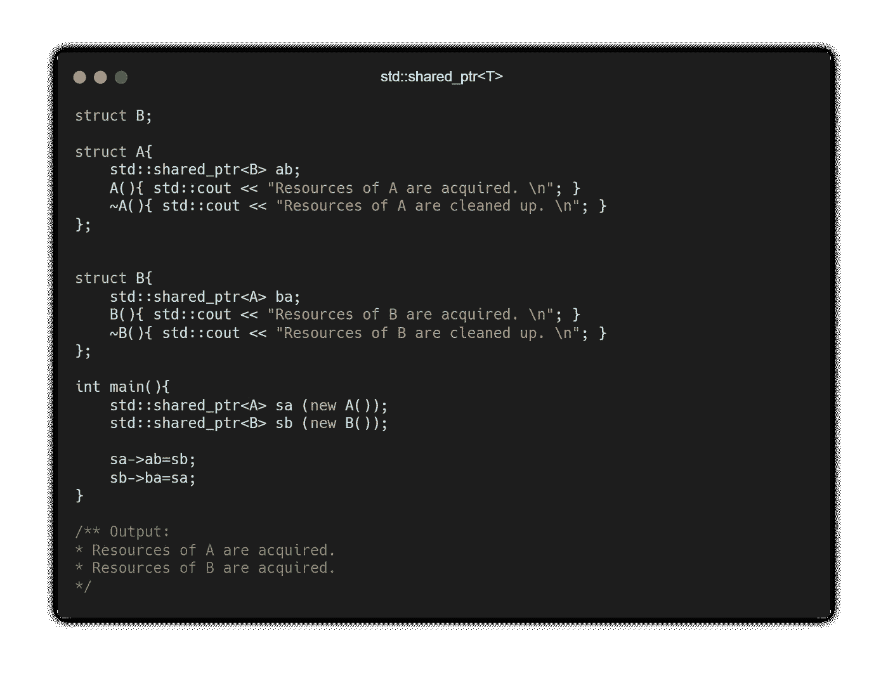

因为 A→B and B→A，引用计数永远不会被解析为零——这是`std::shared_ptr<T>`进行清理的条件。我们可以通过`use_count()`功能观察引用计数。让我们修改主函数:

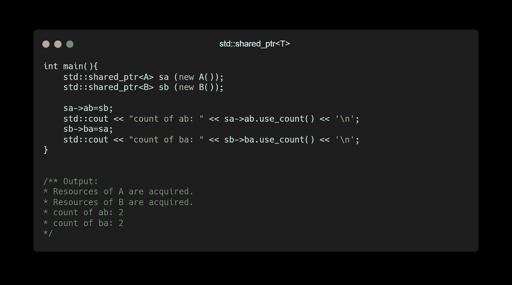

> 我们如何打破诅咒？引入弱指针。

## 弱指针

弱指针是一种特殊类型的指针，与共享指针结合使用。使用弱指针，您可以在不增加引用计数的情况下访问共享指针的内容。这有助于观察共享资源的内容，尤其是解决循环引用的问题。

让我们通过弱指针来解决循环引用的问题。这可以通过修改`A::ab`或`B::ba`指针来实现。

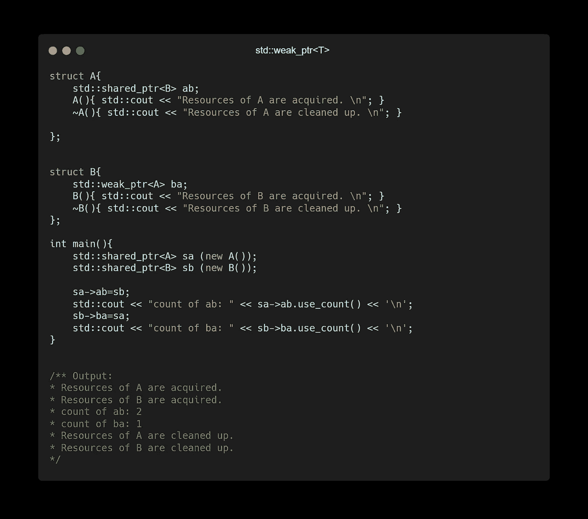

# 摘要

按照他们的设计哲学[零开销原则](https://bit.ly/2VMyrka)，C++默认不使用自动引用管理。通过使用标准库中定义的智能指针，可以在 C++中实现自动引用管理。它给你资源保证和安全。其他语言如 [Swift](https://bit.ly/3s9LNTI) 和 [Rust](https://bit.ly/2U8hlwM) 都坚持了同样的理念，没有制作复杂的垃圾收集器，它们根本不产生任何垃圾。这个内存管理模型是使用智能指针的一个非常有说服力的例子。但原始指针至今仍有其最辉煌的时刻。

对于性能关键的循环，或者当范围足够清楚以确定哪一个是给定资源的拥有指针时，最好使用指针。原始指针给你带来的性能好处很少，但是它伴随着手动跟踪指针的代价，资源安全成为你的责任。

更喜欢使用智能指针来清楚地表达所有权。智能指针为您提供了资源保证，使您摆脱了任务，从而确保不会有泄漏。

[标准](http://isocpp.github.io/CppCoreGuidelines/CppCoreGuidelines#???)建议如下:

*   看指针:把它们分为非拥有者(默认)和拥有者。在可行的情况下，用标准库资源句柄替换所有者(如上例所示)。或者，使用 [GSL](http://isocpp.github.io/CppCoreGuidelines/CppCoreGuidelines#S-gsl) 中的所有者来标记所有者。
*   寻找裸体的`new`和`delete`
*   寻找返回原始指针的已知资源分配函数(例如`fopen`、`malloc`和`strdup`)

# 参考

1.  巴恩斯，J. (2005 年)。安全指针。AdaCore。检索自:[adacore.com/uploads_gems/03_safe_secure_ada](https://www.adacore.com/uploads_gems/03_safe_secure_ada_2005_safe_pointers.pdf)…
2.  《计算机爱好者》(2017)。为什么 C 这么有影响力？检索自:[youtube.com/watch?v=ci1PJexnfNE](https://www.youtube.com/watch?v=ci1PJexnfNE)。
3.  微软文档(2020)。原始指针(C++)。
4.  微软文档(2020)。智能指针(现代 C++)。
5.  微软文档(2019)。对象生存期和资源管理(RAII)。
6.  Stroustrup，b .和 Sutter，H. (2021 年)。C++核心指南。检索自:[isocpp.github.io/CppCoreGuidelines/CppCoreG..](http://isocpp.github.io/CppCoreGuidelines/CppCoreGuidelines#)？？？
7.  Stroustrup，B. (2013 年)。C++编程语言。皮尔森教育。

*最初发布于:*[*https://dcode . hashnode . dev*](https://dcode.hashnode.dev/on-pointer-types-peeking-at-reference-semantics)