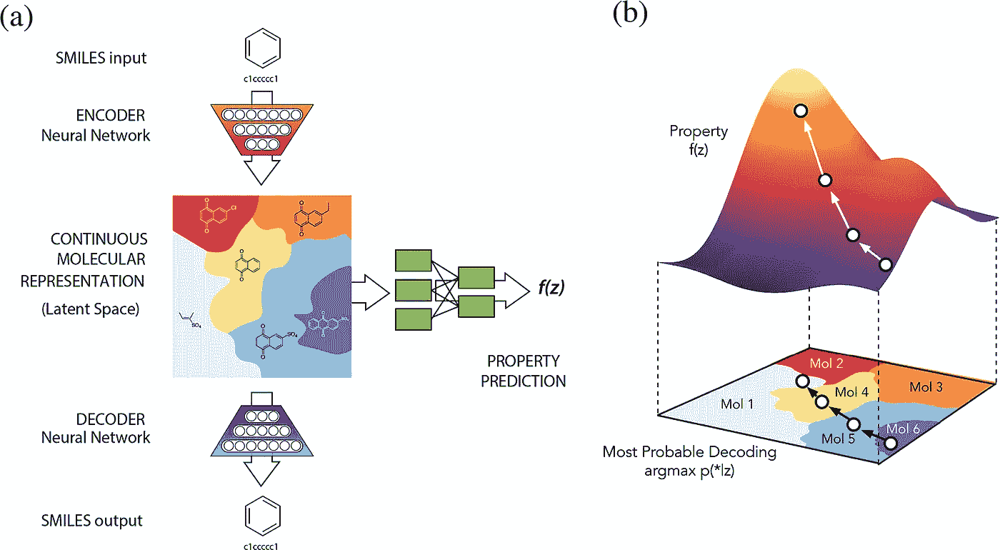
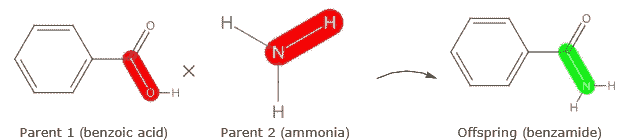
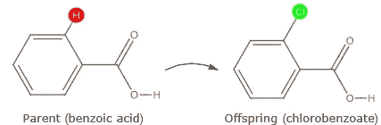
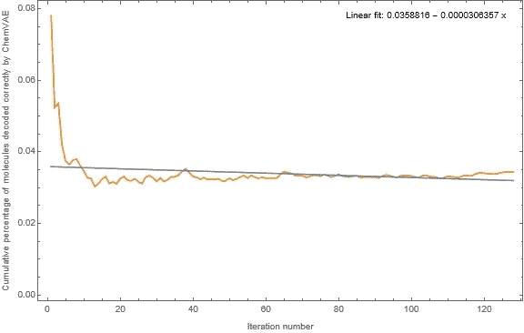
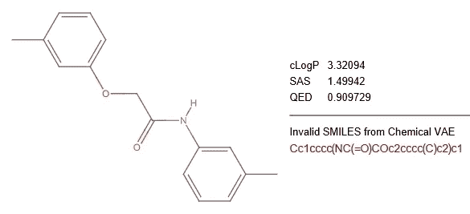

# 化学空间连续表象的缺点

> 原文：<https://medium.com/geekculture/on-the-shortcomings-of-continuous-representations-of-chemical-space-4b1d5054be8b?source=collection_archive---------13----------------------->

# 介绍

该论文(Gomez-Bombarelli 等人，2018 年)介绍了化学 VAE，并为(Zhavoronkov 等人，2019 年)中描述的 GENTRL 模型提供了核心探索技术，在其导言中包含了一些斯塔克主张。我们在此引用一段摘录:

“……计算分子设计受到用于探索化学空间的搜索策略的限制。当前的方法要么彻底搜索固定的库，要么使用离散的局部搜索方法，如遗传算法或类似的离散插值技术……化合物的遗传生成需要人工指定突变和交叉规则的试探法。*离散优化方法难以有效搜索大面积的化学空间，因为不可能用梯度引导搜索*。

引文中的重点是我们的。在这篇文章中，我们在 Norachem 表明，这些过分的断言经不起推敲。特别是，我们演示了以下内容:

**权利要求 1** 。离散遗传操作可以进入化学空间的区域，这些区域位于化学 VAE 潜在空间的视界之外。

**权利要求 2** 。大的、非结构化的和高维的化学空间向下投射到较低维的潜在空间导致不可接受的信息和结构多样性的损失。

但首先，接下来的讨论需要一些背景知识。

# 基于梯度的化学 VAE 搜索

我们从化学 VAE 的基于梯度的方法的简要描述开始，其细节可以在原始论文中找到。本文中的图 1 提供了一个很好的概述，如下所示:

Figure 1 from (Gomez-Bombarelli et al., 2018): An overview of the approach taken by Chemical VAE

图 1(a)示出了分子的规范 SMILES 表示被转换成高维独热向量，该向量然后被编码器向下映射到较低维的潜在空间。这个潜在空间是基于三个分子特性共同训练的:cLogP、合成可及性得分(SAS)和药物相似性的定量估计(QED)。潜在空间中的每个点通过函数 *f* 对应于这些属性的有序三元组值。

图 1(b)说明了如何使用梯度下降来搜索潜在空间中具有最佳分子性质组合的点。当找到一个最佳点时，它被解码器转换成一个高维的独热向量。这个向量然后被转换成一个规范的 SMILES 字符串。

图 1(b)也预示了这种特殊的分子设计计算方法的固有局限性。不言而喻，只有当一个分子的解码被认为是一个等价的化学结构时，它才能被认为存在于潜在空间中。通过这种基于梯度的搜索方法，任何不能被正确解码的分子必然是不可接近的。因此，除非解码器是潜在空间在所有类似药物的化学空间上的满射，否则将会有一大类——通常是非常大的——分子用这种特殊的搜索方法保持不可见。

但是化学 VAE 的解码器显然不是满射。这当然是个问题。符合任何运动设计目标的最佳分子几乎肯定位于看不见的部分，因为潜在空间代表了药物样化学空间中非常薄的一部分。关于这一点，我们将在本文后面有更多的论述。

# 离散遗传搜索

离散遗传方法操纵分子的原始图论复杂性，而不把它们投射到更简单的线性形式。这种分子的忠实表示允许任何化学结构的重建，从而使该方法接近潜在的所有类药物化学空间。(Gomez-Bombarelli 等人，2018 年)的作者批评了“人工指定突变和交叉规则的启发式规则”的必要性我们将证明，一个简单的随机方法，没有任何复杂的启发，产生优秀的分子，不能被化学 VAE 解码。

分子遗传创造的简单随机方法可能具有以下两个操作符:

算子 1 ( ***随机交叉算子*** )。给定两个亲代分子，随机交叉算子通过在随机选择的位置组合亲代来产生子代，如图 2 所示:

Figure 2: Randomised crossover operation

在左边的母体分子中，红色突出显示的键是一种可能的随机选择。右边绿色的键表示一种可能的方式，通过这种方式，来自双亲的合成片段可以结合形成后代。

算子 2 ( ***随机变异算子*** )。给定一个父分子，随机突变算子通过用另一个原子替换父分子中随机选择的原子来产生子代，如图 3 所示:

Figure 3: Randomised mutation operation

在左边的母体分子中，红色的氢原子被随机选择，并被绿色的氯原子取代——这本身就是一种随机选择——从而形成了右边的后代。

注意，上图中的两个操作符很容易定义和实现。他们不需要繁琐或复杂的手工制作的规则。

有了这些离散的操作符，我们就可以在类似药物的化学空间中寻找具有上述三种特性的分子:cLogP、SAS 和 QED。当我们进行搜索时，我们可以记录下遇到的分子中被化学 VAE 正确解码的部分。得到的序列将为我们提供两种搜索方法所扫描的化学空间的相对大小的良好比较。

# 两种搜索方法的比较

我们的计算实验从一组 150 个分子开始，这些分子是从 250，000 个分子的同一集合中随机均匀采样的，化学 VAE 就是在这些分子上训练的——这确保了诺拉切姆在模拟开始之前不会对类似药物的化学空间有更大的看法。然后，我们对 Norachem 的生成设计进行了 128 次迭代，目标是生产出具有三种感兴趣特性的最佳组合的分子。

在模拟过程中，随机操作者构建并评估了许多不同的分子结构。对于每次迭代，我们计算从化学 VAE 的潜在空间中正确解码的结构数量，如下所述:

对于我们在离散搜索中构建的每个新分子，化学 VAE 的解码器返回一个可能解码的规范微笑字符串列表。如果下列情况之一为真，则认为分子 *m* 已被正确解码:

1.  在 *m* 的规范微笑表示和化学 VAE 返回的规范微笑字符串之一之间存在精确匹配，或者
2.  化学 VAE 返回的一个规范微笑字符串代表了一个分子，其图形结构与 *m* 的图形结构同构。

后一种情况确保了微笑表征中的微小差异不会掩盖分子的潜在结构等价性。前一种检查被包括在内，因为它进行起来更便宜。

这一计算产生了一个序列，为通过化学 VAE 发现的离散生成的结构的数量建立了一个上限。正确解码结构的累积百分比与迭代次数的关系如图 4 所示:

Figure 4: The percentage of the discrete search molecules that are visible to Chemical VAE

第一次迭代中大约有 8%的分子被正确解码。随着迭代的进行，这个数字迅速下降，然后稳定在 3.5%左右，这意味着通过离散搜索方法构建和评估的分子中有 96.5%无法通过化学 VAE 获得！ ***这为权利要求 1*** 提供了鲜明的论证。

即使采用“愚蠢”的随机策略，离散操作者也可以扫描化学 VAE 无法到达的类似药物的化学空间区域。当我们使用 Norachem 的人工智能为给定的练习构造接近最优的启发式算子时，这种差异就变得更大了。

当我们比较这两种方法时，必须记住的一个观察结果是，随着迭代次数的增加，化学 VAE 的趋势一直很低。Norachem 的生成设计在每次迭代中都创造出越来越好的分子，因此上面的图 4 生动地表明了一个令人不安的事实，即基于梯度的化学 VAE 搜索未能在设计的后期阶段看到大多数好分子。

图 5 显示了一个这样的好分子，它被化学 VAE 未能解码的离散算子发现:

Figure 5: A sample good molecule that cannot be decoded by Chemical VAE

这种分子对所有感兴趣的性质都有极好的价值。然而，它对化学 VAE 仍然是不可见的，正如返回的标准微笑无效这一事实所证明的那样。

我们已经证明，离散算符可以发现化学 VAE 不能发现的分子。但是反过来可能吗？化学 VAE 能找到离散算符不能表示的分子吗？

答案是绝对的*不*！这一点已经在离散遗传搜索一节中提出来了。通过非常简单的规定，离散操作者可以重建任何类似药物的分子——尤其是那些可逆向合成的分子。换句话说，这些离散算子扫描的化学区域是由化学 VAE 的潜在空间所表示的区域的适当超集。

# 依赖 VAEs 进行药物设计的一些后果

在引言中，我们说明了变分自动编码器方法形成了 GENTRL(生成张量强化学习)的核心探索技术，gen TRL 是 Insilico Medicine 的主要深度学习模型。

潜在空间连续性的一个重要结果是，梯度下降算子在达到最小值之前遇到各种分子结构的概率非常低。这反过来使得支架跳跃不太可能，并导致与已知文献相差不远的分子推荐——这是一种不理想的情况。 ***这是权利要求 2* 的依据**。

权利要求 2 的实质内容得到了以下事实的证实:( Zhavoronkov 等人，2019 年)的原始出版物很快受到了批评，如(Walters 和 Murcko，2020 年),其中批评者指出 GENTRL 的最佳化合物的行为是其与已知 DDR1 激酶抑制剂结构相似的明显结果。在(Zhavoronkov 和 Aspuru-Guzik，2020 年)中，作者试图回应这些批评——我们认为不充分——同时承认 GENTRL 的化合物缺乏优化。

诺拉切姆的生成设计是唯一适合回答(Zhavoronkov 等人，2020 年)和随后的评论提出的挑战。我们将 Norachem 和 GENTRL 之间的详细比较分析推迟到以后的文章中。

# 结论

主要结论是，基于梯度的方法是搜索巨大和无结构的药物样化学空间的次优方式。任何试图将几乎无限的化学空间向下投射到有限维度的连续表示的尝试都将导致信息的丢失并导致劣质候选药物。

Norachem 的生成式设计克服了基于梯度的方法的局限性，它不局限于连续表示，并使用人工智能来优化搜索化学空间不同区域的试探法。

# 参考

Gomez-Bombarelli，r .，Wei，J. N .，Duvenaud .，Hernandez-洛巴托，J. M .，Sanchez-Lengeling，b .，Sheberla，d .，Aguilera-iparaguirre，j .，Hirzel，T. D .，Adams，R. P .，Aspuru-Guzik，A. (2018)。使用数据驱动的连续分子表示进行自动化学设计。ACS Cent。Sci。4 (2)，268–276

Zhavoronkov，a .，Ivanenkov，Y. A .，Aliper，a .，Veselov，M. S .，Aladinskiy，V. A .，Aladinskaya，A. V .，Terentiev，V. A .，Polykovskiy，D. A .，Kuznetsov，M. D .，Asadulaev，a .，Volkov，y .，Zholus，a .，Shayakhmetov，R. R .，Zhebrak，a .，Minaeva，L. I .，Zagribelnyy，B. A .，Lee，l 深度学习能够快速识别有效的 DDR1 激酶抑制剂。*自然生物技术 37* ，1038–1040

沃尔特斯，W.P .，穆尔科，M. (2020)。评估生殖人工智能对药物化学的影响。*纳特生物技术公司 38* ，143-145 页。DOI:10.1038/s 41587–020–0418–2

扎沃龙科夫(2020)。回复‘评估生殖 AI 对药物化学的影响’。*自然新闻，自然出版集团*。[www.nature.com/articles/s41587-020-0417-3](http://www.nature.com/articles/s41587-020-0417-3)