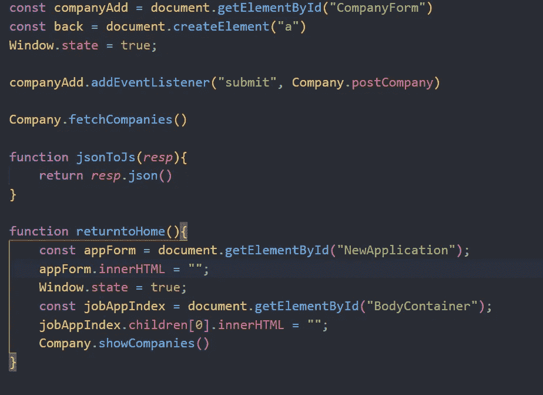
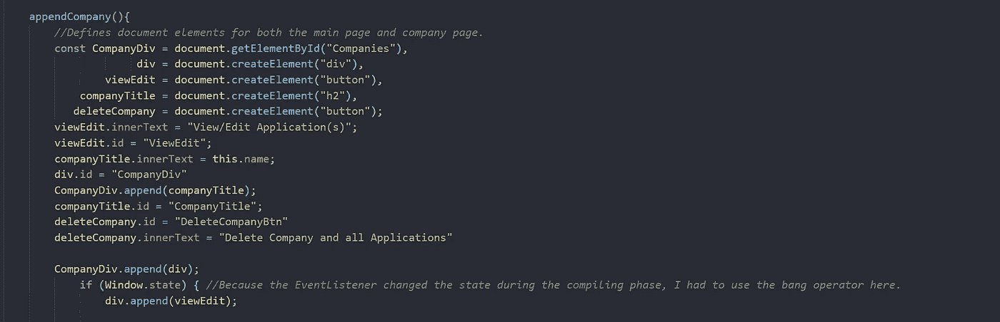
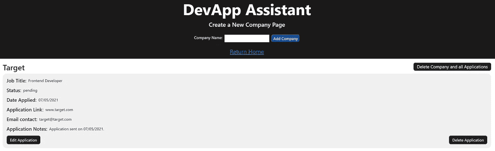

# JavaScript 中“状态”的有用性

> 原文：<https://medium.com/geekculture/on-the-usefulness-of-state-in-javascript-9142aa995e45?source=collection_archive---------9----------------------->

什么是“状态？”怎么有用？我自己的状态怎么样？实际上……忽略最后一个问题。

毫不夸张地说，我是成千上万条鱼中的一条，经受着为期六个月的全职编码训练营带来的身体和心理上的混乱。

刚刚完成了五个项目中的第四个，我可以诚实地说，我自己的“状态”从未如此…不稳定。

然而，我很幸运，最近和一个比我更熟悉 JavaScript 内部工作原理的朋友交谈过。当我告诉他我对某些 DOM 元素出现在不应该出现的地方有问题时，他告诉了我一个众所周知的秘密，那就是“状态”的力量。

我不会，也不知道这一点，因为这个特定的项目是使用普通 JavaScript 构建的，在我们的课程中，我们甚至还没有触及 REACT 的皮毛。不管怎样…回到我遇到的问题，以及他是如何帮我找到解决方案的。

我的问题很简单。我有几个按钮，当用户单击主页上的一个按钮时，我不想让它们显示出来，将它们带到一个包含与给定公司相关的应用程序列表的新页面。不用说，我不知道如何在不在 DOM 上显式“隐藏”这些元素的情况下隐藏它们，这对于这个特定的项目是不允许的。

但是，当我向我的朋友提出这个问题时，他很快就问我是否利用“状态”来决定某些 DOM 元素是否出现在页面上。

他开始解释设置和操作“状态”的力量，作为一种指示哪些元素出现在给定页面上的方式。

在我的例子中，我只需要在程序顶部将窗口状态设置为“true”作为初始值，然后用每个相关函数手动调整该状态，以显示我想要显示的元素。

这个特别的项目是一个应用程序，旨在帮助我毕业后找工作。它将跟踪我在任何给定时间的所有应用程序，在主页上呈现我想要看到的所有应用程序，在每个公司页面上呈现公司特定的应用程序。

上面，您可以看到我的 index.js 文件将窗口的状态设置为“true”这被用作基线，当我在应用程序中调用越来越多的函数时，可以对其进行操作。

我使用 state 的最重要的地方是呈现每个公司的页面，该页面列出了与该公司相关的每个应用程序。在主页上，我希望用户能够单击一个显示“查看/编辑应用程序”的按钮，但是由于我在整个程序中重用了附加到 DOM 的公司方法，所以我必须找到一种方法，使每个公司的页面都不显示编辑/查看按钮。所以我最终在为每个公司渲染公司页面时，手动将 Window.state 设置为“false”(见下文)。

当窗口设置为 true 时，下面是包含每个公司及其应用程序的主页…

如您所见，查看/编辑应用程序按钮清晰可见。但是当我将 Window.state 设置为“false”并加载特定公司的页面时…

您可以看到目标公司的页面(在本例中是 target)显示了所有相关的应用程序，但是没有显示 view/edit application 按钮。这没有多大意义，因为我们已经在允许我们查看和编辑公司应用程序的页面上了。

我在这里想说的是，国家的力量永远不应该被忽视，即使是在使用普通 JavaScript 的时候。在定制您希望用户能够看到和操作的 DOM 元素方面，它是一个非常强大的工具。

我确信，随着我们深入 REACT，在未来几周内我将会看到更多这样的内容，但是我确实体会到了在构建漂亮的、响应性强的 JavaScript 应用程序时，状态是多么重要。

不管怎样…是时候让我自己的状态休息一下了。帮自己一个忙，尝试一下 JavaScript 中的“状态”概念。相信我，当谈到动态和简单的 DOM 操作时，这样做会将您的 JavaScript 应用程序提升到一个新的水平。