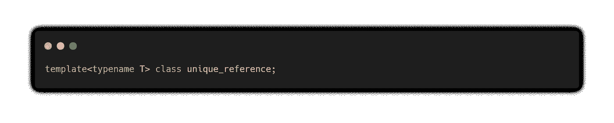
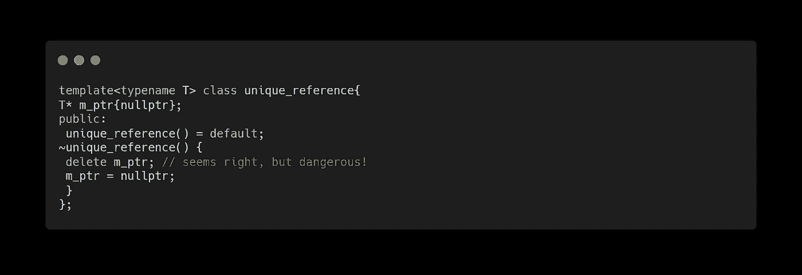
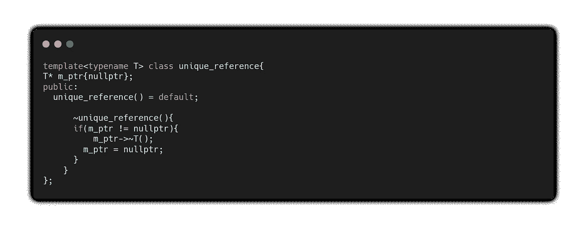
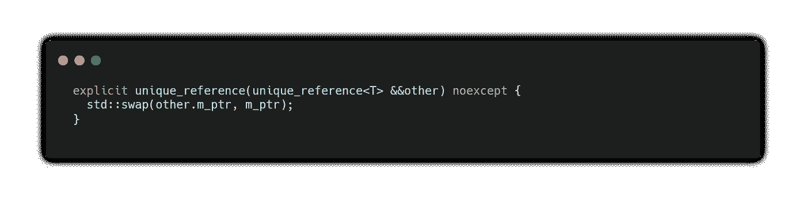
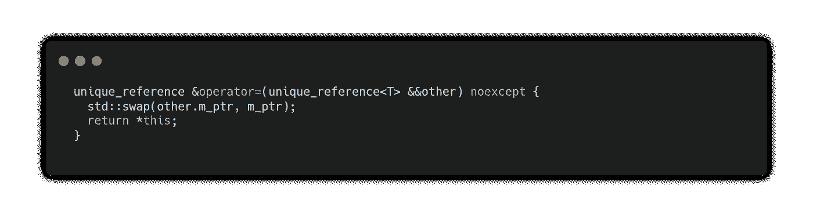
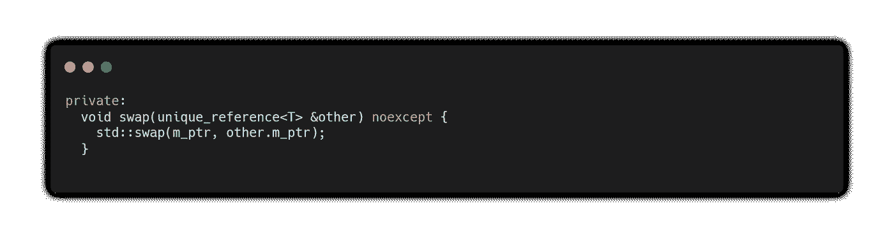
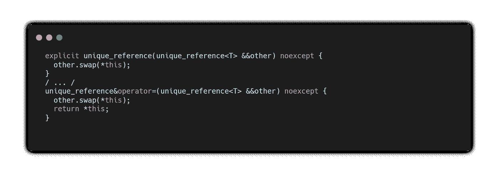
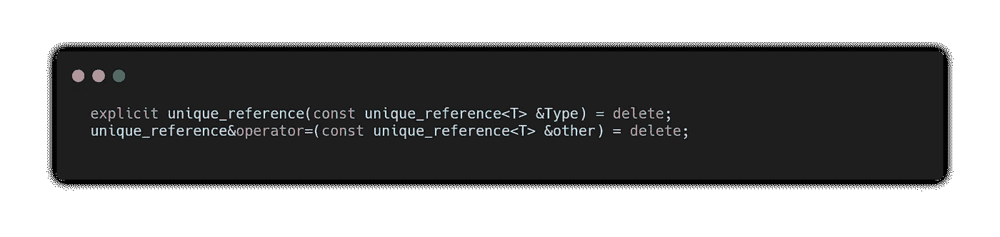
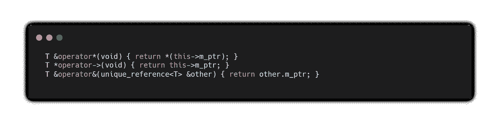

# C++中唯一引用的编写

> 原文：<https://medium.com/geekculture/on-writing-unique-reference-in-c-def51120bfdb?source=collection_archive---------28----------------------->

## 实现引用语义的构建块:唯一引用

Photo from Pexels.

我们之前的讨论探讨了 C 和 C++中指针类型的剖析，并暗示了引用语义的细微差别。我们讨论了现代 C++中原始指针和智能指针的用例，并发现在自动资源管理和手动资源管理之间的选择是有适当程度的。更具体地说，我们介绍了`std::unique_ptr<T>`并演示了它的一些功能。

本文讨论了`std::unique_ptr<T>`的设计目标和实现。然而，我们没有讨论在不同的 C++编译器发行版中 STL 实现的复杂性，而是简化它来表达一个唯一引用的设计目标。

在本文的最后，我们开发了另一个理解层，即唯一引用的功能，并实现了我们的版本。

# 独特参考的设计目标

让我们列出实现我们的唯一引用版本必须满足的要求。我们的实现必须满足以下条件。

*   必须接受任何类型
*   自动资源管理
*   保持唯一性
*   类似指针的界面

我们的简单版本的`std::unique_ptr<T>`需要用它引用的对象显式初始化。

# 履行

让我们通过逐一满足我们的设计需求来构建我们的实现。

## 要求:必须接受任何类型

我们从最简单的需求开始，它必须采用任何类型。我们只需在我们的类型(类)中添加一个模板参数就可以满足这个需求。

就是这样！我们满足了第一个要求。

## 需求:自动资源管理

这是进来的 C++抽象机制的优雅解决方案:答案是 [*资源获取是初始化*](https://en.wikipedia.org/wiki/Resource_acquisition_is_initialization) 或者 RAII。

RAII 提供了关于我们类的状态的保证。资源管理与对象生命周期中的类不变性联系在一起。这是通过负责初始化和清理资源的对象构造函数和析构函数来实现的。

当初始化`unique_reference`的实例时，构造函数被触发——这就是为什么在其他语言中，如 [Python](https://docs.python.org/3/c-api/init_config.html) 和 [Swift](https://docs.swift.org/swift-book/LanguageGuide/Initialization.html) ，这些被称为*初始化器*。同时，当`unique_reference`的实例超出范围时，析构函数被触发。它们共同满足了我们对自动资源管理的需求，为我们提供了保证资源管理的确定性行为。我们的引用管理的确定性行为提供了优于实现垃圾收集器的特性，垃圾收集器在对象超出范围时可能会也可能不会清理一块资源。

看来我们很好地管理了我们的资源。我们在构造时初始化了指向`nullptr`的指针，并通过删除`m_ptr`的内容来取消初始化。然而，有一个微妙的麻烦，我们仍然可能泄漏我们的资源，即使在设置`m_ptr = nullptr`之后。编译器不会就此警告你，但你是在搬起石头砸自己的脚。

为了解决这个问题，我们需要重新思考我们的心智模式。当我们的对象超出范围时，我们想要销毁该对象，不一定要突然删除它们。所以我们称这个对象的析构函数为`~T()`。

*注意，没有原语等用户提供的析构函数的类型被标记为* [*琐碎析构函数*](https://en.cppreference.com/w/cpp/language/destructor) ，这就是为什么`~T()`对[原语](https://en.cppreference.com/w/cpp/language/types)有效。

我们做得很好。让我们继续前进！

## 要求:维护唯一性属性

为此，我们希望我们的唯一引用能够在需要时在函数或类内部转移其所有权。通过实现转移机制，我们需要维护唯一性的属性。我们通过合并[移动语义](https://bityl.co/8Fgd)来做到这一点。启用可移动所有权有两个部分，我们唯一的参考是:移动可构造的，和移动可分配的。

让我们首先使用可移动的构造函数。

让我们看看上面的代码片段实际上在说什么。首先，我们需要将构造函数标记为`explicit`，以避免[意外的隐式转换](https://stackoverflow.com/questions/121162/what-does-the-explicit-keyword-mean)。然后我们使用 [*右值引用*](https://bityl.co/8G2V) 作为我们的参数，它将我们的类标记为可移动构造的。但是在我们处理 move 构造之前，我们必须保证在构造时不会抛出异常，所以我们标记了我们的`noexcept`说明符。

我们的函数体实现起来非常简单。我们想获取 move-from 引用(`other`)的所有资源，并将其与移入对象(`this`)交换。也就是说，第二个需求(move assignable)实现起来同样微不足道。我们只需要重载赋值操作符。

我们本质上是在重复我们的赋值函数和构造函数的主体，所以为了一致性，让我们实现一个小的 helper 函数，我们私下声明它负责交换对象。

实际上，这会导致:

因为我们正在讨论构造函数和赋值操作符，所以应该注意一下如何抑制它们以及为什么要抑制它们。我们想要抑制构造函数的原因有两个:我们想要明确地提到我们不希望发生这种情况，我们想要编译器检查用户是否试图访问这样的模态。

为此，我们只需编写:

这里，我们取消了复制赋值和复制构造，因为复制违背了独特性的含义。

## 要求:类似指针的界面

我们需要一个接口来与唯一引用的状态进行通信。为了一致性，它必须类似于指针的接口。

回想一下，指针可以用`*`和`->`操作符去引用。我们需要`&`操作符来检查我们的指针在内存中的位置。这些是我们需要重载的基本运算符，用于我们的唯一引用。为此，我们写道:

让我们走过这三条线。

第一行返回一个对`*(this->m_ptr)`的引用，这意味着`m_ptr`的内容是我们可以修改和读取的。同样的想法也适用于箭头操作符，我们返回一个指向`m_ptr`在内存中的位置的指针。最后一个操作符略有不同，它返回指针的地址，而不是引用对象的地址。[回想一下](https://dcode.hashnode.dev/pointers-and-references-design-goals-and-use-cases)，指针在内存中有自己的位置，与它所指向的实体是分开的。

# 将所有这些放在一起:

# 测试案例

是时候看看我们是否满足设计要求了:

 [## 唯一引用

### delvinjohn 的一个 C++ repl

replit.com](https://replit.com/@delvinjohn/UniqueReference#unique_reference.h) 

> 我还不确定 repl.it 嵌入是否在你那端有效。如果这在你那边无法实现，请告诉我。

# 摘要

我们充实了我们的设计需求，并实现了我们的唯一引用版本，以满足我们对唯一引用的预期。经过测试，我们发现它充分地完成了我们想要它做的事情:我们现在拥有了自动化资源管理的第一部分！

因为我们实现了一个简单的唯一引用类，试着想想我们如何扩展这个类数组接口作为你的家庭作业。自己完成这一部分给了你重新思考我们用`unique_reference`做了什么的空间。

祝你黑客愉快！

# 参考

-维基百科贡献者。(2021 年 5 月 21 日)。资源获取是初始化。在维基百科，免费的百科全书。从[https://en.wikipedia.org/w/index.php?检索到 2021 年 8 月 17 日 07:06title = Resource _ acquisition _ is _ initial ization&oldid = 1024395395](https://en.wikipedia.org/w/index.php?title=Resource_acquisition_is_initialization&oldid=1024395395)。

- Python (2021)。Python 初始化配置参考手册。[https://docs.python.org/3/c-api/init_config.html](https://docs.python.org/3/c-api/init_config.html)。

——斯威夫特(2021)。Swift 语言指南。[https://docs . swift . org/swift-book/language guide/initial ization . html](https://docs.swift.org/swift-book/LanguageGuide/Initialization.html)。

cppreference.com(2021 年)。析构函数。[https://en.cppreference.com/w/cpp/language/destructor](https://en.cppreference.com/w/cpp/language/destructor)

cppreference.com(2021 年)。基本类型。https://en.cppreference.com/w/cpp/language/types。

- StackOverflow (2010 年)。什么是移动语义？[https://stack overflow . com/questions/3106110/what-is-move-semantics](https://stackoverflow.com/questions/3106110/what-is-move-semantics)。

- StackOverflow (2009 年)。explicit 关键字是什么意思？[https://stack overflow . com/questions/121162/what-the-explicit-keyword-mean](https://stackoverflow.com/questions/121162/what-does-the-explicit-keyword-mean)。

-三角形(2019)。C++右值引用和移动语义，适合初学者。[https://www . internal pointers . com/post/c-r value-references-and-move-semantics-初学者](https://www.internalpointers.com/post/c-rvalue-references-and-move-semantics-beginners)。

-阿米亚娜 d(2021)。指针和参考:设计目标和用例。https://dcode . hash node . dev/pointers-and-references-design-goals-and-use-cases。