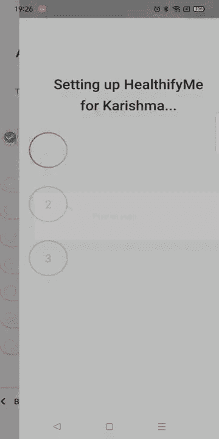
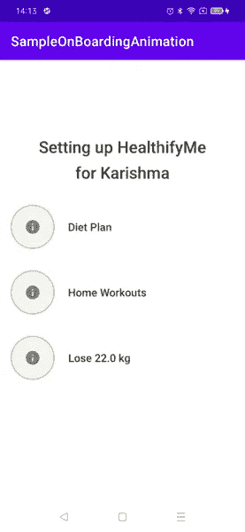
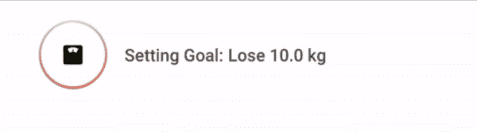

# HealthifyMe 上的入职动画

> 原文：<https://medium.com/geekculture/onboarding-animation-at-healthifyme-2b7cef661408?source=collection_archive---------11----------------------->



Onboarding completion animation in HealthifyMe app

我们 healthify 专注于提供最适合用户的计划。为了做到这一点，在入职时，我们会问用户几个问题，涉及他们的年龄、体重，以及他们是否进行任何体育锻炼或是否受过任何伤害？完成所有回答后，我们会显示一个入职完成屏幕，其中有一些动画，如您在上面的视频中所见。我们专注于用户互动，让我们的应用程序更加用户友好。

今天在这篇文章中，我们将学习如何实现这一点。

**步骤 1:** 在你的项目中添加一些基本的库和 Glide 来加载图标图像。

```
implementation 'com.github.bumptech.glide:glide:4.11.0'
implementation 'com.google.code.gson:gson:2.8.6'
```

**第二步:**设计屏幕。



这里是初始屏幕，我们有一个标题文本，然后是设置用户计划的 3 个步骤。

我们可以通过在一个新文件中创建图标来使它们可重复使用。图像周围有一个进度条。进度条有三个阶段。

a)违约。
b)中间。
c)完成。

下面是图标布局的代码。

`*#layout_loading_progress_with_icon_ and_text.xml*`

`*#activity_main.xml*`

**第三步:**在图标内部初始设置 1，2，3，取数据。

```
fl_progress_1.tv_ob_loading.*text* = 1.toString()
fl_progress_2.tv_ob_loading.*text* = 2.toString()
fl_progress_3.tv_ob_loading.*text* = 3.toString()
```

从 API 中获取我们想要在屏幕上显示的数据。例如，我正在获取一个样本 JSON。

将 Json 转换成 gson 并存储在类名`OnboardingUiDataModel`中

在 setUpUi 方法中传递 json 数据。

```
private fun setupUi(data: OnboardingUiDataModel?, animate: Boolean = true) {
}
```

从 JSON 数据设置屏幕标题。

**步骤 4** :设置加载状态



1.  这里，我们首先将文本视图隐藏在显示步数的图标内。

```
view.tv_ob_loading.*text* = ""
```

2.然后通过`AccelerateDecelerateInterpolator`改变进度条可绘制并旋转。

```
private val interpolator = AccelerateDecelerateInterpolator()view.iv_ob_loading.animate().alpha(1f).setDuration(if (animate) 1000 else 0)
    .setInterpolator(interpolator).start()
```

3.通过任何图像库设置 imageView。我们在这里使用 Glide。

```
val iconRes = icon?.iconRes ?: 0
if (iconRes != 0)
    view.iv_ob_loading.setImageResource(iconRes)
else
    BaseImageLoader.loadImage(this, icon?.icon, view.iv_ob_loading)
```

`loadImage()`是通过 glide 在传递的 imageView 中加载 imageUrl 的方法。

4.通过*不确定的可绘制改变进度条的可绘制状态。*

```
val pbObLoading = view.pb_ob_loading
val bounds = pbObLoading.*indeterminateDrawable*.copyBounds()
progressDrawable?.*bounds* = bounds
progressFinalDrawable?.*bounds* = bounds
pbObLoading.*indeterminateDrawable* = progressDrawable
```

5.动画文本，设置文本内容和动画，同时显示在屏幕上。

```
text1.*visibility* = View.*VISIBLE* text1.*text* = icon?.loadingText
text1.animate().alpha(1f).setDuration(if (animate) 1100 else 0)
    .setInterpolator(interpolator).start()
text2.*visibility* = View.*VISIBLE* text2.*text* = icon?.finalText
text2.animate().alpha(1f).setDuration(if (animate) 1100 else 0)
    .setInterpolator(interpolator).start()
```

这个文本布局包含两个 textView。一是加载文本，二是最终文本。600 毫秒后，我们将删除加载文本，并在加载图标旁边移动最终文本，并将进度条更改为最终可绘制。

动画结束后，我们将第一个动画和第二个动画结合起来，所以一切都按顺序进行。

点击查看 setupLoadingStart()方法[的完整代码。](https://gist.github.com/karishmaagr/40d59f40837e92394cbd7a39f249a72b)

**第五步:**设置所有三种状态的加载动画。

```
private fun setupLoadingStart(
    view: View, //included progress bar view in main xml
    icon: Icon?, //icon  data
    text1: TextView,
    text2: TextView,
    animate: Boolean = true,
    combine: (() -> Unit)? = null // next animation
)
```

所以对于`combine`参数，我们将在第一个动画参数中传递第二个加载动画，在第二个动画结束中传递第三个加载动画。

现在，当第三个动画结束时，我们将展示您可以在下面看到的结束动画。

**第六步:**结束动画，水平向上移动图标，隐藏标题。


隐藏现有布局中的文本。

克隆一个包含新结尾布局的新布局。

用新布局更改`cl_ob_loading`约束集，并使用以下代码显示过渡。

点击查看主活动[的完整代码。](https://gist.github.com/karishmaagr/3951280e309f1b06595ab1c09fee97e8)

太棒了。我们做到了。

制作酷炫动画的基本就是把它分成块，一步一步实现。总是阅读市场上的新东西，所以也许你试图用旧方法实现的东西很复杂，但是新东西用更少的代码就更容易。

# 提高代码质量的事情

1.  我用 XML 对值进行了硬编码，只是为了把它写在一个文件中。但是你从来不这样做，总是使用 diff 资源文件来访问它，所以你可以在多个地方重用它，也可以很容易地进行更改。
2.  基本的业务逻辑可以有测试。
3.  您也可以编写 UI 测试。
4.  不要把所有的动画代码都放在主活动中，而是使用抽象。我们做到了。

有没有其他想法实现同一个动画哪个更好？除此之外，你还能如何解决 UI 组件可重用性和代码优化的问题？如果有，请在评论区与我们分享。你也可以在 karishma.agr1996@gmail.com 给我回信。如果您有任何疑问，同样的 也适用。

感谢您的阅读。👏我希望这篇文章对你有所帮助。非常感谢你的鼓掌帮助其他人找到这篇文章😃。

