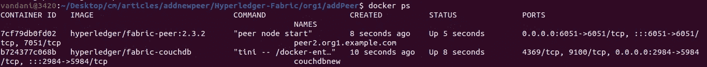
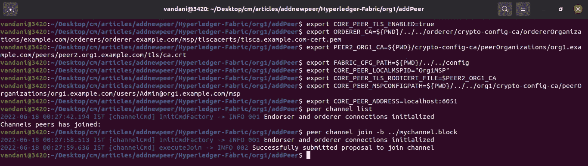
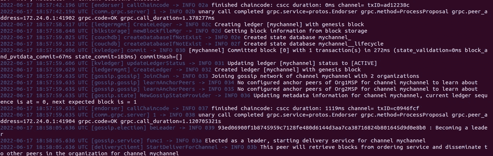

# 运营组织中的新同事入职

> 原文：<https://medium.com/geekculture/onboarding-new-peer-in-running-organization-6d378264b31e?source=collection_archive---------11----------------------->


HLF Image

# 介绍

在本文中，我将演示如何在 Hyperledger fabric network 中向现有的运行组织添加新的对等方。

# 观众

Hyperledger 结构操作员，管理员。这是一篇实用实践文章，旨在为管理组织添加新同事。对于初学者，我想建议你，请通过一些 Hyperledger 织物的基本概念。请访问[我以前的文章](/geekculture/hyperledger-fabric-blockchain-setup-from-scratch-21890e26aac7)，建立一个 HLF 网络。

> *注意:这篇文章不推荐给 HLF 初学者。*

# 先决条件

1.  对 **Hyperledger Fabric 区块链**的基本了解。
2.  基本了解 HLF CA，CouchDB。
3.  基本的外壳命令、外壳脚本等。

# 系统需求

1.  Docker —版本 17.06.2
2.  Docker Compose —版本 1.28.5 或更高版本
3.  Golang —版本 1.14
4.  Nodejs —版本 8
5.  Python 2.7

# 网络安装程序

*   具有 org1 和 org2 的 HLF 网络，每个都有 2 个对等体。
*   订购者群集(3 个订购服务节点)RAFT 作为一致算法(订购者、订购者 2、订购者 3)
*   组织 1、组织 2 和订购者的 CA
*   **CouchDB** 作为世界状态数据库。
*   面料最新版本 **2.3**

# 结构区块链设置

修改 hyperledger 结构网络非常复杂。如果结构网络已经在运行，则可以跳过这一步。

*   让我们克隆回购。

```
**git clone** [**https://github.com/cmjagtap/Hyperledger-Fabric**](https://github.com/cmjagtap/Hyperledger-Fabric)
```

*   执行以下命令。

```
**export PATH=${PWD}/bin:$PATH
sudo service docker start
 cd org1
./1_enrollOrg1AdminAndUsers.sh
./2_generateMSPOrg1.shcd ../org2** ./**1_enrollOrg2AdminAndUsers.sh** ./**2_generateMSPOrg2.sh 

 cd ../orderer** ./**1_enrollAdminAndMSP.sh
./2_artifact.sh

 cd ../org1**
.**/3_createChannel.sh

 cd ../org2**
.**/3_joinChannel.sh**
```

Hyperledger fabric 区块链 2.3 已准备就绪。

# 对等 2 到组织 1 的入职

我将添加新对等体分为以下五个步骤。让我们深入了解每一步。

## 1)为此对等方生成加密证书。

*   首先，我们需要将对等体注册到 org1 CA。我已经创建了一个 shell 脚本**registerenrollnewpeer . sh**执行这个 shell 脚本来注册 peer2 并生成它的 MSP 和 TLS 证书。


Register and enroll new peer

## 2)为新对等体创建 docker-compose 文件。

*   现在，我们必须为对等体创建一个 docker-compose 文件。
*   我已经在 **org1/addPeer** 目录下创建了 **new-peer.yaml** 文件

## 3)新对等体的部署

*   使用以下命令启动 peer2

```
docker-compose -f new-peer.yaml up -d
```



New Peer and CouchDB container

## 4)加入信道中的新对等体

*   让我们按如下方式导出 peer2 环境变量。

```
export CORE_PEER_TLS_ENABLED=trueexport ORDERER_CA=${PWD}/../../orderer/crypto-config-ca/ordererOrganizations/example.com/orderers/orderer.example.com/msp/tlscacerts/tlsca.example.com-cert.pemexport PEER2_ORG1_CA=${PWD}/crypto-config-ca/peerOrganizations/org1.example.com/peers/peer2.org1.example.com/tls/ca.crtexport FABRIC_CFG_PATH=${PWD}/../../configexport CORE_PEER_LOCALMSPID="Org1MSP"export CORE_PEER_TLS_ROOTCERT_FILE=$PEER2_ORG1_CAexport CORE_PEER_MSPCONFIGPATH=${PWD}/../../org1/crypto-config-ca/peerOrganizations/org1.example.com/users/Admin@org1.example.com/mspexport CORE_PEER_ADDRESS=localhost:6051 
```

> 上述 *CORE_PEER_ADDRESS* 指向 peer2

*   使用下面的命令加入频道

```
peer channel join -n ../mychannel.block
```



Join Channel

*   成功加入后，您可以验证新对等方的日志。它将尝试从其他对等方或订购服务获取最新的块，如下所示。



Peer2 Logs

## 5)新对等体的操作

*   您可以使用下面的命令来验证对等通道

```
peer channel list 
```


Peer Channel List

*   现在您可以安装链码并使用这个新的对等体。

# 打扫

执行以下脚本来清理所有 docker 容器和加密材料。

```
.**/clean.sh**
```

# 摘要

我们已经看到，如何在 hyperledger fabric 区块链网络中添加新的对等体来运行组织。