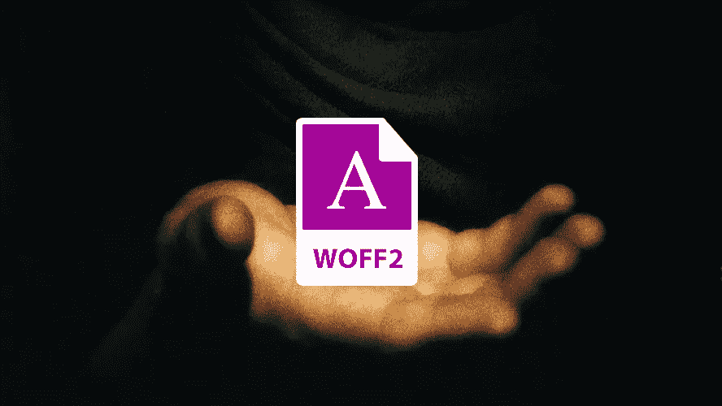
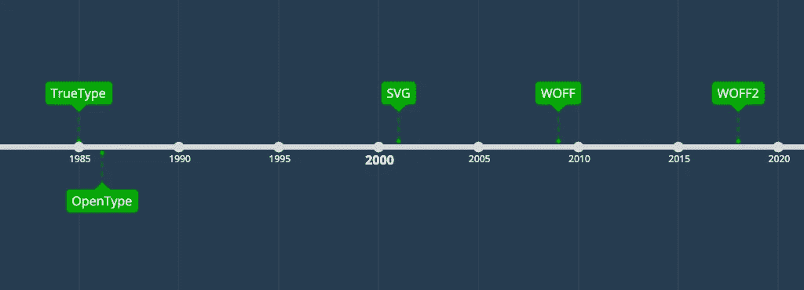

# 一种字体格式来统治他们:WOFF2

> 原文：<https://medium.com/geekculture/one-font-format-to-rule-them-all-woff2-d053e2e5165a?source=collection_archive---------5----------------------->



了解为什么 WOFF2 和作为后备的 WOFF 是你需要的唯一字体格式。

如果你是一名网络开发人员，你会在你的 CSS 中看到这些字体格式。下面是一个自托管的 Raleway 字体的示例:

```
@font-face {
  font-family: 'Raleway';
  font-style: normal;
  font-weight: 400;
  src: url('../raleway.eot');
  src: local(''),
       url('../raleway.eot?#iefix') format('embedded-opentype'),
       url('../raleway.woff2') format('woff2'),
       url('../raleway.woff') format('woff'),
       url('../raleway.ttf') format('truetype'),
       url('../raleway.svg#Raleway') format('svg');
}
```

我们还需要支持所有 5(！)他们中的？他们从哪里来的？他们彼此相比如何？

我想在这篇文章中回答这些问题。

# 时间表



Historical releases of nowadays still used font format

我们花了时间和迭代才得到我们最终得到的东西。

多亏了压缩技术，有了更高效的字体格式，浏览器才能够支持它们。

看看佩德罗·阿马多精心制作的[字体格式时间轴](https://typeforge.files.wordpress.com/2011/11/timeline_formatos_software_fontes_v10-01.jpg)。这表明，事实上字体格式的方方面面比我们想象的要多得多。

# 比较

我将继续使用以下评分标准来比较字体格式:

*   截至 2021 年 11 月的浏览器支持
*   文件大小(又名格式效率)

对于文件大小，我使用了[漫画和我从 caniuse.com](http://comicneue.com/)[收集的浏览器支持。让我们来看看下表，按照这些标准按历史顺序排列:](https://caniuse.com/)

让我解释一下为什么 WOFF2 在这个比较中得分比 WOFF 高:这都归结于 7 kb 的文件大小。一般来说，如果你的网站显示用户内容的速度更快，你的转化率就会增加——即使增加的速度只有一百毫秒。

您的字体可以是:

*   阻止内容出现(不可见文本)
*   导致布局偏移
*   延迟在不稳定的移动网络上下载更多资产
*   向谷歌发出了不好的信号(核心网站的 LCP 和 CLS)

# 如何转换

出于性能原因，自行托管字体是一个非常好的主意。我描述了我在[发表告别谷歌字体](https://wicki.io/posts/2020-11-goodbye-google-fonts/)帖子时的一个案例。

如何最好地将字体类型转换为 WOFF2 和 WOFF 取决于您从哪里获得字体类型:

*   **Google Fonts:** 下载 Google Fonts 上使用的字体类型，使用 [google-webfonts-helper](http://google-webfonts-helper.herokuapp.com/fonts) 下载其他字体格式。
*   **其他一切:**使用[字体松鼠的网页字体生成器](https://www.fontsquirrel.com/tools/webfont-generator)。“最佳”设置甚至只吐出 WOFF2 和 WOFF 文件。

# 结论

WOFF2，还有 WOFF 作为退路，如今已经足够了。

)*如果*你的网站不需要支持 IE8 这样过时的浏览器。

Simon Wicki 是柏林的一名自由开发者。在 JustWatch 做网络和移动应用。流畅的 Vue、Angular、React 和 Ionic。对前端、技术、网络性能和非小说类书籍充满热情。

**👉** [**在 Twitter 上关注我的最新动态。**](https://twitter.com/zwacky)