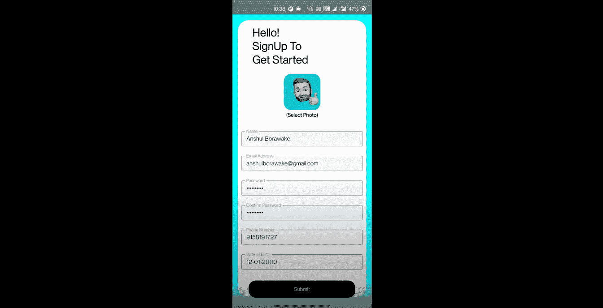
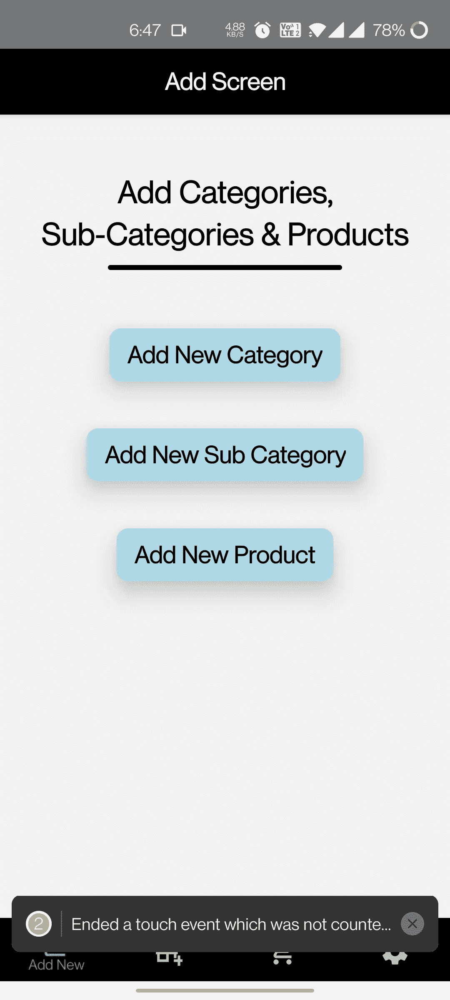
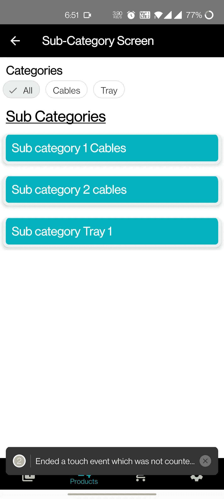
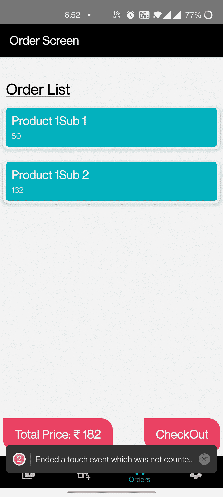

# 一个人使用，不需要互联网和 SQLite DB — React Native(第 2 部分)

> 原文：<https://medium.com/geekculture/one-person-use-no-internet-required-and-sqlite-db-react-native-part-2-d14bd06e6453?source=collection_archive---------10----------------------->

T 该产品或应用程序最独特的特点是，它可以根据任何类型的需求进行手动配置，例如，用于电子商务或小型商店跟踪其库存和购买情况。本文是上一篇博客的延续，参考这篇博客之前先检查一下(参考—[https://medium . com/swlh/build-your-mobile-app-in-10-days-with-react-native-abdeafce 0 DFC](/swlh/built-your-mobile-app-in-10-days-with-react-native-abdeafce0dfc))



React Native One Person Use, No Internet Required and Complete SQLite

# 完成项目参考👇🏻

> 创建子类别，显示子类别和订单屏幕

> 完整的 SQLite DB 调用依赖于这个 **ONE** 函数，成功时返回 **Promise** ，出错时返回 Reject。

## **添加子类别屏幕**

首先，我们将代码从 SQLite 存储连接到“本地数据库”。这里，我们将获取所有父类别，并提供选项来选择我们的“**子类别**属于哪个“**类别**”。



```
import { openDatabase } from 'react-native-sqlite-storage';const db = openDatabase({ name: ‘SQLite.db’, location: ‘default’, createFromLocation: ‘~SQLite.db’ });
```

> 与本地存储链接的代码(使用的包“react-native-sqlite-storage”)

同样的几个注意事项:

*   该代码是从用户接受关于子类别的细节。
*   详细信息包括-仅通过下拉菜单和子类别名称的父类别。
*   该代码创建一个子类别，并以这样的方式将它链接到类别，当父类别被删除时，链接到该类别的所有子类别也被删除。
*   对产品也实施类似的“级联删除”过程，只是接受的细节级别更多，即价格、商品及服务税编号和 HSN 编号。

Add Sub- Categories Screen

## 显示子类别屏幕

该页面的**独特的**功能是标题处的过滤器，用于在类别的不同子类别选项之间移动(更多信息请参考下图)



关于用户界面的一些注意事项:

*   这个 UI 是在没有使用外部包的情况下创建的，实现起来非常简单。
*   我们基本上是使用`flexWrap: "wrap", flexDirection: “row”`和使用 FlatList 来呈现所有其他类别选项。
*   并且，`onPress:`我们称之为属于那个类别的子类别的数据库。
*   后一部分只是呈现我们从数据库中收到的子类别的平面列表。
*   如果**没有返回**子类，则显示—**没有子类**；也就是说，如果检索时数据库长度为零，我们将显示此消息。

View Sub- Categories Screen

## 订单屏幕



屏幕上的几个音符:

*   该屏幕主要显示所有选定的产品及其价格。
*   “左下方”显示了所有挑选产品的总成本。
*   “右下方”将检查所有详细信息，并接受“**历史”**的购买名称
*   所有的信息都存储在**历史**中，以备将来参考并获得同样所需的完整成本。

# 参考链接

*   [GitHub 回购 ](https://github.com/LuffyAnshul/civilApp)
*   [**Youtube 视频**](https://www.youtube.com/watch?v=OU5BNXWJ8hU)