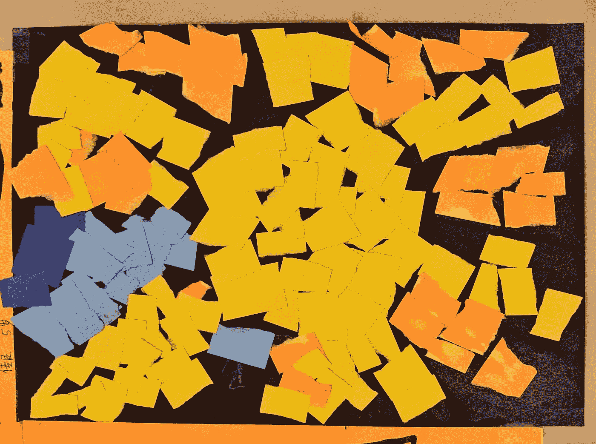

# 一个故事一个假期

> 原文：<https://medium.com/geekculture/one-story-one-holiday-d7e978c73859?source=collection_archive---------14----------------------->

## 用三个故事涵盖三个年终假期

Untitled, by 5 years old Charles Zhu

数据科学家和工程师不仅沉迷于数据、机器学习和商业逻辑，而且和你一样，他们也庆祝节日。年底在敲门，假期在等着。在这篇文章中，我将介绍三个不同国家的节日，这些节日可能不为每个人所知。一个故事给…