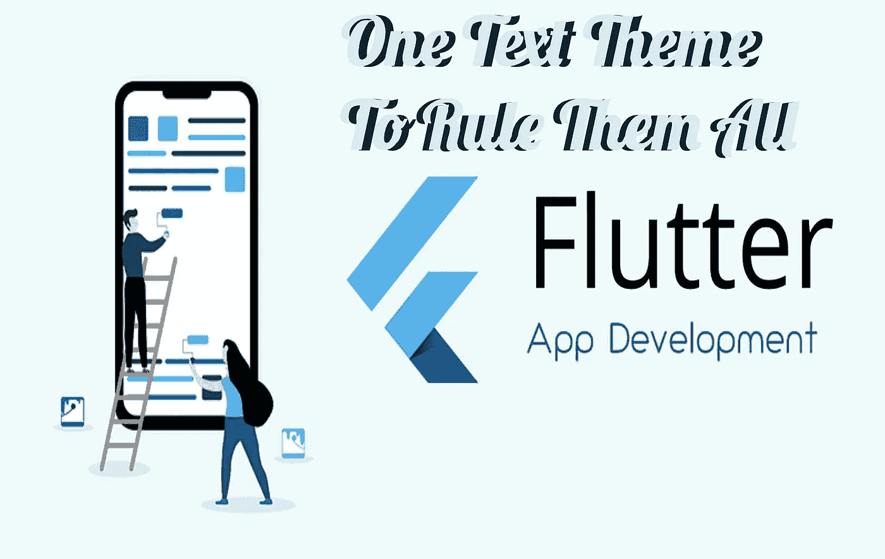

# 一个文本主题来管理它们

> 原文：<https://medium.com/geekculture/one-text-theme-to-rule-them-all-8dd6a531a35a?source=collection_archive---------8----------------------->

在 Flutter 中，我们有两种平台:基于材料和基于 Cupertino。让我向您展示编写一个适用于两个平台的文本主题的技巧，以及如何使用自定义字体。

# **背景**

**谷歌在 Flutter 培训文档中确实提到了这一点。首先，Flutter 团队只有基于材质和基于 cupertino 平台的材质小部件。然后谷歌开始了** …