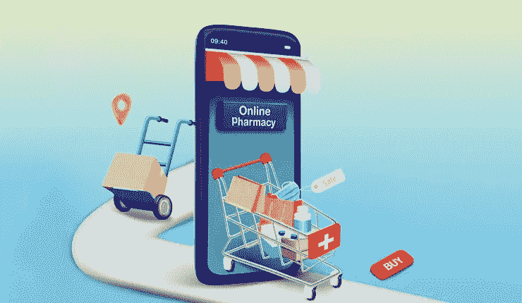
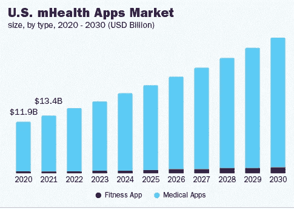
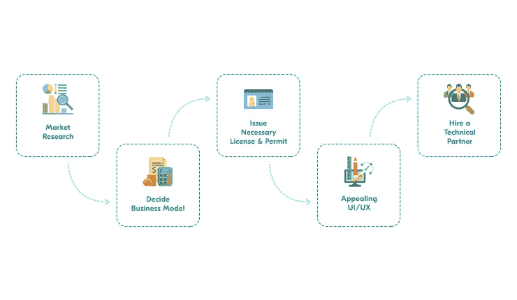

# 在线医疗应用程序开发技巧——随身携带

> 原文：<https://medium.com/geekculture/online-medical-app-development-tricks-keep-these-handy-2e34d98cce20?source=collection_archive---------21----------------------->

Pharmacy Delivery App

疫情结束后；很明显，那些在医疗保健行业工作的人必须采用新的方法使他们的服务更容易被顾客(病人)获得。这是因为；疫情给他们(病人)去医院看病制造了困难。因此，制药业意识到:让他们的业务获得在线医疗应用程序的支持将会使其向前发展。

因此，如果你正在建立一个移动健康市场，它无疑对你有光明的前景。根据 Statista 的数据，2025 年该行业的收入将达到 3327 亿美元左右。

这些数字，除了清楚地表明，用这款应用增强你的医疗风险是一个好主意；引发人们对药房配送应用如此受欢迎的原因的疑问。

# 在线医疗应用受欢迎的原因

请看下图:

Image Source — grandviewresearch.com

> 上图描绘了医疗保健行业通过在线医疗应用经历的持续增长。

**这是因为它们为患者提供了优势-**

预约，然后通过视频等方式参与协商。，
简化处方共享流程。客户可以轻松地从他们的设备上传这些文档。医生也可以通过应用程序直接与患者分享处方。

**除了这些原因，采用按需药房应用程序开发服务将使医疗保健行业获得一些重要的好处。**

*   这是因为简化了诸如预约咨询、订购药品等任务的过程。因此，建立一个忠诚的客户群就变得容易了
*   库存管理是小菜一碟，因为这些应用程序允许企业管理药物及其不同的信息。在某种情况下，如果没有药品，可以通过应用程序轻松更新
*   帮助创建品牌。通过推送通知等功能，医疗保健企业可以根据客户的互动无缝推广他们的新服务或营销新服务，它允许药房交付应用程序确保该行业可以成为一个品牌。

纵观上述所有因素，很明显，为行业提供在线医疗应用或药房交付应用将有助于推动行业发展。

然而，它要求坚持一些步骤。

# 在药房配送应用程序开发过程中要遵循的步骤

> 观察上面的图片，你可以理解在着手获得一个在线医疗应用程序时所经历的不同阶段。

**这包括-**

*   进行市场调查
*   确定合适的商业模式
*   发放适用的执照和许可证
*   创建一个吸引人的用户界面/UX
*   与药房交付应用程序开发公司合作

***在下面的几行中，我详细解释了其中的每一个阶段。***

> ***表现强劲的市场调研***

进行有力的市场调查。除了了解用户和人口统计之外，还要了解你的竞争对手使用的[商业](https://www.articlering.com/category/business/)模式。这包括研究你启动应用程序的地方的地理。

此外，注意你的竞争对手正在使用的商业模式，并研究你的解决方案能够满足的整体需求。
因此，确定了解所有这些领域，以超越你的竞争对手，并成功地为你的客户(患者)服务。

> ***选择合适的商业模式***

你对在线医疗应用商业模式的选择将会让你建立品牌并获得可观的收入。

所以，这个决定一定要做好。

**药房配送应用程序的两种主要商业模式格外受欢迎。**

这包括-
1。允许药房创建应用程序来营销他们提供的服务的运营业务模式。这意味着不涉及任何中介。商店直接收到收入。
2。市场商业模式，我们的药店业务与当地药店、医疗专业人士等合作。，基于这两个赚到的钱，这个生意最终会赚得相当多。

第二种模式很受欢迎，是大多数新的制药企业正在灌输和利用的模式。这是因为它允许所有不同的机构在收入方面做得很好，并获得良好的机会。

因此，当你得到应用程序时，尽管知道商业模式类型，重要的是要注意；只有在全面分析业务需求和整体要求后，才可能做出最终决策。

> ***颁发许可证和适用许可证***

由于药品网上销售是一个敏感的问题，有必要的执照和许可证。换句话说，在下订单时，患者只有在上传处方后才能获得送货服务。接下来，获得在该国适用的许可证，以开始药品配送业务。这将保持患者对您通过应用程序提供的服务的信任。它将同时帮助您吸引更多患者使用您通过应用程序提供的服务。

> ***创建一个吸引人的 UI/UX***

视觉上吸引人的用户界面/UX 让用户可以方便地滚动你的应用程序，同时浏览不同的服务。此外，用户可以在应用程序中执行不同的功能，没有任何挑战。

因此，努力创造一个视觉上吸引人的用户界面/UX，让它容易导航，最终对客户来说也是可操作的。

> ***与药房配送 APP 开发公司*** 合作

最后，联系一家药房交付应用程序开发公司。在[按需药房交付应用程序开发服务](https://www.peppyocean.com/pharmacy-delivery-app-development/)期间实施最佳技术，您将获得一款可为您的医疗保健行业带来最大价值的应用程序。这将使医生和药房赚得更多，并确保患者通过该应用程序保持正常的健康状况。

除了这些步骤之外，确定最有助于轻松方便地提供药房服务或医疗保健服务的功能。

**要包括的功能**

1.  **针对患者**

上传处方，允许医疗专业人员或药房了解患者的医疗状况，并决定患者恢复健康的正确方法
。药物详情，向患者介绍药物、其成分、剂量等

**2。针对化学家**

订单跟踪，实时了解提供药物配送的配送专业人员的位置
数字处方，使药剂师能够访问患者上传的处方

**3。对于送货专业人员**

地图可让司机导航至患者的位置
；应用内聊天可实现专业医护人员和患者之间的无缝沟通

**4。针对医生和医疗专业人员**

症状检查器，允许医疗专业人员诊断患者的医疗状况
监控进展，让医疗专业人员了解患者的健康进展

**5。医疗保健行业**

库存管理，用于跟踪库存药品并剔除缺货药品
；营销和促销工具，用于提供优惠以成功吸引更多患者，并确保客户能够以符合其预算的成本获得优质服务。

有了所有这些方面，您可以通过药房交付应用程序更好地为客户服务。这可以确保他们快速检查健康。

# 包扎

药房交付应用是医疗保健行业的一个门户，除了健康诊断之外，它还允许客户获得快速便捷的药物交付。然而，除非按需药房应用程序开发服务期间遵循的流程做得很好，否则您希望实现的价值将不会实现。因此，在做任何事情之前，先联系一家[药房交付应用程序开发公司](https://www.peppyocean.com/)，在应用程序开发阶段实施正确的策略。这将为您提供一个解决方案，使药物输送和医疗诊断对患者来说轻而易举。同时，它还允许您从第一天起就获得最大的投资回报，并建立对您所提供服务的信任！