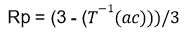

# 本体优度度量

> 原文：<https://medium.com/geekculture/ontology-goodness-measurement-66ef46a82caa?source=collection_archive---------15----------------------->

说到底，本体和知识图([一些关于它们是什么的讨论](https://a-v-goldberg.medium.com/ontology-in-a-modern-website-6edc840aa6ad))并不存在于空白空间中。它们作为某些业务功能的一部分而存在，是为了实现某些目标而创建的。在 Upwork 中，我们使用知识图来通知查询理解和语义匹配。我们还使用它们作为浏览的基础，帮助用户发现各种感兴趣的项目(如工人简介或职位空缺)，我们让用户为他们的简介(自由职业者)、职位空缺(雇主)和其他文档选择适当的值。很难衡量本体变化对搜索和匹配的影响。您可以从日志或业务影响中获得的所有指标都受到许多因素的影响，除非本体的变化非常显著，否则不会产生显著的结果。虽然我们有一个机器学习模型，它有时会向用户建议“技能”和“职业”(存在于知识图中)，但用户做出最终决定，模型在知识图上进行训练。这使得用户的选择和知识图方式之间的比较更加直接和信息化。

我们问自己，在给定的环境下，我们如何测量知识图的良好程度，并提出了以下步骤。首先，我们分析文档的文本(简介和职位空缺)，寻找其中提到的任何知识图标签。我们将发现的属性称为“采用的”，以区别于用户直接“分配”的属性。然后我们计算所有采用属性的类别。我们选择前 3 个类别(根据属性的数量)，按照受欢迎程度(根据属性的数量)递减的顺序排列。然后，我们计算每个文档的相关性度量。我们使用 3 个指标:相对位置、精确度和召回率。相对位置我们用下面的公式计算:

Relative position’s calculation

其中 T 是采用的前 3 个类别的列表，ac 是分配的类别。例如，如果分配的类别在被采用的类别列表中具有索引 2(前 3 个被采用的类别中最不受欢迎的)，Rp 将是⅓.对于索引 0(顶级类别)，Rp 将为 1。

我们将精度定义为既存在于采用的技能集又存在于分配的技能集中的属性数，除以分配的*集的大小。我们将召回定义为同时存在于被采用和被分配的集合中的属性的数量，除以*被采用的*集合的大小。因此 Precision 告诉我们有多少用户选择的属性也在发现的集合中。回忆告诉我们，指定集和采用集的内容是多么相似。然后，我们按文档类型计算所有个人资料和空缺职位的所有 3 个指标的平均值。出于许多原因，我们不想混合配置文件和空缺职位，例如不同类型的用户创建它们，不同的选择过程和 UI 等。*

有许多指标组合表明了一个类别的各种问题。例如，低 Rp(低于⅓)表示用户出于某种原因选择了基于该类别文档中实际存在的技能不应该选择的类别。单个文档可以归因于用户的行为，但是当在数百或数千个文档中聚合时，可能会指示误导性的类别名称。也许有几个类别有相似的名字，或者只是没有一个类别反映了某一组技能，用户在胡乱猜测。低召回率表示用户选择在文本中很少发现的属性。再加上低 Rp，这告诉我们用户选择了一个错误的类别，然后他们的选择被该类别中的属性所限制。低精度可能是一个非常广泛的类别的标志，该类别包含许多属性，这些属性可以从划分为几个更小的类别中受益。还有一个非常有趣的例子，所有度量值都很高，文档总数也很高。正如我上面提到的，我们使用知识图来通知语义搜索。这种组合指向实际上不可区分(通过语义手段)的文档的类别。最好的办法是分析这样一个类别的内容，定义更多的属性，或许在这个过程中拆分类别。

就特定于 Upwork 的结果而言，我们发现了相当多需要改进的类别。虽然有许多类别在配置文件和开放中都受到影响，但许多类别只针对一种文档类型。显然，最受影响的类别是语言辅导。伙计们，救援来了！