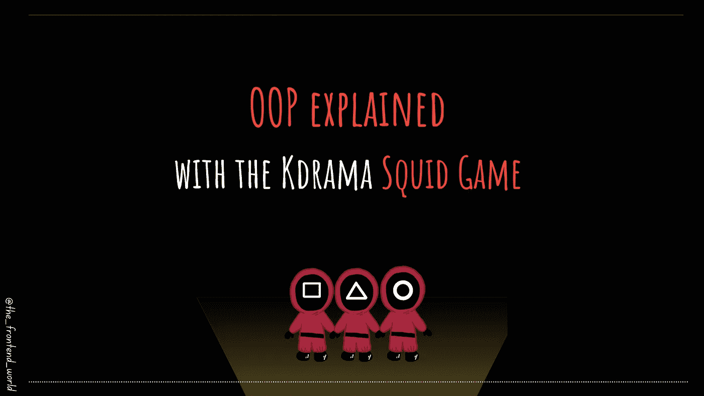

# OOP 用 Kdrama Squid 游戏解释

> 原文：<https://medium.com/geekculture/oop-explained-with-the-kdrama-squid-game-ee87637751f7?source=collection_archive---------8----------------------->

## 用 Squid 游戏理解面向对象编程

By FAM

我们今天的故事是关于 OOP，面向对象编程。这是任何程序员都必须知道的基础知识。

我非常喜欢一个韩国系列，并且想用这个 Kdrama 解释这个编程模型。既然这么受欢迎，希望你已经看过了…