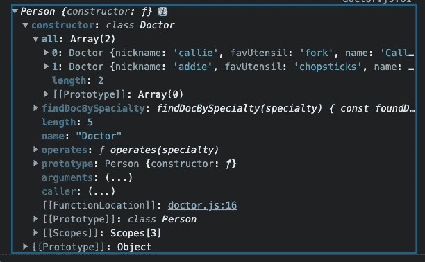
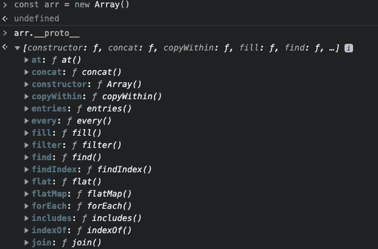
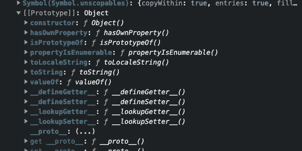

# JavaScript 中的 OOP

> 原文：<https://medium.com/geekculture/oop-in-javascript-6c4ff58ff48c?source=collection_archive---------10----------------------->

Photo by [Joshua Reddekopp](https://unsplash.com/@joshuaryanphoto?utm_source=unsplash&utm_medium=referral&utm_content=creditCopyText) on [Unsplash](https://unsplash.com/s/photos/coding?utm_source=unsplash&utm_medium=referral&utm_content=creditCopyText)

当我在熨斗学校开始我的软件工程之旅时，我第一次了解了面向对象编程。我怀疑像我这样从起点开始的人，是否能够在深层次上理解它。训练营的本质就是你用指甲抓着不放！所以我决定回顾/复习一下，特别是考虑到[函数式编程与 OOP 讨论](/@sho.miyata.1/the-object-oriented-programming-vs-functional-programming-debate-in-a-beginner-friendly-nutshell-24fb6f8625cc)可能不会很快“解决”。

OOP 当然是面向对象编程的简写，自[50 年代末/60 年代初](https://en.wikipedia.org/wiki/Object-oriented_programming#History)以来就一直存在。JavaScript 方面，2015 年 [ES6](https://www.w3schools.com/js/js_es6.asp) 推出了 OOP。正因为如此，JavaScript 被认为是多范型的——我们可以使用纯函数编写 JavaScript，或者我们可以使用 OOP 原理来构建我们的代码，从而模仿真实世界的体验。

一般来说，OOP 是一种编程范式或一组概念，其中代码以这样一种方式组织，即它创建一个以实例化对象为中心的蓝图——通常通过类——包含状态和行为。即对象*所具有的*(特征/属性)和对象*所做的*(方法/功能)的事物。这个类的每个实例化是一个对象，它也将实例化它的单个状态，并且可以访问它的继承函数。所以我们可以创造一种动物。那种动物可以有名字，各种各样的特征和它所做的事情，比如说话。“喵。”

OOP 的四大支柱是封装、继承、抽象和多态。这些术语已经被描述了许多方式。这是我对他们的理解:

1)封装:代码被组织到容器中以便更好地组织，这避免了代码重复的需要。这是 OOP 跳动的心脏。封装还允许我们隐藏一个方法或属性，这样它就不会被意外地改变或篡改。(注意 verrrry new `#`在本例中不是用于社交媒体发布，而是用于在 JavaScript 的类中创建和利用私有变量和方法！您可以在下面的代码示例中看到它的使用。)

2)继承:类的任何实例继承该类的变量和方法，以及可能从该类的超(或父)类继承的任何状态和/或行为。这额外的一点超能力(看到我做了什么吗？)需要使用`super()`关键字。

3)抽象:那些可爱的小实例对象不需要担心他们漂亮的脑袋“如何”。他们可以直接调用方法，让类来处理细节。

4)多态性:一个方法可以被编程为根据调用它的人的不同而有不同的行为。(即，狗会叫，而猫会喵。)子类甚至可以覆盖其超类中声明的函数。这个新的和改进的功能被封装/保护在它自己的类中。如此强大的力量！

有趣的是，如果我们使用函数式编程——也就是说，如果我们函数式地创建一个对象——我们确实可以访问`this`(在实例化对象的正确上下文中)，我们有 JavaScript 的内置构造函数，并且对象被自动返回。如果我们使用`new`关键字，所有这些都会提供给我们。这确实模仿了 OOP，但它不是 OOP。您甚至可以将函数嵌套在这些“与 OOP 相邻”的函数中，尽管不建议这样做，因为新对象的每次实例化都需要额外的内存空间。

creating Doctor via functional programming

使用类(见下文)是我们编写 JavaScript OOP 风格的方式，至少在内存空间方面更好。当创建一个新实例时，它可以定位它有权访问的函数，但不需要为函数本身保留内存空间。

`static`关键字是为类方法和属性保留的，而实例方法不使用`static`。当然，实例变量使用`this`。(方法也可以用`this`。)

OOP concepts used in JavaScript — welcome to Grey’s Anatomy

有趣的事实:JavaScript 中的 OOP 类并不是真正的 OOP。这实际上是句法糖(即魔术。不要看窗帘后面！)看起来和行为都像 OOP，但实际上是简单的原型继承。例如，如果我们打开 console.log `drMontgomery.__proto__`，我们会看到这样的内容:

Doctor Class extends from Person Class via __proto__ property

这与我们创建一个新数组并检查它的 __proto__ 属性没有太大区别:

we know that a new Array comes with lots of functionality built in

array inherits from Object via Prototype. Feels like OOP!

我发现我越了解 OOP 就越喜欢它。尽管函数式编程和钩子在 React.js 中风靡一时，但我现在对 React 中的 OG 类有了更深的敬意。与典型的 OOP 一样，当我们看一个从 React 扩展的类时，它继承了许多方法，最重要的是生命周期方法(`render()`本身就是一个生命周期方法。在过去，我倾向于忘记这一点。).注意`extends`关键字。呜！

This code is gratefully borrowed from [Brad Westfall](https://medium.com/u/37d87f15681e?source=post_page-----6c4ff58ff48c--------------------------------)

大家编码快乐！我很想知道你对 OOP 的看法，以及你对 OOP 和函数式编程的偏好。

我非常，非常推荐安德烈·尼戈瓦:【https://www.udemy.com/course/advanced-javascript-concepts/】T2 的这门课

 [## 面向对象编程的四大支柱

### JavaScript 是一种多范式语言，可以按照不同的编程范式编写。一个编程…

www.freecodecamp.org](https://www.freecodecamp.org/news/four-pillars-of-object-oriented-programming/)  [## useEffect(fn，[])不是新的 componentDidMount()

### 他们几乎是一样的。但实际上，这种差异足以让你陷入困境…

reacttraining.com](https://reacttraining.com/blog/useEffect-is-not-the-new-componentDidMount/)