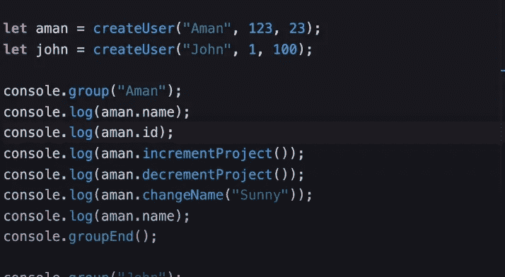
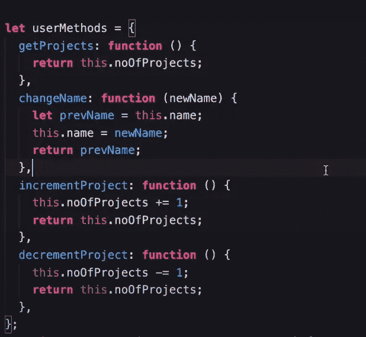
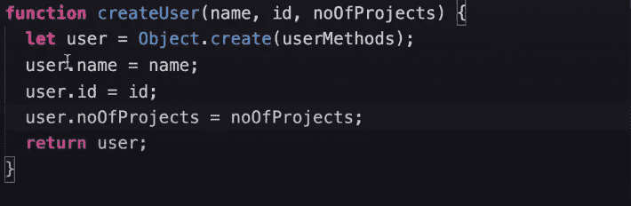
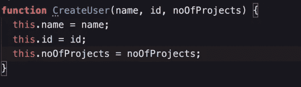
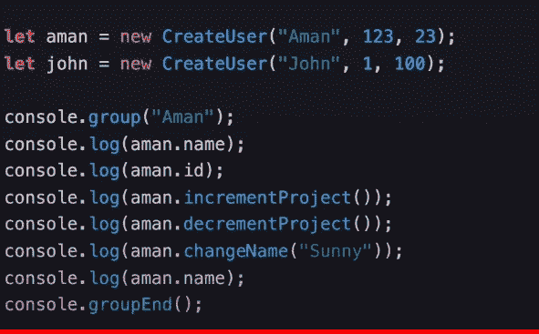
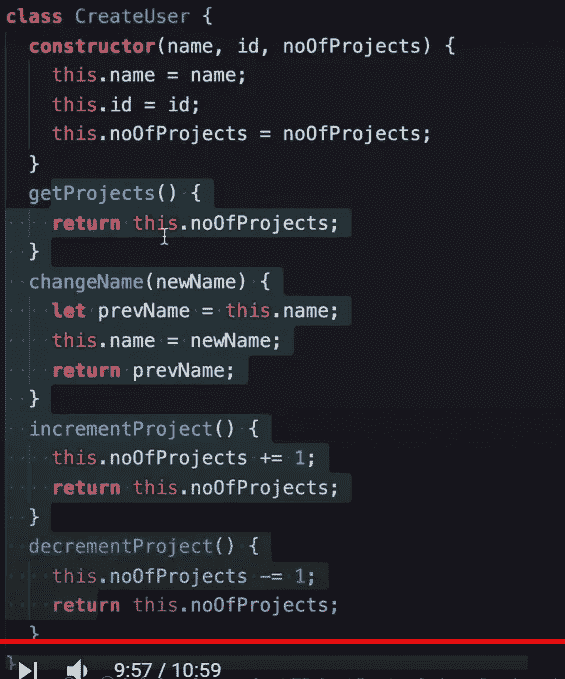

# JavaScript 中的 OOP 来创建对象。

> 原文：<https://medium.com/geekculture/oop-in-javascript-to-create-objects-6d028e27ae0b?source=collection_archive---------27----------------------->

# 什么是对象？

> **对象是“键”和“值”对的集合**

-函数和数组也是 JS 中不同类型的对象

ex:-**let obj = { name:" onkar " }；**

**obj = { " display name ":function(){ console . log(" hello ")} }；**

# 为什么 OOP？

*   世界上的每一个应用程序都由两个主要部分组成:a)数据，b)函数和方法
*   为了创建任何应用程序，我们需要数据和函数或方法来处理这些数据。
*   随着我们项目中函数和总体数据数量的增加，添加新函数变得非常困难，而且变得非常混乱。
*   这个问题用 OOP 来解决。OOP 帮助我们将数据和函数捆绑在一起，这使得代码“**易于阅读**”和“**易于添加新特性**”

# 在 JS 中创建对象的不同方法。

创建对象的方法:-

*   对象文字。
*   对象构造函数。
*   对象.创建

# 对象创建模式。

*   在 dunder proto 中有 4 种主要的方法来创建对象

1.  使用函数。
2.  原型模式。
3.  伪古典模式。
4.  班级模式。

## 1)使用函数创建一个对象。( — — — — — — — — — — — — )

*   一旦使用上述方法创建了一个函数。它创建一个新用户并返回它。
*   编写函数时还有一件重要的事情:- " **不要忘记返回我们在函数**中创建的用户(我忘记了)。
*   稍后，我们可以使用该函数创建新用户，并将他们存储到变量中。

testing our function.

## 2.原型模式

*   在这个方法中，我们必须创建一个内部只有数据的函数。之后，我们必须创建一个新的对象，它将包含该函数所需的所有方法。

creating an object which will contain methods

*   但是在函数内部，当创建一个新对象时，我们必须使用" **object.create** "方法。参考下图:-

creating function

*   这里，当创建一个新的对象用户时，我们必须传递先前创建的新的对象用户方法。
*   现在，userMethods 中的方法将被添加到新创建对象的 **dunder proto** 中。

> 提示:- dunder proto 是对象的一个特殊区域，它包含所有使用相同函数创建的对象所共有的所有方法。

*   现在我们可以通过使用函数创建一个新对象来测试它。如下图所示。

checking prototypal pattern

## 3.伪经典模式

*   在伪经典模式中，我们使用“ **new** ”关键字，同时使用函数创建一个新对象。
*   " **new** "关键字做 3 件事:-

> 1)创建新对象。
> 
> 2)将“ **function.prototype** 对象内部的方法添加到新建对象的 dunder proto(__proto__)中。
> 
> 3)返回新创建的对象。

*   该函数及其原型创建如下所示

creating function

creating function.prototype

> 需要注意的是:- " **这个**在函数里面会指向一个由" **new** 关键字创建的新对象。

*   现在我们可以测试我们的功能如下:-

# 4.班级模式(— — — — —)

*   当使用类模式创建对象时，我们必须编写一个名字包含首字母大写的类。
*   首先，在类内部，我们必须写一个构造函数来接受我们需要的参数。
*   在这个构造函数中，我们必须用关键字“ **this** ”初始化所有参数。

> 我们知道“**这个**指向的是由“**new**”keuwrod 新创建的对象

*   在初始化对象的所有属性后，我们必须在对象的 dunder proto 中编写我们需要的所有方法。请参考图片:-

creating class

*   写完类中的所有方法后，现在我们必须使用这个类创建新的对象。例如:-

testing class pattern